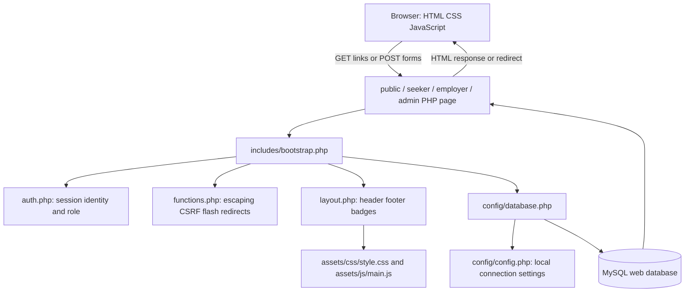
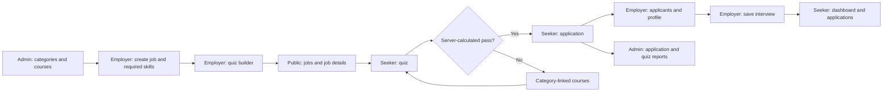

# Member 1: Foundations, authentication, and shared UI

**Team guides:** [Member 1](member-1-foundations-and-ui.md) · [Member 2](member-2-jobseeker-and-search.md) · [Member 3](member-3-employer-and-interviews.md) · [Member 4](member-4-admin-and-database.md)

## Contents

- [How to study this guide](#how-to-study-this-guide)
- [Equal team responsibilities](#equal-team-responsibilities)
- [Overall architecture everyone must understand](#overall-architecture-everyone-must-understand)
- [Core reading vocabulary used throughout the project](#core-reading-vocabulary-used-throughout-the-project)
- [Member 1 — concepts before your code](#member-1--concepts-before-your-code)
- [Your file ownership and reading order](#your-file-ownership-and-reading-order)
- [Chunk-by-chunk source walkthrough](#chunk-by-chunk-source-walkthrough)
- [File: index.php](#file-indexphp)
- [File: includes/bootstrap.php](#file-includesbootstrapphp)
- [File: includes/functions.php](#file-includesfunctionsphp)
- [File: includes/auth.php](#file-includesauthphp)
- [File: includes/layout.php](#file-includeslayoutphp)
- [File: public/register.php](#file-publicregisterphp)
- [File: public/login.php](#file-publicloginphp)
- [File: public/logout.php](#file-publiclogoutphp)
- [File: public/index.php](#file-publicindexphp)
- [File: assets/js/main.js](#file-assetsjsmainjs)
- [File: assets/css/style.css](#file-assetscssstylecss)
- [UI property and function connections to demonstrate](#ui-property-and-function-connections-to-demonstrate)
- [Shared final rehearsal checklist](#shared-final-rehearsal-checklist)

## How to study this guide

This is a teaching snapshot of the code on 27 September 2026, with the quiz visibility feature updated on 29 September 2026, not a claim about who originally wrote it. Replace Member 1–4 with your names. Start with the concepts, trace one complete request, then study each assigned file in source order. Source chunks include every line of the assigned runtime files; their headings give the original line ranges. Blank lines and closing braces delimit blocks rather than introducing new behavior. Some existing templates put many statements on one line: read the explanation and the attribute glossary before following that long line.

For each chunk, answer: **What input enters? Which condition runs? What changes in memory/database? What output or redirect leaves? Who is allowed to do this?** Read the actual source alongside the guide if the project has changed since this snapshot. Source hashes identify the version explained. Configuration secrets are deliberately excluded; the example configuration teaches the same structure.

## Equal team responsibilities

| Member | Primary implementation/study responsibility | Main integration handoff |
| --- | --- | --- |
| 1 | Shared PHP foundations, login/register/logout, homepage, all shared HTML/CSS/JavaScript | Provides session identity, CSRF, escaping, navigation, and UI conventions to everyone |
| 2 | Public job discovery, badges, job details, all seeker pages, quiz scoring, applications, learning | Consumes employer jobs/questions and admin courses; creates attempts/applications |
| 3 | All employer pages, candidate review, interview display helper, interview regression checks | Writes jobs/questions/schedules; works with Member 2 to verify candidate visibility |
| 4 | All administrator pages, PDO configuration, full SQL schema/seeds/migration, installation documentation | Supplies shared data model, integrity rules, categories/courses, reports, and setup |

There are three application roles but four engineering responsibilities: shared infrastructure/UI is the fourth responsibility. Equal means comparable learning, explanation, and demonstration effort, not equal file counts. Member 1 has more repetitive CSS lines; Members 2 and 3 have denser business rules; Member 4 has SQL relationships and constraints. Give each member the same **12-hour study allocation**: 2 hours concepts/architecture, 5 hours owned code, 2 hours practical tracing, 1 hour cross-review, and 2 hours viva rehearsal. Each prepares a 6-minute demonstration and answers questions about one other member's handoff. These are suggested allocations, not measured reading times.

## Overall architecture everyone must understand

The project is a **server-rendered, procedural PHP multipage application**. A URL points directly to a PHP file. That file commonly performs request handling, SQL access, and HTML rendering together. Shared functions reduce repetition. It is not a framework MVC implementation, SPA, REST API service, or microservice system.



`bootstrap.php` loads the database function definition; it does not immediately connect. The first `database()` call opens PDO, and a static variable reuses that connection for the rest of this request. PHP variables do not persist between unrelated web requests. MySQL records and session data can persist.

### The stack and its exact role

| Technology | Where and why |
| --- | --- |
| PHP 8.2+ project target | Executes server logic, functions, sessions, validation, scoring, SQL calls, HTML templates; the local checks previously used PHP 8.5 |
| MySQL 8+ / InnoDB | Relational storage, foreign keys, unique/check constraints, transactions, aggregates |
| PDO with pdo_mysql | PHP-to-MySQL connection and parameterized SQL; no ORM |
| HTML5 | Semantic content, links, GET/POST forms, native details/summary disclosure, client validation |
| CSS3 | Custom layout, responsive grid/flex, badges, focus, printing, reduced motion; no Bootstrap/Tailwind |
| Vanilla JavaScript | DOM enhancements, field visibility, and quiz tab-hidden auto-submission after Start; no React, jQuery, Node build step, or AJAX search |
| PHP sessions | Browser has a session identifier cookie; authenticated user ID, CSRF token, and flashes live in server session state |
| Apache/XAMPP or PHP built-in server | Executes PHP and serves assets; the development server command is `php -S localhost:8000` from the root |
| Fontshare / Google Fonts | External font/icon stylesheets requested by the shared header; fonts fall back when unavailable |
| YouTube iframe | Plays an externally hosted video; the database stores a video ID, not a video file |
| Browser print dialog | CV can be printed or saved to PDF; no server PDF library |

### One normal page request

1. Browser requests `seeker/applications.php` with its session cookie.
2. `require_once` loads `bootstrap.php`; PHP opens/resumes the named session and loads shared functions.
3. `require_login('seeker')` uses the session ID to read `users`, checks active status and role, and redirects unauthorized visitors.
4. A prepared query filters applications by the authenticated user's ID, joins the job and employer, and returns associative arrays.
5. `page_header()` outputs the document shell and pulls flash messages.
6. The template loops over rows; `e()` escapes text and attributes; `interview_details()` prints schedule data.
7. The footer loads JavaScript. The browser lays out the HTML with CSS. It never receives raw PHP source.

### One normal write request

POST form → session/role check → CSRF check → read/validate fields → prepared INSERT/UPDATE/DELETE → optional commit → flash → redirect → fresh GET renders the result. This is the Post/Redirect/Get pattern. Redirects must occur before HTML is sent. CSRF validation does not replace role or ownership validation.

### Complete business workflow and file connections



The shared database connects roles; one PHP page does not call another page in the background. For example, the employer updates one `applications` row, then the seeker reads that row on their next request. There is no live push notification or email delivery. `includes/interview-details.php` keeps display logic consistent but does not itself authenticate or query data.

### Relationship map

```mermaid
erDiagram
    users ||--o| job_seekers : profile
    users ||--o| employers : profile
    employers ||--o{ jobs : publishes
    job_categories ||--o{ jobs : classifies
    jobs ||--o{ job_required_skills : requires
    jobs ||--o{ quiz_questions : screens
    jobs ||--o{ quiz_attempts : receives
    job_seekers ||--o{ quiz_attempts : takes
    quiz_attempts ||--o{ quiz_answers : contains
    quiz_questions ||--o{ quiz_answers : answered
    jobs ||--o{ applications : receives
    job_seekers ||--o{ applications : submits
    quiz_attempts ||--o{ applications : qualifies
    courses ||--o{ course_job_categories : mapped
    job_categories ||--o{ course_job_categories : mapped
    courses ||--o{ course_videos : contains
    courses ||--o{ course_completions : completed
    job_seekers ||--o{ course_completions : records
```



The six CV detail tables also reference `job_seekers.user_id`: `education`, `experience`, `projects`, `job_seeker_skills`, `certifications`, and `languages`. Role-specific profiles use `user_id` as both primary key and foreign key. There is no separate `admins` table. An interview is stored directly in `applications`, not in a separate meeting table. The diagram shows structural links; the passing-attempt rule is additionally enforced by PHP when submitting an application.

## Core reading vocabulary used throughout the project

| Syntax / concept | Meaning in this project |
| --- | --- |
| `<?php ... ?>`, `<?= ... ?>` | Execute PHP, then return to literal HTML; short echo prints an expression |
| `$variable`, `['key']`, `=>`, `[]` | PHP variable, associative-array lookup, key/value pair, and array creation/append |
| `$_GET`, `$_POST`, `$_SERVER`, `$_SESSION` | URL inputs, submitted body fields, request metadata, server session state |
| `??` versus `?:` | Missing/null fallback versus any falsy-value fallback; a string `"0"` is falsy in PHP |
| `===`, `!==`, `&&`, `\|\|`, `!` | Strict comparisons and Boolean operators; conditions choose which branch executes |
| `(int)`, `(float)`, `(bool)`, `(string)` | Explicit type conversion, not complete validation; casting an ID does not prove ownership |
| `.`, `.=` | String concatenation / append; SQL text and redirect paths use it |
| `function`, `return`, `void`, `never`, `?array` | Named reusable behavior, returned result, no result, never returns normally, nullable array |
| `declare(strict_types=1)` | Scalar type rules for calls made from that PHP file; it is not automatically inherited by all including files |
| `static` local variable | Keeps a cached value across calls in the same request, not a global cross-user login cache |
| `__DIR__`, `__FILE__`, `require_once` | Current file directory/path and load-once inclusion; filesystem paths differ from browser URLs |
| `foreach`, `if: ... endif`, `endforeach` | Iterate records and use template-friendly control syntax |
| `->`, `::` | Object method/property access and class constant/static access, such as `PDO::FETCH_COLUMN` |
| `prepare`, `execute` | SQL structure first, input values second; `?` placeholders bind in array order |
| `query` | Execute fixed SQL directly; do not concatenate untrusted strings into it |
| `fetch`, `fetchAll`, `fetchColumn` | One row, all rows, or one scalar/column; `fetch()` may return false |
| `JOIN` vs `LEFT JOIN` | Require a related row vs retain the left row even if no related row exists |
| `EXISTS`, `COUNT`, `SUM`, `AVG`, `GROUP BY` | Presence check, totals, sums, averages, grouping; not interchangeable |
| `ORDER BY`, `LIMIT` | Result ordering and row cap; a recent-five list is not the complete history |
| `NULL`, `COALESCE` | Missing SQL value and fallback for missing values, distinct from the empty string |
| Transaction | Related statements become one commit; rollback undoes uncommitted changes on that connection |
| Authentication / authorization / ownership | Who you are / whether your role can use the operation / whether this particular row belongs to you |
| Validation / escaping / parameter binding | Check business rules / make output safe as HTML / bind data safely into SQL; each solves a different problem |

### HTML properties and attributes to recognize

`name` becomes the submitted PHP key; `id` identifies an element for a label, fragment link, or JS; `class` selects reusable CSS. `value` supplies a field/option's submitted data. `method="get"` puts filters in a shareable URL; `method="post"` sends changes in a body (it is not encryption). Missing `action` means submit to the current page. `type="hidden"` hides UI but is still editable by a user. `required`, `min`, `max`, `minlength`, `maxlength`, and input types provide browser checks; the server still needs validation. `selected` chooses a select option; `checked` chooses a checkbox/radio; `disabled` prevents normal submission. `placeholder` is a hint, not a label or saved value.

`for` associates a label with an `id`; nesting a control inside a label also associates them. `aria-label` gives an accessible name; `aria-labelledby` points to visible naming text; `aria-describedby` points to help; `aria-current` identifies the current page/filter; `aria-hidden` hides decorative duplicates from assistive technology. `role="status"` marks status text. `tabindex="0"` makes an element focusable. `target="_blank"` opens another tab and `rel="noopener noreferrer"` removes opener/referrer access. `details` and `summary` provide a native disclosure; without `open`, extra filters start collapsed. `data-confirm` exposes a custom string through JS `dataset.confirm`. `href="#id"` links to a fragment; it does not query the database.

### Security explanation every member should be able to give

Use the session for acting-user identity. Use role checks before protected actions and row ownership in SQL. Check a session-bound unpredictable CSRF token for POST operations. Use prepared SQL values and escape HTML output with `htmlspecialchars`. Passwords are hashed and verified, never decrypted. Meeting links also need an HTTP(S) scheme check because HTML escaping alone does not reject a `javascript:` URL. These are defenses present in the code, not a claim of complete production hardening.

### Built-in functions and object methods: quick teaching reference

| Function / method | How to read a line that uses it |
| --- | --- |
| `trim`, `strtolower`, `strtoupper`, `ucwords` | Remove edge whitespace, lowercase, uppercase, or capitalize words. These transform text, not permissions. |
| `str_replace`, `substr`, `strlen` | Replace substrings, take a substring, count bytes. strlen is not a Unicode character count. |
| `strcasecmp`, `str_contains` | Case-insensitive string comparison (zero means equal) and substring presence (Boolean). |
| `explode`, `implode` | Split a string by a separator; join array values with a separator. Skill input uses commas, display aggregation uses a pipe. |
| `array_map`, `array_filter`, `array_unique` | Transform each value, keep matching/truthy values, remove duplicate values. Check the callback/default behavior before assuming normalization. |
| `array_merge`, `array_intersect_key` | Combine maps (later string keys replace earlier ones); keep keys also present in another array. Tests use the latter to compare fixture fields after removing its extra employer_id key. |
| `in_array($value, $list, true)` | Membership check with strict types; an int and a numeric string are not equal in this mode. |
| `isset`, `empty`, `unset`, `count` | Check non-null existence, test falsy/missing state, remove a variable/key, count elements. empty also considers string zero empty. |
| `round`, `intval` | Round a number to precision; convert a value to integer. Neither establishes ownership. |
| `filter_var` and validation constants | Validate URL/email structure. A successful shape check does not prove the email/domain/meeting exists. |
| `preg_match`, `preg_match_all` | Match a regular expression once or count all matches; ^/$ anchor and {11} repeats eleven times. /u uses UTF-8; /s makes dot include newline. |
| `parse_url` | Parse URL components; PHP_URL_SCHEME requests the protocol part. |
| `htmlspecialchars`, `nl2br` | Escape HTML-sensitive characters; add HTML breaks for newlines. Escape first, add breaks second. |
| `http_build_query` | Encode a map into URL query text, including literal plus signs and spaces. Escape that resulting text when inserting into an HTML attribute. |
| `date`, `strtotime`, `time`, `date_default_timezone_get` | Format a timestamp, parse date text, get current Unix time, get the configured PHP timezone. A browser datetime-local input carries no zone. |
| `DateTimeImmutable::createFromFormat`, `format`, `getTimestamp` | Parse an exact wall-clock format into an immutable object, format it again, and obtain epoch seconds for comparison. |
| `session_name`, `session_start`, `session_id` | Choose the cookie/session name, load session state, and read/set the identifier. Set name/identifier before starting as appropriate. |
| `session_regenerate_id`, `session_unset`, `session_destroy` | Replace the identifier, clear in-memory session variables, delete stored session state. They are distinct operations. |
| `random_bytes`, `bin2hex`, `hash_equals` | Secure random bytes, printable hex encoding, timing-safe equality comparison. Used for tokens/test session names. |
| `password_hash`, `password_verify` | Create a password hash and verify a proposed password against it. Never decrypt a password. |
| `header`, `http_response_code`, `exit` | Send response metadata, choose HTTP status, stop execution. A redirect helper calls exit so later writes/output cannot continue. |
| `PDO::prepare`, `PDOStatement::execute` | Prepare SQL with placeholders, then supply bound values in order. A SELECT execution is followed by fetching. |
| `fetch`, `fetchAll`, `fetchColumn`, `PDO::FETCH_COLUMN` | Read one row, all rows, one scalar, or request flat-column results; fetch false means no row. |
| `lastInsertId` | ID allocated by the last relevant auto-increment insert on this connection; retrieve it before unrelated inserts. |
| `beginTransaction`, `commit`, `rollBack`, `inTransaction` | Start, persist, undo, and inspect transaction state. Transactions use the same PDO connection. |
| `error_log`, `PDOException`, `ErrorException`, `RuntimeException` | Log a diagnostic or represent a database/PHP/test failure. A catch block handles only matching exception classes. |
| `ob_start`, `ob_get_clean` | Capture rendered output in a buffer and retrieve it while ending the buffer. Tests inspect the HTML string. |
| `proc_open`, `stream_get_contents`, `proc_close` | Start a child process, read its output pipes, collect its exit status. Used only by the CLI test runner. |
| `set_error_handler`, `register_shutdown_function`, `error_get_last` | Install a PHP error callback, run cleanup/assertions when execution ends, and inspect the last PHP error. |
| `static fn(...) => ...`, `function (...) use (...)` | Arrow callback returning one expression, or closure capturing named outside variables. static prevents binding an object context; it does not create persistent storage here. |

Read `+=` as add-and-assign, `[] =` as append, and `condition ? a : b` as choose one result. A single-line if controls only its following statement. A variable can be reused for different values: quiz.php changes `$job` from a prepared statement to the fetched row, and many `$s` variables are reused for new statements. This is legal procedural PHP but requires following assignment order carefully.

### What is actually implemented, and what is not

Quiz tab visibility: after the caution is acknowledged with Start, a hidden quiz tab triggers submission of current answers. This uses inline JavaScript in `seeker/quiz.php` (Member 2); PHP still scores the attempt. It is a client-side deterrent, not guaranteed cheating prevention or server-enforced attempt locking. No database change is required. See Member 2’s updated quiz walkthrough for the full code and limitations.

The quiz is scored by PHP using current database answers. Failed attempts suggest courses by **job category**, not AI or a semantic skill-matching model. Completion is self-reported with a button, not verified watching. Passing any previous attempt for the same job permits applying; there is no implemented maximum-attempt lock. Database defaults/constraints and browser validation cover some cases, but server validation is uneven. Application POST does not independently recheck the job deadline/current active status. Some broad PDO exception handlers label every database error as a duplicate. Those are current limitations to explain honestly, not features to claim.

Shared CSS names such as a “locked” badge do not prove that corresponding business logic exists. No email notifications, automatic hiring decisions, uploaded CV processing, dedicated REST API, or frontend framework are implemented. This guide documents the current code and does not change those behaviors.

## Member 1 — concepts before your code

Your part makes every other part usable. Learn these in order:

1. **HTTP and server rendering.** Clicking a link requests a different PHP page. HTML is the response, CSS controls appearance, JS changes already-rendered DOM elements. View Source shows HTML rather than PHP.
2. **Session lifecycle.** The first visit creates a session; a successful login regenerates its ID and stores `user_id`. A later role guard re-reads the account and rejects inactive users. The session cookie is an identifier, not the password.
3. **Password hashing.** `password_hash(..., PASSWORD_DEFAULT)` creates a salted one-way representation. `password_verify()` tests a candidate against it. The hash contains algorithm parameters; do not compare newly generated hashes or claim hashing is reversible encryption.
4. **CSRF.** A hidden token is generated in the session and compared with the submitted token using `hash_equals`. A third-party page should not know it. A token prevents a different class of attack from SQL injection or XSS.
5. **Reusable layout.** The header/footer functions print common HTML. A page supplies its title and content; role-sensitive links are convenience, while `require_login` remains the enforcement.
6. **CSS box model and cascade.** Content is surrounded by padding, border, then margin. `border-box` includes padding/border in declared width. Matching selectors combine; later equal-specificity rules override earlier ones. Inline homepage rules can override the shared stylesheet. CSS custom properties are theme values, not PHP variables.
7. **Responsive layout.** Flex handles a row, grid handles columns, media queries adapt at 768px. `minmax(min(100%, 300px), 1fr)` keeps cards within narrow containers. Skills deliberately stay on one scrollable row. The extra-filter form uses native disclosure, not JS animation.
8. **Accessibility and JS enhancement.** Use visible focus, meaningful labels, reduced motion, and semantic tables. JavaScript handles confirmation, table scrolling wrappers, current navigation, and selected conditional fields. It does not authenticate, grade, or search the database.

**Your database contract:** you create `users` plus one role profile during registration; login reads `password_hash`, `role`, `is_active` and updates `last_login_at`. Member 4 owns the schema and connection. All other members call your authentication/helper/layout functions.

**Practice trace:** register a seeker → observe the two inserts in one transaction → log in → follow session regeneration → open the seeker dashboard → log out. Then explain why hiding a nav link would not prevent direct URL access.

## Your file ownership and reading order

- [index.php](../../index.php) — Root URL entry point.
- [includes/bootstrap.php](../../includes/bootstrap.php) — Common initialization loaded by almost every page.
- [includes/functions.php](../../includes/functions.php) — Small shared helpers, not a business-logic service layer.
- [includes/auth.php](../../includes/auth.php) — Read session identity and enforce roles.
- [includes/layout.php](../../includes/layout.php) — Print the shared document shell and status components.
- [public/register.php](../../public/register.php) — Create an identity and exactly one role profile.
- [public/login.php](../../public/login.php) — Verify credentials and establish the authenticated session.
- [public/logout.php](../../public/logout.php) — End the login session and return to sign-in.
- [public/index.php](../../public/index.php) — Public landing page, with page-local CSS overrides.
- [assets/js/main.js](../../assets/js/main.js) — Progressive enhancement for shared page controls.
- [assets/css/style.css](../../assets/css/style.css) — All shared styling and CSS property reference.

## Chunk-by-chunk source walkthrough

Read each explanation, trace the code below it, and then summarize it aloud before continuing. Every chunk is in original source order; code is reproduced as stored, including existing compact template lines.

## File: index.php

**Responsibility:** Root URL entry point.

**Source:** [index.php](../../index.php) · **SHA-256 snapshot prefix:** `51f3c389ef1d`

### Redirect before rendering — source lines 1–6

The PHP opening tag starts server execution. strict_types applies in this file. header sends Location: public/index.php; exit immediately stops execution. Blank lines do not output HTML while inside PHP. This does not itself load a session or perform a database query.

```php
<?php

declare(strict_types=1);

header('Location: public/index.php');
exit;
```

## File: includes/bootstrap.php

**Responsibility:** Common initialization loaded by almost every page.

**Source:** [includes/bootstrap.php](../../includes/bootstrap.php) · **SHA-256 snapshot prefix:** `845dabb83390`

### Start the named session — source lines 1–6

strict_types enables strict scalar calls here. session_name selects job_placement_session before session_start reads or creates the session. Starting before output allows cookie/headers to be sent.

```php
<?php

declare(strict_types=1);

session_name('job_placement_session');
session_start();
```

### Load shared definitions — source lines 7–11

__DIR__ anchors filesystem paths to includes/. require_once avoids duplicate function definitions. The order makes database(), then helper, auth, and layout definitions available. This is a small application bootstrap file; it is unrelated to the Bootstrap CSS framework.

```php

require_once __DIR__ . '/../config/database.php';
require_once __DIR__ . '/functions.php';
require_once __DIR__ . '/auth.php';
require_once __DIR__ . '/layout.php';
```

## File: includes/functions.php

**Responsibility:** Small shared helpers, not a business-logic service layer.

**Source:** [includes/functions.php](../../includes/functions.php) · **SHA-256 snapshot prefix:** `8a0205eacea8`

### HTML escaping — source lines 1–8

e accepts a nullable string and returns a string. Casting NULL yields an empty string. htmlspecialchars with ENT_QUOTES escapes both quote types, angle brackets, and ampersands using UTF-8. It protects HTML output, not SQL or arbitrary JavaScript contexts.

```php
<?php

declare(strict_types=1);

function e(?string $value): string
{
    return htmlspecialchars((string) $value, ENT_QUOTES, 'UTF-8');
}
```

### Redirect — source lines 9–14

The never return type means the function cannot return normally. Location is sent and exit prevents code after a redirect from executing. Its callers supply internal paths.

```php

function redirect(string $path): never
{
    header('Location: ' . $path);
    exit;
}
```

### Queue feedback — source lines 15–20

Append a type/message pair to $_SESSION[flash]. The [] append allows multiple messages. Session storage carries them across a redirect.

```php

function flash(string $type, string $message): void
{
    $_SESSION['flash'][] = ['type' => $type, 'message' => $message];
}

```

### Consume feedback — source lines 21–27

Read the flash array or default to [], unset it so the next request does not repeat it, then return the saved local copy. Removing session storage does not remove the already-rendered notice from the page.

```php
function pull_flashes(): array
{
    $flashes = $_SESSION['flash'] ?? [];
    unset($_SESSION['flash']);
    return $flashes;
}

```

### Generate CSRF token — source lines 28–35

Create the token only when missing: 32 random bytes become 64 hex characters. Return the same session token to forms until session state changes. Randomness makes guessing difficult.

```php
function csrf_token(): string
{
    if (empty($_SESSION['csrf_token'])) {
        $_SESSION['csrf_token'] = bin2hex(random_bytes(32));
    }
    return $_SESSION['csrf_token'];
}

```

### Verify CSRF — source lines 36–44

Read posted token or an empty string. Reject a non-string before comparing it with hash_equals. A mismatch sends 419 then exits, so database writes after this helper never run.

```php
function verify_csrf(): void
{
    $token = $_POST['csrf_token'] ?? '';
    if (!is_string($token) || !hash_equals($_SESSION['csrf_token'] ?? '', $token)) {
        http_response_code(419);
        exit('Invalid request token. Please return to the previous page and try again.');
    }
}

```

### Read form text — source lines 45–49

posted(key) defaults missing values to empty string, casts to string, and trims whitespace. This is convenience, not full validation. It also trims passwords where callers use it, a current behavior to recognize.

```php
function posted(string $key): string
{
    return trim((string) ($_POST[$key] ?? ''));
}

```

### YouTube ID format — source lines 50–54

preg_match anchors the entire string with ^ and $, allows letters/digits/underscore/hyphen, and requires exactly 11 characters. Casting the match result produces bool. It checks shape, not whether YouTube has the video.

```php
function is_valid_youtube_id(string $id): bool
{
    return (bool) preg_match('/^[A-Za-z0-9_-]{11}$/', $id);
}

```

### Safe clickable meeting URL — source lines 55–59

FILTER_VALIDATE_URL checks general URL structure. parse_url extracts the scheme, lowercasing allows HTTPS as well as https, and strict in_array limits schemes to http/https. This helper does not create, verify access to, or guarantee availability of the meeting.

```php
function is_http_url(string $url): bool
{
    return filter_var($url, FILTER_VALIDATE_URL) !== false
        && in_array(strtolower((string) parse_url($url, PHP_URL_SCHEME)), ['http', 'https'], true);
}
```

## File: includes/auth.php

**Responsibility:** Read session identity and enforce roles.

**Source:** [includes/auth.php](../../includes/auth.php) · **SHA-256 snapshot prefix:** `d5da73c38c3e`

### current_user cache and lookup — source lines 1–24

static $user starts false: false means not looked up yet, NULL means anonymous, and an array means a loaded user. Subsequent calls return the cached result. Missing session user_id returns NULL. Otherwise bind the ID, fetch account fields, and convert false to NULL. Missing/inactive accounts clear and destroy session state. The database role is the authority; it is not trusted from a URL.

```php
<?php

declare(strict_types=1);

function current_user(): ?array
{
    static $user = false;
    if ($user !== false) {
        return $user;
    }
    if (empty($_SESSION['user_id'])) {
        return $user = null;
    }

    $statement = database()->prepare('SELECT id, email, role, is_active FROM users WHERE id = ?');
    $statement->execute([$_SESSION['user_id']]);
    $user = $statement->fetch() ?: null;
    if (!$user || !$user['is_active']) {
        session_unset();
        session_destroy();
        return $user = null;
    }
    return $user;
}
```

### Role guard — source lines 25–34

require_login optionally accepts a role; both missing user and wrong role trigger an error flash and redirect. Returning the account lets callers use its ID. Role mismatch and object ownership are separate checks.

```php

function require_login(?string $role = null): array
{
    $user = current_user();
    if (!$user || ($role !== null && $user['role'] !== $role)) {
        flash('error', 'Please sign in with an authorized account.');
        redirect('../public/login.php');
    }
    return $user;
}
```

### Dashboard routing — source lines 35–43

match maps admin/employer to their directories; default is seeker. This mapping is used by login and navigation. The ../ prefix is relative to pages inside role/public directories.

```php

function dashboard_path(string $role): string
{
    return match ($role) {
        'admin' => '../admin/dashboard.php',
        'employer' => '../employer/dashboard.php',
        default => '../seeker/dashboard.php',
    };
}
```

## File: includes/layout.php

**Responsibility:** Print the shared document shell and status components.

**Source:** [includes/layout.php](../../includes/layout.php) · **SHA-256 snapshot prefix:** `c5aa7ce3fcf9`

### Document head and navigation shell — source lines 1–11

page_header takes a title plus optional base path. current_user supplies optional role information. Escaping protects the title. UTF-8 meta and viewport support text/mobile rendering. Three external font stylesheets and local CSS are linked. Skip to content targets main-content. Header nav is named for assistive technology.

```php
<?php

declare(strict_types=1);

function page_header(string $title, string $base = '../'): void
{
    $user = current_user();
    $home = $base . 'public/index.php';
    $jobs = $base . 'public/jobs.php';
    echo '<!doctype html><html lang="en"><head><meta charset="utf-8"><meta name="viewport" content="width=device-width, initial-scale=1"><title>' . e($title) . ' | SkillGate</title><link rel="stylesheet" href="' . $base . 'assets/css/style.css"><link href="https://api.fontshare.com/v2/css?f[]=cabinet-grotesk@800,700,500,400&f[]=satoshi@900,700,500,400&display=swap" rel="stylesheet"><link href="https://fonts.googleapis.com/css2?family=JetBrains+Mono:wght@400;500;700&display=swap" rel="stylesheet"><link href="https://fonts.googleapis.com/css2?family=Material+Symbols+Outlined:wght,FILL@100..700,0..1&display=swap" rel="stylesheet"></head><body>';
    echo '<a class="skip-link" href="#main-content">Skip to content</a><header class="site-header"><a class="brand" href="' . $home . '">SkillGate</a><nav aria-label="Main navigation"><a href="' . $jobs . '">Jobs</a>';
```

### Role-aware navigation — source lines 12–22

Authenticated users get a dashboard URL built by stripping the helper path initial ../ and prepending base. Seekers also get My applications/My profile; employers get My jobs. Guests get login/register. These are UI choices, not permission enforcement.

```php
    if ($user) {
        echo '<a href="' . $base . substr(dashboard_path($user['role']), 3) . '">Dashboard</a>';
        if ($user['role'] === 'seeker') {
            echo '<a href="' . $base . 'seeker/applications.php">My applications</a><a href="' . $base . 'seeker/profile.php">My profile</a>';
        } elseif ($user['role'] === 'employer') {
            echo '<a href="' . $base . 'employer/jobs.php">My jobs</a>';
        }
        echo '<a href="' . $base . 'public/logout.php">Logout</a>';
    } else {
        echo '<a href="' . $base . 'public/login.php">Login</a><a class="button small" href="' . $base . 'public/register.php">Get started</a>';
    }
```

### Content and flashes — source lines 23–28

Close navigation, open main, consume flashes, and escape both message/type. role=status marks feedback. Messages persist visibly because JS no longer auto-removes them.

```php
    echo '</nav></header><main class="container" id="main-content">';
    foreach (pull_flashes() as $flash) {
        echo '<div class="notice ' . e($flash['type']) . '" role="status">' . e($flash['message']) . '</div>';
    }
}

```

### Footer and JS — source lines 29–33

Close main, print the footer, then load ../assets/js/main.js at the end of body. Current content pages sit one directory below root. The footer script path is hardcoded and does not use page_header base; remember this if adding deeper pages.

```php
function page_footer(): void
{
    echo '</main><footer class="site-footer">SkillGate - Job Grooming &amp; Placement Platform</footer><script src="../assets/js/main.js"></script></body></html>';
}

```

### Status label — source lines 34–38

Replace underscores with spaces, title-case words, escape, and return text. under_review becomes Under Review.

```php
function status_label(string $status): string
{
    return e(ucwords(str_replace('_', ' ', $status)));
}

```

### Status badge — source lines 39–44

Build a badge CSS class from a lowercased hyphenated status. Escape the class fragment and display text. The CSS class changes appearance only.

```php
function status_badge(string $status): string
{
    $formatted = e(ucwords(str_replace('_', ' ', $status)));
    return '<span class="badge badge-' . e(str_replace('_', '-', strtolower($status))) . '">' . $formatted . '</span>';
}

```

### Quiz result badge — source lines 45–51

A Boolean selects the Passed or Not Passed HTML with a Material Symbols icon. This helper does not calculate whether someone passed.

```php
function passed_badge(bool $passed): string
{
    if ($passed) {
        return '<span class="badge badge-passed"><span class="material-symbols-outlined">check_circle</span> Passed</span>';
    }
    return '<span class="badge badge-not-passed"><span class="material-symbols-outlined">cancel</span> Not Passed</span>';
}
```

## File: public/register.php

**Responsibility:** Create an identity and exactly one role profile.

**Source:** [public/register.php](../../public/register.php) · **SHA-256 snapshot prefix:** `54b038621b28`

### Initial GET guard — source lines 1–6

Load bootstrap. If already logged in, redirect to the existing role dashboard. Initialize an empty errors list for initial rendering.

```php
<?php
require_once __DIR__ . '/../includes/bootstrap.php';
if (current_user()) {
    redirect(dashboard_path(current_user()['role']));
}
$errors = [];
```

### Validate submitted inputs — source lines 7–24

POST first verifies CSRF. Email is lowercased, password/name/role are read through posted. Check email format, at least eight password bytes, allowed public roles (seeker/employer only), and nonempty name. Errors accumulate so the form can show multiple issues.

```php
if ($_SERVER['REQUEST_METHOD'] === 'POST') {
    verify_csrf();
    $email = strtolower(posted('email'));
    $password = posted('password');
    $role = posted('role');
    $name = posted('name');
    if (!filter_var($email, FILTER_VALIDATE_EMAIL)) {
        $errors[] = 'Enter a valid email address.';
    }
    if (strlen($password) < 8) {
        $errors[] = 'Password must contain at least 8 characters.';
    }
    if (!in_array($role, ['seeker', 'employer'], true)) {
        $errors[] = 'Choose an account type.';
    }
    if ($name === '') {
        $errors[] = 'Enter your name or company name.';
    }
```

### Atomic account and profile creation — source lines 25–39

When there are no errors, start a transaction. Insert the email, password hash, and role into users. lastInsertId gets the parent ID. Branch to job_seekers or employers; the same ID becomes user_id. Optional contact_name becomes NULL when empty. Commit both records, queue success, and redirect to login. No admin signup option is accepted.

```php
    if (!$errors) {
        try {
            $pdo = database();
            $pdo->beginTransaction();
            $statement = $pdo->prepare('INSERT INTO users (email, password_hash, role) VALUES (?, ?, ?)');
            $statement->execute([$email, password_hash($password, PASSWORD_DEFAULT), $role]);
            $userId = (int) $pdo->lastInsertId();
            if ($role === 'seeker') {
                database()->prepare('INSERT INTO job_seekers (user_id, full_name) VALUES (?, ?)')->execute([$userId, $name]);
            } else {
                database()->prepare('INSERT INTO employers (user_id, company_name, contact_name) VALUES (?, ?, ?)')->execute([$userId, $name, posted('contact_name') ?: null]);
            }
            $pdo->commit();
            flash('success', 'Account created. Please sign in.');
            redirect('login.php');
```

### Failure path — source lines 40–47

PDOException is caught. Roll back if a transaction is active, then add an error. The duplicate-email message is overly broad: other database failures also reach this catch. This is a limitation, not proof that every caught error is a duplicate.

```php
        } catch (PDOException $exception) {
            if (database()->inTransaction()) {
                database()->rollBack();
            }
            $errors[] = 'That email address is already registered.';
        }
    }
}
```

### Registration HTML — source lines 48–65

The error loop escapes output. The hidden CSRF token accompanies the form. Labels use for/id, role options retain posted selection, and name/email/contact values are escaped on redisplay. Password is deliberately not refilled. minlength and required are browser helpers. aria-describedby connects the password hint. The full row contains submit and login link.

```php
page_header('Create account'); ?>
<h1>Create your account</h1><?php foreach ($errors as $error): ?>
    <div class="notice error"><?= e($error) ?></div><?php endforeach; ?>
<form method="post" class="form-grid"><input type="hidden" name="csrf_token" value="<?= csrf_token() ?>">
    <div><label for="role">I am a</label><select id="role" name="role" required>
            <option value="seeker" <?= posted('role') === 'seeker' ? 'selected' : '' ?>>Job seeker</option>
            <option value="employer" <?= posted('role') === 'employer' ? 'selected' : '' ?>>Employer / company</option>
        </select></div>
    <div><label for="name">Full name / company name</label><input id="name" name="name"
            value="<?= e($_POST['name'] ?? '') ?>" required></div>
    <div id="employer-contact-field" hidden><label for="contact_name">Employer contact name</label><input
            id="contact_name" name="contact_name" value="<?= e(posted('contact_name')) ?>"></div>
    <div><label for="email">Email</label><input id="email" type="email" name="email"
            value="<?= e($_POST['email'] ?? '') ?>" required></div>
    <div><label for="password">Password</label><input id="password" type="password" name="password" minlength="8" autocomplete="new-password"
            aria-describedby="password-hint" required><small class="meta" id="password-hint">Use at least 8 characters.</small></div>
    <div class="full"><button>Create account</button> Already registered? <a href="login.php">Login</a></div>
</form>
```

### Employer field enhancement — source lines 66–73

Select DOM elements by id. A const arrow function sets hidden based on role. Register it for change and call it immediately for initial/error state. No server record is created by changing this select; submission still performs validation. Finish with shared footer.

```php
<script>
    const roleSelect = document.getElementById('role');
    const employerContactField = document.getElementById('employer-contact-field');
    const updateEmployerFields = () => { employerContactField.hidden = roleSelect.value !== 'employer'; };
    roleSelect.addEventListener('change', updateEmployerFields);
    updateEmployerFields();
</script>
<?php page_footer(); ?>
```

## File: public/login.php

**Responsibility:** Verify credentials and establish the authenticated session.

**Source:** [public/login.php](../../public/login.php) · **SHA-256 snapshot prefix:** `8ef51487248c`

### Already logged in — source lines 1–6

Bootstrap and current_user guard avoid showing login to an authenticated account. Error starts empty.

```php
<?php
require_once __DIR__ . '/../includes/bootstrap.php';
if (current_user()) {
    redirect(dashboard_path(current_user()['role']));
}
$error = '';
```

### Credential verification — source lines 7–19

CSRF first. Query by lowercased email with a placeholder. Short-circuit evaluation ensures a row and active status before password_verify. Regenerate session ID with old-ID deletion, store only user_id, update last_login_at, and redirect using database role. All failures use the same generic message.

```php
if ($_SERVER['REQUEST_METHOD'] === 'POST') {
    verify_csrf();
    $statement = database()->prepare('SELECT id, password_hash, role, is_active FROM users WHERE email = ?');
    $statement->execute([strtolower(posted('email'))]);
    $user = $statement->fetch();
    if ($user && $user['is_active'] && password_verify(posted('password'), $user['password_hash'])) {
        session_regenerate_id(true);
        $_SESSION['user_id'] = $user['id'];
        database()->prepare('UPDATE users SET last_login_at = NOW() WHERE id = ?')->execute([$user['id']]);
        redirect(dashboard_path($user['role']));
    }
    $error = 'Invalid email, password, or inactive account.';
}
```

### Login view — source lines 20–31

auth-panel limits width. Show an escaped error only when present. Keep the submitted email, leave password empty, and set autocomplete hints. Hidden CSRF is submitted with required inputs. The register link and shared footer complete the page.

```php
page_header('Login'); ?>
<section class="auth-panel">
<h1>Welcome back</h1><?php if ($error): ?>
    <div class="notice error"><?= e($error) ?></div><?php endif; ?>
<form method="post"><input type="hidden" name="csrf_token" value="<?= csrf_token() ?>">
    <p><label for="email">Email</label><input id="email" type="email" name="email" autocomplete="email" value="<?= e(posted('email')) ?>" required></p>
    <p><label for="password">Password</label><input id="password" type="password" name="password" autocomplete="current-password" required></p>
    <button>Login</button>
</form>
<p>New to SkillGate? <a class="text-link" href="register.php">Create an account</a></p>
</section>
<?php page_footer(); ?>
```

## File: public/logout.php

**Responsibility:** End the login session and return to sign-in.

**Source:** [public/logout.php](../../public/logout.php) · **SHA-256 snapshot prefix:** `ca2c658474dd`

### Logout sequence — source lines 1–8

Bootstrap resumes the current session. session_unset clears its variables; session_destroy deletes its stored data; session_start allows a fresh flash message. Queue success and redirect. This page uses GET logout and does not explicitly expire the session cookie or use a POST CSRF guard; do not claim it does.

```php
<?php

require_once __DIR__ . '/../includes/bootstrap.php';
session_unset();
session_destroy();
session_start();
flash('success', 'You have been logged out.');
redirect('login.php');
```

## File: public/index.php

**Responsibility:** Public landing page, with page-local CSS overrides.

**Source:** [public/index.php](../../public/index.php) · **SHA-256 snapshot prefix:** `bd1318e90251`

### Initialize the homepage — source lines 1–4

Load shared definitions, render the header and begin a style element. The homepage calls no explicit content SQL; authenticated navigation can still query current_user.

```php
<?php require_once __DIR__ . '/../includes/bootstrap.php';
page_header('Find your next opportunity'); ?>

<style>
```

### Homepage CSS — source lines 5–104

Read each selector/property using the CSS property reference below. .hero centers the introduction with a smaller clamp heading; .hero-buttons is a wrapping centered flex row. Feature cards use flex column, border and hover lift; icons have fixed boxes. .cta-section reverses to a dark background/light text and special button colors. These rules occur after the linked stylesheet and override matching declarations at the appropriate specificity. !important on hero background forces transparent over normal rules. Closing style ends CSS, not PHP logic.

```php
/* Override default hero background to ensure uniform page background */
.hero {
    text-align: center;
    margin: 0 auto;
    padding: 3.5rem 1rem 3rem;
    max-width: 900px;
    background: transparent !important;
}
.hero h1 {
    font-size: clamp(2.25rem, 5vw, 3.5rem);
    margin-top: 1.5rem;
}
.hero .lead {
    margin: 0 auto 2.5rem;
    font-size: 1.05rem;
    color: var(--slate);
    max-width: 600px;
}
.hero-buttons {
    display: flex;
    gap: 1rem;
    justify-content: center;
    flex-wrap: wrap;
}
.features-section {
    padding: 2rem 0;
    margin-top: 2rem;
}
.section-title {
    text-align: center;
    margin-bottom: 2rem;
}
.feature-card {
    padding: 1.5rem;
    background: #fff;
    border: 1px solid var(--line);
    border-radius: 24px;
    box-shadow: var(--shadow-sm);
    transition: transform 0.3s ease, box-shadow 0.3s ease;
    display: flex;
    flex-direction: column;
}
.feature-card:hover {
    transform: translateY(-4px);
    box-shadow: var(--shadow-md);
}
.feature-icon {
    display: inline-flex;
    align-items: center;
    justify-content: center;
    width: 64px;
    height: 64px;
    background: var(--peach);
    color: var(--amber);
    border-radius: 16px;
    margin-bottom: 2rem;
}
.feature-icon .material-symbols-outlined {
    font-size: 32px;
}
.feature-card h3 {
    margin: 0 0 1rem 0;
    font-size: 1.2rem;
}
.feature-card p {
    color: var(--slate);
    margin: 0;
    line-height: 1.6;
}
.cta-section {
    background: var(--ink);
    color: #fff;
    border-radius: 32px;
    padding: 3rem 1.5rem;
    text-align: center;
    margin: 3rem 0 2rem;
}
.cta-section h2 {
    color: #fff;
    margin-top: 0;
    font-size: clamp(1.5rem, 3vw, 2rem);
}
.cta-section .lead {
    color: rgba(255, 255, 255, 0.7);
    max-width: 500px;
}
.cta-section .button {
    background: #fff;
    color: var(--ink);
}
.cta-section .button.secondary {
    background: transparent;
    color: #fff;
    border-color: rgba(255,255,255,0.2);
}
.cta-section .button:hover {
    transform: translateY(-2px);
    box-shadow: 0 10px 25px rgba(0,0,0,0.2);
}
</style>
```

### Hero and account-aware actions — source lines 105–118

Show the tagline, primary heading, and lead paragraph. Explore Jobs is always available. current_user determines whether the secondary action is registration or the role dashboard. Inline font-size/padding declarations on buttons override normal stylesheet declarations.

```php

<section class="hero">
    <span class="badge" style="background: var(--peach); color: var(--amber);">Career readiness, made practical</span>
    <h1>Prepare. Prove it. Get hired.</h1>
    <p class="lead">Explore roles, build a professional CV, complete job-specific screening, and strengthen your skills through focused courses.</p>
    <div class="hero-buttons">
        <a class="button" href="jobs.php" style="font-size: 1.1rem; padding: 1rem 2rem;">Explore Jobs</a>
        <?php if (!current_user()): ?>
            <a class="button secondary" href="register.php" style="font-size: 1.1rem; padding: 1rem 2rem;">Create Account</a>
        <?php else: ?>
            <a class="button secondary" href="<?= dashboard_path(current_user()['role']) ?>" style="font-size: 1.1rem; padding: 1rem 2rem;">Go to Dashboard</a>
        <?php endif; ?>
    </div>
</section>
```

### Three feature cards — source lines 119–150

The section title and .grid organize static descriptions for seekers, employers, and learning. material-symbols-outlined renders icon-font ligatures. The three articles are marketing content, not separate permission checks or data queries.

```php

<section class="features-section">
    <div class="section-title">
        <h2>How SkillGate works</h2>
        <p class="lead" style="margin:0 auto; text-align:center;">An end-to-end platform connecting talent with opportunity.</p>
    </div>
    <div class="grid">
        <article class="feature-card">
            <div class="feature-icon">
                <span class="material-symbols-outlined">person_search</span>
            </div>
            <h3>For job seekers</h3>
            <p>Build your comprehensive profile, take preliminary skills assessments, and apply to relevant roles with confidence.</p>
        </article>
        
        <article class="feature-card">
            <div class="feature-icon">
                <span class="material-symbols-outlined">business_center</span>
            </div>
            <h3>For employers</h3>
            <p>Publish targeted roles, build practical screening quizzes, and manage qualified candidates efficiently in one place.</p>
        </article>
        
        <article class="feature-card">
            <div class="feature-icon">
                <span class="material-symbols-outlined">school</span>
            </div>
            <h3>For learning</h3>
            <p>Use category-linked course recommendations to prepare for specific roles and upskill for your next career move.</p>
        </article>
    </div>
</section>
```

### Call to action and finish — source lines 151–165

Show a dark CTA; guests see register/login, authenticated visitors see a jobs link. The conditional changes only displayed actions. page_footer closes the shell and loads shared JS.

```php

<section class="cta-section">
    <h2>Ready to take the next step?</h2>
    <p class="lead" style="margin: 0 auto 2rem; max-width: 600px;">Build your profile, practise your skills, and take the next step toward your career.</p>
    <div class="hero-buttons">
        <?php if (!current_user()): ?>
            <a class="button" href="register.php">Get Started for Free</a>
            <a class="button secondary" href="login.php">Sign In</a>
        <?php else: ?>
             <a class="button" href="jobs.php">Find your dream job</a>
        <?php endif; ?>
    </div>
</section>

<?php page_footer(); ?>
```

## File: assets/js/main.js

**Responsibility:** Progressive enhancement for shared page controls.

**Source:** [assets/js/main.js](../../assets/js/main.js) · **SHA-256 snapshot prefix:** `acae6db0e8c5`

### Confirmation prompts — source lines 1–5

querySelectorAll returns all data-confirm elements. forEach installs click listeners. dataset.confirm reads the HTML data attribute. confirm returns Boolean; cancel calls preventDefault to stop the button/link default action. This is not authorization.

```javascript
document.querySelectorAll('[data-confirm]').forEach((element) => {
    element.addEventListener('click', (event) => {
        if (!confirm(element.dataset.confirm)) event.preventDefault();
    });
});
```

### Scrollable tables — source lines 6–17

Select tables in main. For each, create a div, assign table-scroll, tabIndex=0, role=region and an accessible name, insert it before the table, then move the table into it with append. The table remains semantic; CSS supplies horizontal overflow. No timeout removes notices.

```javascript

// Keep messages and instructions visible until the user leaves the page.
// Give wide report tables their own scroll area on smaller screens.
document.querySelectorAll('main table').forEach((table) => {
    const wrapper = document.createElement('div');
    wrapper.className = 'table-scroll';
    wrapper.tabIndex = 0;
    wrapper.setAttribute('role', 'region');
    wrapper.setAttribute('aria-label', 'Scrollable table');
    table.before(wrapper);
    wrapper.append(table);
});
```

### Active navigation — source lines 18–23

Resolve each header link as a URL and compare only its pathname to window.location.pathname. Equal paths get aria-current=page, styled by CSS. Query parameters do not affect this comparison. Scripts run at the end of body so these elements already exist.

```javascript

document.querySelectorAll('.site-header nav a').forEach((link) => {
    if (new URL(link.href).pathname === window.location.pathname) {
        link.setAttribute('aria-current', 'page');
    }
});
```

## File: assets/css/style.css

**Responsibility:** Entire shared stylesheet: Member 1 owns appearance across all roles and coordinates feature classes with their page owners.

**Source:** [assets/css/style.css](../../assets/css/style.css) · **SHA-256 snapshot prefix:** `264c00b5c387`

### CSS concepts and units before the rules

Selectors before `{` choose elements; each `property: value;` inside declares styling. `.card` selects a class, `#main-content` an ID, `nav a` a descendant, `>` a direct child, `*` everything, `[hidden]` an attribute, and comma-separated selectors share a rule. `:hover`, `:focus-visible`, `:first-child`, `:nth-child`, `:not(...)` and `:target` select interaction/structural states. `::before` and `::after` refer to pseudo-elements. `@media` gates a group of rules; `@keyframes` describes animation steps. Braces close declarations or nested groups; comments and blank lines are nonexecuting.

`px` is a CSS pixel; `rem` follows root font size (normally 16px); `em` follows the current element font size; `%` is relative to the relevant containing dimension; `vw` is viewport width; `ch` approximates the width of the zero glyph; `fr` divides available grid space. Hex values are colors, `rgba` adds alpha. `var(--name)` reads a custom property. `min`, `max`, `calc`, and `clamp` compute constraints. `repeat(auto-fit, minmax(...))` creates as many fitting grid columns as possible. `!important` overrides ordinary declarations; it should not be described as general application logic.

### Every CSS property used by this file

The table explains each property; the source chunks below provide every selector and its exact value. Repeated properties have the same CSS meaning but may target different components.

| Property | Meaning |
| --- | --- |
| `--amber` | Reusable theme token declared on :root; its exact color/shadow value appears in the first rule. |
| `--ink` | Reusable theme token declared on :root; its exact color/shadow value appears in the first rule. |
| `--line` | Reusable theme token declared on :root; its exact color/shadow value appears in the first rule. |
| `--paper` | Reusable theme token declared on :root; its exact color/shadow value appears in the first rule. |
| `--peach` | Reusable theme token declared on :root; its exact color/shadow value appears in the first rule. |
| `--shadow-diffused` | Reusable theme token declared on :root; its exact color/shadow value appears in the first rule. |
| `--shadow-md` | Reusable theme token declared on :root; its exact color/shadow value appears in the first rule. |
| `--shadow-sm` | Reusable theme token declared on :root; its exact color/shadow value appears in the first rule. |
| `--slate` | Reusable theme token declared on :root; its exact color/shadow value appears in the first rule. |
| `--stone` | Reusable theme token declared on :root; its exact color/shadow value appears in the first rule. |
| `accent-color` | Browser tint for native radio/checkbox controls. |
| `align-items` | Aligns flex/grid children on the cross axis. |
| `animation` | Keyframe name, duration, easing and fill behavior; both keeps endpoint styles during delays and after animation. |
| `animation-delay` | Delays the start of an animation for staggered cards. |
| `aspect-ratio` | Maintains the video rectangle ratio while width changes. |
| `background` | Shorthand for background color/image/repeat/position; gradients and data-URI SVGs are decorative here. |
| `border` | Shorthand width/style/color; none/0 removes the border. |
| `border-bottom` | Bottom separator. |
| `border-collapse` | Table border model; separate lets rounded tables use independent cell boundaries. |
| `border-color` | Changes border color without replacing its width/style. |
| `border-radius` | Rounded corners; 999px produces a pill when height is small. |
| `border-spacing` | Gap between separate table cell borders. |
| `border-top` | Top boundary or accent. |
| `box-shadow` | Decorative shadow (offsets, blur/spread and color) without affecting normal box size. |
| `box-sizing` | border-box includes padding and border in declared dimensions. |
| `clip-path` | Inset clipping visually conceals screen-reader-only text without removing it from accessibility. |
| `color` | Foreground text/icon color; may inherit from an ancestor. |
| `cursor` | pointer signals a clickable control. |
| `display` | Chooses layout behavior: none removes a box, block stacks, flex lays out a row/column, grid creates tracks, inline-flex remains inline externally. |
| `flex-direction` | Chooses row or column main axis. |
| `flex-shrink` | Zero prevents a badge/button shrinking below its content width. |
| `flex-wrap` | wrap permits extra rows; nowrap keeps the skill strip on one row. |
| `font` | Shorthand combining weight, size and family; can reset omitted font subproperties. |
| `font-family` | Ordered preferred typeface and fallback list; external fonts are loaded by layout.php. |
| `font-size` | Text size; rem uses the root size, vw uses viewport width, clamp supplies minimum/preferred/maximum. |
| `font-weight` | Text thickness, such as 400 regular or 700 bold. |
| `gap` | Space between flex/grid items; does not add outer margins. |
| `grid-column` | 1 / -1 spans from first to last grid line for a full-width field. |
| `grid-template-columns` | Defines grid tracks. repeat/auto-fit/minmax and 1fr distribute available width responsively. |
| `height` | Declared box height. |
| `justify-content` | Distributes free space along the main axis. |
| `left` | Left inset for positioned elements. |
| `letter-spacing` | Space between letters; negative values tighten headings. |
| `line-height` | Line-box height; unitless values scale with font size. |
| `margin` | Outer spacing; one value applies all sides, two mean vertical/horizontal, auto can center a constrained box. |
| `margin-bottom` | Outer space after the box. |
| `margin-inline` | Logical left/right margins in this left-to-right document. |
| `margin-right` | Outer space to the right; used to separate a checkbox/radio from its label text. |
| `margin-top` | Outer space before the box. |
| `max-width` | Upper width limit; ch approximates character width for readable text lines. |
| `min-height` | Minimum box height; controls/textarea have usable space. |
| `min-width` | Lower width limit; table minimum can require horizontal scrolling. |
| `opacity` | Transparency from zero invisible to one opaque; invisible does not itself remove layout. |
| `outline` | Keyboard-focus ring drawn outside a border without changing layout. |
| `outline-offset` | Gap between the outline and element edge. |
| `overflow` | Clips or scrolls content outside the box depending on value. |
| `overflow-wrap` | anywhere allows long links/addresses to break instead of widening the layout. |
| `overflow-x` | Horizontal overflow; auto enables scroll only when needed. |
| `padding` | Inner spacing between content and border; multi-value shorthand follows top/right/bottom/left. |
| `padding-block` | Logical vertical inner spacing. |
| `padding-top` | Top inner spacing. |
| `position` | sticky sticks within scrolling limits; static is normal flow; fixed anchors to viewport; absolute removes normal flow positioning. |
| `resize` | Limits user-resizing direction for textareas. |
| `scroll-margin-top` | Extra clearance around an individual fragment target. |
| `scroll-padding-top` | Leaves top clearance when the scroll container aligns a target. |
| `text-align` | Horizontal inline-text alignment inside a box. |
| `text-decoration` | Underline or removal of link decoration. |
| `text-transform` | Changes visual casing without changing stored text. |
| `text-underline-offset` | Distance between text and underline. |
| `top` | Top inset for positioned elements. |
| `transform` | Visual translation/lift without recalculating normal document flow. |
| `transition` | Animates changes to the listed properties over a duration/easing curve. |
| `vertical-align` | Aligns content at the top of table cells. |
| `white-space` | nowrap keeps a badge label or hidden text on one line. |
| `width` | Declared width; percentages use the containing block, min/calc constrain responsive content. |
| `z-index` | Stacking order for positioned/stacking-context elements. |

### Reading the blocks in order

The later skill-search rules intentionally override the earlier wrapping skill-filters rule with nowrap and overflow-x:auto. Mobile rules at 768px and reduced-motion rules are additional conditional overrides, not separate stylesheets.

### CSS block 1: :root — source lines 1–13

Theme palette and shadow definitions. --ink is dark text/buttons; --paper page background; --peach accents; --slate body text; --stone secondary text; --line borders; --amber interaction accent. Shadows vary blur/opacity. Later var() references reuse them.

```css
:root {
    --ink: #1C1917;
    --amber: #F97316;
    --paper: #FFFBF5;
    --peach: #FFE8D6;
    --slate: #44403C;
    --stone: #68615C;
    --line: #E7E2DB;
    
    --shadow-sm: 0 1px 2px rgba(28, 25, 23, 0.05);
    --shadow-md: 0 4px 6px -1px rgba(28, 25, 23, 0.05), 0 2px 4px -1px rgba(28, 25, 23, 0.03);
    --shadow-diffused: 0 10px 30px rgba(255, 232, 214, 0.4);
}
```

### CSS block 2: * — source lines 14–17

Target `*`. Read each declaration using the property table above; the exact value below determines spacing, typography, layout, or interaction styling. This rule supplies the common component wherever that selector matches. It does not change PHP permissions or stored data.

```css

* {
    box-sizing: border-box;
}
```

### CSS block 3: [hidden] — source lines 18–21

Target `[hidden]`. Read each declaration using the property table above; the exact value below determines spacing, typography, layout, or interaction styling. This rule supplies the common component wherever that selector matches. It does not change PHP permissions or stored data.

```css

[hidden] {
    display: none !important;
}
```

### CSS block 4: body — source lines 22–29

Target `body`. Read each declaration using the property table above; the exact value below determines spacing, typography, layout, or interaction styling. This rule supplies the common component wherever that selector matches. It does not change PHP permissions or stored data.

```css

body {
    margin: 0;
    color: var(--slate);
    background: var(--paper);
    font: 400 16px 'Satoshi', sans-serif;
    line-height: 1.6;
}
```

### CSS block 5: a — source lines 30–35

Target `a`. Read each declaration using the property table above; the exact value below determines spacing, typography, layout, or interaction styling. This rule supplies the common component wherever that selector matches. It does not change PHP permissions or stored data.

```css

a {
    color: var(--ink);
    text-decoration: none;
    transition: all 0.2s ease;
}
```

### CSS block 6: a:hover — source lines 36–39

Target `a:hover`. Read each declaration using the property table above; the exact value below determines spacing, typography, layout, or interaction styling. This rule supplies the common component wherever that selector matches. It does not change PHP permissions or stored data.

```css

a:hover {
    color: var(--amber);
}
```

### CSS block 7: .site-header — source lines 40–54

Target `.site-header`. Read each declaration using the property table above; the exact value below determines spacing, typography, layout, or interaction styling. This rule supplies the common component wherever that selector matches. It does not change PHP permissions or stored data.

```css

.site-header {
    margin: 1rem 5%;
    padding: 0.5rem 1rem;
    display: flex;
    align-items: center;
    justify-content: space-between;
    background: #fff;
    border-radius: 999px;
    box-shadow: var(--shadow-sm);
    position: sticky;
    top: 1rem;
    z-index: 10;
    transition: transform 0.3s cubic-bezier(0.4, 0, 0.2, 1);
}
```

### CSS block 8: .brand — source lines 55–62

Target `.brand`. Read each declaration using the property table above; the exact value below determines spacing, typography, layout, or interaction styling. This rule supplies the common component wherever that selector matches. It does not change PHP permissions or stored data.

```css

.brand {
    color: var(--ink);
    font-family: 'Cabinet Grotesk', sans-serif;
    font-size: 1.25rem;
    font-weight: 700;
    letter-spacing: -0.02em;
}
```

### CSS block 9: .brand:hover — source lines 63–65

Target `.brand:hover`. Read each declaration using the property table above; the exact value below determines spacing, typography, layout, or interaction styling. This rule supplies the common component wherever that selector matches. It does not change PHP permissions or stored data.

```css
.brand:hover {
    color: var(--ink);
}
```

### CSS block 10: nav — source lines 66–71

Target `nav`. Read each declaration using the property table above; the exact value below determines spacing, typography, layout, or interaction styling. This rule supplies the common component wherever that selector matches. It does not change PHP permissions or stored data.

```css

nav {
    display: flex;
    align-items: center;
    gap: 1.5rem;
}
```

### CSS block 11: nav a:not(.button) — source lines 72–76

Target `nav a:not(.button)`. Read each declaration using the property table above; the exact value below determines spacing, typography, layout, or interaction styling. This rule supplies the common component wherever that selector matches. It does not change PHP permissions or stored data.

```css

nav a:not(.button) {
    font-weight: 500;
    color: var(--slate);
}
```

### CSS block 12: nav a:not(.button):hover — source lines 77–79

Target `nav a:not(.button):hover`. Read each declaration using the property table above; the exact value below determines spacing, typography, layout, or interaction styling. This rule supplies the common component wherever that selector matches. It does not change PHP permissions or stored data.

```css
nav a:not(.button):hover {
    color: var(--ink);
}
```

### CSS block 13: .container — source lines 80–84

Target `.container`. Read each declaration using the property table above; the exact value below determines spacing, typography, layout, or interaction styling. This rule supplies the common component wherever that selector matches. It does not change PHP permissions or stored data.

```css

.container {
    width: min(1160px, calc(100% - 3rem));
    margin: 2.5rem auto 4rem;
}
```

### CSS block 14: .hero — source lines 85–90

Target `.hero`. Read each declaration using the property table above; the exact value below determines spacing, typography, layout, or interaction styling. This rule supplies the common component wherever that selector matches. It does not change PHP permissions or stored data.

```css

.hero {
    padding: 6rem 0;
    max-width: 800px;
    background: radial-gradient(circle at 10% 20%, var(--peach) 0%, transparent 50%);
}
```

### CSS block 15: h1, h2, h3, h4 — source lines 91–97

Target `h1, h2, h3, h4`. Read each declaration using the property table above; the exact value below determines spacing, typography, layout, or interaction styling. This rule supplies the common component wherever that selector matches. It does not change PHP permissions or stored data.

```css

h1, h2, h3, h4 {
    font-family: 'Cabinet Grotesk', sans-serif;
    color: var(--ink);
    font-weight: 700;
    letter-spacing: -0.03em;
}
```

### CSS block 16: h1 — source lines 98–103

Target `h1`. Read each declaration using the property table above; the exact value below determines spacing, typography, layout, or interaction styling. This rule supplies the common component wherever that selector matches. It does not change PHP permissions or stored data.

```css

h1 {
    font-size: clamp(1.75rem, 3vw, 2.25rem);
    line-height: 1.2;
    margin: 0 0 1.25rem;
}
```

### CSS block 17: h2 — source lines 104–109

Target `h2`. Read each declaration using the property table above; the exact value below determines spacing, typography, layout, or interaction styling. This rule supplies the common component wherever that selector matches. It does not change PHP permissions or stored data.

```css

h2 {
    font-size: 1.4rem;
    line-height: 1.3;
    margin: 2rem 0 1rem;
}
```

### CSS block 18: h3 — source lines 110–114

Target `h3`. Read each declaration using the property table above; the exact value below determines spacing, typography, layout, or interaction styling. This rule supplies the common component wherever that selector matches. It does not change PHP permissions or stored data.

```css

h3 {
    font-size: 1.1rem;
    margin-top: 0;
}
```

### CSS block 19: .lead — source lines 115–121

Target `.lead`. Read each declaration using the property table above; the exact value below determines spacing, typography, layout, or interaction styling. This rule supplies the common component wherever that selector matches. It does not change PHP permissions or stored data.

```css

.lead {
    color: var(--slate);
    font-size: 1.05rem;
    max-width: 65ch;
    margin-bottom: 2rem;
}
```

### CSS block 20: .button, button — source lines 122–140

Target `.button, button`. Read each declaration using the property table above; the exact value below determines spacing, typography, layout, or interaction styling. This rule supplies the common component wherever that selector matches. It does not change PHP permissions or stored data.

```css

.button, button {
    display: inline-flex;
    align-items: center;
    justify-content: center;
    gap: 0.5rem;
    background: var(--ink);
    color: #fff;
    border: none;
    border-radius: 12px;
    padding: 0.75rem 1.5rem;
    font-family: 'Satoshi', sans-serif;
    font-weight: 500;
    font-size: .95rem;
    line-height: 1.4;
    min-height: 44px;
    cursor: pointer;
    transition: transform 0.2s cubic-bezier(0.175, 0.885, 0.32, 1.275), box-shadow 0.2s ease;
}
```

### CSS block 21: .button:hover, button:hover — source lines 141–146

Target `.button:hover, button:hover`. Read each declaration using the property table above; the exact value below determines spacing, typography, layout, or interaction styling. This rule supplies the common component wherever that selector matches. It does not change PHP permissions or stored data.

```css

.button:hover, button:hover {
    transform: translateY(-1px);
    box-shadow: var(--shadow-md);
    color: #fff;
}
```

### CSS block 22: .button.secondary — source lines 147–152

Target `.button.secondary`. Read each declaration using the property table above; the exact value below determines spacing, typography, layout, or interaction styling. This rule supplies the common component wherever that selector matches. It does not change PHP permissions or stored data.

```css

.button.secondary {
    background: transparent;
    color: var(--ink);
    border: 1.5px solid var(--line);
}
```

### CSS block 23: .button.secondary:hover — source lines 153–157

Target `.button.secondary:hover`. Read each declaration using the property table above; the exact value below determines spacing, typography, layout, or interaction styling. This rule supplies the common component wherever that selector matches. It does not change PHP permissions or stored data.

```css

.button.secondary:hover {
    background: transparent;
    border-color: var(--ink);
}
```

### CSS block 24: .button.danger — source lines 158–161

Target `.button.danger`. Read each declaration using the property table above; the exact value below determines spacing, typography, layout, or interaction styling. This rule supplies the common component wherever that selector matches. It does not change PHP permissions or stored data.

```css

.button.danger {
    background: #BE123C;
}
```

### CSS block 25: .button.danger:hover — source lines 162–164

Target `.button.danger:hover`. Read each declaration using the property table above; the exact value below determines spacing, typography, layout, or interaction styling. This rule supplies the common component wherever that selector matches. It does not change PHP permissions or stored data.

```css
.button.danger:hover {
    box-shadow: 0 4px 6px -1px rgba(190, 18, 60, 0.2);
}
```

### CSS block 26: .small — source lines 165–169

Target `.small`. Read each declaration using the property table above; the exact value below determines spacing, typography, layout, or interaction styling. This rule supplies the common component wherever that selector matches. It does not change PHP permissions or stored data.

```css

.small {
    padding: 0.5rem 1rem;
    font-size: 0.9rem;
}
```

### CSS block 27: .grid — source lines 170–175

Target `.grid`. Read each declaration using the property table above; the exact value below determines spacing, typography, layout, or interaction styling. This rule supplies the common component wherever that selector matches. It does not change PHP permissions or stored data.

```css

.grid {
    display: grid;
    gap: 1.5rem;
    grid-template-columns: repeat(auto-fit, minmax(min(100%, 300px), 1fr));
}
```

### CSS block 28: .card — source lines 176–183

Target `.card`. Read each declaration using the property table above; the exact value below determines spacing, typography, layout, or interaction styling. This rule supplies the common component wherever that selector matches. It does not change PHP permissions or stored data.

```css

.card {
    background: #fff;
    border: 1px solid var(--line);
    border-radius: 16px;
    padding: 1.5rem;
    transition: box-shadow 0.3s ease, transform 0.3s ease;
}
```

### CSS block 29: .card:hover — source lines 184–187

Target `.card:hover`. Read each declaration using the property table above; the exact value below determines spacing, typography, layout, or interaction styling. This rule supplies the common component wherever that selector matches. It does not change PHP permissions or stored data.

```css

.card:hover {
    box-shadow: var(--shadow-diffused);
}
```

### CSS block 30: .meta — source lines 188–193

Target `.meta`. Read each declaration using the property table above; the exact value below determines spacing, typography, layout, or interaction styling. This rule supplies the common component wherever that selector matches. It does not change PHP permissions or stored data.

```css

.meta {
    color: var(--stone);
    font-family: 'Satoshi', sans-serif;
    font-size: 0.85rem;
}
```

### CSS block 31: .badge — source lines 194–209

Target `.badge`. Read each declaration using the property table above; the exact value below determines spacing, typography, layout, or interaction styling. This rule supplies the common component wherever that selector matches. It does not change PHP permissions or stored data.

```css

/* Base Badge */
.badge {
    display: inline-flex;
    align-items: center;
    gap: 0.25rem;
    padding: 0.25rem 0.75rem;
    border-radius: 999px;
    font-family: 'Satoshi', sans-serif;
    font-size: 0.75rem;
    font-weight: 600;
    text-transform: uppercase;
    letter-spacing: 0.05em;
    background: #F1F5F9;
    color: #475569;
}
```

### CSS block 32: .badge .material-symbols-outlined — source lines 210–212

Target `.badge .material-symbols-outlined`. Read each declaration using the property table above; the exact value below determines spacing, typography, layout, or interaction styling. This rule supplies the common component wherever that selector matches. It does not change PHP permissions or stored data.

```css
.badge .material-symbols-outlined {
    font-size: 1rem;
}
```

### CSS block 33: .badge-not-attempted, .badge-pending, .badge-draft — source lines 213–218

Target `.badge-not-attempted, .badge-pending, .badge-draft`. Read each declaration using the property table above; the exact value below determines spacing, typography, layout, or interaction styling. This rule supplies the common component wherever that selector matches. It does not change PHP permissions or stored data.

```css

/* Semantic Badges */
.badge-not-attempted, .badge-pending, .badge-draft {
    background: #F1F5F9;
    color: #475569;
}
```

### CSS block 34: .badge-passed, .badge-quiz-passed, .badge-approved, .badge-published — source lines 219–222

Target `.badge-passed, .badge-quiz-passed, .badge-approved, .badge-published`. Read each declaration using the property table above; the exact value below determines spacing, typography, layout, or interaction styling. This rule supplies the common component wherever that selector matches. It does not change PHP permissions or stored data.

```css
.badge-passed, .badge-quiz-passed, .badge-approved, .badge-published {
    background: #DCFCE7;
    color: #15803D;
}
```

### CSS block 35: .badge-failed, .badge-not-passed, .badge-course-assigned, .badge-under-review — source lines 223–226

Target `.badge-failed, .badge-not-passed, .badge-course-assigned, .badge-under-review`. Read each declaration using the property table above; the exact value below determines spacing, typography, layout, or interaction styling. This rule supplies the common component wherever that selector matches. It does not change PHP permissions or stored data.

```css
.badge-failed, .badge-not-passed, .badge-course-assigned, .badge-under-review {
    background: #FEF3C7;
    color: #B45309;
}
```

### CSS block 36: .badge-course-in-progress — source lines 227–230

Target `.badge-course-in-progress`. Read each declaration using the property table above; the exact value below determines spacing, typography, layout, or interaction styling. This rule supplies the common component wherever that selector matches. It does not change PHP permissions or stored data.

```css
.badge-course-in-progress {
    background: #EDE9FE;
    color: #6D28D9;
}
```

### CSS block 37: .badge-final-attempt-locked, .badge-rejected, .badge-closed — source lines 231–234

Target `.badge-final-attempt-locked, .badge-rejected, .badge-closed`. Read each declaration using the property table above; the exact value below determines spacing, typography, layout, or interaction styling. This rule supplies the common component wherever that selector matches. It does not change PHP permissions or stored data.

```css
.badge-final-attempt-locked, .badge-rejected, .badge-closed {
    background: #FFE4E6;
    color: #BE123C;
}
```

### CSS block 38: form — source lines 235–243

Target `form`. Read each declaration using the property table above; the exact value below determines spacing, typography, layout, or interaction styling. This rule supplies the common component wherever that selector matches. It does not change PHP permissions or stored data.

```css

form {
    background: #fff;
    border: 1px solid var(--line);
    border-radius: 16px;
    padding: 1.5rem;
    margin-bottom: 2rem;
    box-shadow: var(--shadow-sm);
}
```

### CSS block 39: .form-grid — source lines 244–249

Target `.form-grid`. Read each declaration using the property table above; the exact value below determines spacing, typography, layout, or interaction styling. This rule supplies the common component wherever that selector matches. It does not change PHP permissions or stored data.

```css

.form-grid {
    display: grid;
    grid-template-columns: repeat(2, minmax(0, 1fr));
    gap: 1.5rem;
}
```

### CSS block 40: label — source lines 250–256

Target `label`. Read each declaration using the property table above; the exact value below determines spacing, typography, layout, or interaction styling. This rule supplies the common component wherever that selector matches. It does not change PHP permissions or stored data.

```css

label {
    display: block;
    font-weight: 500;
    color: var(--ink);
    margin-bottom: 0.5rem;
}
```

### CSS block 41: input, select, textarea — source lines 257–268

Target `input, select, textarea`. Read each declaration using the property table above; the exact value below determines spacing, typography, layout, or interaction styling. This rule supplies the common component wherever that selector matches. It does not change PHP permissions or stored data.

```css

input, select, textarea {
    width: 100%;
    padding: 0.75rem 1rem;
    border: 1px solid var(--line);
    border-radius: 12px;
    font-family: 'Satoshi', sans-serif;
    font-size: 1rem;
    background: #fff;
    color: var(--ink);
    transition: all 0.2s ease;
}
```

### CSS block 42: input:focus, select:focus, textarea:focus — source lines 269–274

Target `input:focus, select:focus, textarea:focus`. Read each declaration using the property table above; the exact value below determines spacing, typography, layout, or interaction styling. This rule supplies the common component wherever that selector matches. It does not change PHP permissions or stored data.

```css

input:focus, select:focus, textarea:focus {
    outline: none;
    border-color: var(--amber);
    box-shadow: 0 0 0 3px rgba(249, 115, 22, 0.15);
}
```

### CSS block 43: textarea — source lines 275–279

Target `textarea`. Read each declaration using the property table above; the exact value below determines spacing, typography, layout, or interaction styling. This rule supplies the common component wherever that selector matches. It does not change PHP permissions or stored data.

```css

textarea {
    min-height: 120px;
    resize: vertical;
}
```

### CSS block 44: input[type="radio"], input[type="checkbox"] — source lines 280–285

Target `input[type="radio"], input[type="checkbox"]`. Read each declaration using the property table above; the exact value below determines spacing, typography, layout, or interaction styling. This rule supplies the common component wherever that selector matches. It does not change PHP permissions or stored data.

```css

input[type="radio"], input[type="checkbox"] {
    width: auto;
    margin-right: 0.5rem;
    accent-color: var(--amber);
}
```

### CSS block 45: fieldset — source lines 286–292

Target `fieldset`. Read each declaration using the property table above; the exact value below determines spacing, typography, layout, or interaction styling. This rule supplies the common component wherever that selector matches. It does not change PHP permissions or stored data.

```css

fieldset {
    border: 1px solid var(--line);
    border-radius: 12px;
    padding: 1.5rem;
    margin-bottom: 1.5rem;
}
```

### CSS block 46: legend — source lines 293–298

Target `legend`. Read each declaration using the property table above; the exact value below determines spacing, typography, layout, or interaction styling. This rule supplies the common component wherever that selector matches. It does not change PHP permissions or stored data.

```css

legend {
    font-weight: 500;
    color: var(--ink);
    padding: 0 0.5rem;
}
```

### CSS block 47: fieldset label — source lines 299–304

Target `fieldset label`. Read each declaration using the property table above; the exact value below determines spacing, typography, layout, or interaction styling. This rule supplies the common component wherever that selector matches. It does not change PHP permissions or stored data.

```css

fieldset label {
    display: block;
    padding: 0.5rem 0;
    font-weight: 400;
}
```

### CSS block 48: .full — source lines 305–308

Target `.full`. Read each declaration using the property table above; the exact value below determines spacing, typography, layout, or interaction styling. This rule supplies the common component wherever that selector matches. It does not change PHP permissions or stored data.

```css

.full {
    grid-column: 1 / -1;
}
```

### CSS block 49: .notice — source lines 309–319

Target `.notice`. Read each declaration using the property table above; the exact value below determines spacing, typography, layout, or interaction styling. This rule supplies the common component wherever that selector matches. It does not change PHP permissions or stored data.

```css

.notice {
    padding: 1rem 1.25rem;
    margin-bottom: 1.5rem;
    border-radius: 12px;
    background: #F1F5F9;
    border: 1px solid #E2E8F0;
    color: var(--slate);
    display: block;
    animation: slideDown 0.3s cubic-bezier(0.175, 0.885, 0.32, 1.275);
}
```

### CSS block 50: .notice.error — source lines 320–325

Target `.notice.error`. Read each declaration using the property table above; the exact value below determines spacing, typography, layout, or interaction styling. This rule supplies the common component wherever that selector matches. It does not change PHP permissions or stored data.

```css

.notice.error {
    background: #FFE4E6;
    border-color: #FECDD3;
    color: #BE123C;
}
```

### CSS block 51: .notice.success — source lines 326–331

Target `.notice.success`. Read each declaration using the property table above; the exact value below determines spacing, typography, layout, or interaction styling. This rule supplies the common component wherever that selector matches. It does not change PHP permissions or stored data.

```css

.notice.success {
    background: #DCFCE7;
    border-color: #BBF7D0;
    color: #15803D;
}
```

### CSS block 52: .stats — source lines 332–338

Target `.stats`. Read each declaration using the property table above; the exact value below determines spacing, typography, layout, or interaction styling. This rule supplies the common component wherever that selector matches. It does not change PHP permissions or stored data.

```css

.stats {
    display: grid;
    grid-template-columns: repeat(auto-fit, minmax(min(100%, 170px), 1fr));
    gap: 1.5rem;
    margin-bottom: 2rem;
}
```

### CSS block 53: .stat — source lines 339–346

Target `.stat`. Read each declaration using the property table above; the exact value below determines spacing, typography, layout, or interaction styling. This rule supplies the common component wherever that selector matches. It does not change PHP permissions or stored data.

```css

.stat {
    padding: 1.5rem;
    background: #fff url('data:image/svg+xml;utf8,<svg width="20" height="20" xmlns="http://www.w3.org/2000/svg"><circle cx="2" cy="2" r="1" fill="%23E7E2DB"/></svg>') repeat;
    border: 1px solid var(--line);
    border-radius: 16px;
    box-shadow: var(--shadow-sm);
}
```

### CSS block 54: .stat strong — source lines 347–354

Target `.stat strong`. Read each declaration using the property table above; the exact value below determines spacing, typography, layout, or interaction styling. This rule supplies the common component wherever that selector matches. It does not change PHP permissions or stored data.

```css

.stat strong {
    display: block;
    font-family: 'JetBrains Mono', monospace;
    font-size: 1.8rem;
    color: var(--ink);
    line-height: 1.2;
}
```

### CSS block 55: table — source lines 355–365

Table presentation rule. Boundaries, alignment, and sizing make reports readable. Shared JS supplies the table-scroll wrapper; overflow belongs to that wrapper so wide reports do not force the whole page wider.

```css

table {
    width: 100%;
    border-collapse: separate;
    border-spacing: 0;
    background: #fff;
    border: 1px solid var(--line);
    border-radius: 16px;
    overflow: hidden;
    box-shadow: var(--shadow-sm);
}
```

### CSS block 56: th, td — source lines 366–372

Table presentation rule. Boundaries, alignment, and sizing make reports readable. Shared JS supplies the table-scroll wrapper; overflow belongs to that wrapper so wide reports do not force the whole page wider.

```css

th, td {
    padding: .85rem 1rem;
    text-align: left;
    vertical-align: top;
    border-bottom: 1px solid var(--line);
}
```

### CSS block 57: th — source lines 373–381

Table presentation rule. Boundaries, alignment, and sizing make reports readable. Shared JS supplies the table-scroll wrapper; overflow belongs to that wrapper so wide reports do not force the whole page wider.

```css

th {
    background: #FAFAF9;
    color: var(--stone);
    font-size: 0.75rem;
    font-weight: 600;
    text-transform: uppercase;
    letter-spacing: 0.05em;
}
```

### CSS block 58: tr:last-child td — source lines 382–385

Table presentation rule. Boundaries, alignment, and sizing make reports readable. Shared JS supplies the table-scroll wrapper; overflow belongs to that wrapper so wide reports do not force the whole page wider.

```css

tr:last-child td {
    border-bottom: none;
}
```

### CSS block 59: .site-footer — source lines 386–393

Target `.site-footer`. Read each declaration using the property table above; the exact value below determines spacing, typography, layout, or interaction styling. This rule supplies the common component wherever that selector matches. It does not change PHP permissions or stored data.

```css

.site-footer {
    padding: 3rem 5%;
    color: var(--stone);
    border-top: 1px solid var(--line);
    text-align: center;
    font-size: 0.9rem;
}
```

### CSS block 60: .cv — source lines 394–403

Target `.cv`. Read each declaration using the property table above; the exact value below determines spacing, typography, layout, or interaction styling. This rule supplies the common component wherever that selector matches. It does not change PHP permissions or stored data.

```css

.cv {
    background: #fff;
    padding: 3rem;
    border-radius: 16px;
    border: 1px solid var(--line);
    box-shadow: var(--shadow-sm);
    max-width: 850px;
    margin-inline: auto;
}
```

### CSS block 61: .video — source lines 404–410

Target `.video`. Read each declaration using the property table above; the exact value below determines spacing, typography, layout, or interaction styling. This rule supplies the common component wherever that selector matches. It does not change PHP permissions or stored data.

```css

.video {
    width: 100%;
    aspect-ratio: 16/9;
    border: 1px solid var(--line);
    border-radius: 12px;
}
```

### CSS block 62: .saved-entries — source lines 411–414

Target `.saved-entries`. Read each declaration using the property table above; the exact value below determines spacing, typography, layout, or interaction styling. This rule supplies the common component wherever that selector matches. It does not change PHP permissions or stored data.

```css

.saved-entries {
    margin-top: 2.5rem;
}
```

### CSS block 63: .entry-row — source lines 415–423

Target `.entry-row`. Read each declaration using the property table above; the exact value below determines spacing, typography, layout, or interaction styling. This rule supplies the common component wherever that selector matches. It does not change PHP permissions or stored data.

```css

.entry-row {
    display: flex;
    align-items: center;
    justify-content: space-between;
    gap: 1rem;
    padding: 1rem 0;
    border-top: 1px solid var(--line);
}
```

### CSS block 64: .entry-row small — source lines 424–430

Target `.entry-row small`. Read each declaration using the property table above; the exact value below determines spacing, typography, layout, or interaction styling. This rule supplies the common component wherever that selector matches. It does not change PHP permissions or stored data.

```css

.entry-row small {
    display: block;
    color: var(--stone);
    font-family: 'JetBrains Mono', monospace;
    margin-top: 0.25rem;
}
```

### CSS block 65: .entry-row form, form.inline-form — source lines 431–438

Target `.entry-row form, form.inline-form`. Read each declaration using the property table above; the exact value below determines spacing, typography, layout, or interaction styling. This rule supplies the common component wherever that selector matches. It does not change PHP permissions or stored data.

```css

.entry-row form, form.inline-form {
    margin: 0;
    padding: 0;
    border: 0;
    box-shadow: none;
    background: transparent;
}
```

### CSS block 66: @keyframes slideDown — source lines 439–443

Animation definition. from describes the starting opacity/transform and to the ending values; elements opt into it through animation declarations. It changes appearance, not database state.

```css

@keyframes slideDown {
    from { opacity: 0; transform: translateY(-10px); }
    to { opacity: 1; transform: translateY(0); }
}
```

### CSS block 67: @media (prefers-reduced-motion: no-preference) — source lines 444–461

Conditional group. Read the media condition first, then each nested selector: these declarations override matching normal rules only in this environment. Mobile styles stack forms and adjust spacing; print styles suppress navigation and simplify CV cards; motion preferences decide whether animations run.

```css

@media (prefers-reduced-motion: no-preference) {
    main > *:not(.hero) {
        animation: reveal 0.4s ease both;
    }
    .grid > * {
        animation: reveal 0.4s ease both;
    }
    .grid > *:nth-child(1) { animation-delay: 0.08s; }
    .grid > *:nth-child(2) { animation-delay: 0.16s; }
    .grid > *:nth-child(3) { animation-delay: 0.24s; }
    .grid > *:nth-child(4) { animation-delay: 0.32s; }
    
    @keyframes reveal { 
        from { opacity: 0; transform: translateY(10px); } 
        to { opacity: 1; transform: translateY(0); } 
    }
}
```

### CSS block 68: @media (max-width: 768px) — source lines 462–500

Conditional group. Read the media condition first, then each nested selector: these declarations override matching normal rules only in this environment. Mobile styles stack forms and adjust spacing; print styles suppress navigation and simplify CV cards; motion preferences decide whether animations run.

```css

@media (max-width: 768px) {
    .site-header {
        border-radius: 0;
        margin: 0;
        padding: 1rem;
        flex-direction: column;
        align-items: flex-start;
        gap: .5rem;
        position: static;
    }
    
    nav {
        flex-wrap: wrap;
        width: 100%;
        gap: .4rem 1rem;
    }
    
    .form-grid {
        grid-template-columns: 1fr;
    }
    
    h1 {
        font-size: 1.75rem;
    }
    
    .button, button {
        width: 100%;
        margin-bottom: 0.5rem;
    }
    
    .entry-row {
        flex-direction: column;
        align-items: flex-start;
    }
    .entry-row .button {
        width: auto;
    }
}
```

### CSS block 69: @media print — source lines 501–506

Conditional group. Read the media condition first, then each nested selector: these declarations override matching normal rules only in this environment. Mobile styles stack forms and adjust spacing; print styles suppress navigation and simplify CV cards; motion preferences decide whether animations run.

```css

@media print {
    .site-header, .site-footer, nav { display: none !important; }
    body, .container { background: #fff; margin: 0; width: 100%; padding: 0; }
    .cv, .card { box-shadow: none; border: none; padding: 0; }
}
```

### CSS block 70: .skill-filters — source lines 507–513

Job discovery component rule. Apply the property reference to these exact values: the badge strip avoids vertical stacking, active colors/checkmarks indicate selection, and details/summary keeps additional search controls collapsed until opened. CSS never performs the filtering SQL.

```css
.skill-filters {
    display: flex;
    flex-wrap: wrap;
    align-items: center;
    gap: .45rem;
    margin: 1.25rem 0;
}
```

### CSS block 71: .badge.active — source lines 514–518

Target `.badge.active`. Read each declaration using the property table above; the exact value below determines spacing, typography, layout, or interaction styling. This rule supplies the common component wherever that selector matches. It does not change PHP permissions or stored data.

```css

.badge.active {
    background: var(--ink);
    color: #fff;
}
```

### CSS block 72: .profile-sections — source lines 519–525

Target `.profile-sections`. Read each declaration using the property table above; the exact value below determines spacing, typography, layout, or interaction styling. This rule supplies the common component wherever that selector matches. It does not change PHP permissions or stored data.

```css

.profile-sections {
    display: grid;
    grid-template-columns: repeat(auto-fit, minmax(min(100%, 280px), 1fr));
    gap: 1rem;
    margin: 1rem 0 2rem;
}
```

### CSS block 73: .cv-line — source lines 526–532

Target `.cv-line`. Read each declaration using the property table above; the exact value below determines spacing, typography, layout, or interaction styling. This rule supplies the common component wherever that selector matches. It does not change PHP permissions or stored data.

```css

.cv-line {
    display: flex;
    flex-direction: column;
    padding: .7rem 0;
    border-top: 1px solid var(--line);
}
```

### CSS block 74: .cv-line span:first-child — source lines 533–534

Target `.cv-line span:first-child`. Read each declaration using the property table above; the exact value below determines spacing, typography, layout, or interaction styling. This rule supplies the common component wherever that selector matches. It does not change PHP permissions or stored data.

```css

.cv-line span:first-child { font-weight: 700; }
```

### CSS block 75: .applicant-summary — source lines 535–535

Target `.applicant-summary`. Read each declaration using the property table above; the exact value below determines spacing, typography, layout, or interaction styling. This rule supplies the common component wherever that selector matches. It does not change PHP permissions or stored data.

```css
.applicant-summary { margin-bottom: 1rem; }
```

### CSS block 76: :focus-visible — source lines 536–538

Target `:focus-visible`. Read each declaration using the property table above; the exact value below determines spacing, typography, layout, or interaction styling. This rule supplies the common component wherever that selector matches. It does not change PHP permissions or stored data.

```css

/* Shared page structure and interview details. */
:focus-visible { outline: 3px solid #C2410C; outline-offset: 3px; }
```

### CSS block 77: html — source lines 539–539

Target `html`. Read each declaration using the property table above; the exact value below determines spacing, typography, layout, or interaction styling. This rule supplies the common component wherever that selector matches. It does not change PHP permissions or stored data.

```css
html { scroll-padding-top: 6rem; }
```

### CSS block 78: h1, h2, h3, p, dd, td — source lines 540–540

Target `h1, h2, h3, p, dd, td`. Read each declaration using the property table above; the exact value below determines spacing, typography, layout, or interaction styling. This rule supplies the common component wherever that selector matches. It does not change PHP permissions or stored data.

```css
h1, h2, h3, p, dd, td { overflow-wrap: anywhere; }
```

### CSS block 79: .card > h2:first-child — source lines 541–541

Target `.card > h2:first-child`. Read each declaration using the property table above; the exact value below determines spacing, typography, layout, or interaction styling. This rule supplies the common component wherever that selector matches. It does not change PHP permissions or stored data.

```css
.card > h2:first-child { margin-top: 0; }
```

### CSS block 80: .card > .badge + h3, .card > .badge + h1 — source lines 542–542

Target `.card > .badge + h3, .card > .badge + h1`. Read each declaration using the property table above; the exact value below determines spacing, typography, layout, or interaction styling. This rule supplies the common component wherever that selector matches. It does not change PHP permissions or stored data.

```css
.card > .badge + h3, .card > .badge + h1 { margin-top: .8rem; }
```

### CSS block 81: .card form — source lines 543–543

Target `.card form`. Read each declaration using the property table above; the exact value below determines spacing, typography, layout, or interaction styling. This rule supplies the common component wherever that selector matches. It does not change PHP permissions or stored data.

```css
.card form { box-shadow: none; }
```

### CSS block 82: hr — source lines 544–544

Target `hr`. Read each declaration using the property table above; the exact value below determines spacing, typography, layout, or interaction styling. This rule supplies the common component wherever that selector matches. It does not change PHP permissions or stored data.

```css
hr { border: 0; border-top: 1px solid var(--line); margin: 2rem 0; }
```

### CSS block 83: .text-link — source lines 545–545

Target `.text-link`. Read each declaration using the property table above; the exact value below determines spacing, typography, layout, or interaction styling. This rule supplies the common component wherever that selector matches. It does not change PHP permissions or stored data.

```css
.text-link { text-decoration: underline; text-underline-offset: 3px; }
```

### CSS block 84: .site-header nav a[aria-current="page"] — source lines 546–546

Target `.site-header nav a[aria-current="page"]`. Read each declaration using the property table above; the exact value below determines spacing, typography, layout, or interaction styling. This rule supplies the common component wherever that selector matches. It does not change PHP permissions or stored data.

```css
.site-header nav a[aria-current="page"] { color: #9A3412; text-decoration: underline; text-underline-offset: 6px; }
```

### CSS block 85: .site-header nav a — source lines 547–547

Target `.site-header nav a`. Read each declaration using the property table above; the exact value below determines spacing, typography, layout, or interaction styling. This rule supplies the common component wherever that selector matches. It does not change PHP permissions or stored data.

```css
.site-header nav a { padding-block: .35rem; }
```

### CSS block 86: .page-heading — source lines 548–548

Target `.page-heading`. Read each declaration using the property table above; the exact value below determines spacing, typography, layout, or interaction styling. This rule supplies the common component wherever that selector matches. It does not change PHP permissions or stored data.

```css
.page-heading { display: flex; align-items: center; justify-content: space-between; gap: 1rem; margin-bottom: 1.25rem; }
```

### CSS block 87: .page-heading h1, .page-heading h2, .page-heading p — source lines 549–549

Target `.page-heading h1, .page-heading h2, .page-heading p`. Read each declaration using the property table above; the exact value below determines spacing, typography, layout, or interaction styling. This rule supplies the common component wherever that selector matches. It does not change PHP permissions or stored data.

```css
.page-heading h1, .page-heading h2, .page-heading p { margin: 0; }
```

### CSS block 88: .page-heading p — source lines 550–550

Target `.page-heading p`. Read each declaration using the property table above; the exact value below determines spacing, typography, layout, or interaction styling. This rule supplies the common component wherever that selector matches. It does not change PHP permissions or stored data.

```css
.page-heading p { margin-top: .35rem; }
```

### CSS block 89: .page-heading .badge, .page-heading .button — source lines 551–551

Target `.page-heading .badge, .page-heading .button`. Read each declaration using the property table above; the exact value below determines spacing, typography, layout, or interaction styling. This rule supplies the common component wherever that selector matches. It does not change PHP permissions or stored data.

```css
.page-heading .badge, .page-heading .button { flex-shrink: 0; }
```

### CSS block 90: .application-list — source lines 552–552

Target `.application-list`. Read each declaration using the property table above; the exact value below determines spacing, typography, layout, or interaction styling. This rule supplies the common component wherever that selector matches. It does not change PHP permissions or stored data.

```css
.application-list { display: grid; gap: 1.25rem; }
```

### CSS block 91: .application-card — source lines 553–553

Target `.application-card`. Read each declaration using the property table above; the exact value below determines spacing, typography, layout, or interaction styling. This rule supplies the common component wherever that selector matches. It does not change PHP permissions or stored data.

```css
.application-card { scroll-margin-top: 6rem; }
```

### CSS block 92: .application-card:target — source lines 554–554

Target `.application-card:target`. Read each declaration using the property table above; the exact value below determines spacing, typography, layout, or interaction styling. This rule supplies the common component wherever that selector matches. It does not change PHP permissions or stored data.

```css
.application-card:target { border-color: #C2410C; }
```

### CSS block 93: .application-card h3 — source lines 555–555

Target `.application-card h3`. Read each declaration using the property table above; the exact value below determines spacing, typography, layout, or interaction styling. This rule supplies the common component wherever that selector matches. It does not change PHP permissions or stored data.

```css
.application-card h3 { padding-top: 1rem; border-top: 1px solid var(--line); margin-bottom: .5rem; }
```

### CSS block 94: .interview-grid — source lines 556–556

Interview presentation rule. Definition lists align date/type/location labels with values; notes use a separate panel, and long URLs can wrap. The matching markup is produced by interview_details and seeker/employer pages.

```css
.interview-grid { margin-bottom: 2rem; }
```

### CSS block 95: .interview-card — source lines 557–557

Interview presentation rule. Definition lists align date/type/location labels with values; notes use a separate panel, and long URLs can wrap. The matching markup is produced by interview_details and seeker/employer pages.

```css
.interview-card { border-top: 3px solid #C2410C; margin-bottom: 1rem; }
```

### CSS block 96: .interview-grid .interview-card — source lines 558–558

Interview presentation rule. Definition lists align date/type/location labels with values; notes use a separate panel, and long URLs can wrap. The matching markup is produced by interview_details and seeker/employer pages.

```css
.interview-grid .interview-card { margin-bottom: 0; }
```

### CSS block 97: .detail-list — source lines 559–559

Interview presentation rule. Definition lists align date/type/location labels with values; notes use a separate panel, and long URLs can wrap. The matching markup is produced by interview_details and seeker/employer pages.

```css
.detail-list { margin: .5rem 0 1.25rem; display: grid; gap: .85rem; }
```

### CSS block 98: .detail-list > div — source lines 560–560

Interview presentation rule. Definition lists align date/type/location labels with values; notes use a separate panel, and long URLs can wrap. The matching markup is produced by interview_details and seeker/employer pages.

```css
.detail-list > div { display: grid; grid-template-columns: 130px minmax(0, 1fr); gap: .75rem; }
```

### CSS block 99: .detail-list dt — source lines 561–561

Interview presentation rule. Definition lists align date/type/location labels with values; notes use a separate panel, and long URLs can wrap. The matching markup is produced by interview_details and seeker/employer pages.

```css
.detail-list dt { color: var(--stone); font-size: .85rem; }
```

### CSS block 100: .detail-list dd — source lines 562–562

Interview presentation rule. Definition lists align date/type/location labels with values; notes use a separate panel, and long URLs can wrap. The matching markup is produced by interview_details and seeker/employer pages.

```css
.detail-list dd { margin: 0; font-size: .95rem; }
```

### CSS block 101: .timezone-label — source lines 563–563

Interview presentation rule. Definition lists align date/type/location labels with values; notes use a separate panel, and long URLs can wrap. The matching markup is produced by interview_details and seeker/employer pages.

```css
.timezone-label { display: block; color: var(--stone); font-size: .8rem; }
```

### CSS block 102: .interview-notes — source lines 564–564

Interview presentation rule. Definition lists align date/type/location labels with values; notes use a separate panel, and long URLs can wrap. The matching markup is produced by interview_details and seeker/employer pages.

```css
.interview-notes { background: var(--paper); padding: 1rem; border-radius: 8px; margin-bottom: 1rem; font-size: .95rem; }
```

### CSS block 103: .interview-notes p — source lines 565–565

Interview presentation rule. Definition lists align date/type/location labels with values; notes use a separate panel, and long URLs can wrap. The matching markup is produced by interview_details and seeker/employer pages.

```css
.interview-notes p { margin: .4rem 0 0; }
```

### CSS block 104: .badge-interview, .badge-shortlisted — source lines 566–566

Interview presentation rule. Definition lists align date/type/location labels with values; notes use a separate panel, and long URLs can wrap. The matching markup is produced by interview_details and seeker/employer pages.

```css
.badge-interview, .badge-shortlisted { background: #DBEAFE; color: #1E40AF; }
```

### CSS block 105: .badge-selected, .badge-active — source lines 567–567

Target `.badge-selected, .badge-active`. Read each declaration using the property table above; the exact value below determines spacing, typography, layout, or interaction styling. This rule supplies the common component wherever that selector matches. It does not change PHP permissions or stored data.

```css
.badge-selected, .badge-active { background: #DCFCE7; color: #166534; }
```

### CSS block 106: .badge-withdrawn, .badge-deactivated — source lines 568–568

Target `.badge-withdrawn, .badge-deactivated`. Read each declaration using the property table above; the exact value below determines spacing, typography, layout, or interaction styling. This rule supplies the common component wherever that selector matches. It does not change PHP permissions or stored data.

```css
.badge-withdrawn, .badge-deactivated { background: #F1F5F9; color: #475569; }
```

### CSS block 107: .table-scroll — source lines 569–569

Table presentation rule. Boundaries, alignment, and sizing make reports readable. Shared JS supplies the table-scroll wrapper; overflow belongs to that wrapper so wide reports do not force the whole page wider.

```css
.table-scroll { max-width: 100%; overflow-x: auto; margin-bottom: 1.5rem; border-radius: 16px; }
```

### CSS block 108: .table-scroll table — source lines 570–570

Table presentation rule. Boundaries, alignment, and sizing make reports readable. Shared JS supplies the table-scroll wrapper; overflow belongs to that wrapper so wide reports do not force the whole page wider.

```css
.table-scroll table { min-width: 560px; }
```

### CSS block 109: .status-form — source lines 571–571

Target `.status-form`. Read each declaration using the property table above; the exact value below determines spacing, typography, layout, or interaction styling. This rule supplies the common component wherever that selector matches. It does not change PHP permissions or stored data.

```css
.status-form { display: flex; align-items: center; gap: .5rem; min-width: 260px; }
```

### CSS block 110: .status-form button — source lines 572–572

Target `.status-form button`. Read each declaration using the property table above; the exact value below determines spacing, typography, layout, or interaction styling. This rule supplies the common component wherever that selector matches. It does not change PHP permissions or stored data.

```css
.status-form button { flex-shrink: 0; }
```

### CSS block 111: .empty-state — source lines 573–573

Target `.empty-state`. Read each declaration using the property table above; the exact value below determines spacing, typography, layout, or interaction styling. This rule supplies the common component wherever that selector matches. It does not change PHP permissions or stored data.

```css
.empty-state { text-align: center; padding: 2.5rem 1.5rem; }
```

### CSS block 112: .empty-state h2 — source lines 574–574

Target `.empty-state h2`. Read each declaration using the property table above; the exact value below determines spacing, typography, layout, or interaction styling. This rule supplies the common component wherever that selector matches. It does not change PHP permissions or stored data.

```css
.empty-state h2 { margin-top: 0; }
```

### CSS block 113: .auth-panel — source lines 575–575

Target `.auth-panel`. Read each declaration using the property table above; the exact value below determines spacing, typography, layout, or interaction styling. This rule supplies the common component wherever that selector matches. It does not change PHP permissions or stored data.

```css
.auth-panel { max-width: 520px; margin: 0 auto; }
```

### CSS block 114: .sr-only, .skip-link:not(:focus) — source lines 576–576

Target `.sr-only, .skip-link:not(:focus)`. Read each declaration using the property table above; the exact value below determines spacing, typography, layout, or interaction styling. This rule supplies the common component wherever that selector matches. It does not change PHP permissions or stored data.

```css
.sr-only, .skip-link:not(:focus) { position: absolute; width: 1px; height: 1px; overflow: hidden; clip-path: inset(50%); white-space: nowrap; }
```

### CSS block 115: .skip-link:focus — source lines 577–577

Target `.skip-link:focus`. Read each declaration using the property table above; the exact value below determines spacing, typography, layout, or interaction styling. This rule supplies the common component wherever that selector matches. It does not change PHP permissions or stored data.

```css
.skip-link:focus { position: fixed; top: .5rem; left: .5rem; z-index: 20; background: white; padding: .75rem; }
```

### CSS block 116: @media (max-width: 768px) — source lines 578–588

Conditional group. Read the media condition first, then each nested selector: these declarations override matching normal rules only in this environment. Mobile styles stack forms and adjust spacing; print styles suppress navigation and simplify CV cards; motion preferences decide whether animations run.

```css

@media (max-width: 768px) {
    .container { width: calc(100% - 2rem); margin-top: 1.5rem; }
    .card, form, fieldset { padding: 1rem; }
    .page-heading { align-items: flex-start; flex-wrap: wrap; }
    .page-heading .button { width: auto; }
    .detail-list > div { grid-template-columns: 1fr; gap: .15rem; }
    .status-form button { width: auto; margin: 0; }
    .cv { padding: 1.25rem; }
    nav .button { width: auto; margin: 0; }
}
```

### CSS block 117: .skill-search — source lines 589–590

Job discovery component rule. Apply the property reference to these exact values: the badge strip avoids vertical stacking, active colors/checkmarks indicate selection, and details/summary keeps additional search controls collapsed until opened. CSS never performs the filtering SQL.

```css

.skill-search { margin-bottom: 1.5rem; }
```

### CSS block 118: .skill-search > h2 — source lines 591–591

Job discovery component rule. Apply the property reference to these exact values: the badge strip avoids vertical stacking, active colors/checkmarks indicate selection, and details/summary keeps additional search controls collapsed until opened. CSS never performs the filtering SQL.

```css
.skill-search > h2 { margin-bottom: .5rem; }
```

### CSS block 119: .skill-search > .meta — source lines 592–592

Job discovery component rule. Apply the property reference to these exact values: the badge strip avoids vertical stacking, active colors/checkmarks indicate selection, and details/summary keeps additional search controls collapsed until opened. CSS never performs the filtering SQL.

```css
.skill-search > .meta { margin: 0 0 .75rem; }
```

### CSS block 120: .skill-search .skill-filters — source lines 593–598

Job discovery component rule. Apply the property reference to these exact values: the badge strip avoids vertical stacking, active colors/checkmarks indicate selection, and details/summary keeps additional search controls collapsed until opened. CSS never performs the filtering SQL.

```css
.skill-search .skill-filters {
    margin: 0;
    flex-wrap: nowrap;
    overflow-x: auto;
    padding: .25rem .25rem .65rem;
}
```

### CSS block 121: .skill-search .skill-badge — source lines 599–599

Job discovery component rule. Apply the property reference to these exact values: the badge strip avoids vertical stacking, active colors/checkmarks indicate selection, and details/summary keeps additional search controls collapsed until opened. CSS never performs the filtering SQL.

```css
.skill-search .skill-badge { flex-shrink: 0; white-space: nowrap; }
```

### CSS block 122: .job-filters — source lines 600–600

Job discovery component rule. Apply the property reference to these exact values: the badge strip avoids vertical stacking, active colors/checkmarks indicate selection, and details/summary keeps additional search controls collapsed until opened. CSS never performs the filtering SQL.

```css
.job-filters { margin-top: .65rem; border-top: 1px solid var(--line); }
```

### CSS block 123: .job-filters summary — source lines 601–601

Job discovery component rule. Apply the property reference to these exact values: the badge strip avoids vertical stacking, active colors/checkmarks indicate selection, and details/summary keeps additional search controls collapsed until opened. CSS never performs the filtering SQL.

```css
.job-filters summary { padding: .75rem 0; min-height: 44px; cursor: pointer; font-weight: 600; color: var(--ink); }
```

### CSS block 124: .job-filters summary:hover — source lines 602–602

Job discovery component rule. Apply the property reference to these exact values: the badge strip avoids vertical stacking, active colors/checkmarks indicate selection, and details/summary keeps additional search controls collapsed until opened. CSS never performs the filtering SQL.

```css
.job-filters summary:hover { color: #9A3412; }
```

### CSS block 125: .job-filters > form — source lines 603–603

Job discovery component rule. Apply the property reference to these exact values: the badge strip avoids vertical stacking, active colors/checkmarks indicate selection, and details/summary keeps additional search controls collapsed until opened. CSS never performs the filtering SQL.

```css
.job-filters > form { padding: .5rem 0 0; margin: 0; border: 0; background: transparent; }
```

### CSS block 126: .skill-badge — source lines 604–611

Job discovery component rule. Apply the property reference to these exact values: the badge strip avoids vertical stacking, active colors/checkmarks indicate selection, and details/summary keeps additional search controls collapsed until opened. CSS never performs the filtering SQL.

```css
.skill-badge {
    text-transform: none;
    letter-spacing: normal;
    font-size: .85rem;
    min-height: 40px;
    padding: .45rem .8rem;
    border: 1px solid var(--line);
}
```

### CSS block 127: .skill-badge:hover — source lines 612–612

Job discovery component rule. Apply the property reference to these exact values: the badge strip avoids vertical stacking, active colors/checkmarks indicate selection, and details/summary keeps additional search controls collapsed until opened. CSS never performs the filtering SQL.

```css
.skill-badge:hover { background: var(--peach); color: var(--ink); border-color: #C2410C; }
```

### CSS block 128: .skill-badge.active — source lines 613–613

Job discovery component rule. Apply the property reference to these exact values: the badge strip avoids vertical stacking, active colors/checkmarks indicate selection, and details/summary keeps additional search controls collapsed until opened. CSS never performs the filtering SQL.

```css
.skill-badge.active { background: var(--ink); color: #fff; border-color: var(--ink); }
```

### CSS block 129: .skill-count — source lines 614–614

Job discovery component rule. Apply the property reference to these exact values: the badge strip avoids vertical stacking, active colors/checkmarks indicate selection, and details/summary keeps additional search controls collapsed until opened. CSS never performs the filtering SQL.

```css
.skill-count { font-size: .75rem; padding: 0 .35rem; border-radius: 999px; background: rgba(120, 113, 108, .12); }
```

### CSS block 130: .skill-badge.active .skill-count — source lines 615–615

Job discovery component rule. Apply the property reference to these exact values: the badge strip avoids vertical stacking, active colors/checkmarks indicate selection, and details/summary keeps additional search controls collapsed until opened. CSS never performs the filtering SQL.

```css
.skill-badge.active .skill-count { background: rgba(255, 255, 255, .2); }
```

### CSS block 131: @media (prefers-reduced-motion: reduce) — source lines 616–618

Conditional group. Read the media condition first, then each nested selector: these declarations override matching normal rules only in this environment. Mobile styles stack forms and adjust spacing; print styles suppress navigation and simplify CV cards; motion preferences decide whether animations run.

```css
@media (prefers-reduced-motion: reduce) {
    *, *::before, *::after { animation: none !important; transition: none !important; }
}
```

## UI property and function connections to demonstrate

| UI feature | HTML producer | CSS / JS behavior |
| --- | --- | --- |
| Role navigation | includes/layout.php | .site-header, nav; main.js assigns aria-current |
| Flash feedback | functions.php then layout.php | .notice/error/success; no automatic dismissal |
| Skill badges and collapsed filters | public/jobs.php (Member 2) | .skill-search, .skill-badge, .job-filters, nowrap/overflow; details works natively |
| Office/online form | employer/applicant-profile.php (Member 3) | Inline JS toggles hidden/required/disabled |
| Interview details | includes/interview-details.php (Member 3) | .detail-list, .interview-notes, .timezone-label |
| Wide reports | admin/employer/seeker table templates | main.js adds .table-scroll and keyboard focus |
| CV printing | seeker/cv-preview.php (Member 2) | window.print plus @media print |

### Important UI limitations to explain

Several older forms have a separate label without for/id; newer wrapped labels are better associated. The email input in the seeker profile is disabled because this page does not update login identity. Some links rely on color instead of an underline, while .text-link deliberately adds one. External fonts/icons require connectivity but fallback fonts still render text. main.js makes table scrolling possible, but a JavaScript-disabled browser does not get those wrappers. User-facing form errors should remain visible, so no timer removes .notice elements.

### Member 1 viva questions and answers

1. **What is bootstrap.php?** Shared application initialization, not the Bootstrap UI framework.
2. **Why regenerate a session ID after login?** To reduce session fixation by replacing the pre-login identifier.
3. **Where is the password after login?** Only a hash is stored in users; the session keeps user_id, not the password.
4. **Why both CSRF and prepared statements?** CSRF checks request legitimacy; prepared SQL separates values from SQL structure.
5. **Can hiding a link secure a page?** No. The PHP role and ownership checks must reject unauthorized direct requests.
6. **Why does C++ need special URL handling?** Literal plus means space in query parsing; http_build_query encodes plus as %2B.
7. **Why do headings differ on the homepage?** Inline/page-local CSS supplies specific overrides after the shared stylesheet.
8. **Why does the extra-filter panel work without JS?** Native HTML details/summary owns that behavior.
9. **Why is a badge's active class not permission?** It is only a visual selector; the server executes actual authorization and filtering.
10. **What does strict_types protect?** Scalar argument/return checks in the relevant call context, not input validation or authorization.

**Six-minute demo:** 1 minute architecture; 2 minutes login/register request lifecycle; 1 minute CSRF/escaping; 1 minute responsive badges and collapsed filters; 1 minute keyboard navigation and print styles. Ask Member 4 to explain your registration transaction's foreign keys.

## Shared final rehearsal checklist

Each member should be able to narrate the architecture diagram without reading it. On every owned form, name the HTTP method, field names, CSRF check, session-derived identity, SQL operation, and redirect. On every SELECT, explain joins and ownership predicates. On every rendered variable, explain escaping. On every shared class/attribute, identify whether HTML, CSS, JS, or PHP gives it meaning.

Round-robin handoff: Member 4 creates the category/course → Member 3 creates job/questions → Member 2 browses, takes quiz and applies → Member 3 schedules → Member 2 views details → Member 4 opens reports → Member 1 explains the shared session/security/UI supporting every step. Give everyone equal presentation time.

If faculty points at a line: identify its language first (PHP, SQL string, HTML, CSS or JS), identify variable origin, explain the operator/function/attribute, say whether it reads/writes/output, and connect it to the next step. Do not memorize a sentence without tracing the values. Existing limitations in these guides are discussion points, not claims of implemented fixes.
