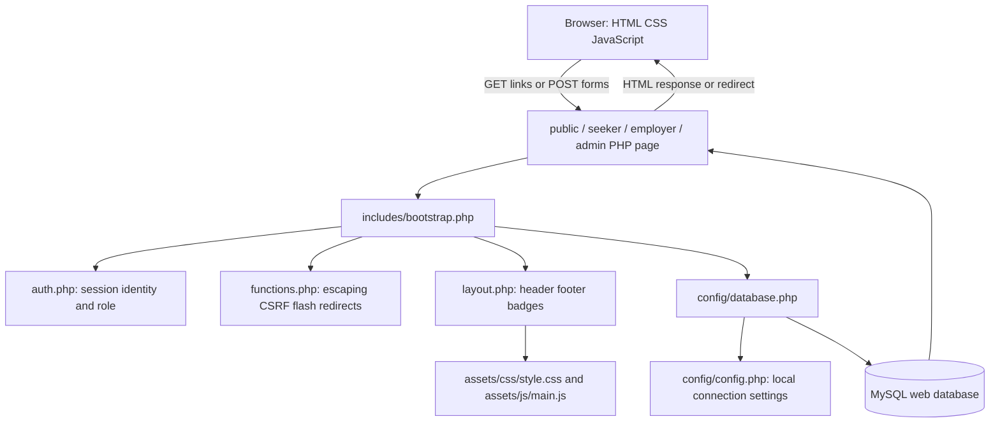
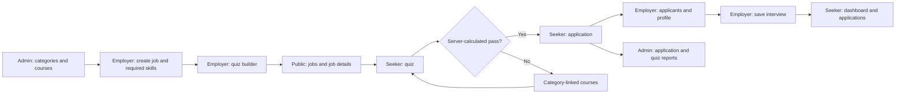
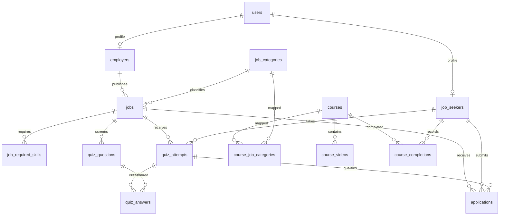

# Member 2: Jobseeker journey and skill search

**Team guides:** [Member 1](member-1-foundations-and-ui.md) · [Member 2](member-2-jobseeker-and-search.md) · [Member 3](member-3-employer-and-interviews.md) · [Member 4](member-4-admin-and-database.md)

## Contents

- [How to study this guide](#how-to-study-this-guide)
- [Equal team responsibilities](#equal-team-responsibilities)
- [Overall architecture everyone must understand](#overall-architecture-everyone-must-understand)
- [Core reading vocabulary used throughout the project](#core-reading-vocabulary-used-throughout-the-project)
- [Member 2 — concepts before your code](#member-2--concepts-before-your-code)
- [Your file ownership and reading order](#your-file-ownership-and-reading-order)
- [Chunk-by-chunk source walkthrough](#chunk-by-chunk-source-walkthrough)
- [File: public/jobs.php](#file-publicjobsphp)
- [File: public/job-details.php](#file-publicjob-detailsphp)
- [File: seeker/dashboard.php](#file-seekerdashboardphp)
- [File: seeker/profile.php](#file-seekerprofilephp)
- [File: seeker/cv-preview.php](#file-seekercv-previewphp)
- [File: seeker/quiz.php](#file-seekerquizphp)
- [File: seeker/quiz-result.php](#file-seekerquiz-resultphp)
- [File: seeker/applications.php](#file-seekerapplicationsphp)
- [File: seeker/recommendations.php](#file-seekerrecommendationsphp)
- [File: seeker/course.php](#file-seekercoursephp)
- [Member 2 — complete worked examples](#member-2--complete-worked-examples)
- [Shared final rehearsal checklist](#shared-final-rehearsal-checklist)

## How to study this guide

This is a teaching snapshot of the code on 27 September 2026, with the quiz visibility feature updated on 29 September 2026, not a claim about who originally wrote it. Replace Member 1–4 with your names. Start with the concepts, trace one complete request, then study each assigned file in source order. Source chunks include every line of the assigned runtime files; their headings give the original line ranges. Blank lines and closing braces delimit blocks rather than introducing new behavior. Some existing templates put many statements on one line: read the explanation and the attribute glossary before following that long line.

For each chunk, answer: **What input enters? Which condition runs? What changes in memory/database? What output or redirect leaves? Who is allowed to do this?** Read the actual source alongside the guide if the project has changed since this snapshot. Source hashes identify the version explained. Configuration secrets are deliberately excluded; the example configuration teaches the same structure.

## Equal team responsibilities

| Member | Primary implementation/study responsibility | Main integration handoff |
| --- | --- | --- |
| 1 | Shared PHP foundations, login/register/logout, homepage, all shared HTML/CSS/JavaScript | Provides session identity, CSRF, escaping, navigation, and UI conventions to everyone |
| 2 | Public job discovery, badges, job details, all seeker pages, quiz scoring, applications, learning | Consumes employer jobs/questions and admin courses; creates attempts/applications |
| 3 | All employer pages, candidate review, interview display helper, interview regression checks | Writes jobs/questions/schedules; works with Member 2 to verify candidate visibility |
| 4 | All administrator pages, PDO configuration, full SQL schema/seeds/migration, installation documentation | Supplies shared data model, integrity rules, categories/courses, reports, and setup |

There are three application roles but four engineering responsibilities: shared infrastructure/UI is the fourth responsibility. Equal means comparable learning, explanation, and demonstration effort, not equal file counts. Member 1 has more repetitive CSS lines; Members 2 and 3 have denser business rules; Member 4 has SQL relationships and constraints. Give each member the same **12-hour study allocation**: 2 hours concepts/architecture, 5 hours owned code, 2 hours practical tracing, 1 hour cross-review, and 2 hours viva rehearsal. Each prepares a 6-minute demonstration and answers questions about one other member's handoff. These are suggested allocations, not measured reading times.

## Overall architecture everyone must understand

The project is a **server-rendered, procedural PHP multipage application**. A URL points directly to a PHP file. That file commonly performs request handling, SQL access, and HTML rendering together. Shared functions reduce repetition. It is not a framework MVC implementation, SPA, REST API service, or microservice system.



`bootstrap.php` loads the database function definition; it does not immediately connect. The first `database()` call opens PDO, and a static variable reuses that connection for the rest of this request. PHP variables do not persist between unrelated web requests. MySQL records and session data can persist.

### The stack and its exact role

| Technology | Where and why |
| --- | --- |
| PHP 8.2+ project target | Executes server logic, functions, sessions, validation, scoring, SQL calls, HTML templates; the local checks previously used PHP 8.5 |
| MySQL 8+ / InnoDB | Relational storage, foreign keys, unique/check constraints, transactions, aggregates |
| PDO with pdo_mysql | PHP-to-MySQL connection and parameterized SQL; no ORM |
| HTML5 | Semantic content, links, GET/POST forms, native details/summary disclosure, client validation |
| CSS3 | Custom layout, responsive grid/flex, badges, focus, printing, reduced motion; no Bootstrap/Tailwind |
| Vanilla JavaScript | DOM enhancements, field visibility, and quiz tab-hidden auto-submission after Start; no React, jQuery, Node build step, or AJAX search |
| PHP sessions | Browser has a session identifier cookie; authenticated user ID, CSRF token, and flashes live in server session state |
| Apache/XAMPP or PHP built-in server | Executes PHP and serves assets; the development server command is `php -S localhost:8000` from the root |
| Fontshare / Google Fonts | External font/icon stylesheets requested by the shared header; fonts fall back when unavailable |
| YouTube iframe | Plays an externally hosted video; the database stores a video ID, not a video file |
| Browser print dialog | CV can be printed or saved to PDF; no server PDF library |

### One normal page request

1. Browser requests `seeker/applications.php` with its session cookie.
2. `require_once` loads `bootstrap.php`; PHP opens/resumes the named session and loads shared functions.
3. `require_login('seeker')` uses the session ID to read `users`, checks active status and role, and redirects unauthorized visitors.
4. A prepared query filters applications by the authenticated user's ID, joins the job and employer, and returns associative arrays.
5. `page_header()` outputs the document shell and pulls flash messages.
6. The template loops over rows; `e()` escapes text and attributes; `interview_details()` prints schedule data.
7. The footer loads JavaScript. The browser lays out the HTML with CSS. It never receives raw PHP source.

### One normal write request

POST form → session/role check → CSRF check → read/validate fields → prepared INSERT/UPDATE/DELETE → optional commit → flash → redirect → fresh GET renders the result. This is the Post/Redirect/Get pattern. Redirects must occur before HTML is sent. CSRF validation does not replace role or ownership validation.

### Complete business workflow and file connections



The shared database connects roles; one PHP page does not call another page in the background. For example, the employer updates one `applications` row, then the seeker reads that row on their next request. There is no live push notification or email delivery. `includes/interview-details.php` keeps display logic consistent but does not itself authenticate or query data.

### Relationship map



The six CV detail tables also reference `job_seekers.user_id`: `education`, `experience`, `projects`, `job_seeker_skills`, `certifications`, and `languages`. Role-specific profiles use `user_id` as both primary key and foreign key. There is no separate `admins` table. An interview is stored directly in `applications`, not in a separate meeting table. The diagram shows structural links; the passing-attempt rule is additionally enforced by PHP when submitting an application.

## Core reading vocabulary used throughout the project

| Syntax / concept | Meaning in this project |
| --- | --- |
| `<?php ... ?>`, `<?= ... ?>` | Execute PHP, then return to literal HTML; short echo prints an expression |
| `$variable`, `['key']`, `=>`, `[]` | PHP variable, associative-array lookup, key/value pair, and array creation/append |
| `$_GET`, `$_POST`, `$_SERVER`, `$_SESSION` | URL inputs, submitted body fields, request metadata, server session state |
| `??` versus `?:` | Missing/null fallback versus any falsy-value fallback; a string `"0"` is falsy in PHP |
| `===`, `!==`, `&&`, `\|\|`, `!` | Strict comparisons and Boolean operators; conditions choose which branch executes |
| `(int)`, `(float)`, `(bool)`, `(string)` | Explicit type conversion, not complete validation; casting an ID does not prove ownership |
| `.`, `.=` | String concatenation / append; SQL text and redirect paths use it |
| `function`, `return`, `void`, `never`, `?array` | Named reusable behavior, returned result, no result, never returns normally, nullable array |
| `declare(strict_types=1)` | Scalar type rules for calls made from that PHP file; it is not automatically inherited by all including files |
| `static` local variable | Keeps a cached value across calls in the same request, not a global cross-user login cache |
| `__DIR__`, `__FILE__`, `require_once` | Current file directory/path and load-once inclusion; filesystem paths differ from browser URLs |
| `foreach`, `if: ... endif`, `endforeach` | Iterate records and use template-friendly control syntax |
| `->`, `::` | Object method/property access and class constant/static access, such as `PDO::FETCH_COLUMN` |
| `prepare`, `execute` | SQL structure first, input values second; `?` placeholders bind in array order |
| `query` | Execute fixed SQL directly; do not concatenate untrusted strings into it |
| `fetch`, `fetchAll`, `fetchColumn` | One row, all rows, or one scalar/column; `fetch()` may return false |
| `JOIN` vs `LEFT JOIN` | Require a related row vs retain the left row even if no related row exists |
| `EXISTS`, `COUNT`, `SUM`, `AVG`, `GROUP BY` | Presence check, totals, sums, averages, grouping; not interchangeable |
| `ORDER BY`, `LIMIT` | Result ordering and row cap; a recent-five list is not the complete history |
| `NULL`, `COALESCE` | Missing SQL value and fallback for missing values, distinct from the empty string |
| Transaction | Related statements become one commit; rollback undoes uncommitted changes on that connection |
| Authentication / authorization / ownership | Who you are / whether your role can use the operation / whether this particular row belongs to you |
| Validation / escaping / parameter binding | Check business rules / make output safe as HTML / bind data safely into SQL; each solves a different problem |

### HTML properties and attributes to recognize

`name` becomes the submitted PHP key; `id` identifies an element for a label, fragment link, or JS; `class` selects reusable CSS. `value` supplies a field/option's submitted data. `method="get"` puts filters in a shareable URL; `method="post"` sends changes in a body (it is not encryption). Missing `action` means submit to the current page. `type="hidden"` hides UI but is still editable by a user. `required`, `min`, `max`, `minlength`, `maxlength`, and input types provide browser checks; the server still needs validation. `selected` chooses a select option; `checked` chooses a checkbox/radio; `disabled` prevents normal submission. `placeholder` is a hint, not a label or saved value.

`for` associates a label with an `id`; nesting a control inside a label also associates them. `aria-label` gives an accessible name; `aria-labelledby` points to visible naming text; `aria-describedby` points to help; `aria-current` identifies the current page/filter; `aria-hidden` hides decorative duplicates from assistive technology. `role="status"` marks status text. `tabindex="0"` makes an element focusable. `target="_blank"` opens another tab and `rel="noopener noreferrer"` removes opener/referrer access. `details` and `summary` provide a native disclosure; without `open`, extra filters start collapsed. `data-confirm` exposes a custom string through JS `dataset.confirm`. `href="#id"` links to a fragment; it does not query the database.

### Security explanation every member should be able to give

Use the session for acting-user identity. Use role checks before protected actions and row ownership in SQL. Check a session-bound unpredictable CSRF token for POST operations. Use prepared SQL values and escape HTML output with `htmlspecialchars`. Passwords are hashed and verified, never decrypted. Meeting links also need an HTTP(S) scheme check because HTML escaping alone does not reject a `javascript:` URL. These are defenses present in the code, not a claim of complete production hardening.

### Built-in functions and object methods: quick teaching reference

| Function / method | How to read a line that uses it |
| --- | --- |
| `trim`, `strtolower`, `strtoupper`, `ucwords` | Remove edge whitespace, lowercase, uppercase, or capitalize words. These transform text, not permissions. |
| `str_replace`, `substr`, `strlen` | Replace substrings, take a substring, count bytes. strlen is not a Unicode character count. |
| `strcasecmp`, `str_contains` | Case-insensitive string comparison (zero means equal) and substring presence (Boolean). |
| `explode`, `implode` | Split a string by a separator; join array values with a separator. Skill input uses commas, display aggregation uses a pipe. |
| `array_map`, `array_filter`, `array_unique` | Transform each value, keep matching/truthy values, remove duplicate values. Check the callback/default behavior before assuming normalization. |
| `array_merge`, `array_intersect_key` | Combine maps (later string keys replace earlier ones); keep keys also present in another array. Tests use the latter to compare fixture fields after removing its extra employer_id key. |
| `in_array($value, $list, true)` | Membership check with strict types; an int and a numeric string are not equal in this mode. |
| `isset`, `empty`, `unset`, `count` | Check non-null existence, test falsy/missing state, remove a variable/key, count elements. empty also considers string zero empty. |
| `round`, `intval` | Round a number to precision; convert a value to integer. Neither establishes ownership. |
| `filter_var` and validation constants | Validate URL/email structure. A successful shape check does not prove the email/domain/meeting exists. |
| `preg_match`, `preg_match_all` | Match a regular expression once or count all matches; ^/$ anchor and {11} repeats eleven times. /u uses UTF-8; /s makes dot include newline. |
| `parse_url` | Parse URL components; PHP_URL_SCHEME requests the protocol part. |
| `htmlspecialchars`, `nl2br` | Escape HTML-sensitive characters; add HTML breaks for newlines. Escape first, add breaks second. |
| `http_build_query` | Encode a map into URL query text, including literal plus signs and spaces. Escape that resulting text when inserting into an HTML attribute. |
| `date`, `strtotime`, `time`, `date_default_timezone_get` | Format a timestamp, parse date text, get current Unix time, get the configured PHP timezone. A browser datetime-local input carries no zone. |
| `DateTimeImmutable::createFromFormat`, `format`, `getTimestamp` | Parse an exact wall-clock format into an immutable object, format it again, and obtain epoch seconds for comparison. |
| `session_name`, `session_start`, `session_id` | Choose the cookie/session name, load session state, and read/set the identifier. Set name/identifier before starting as appropriate. |
| `session_regenerate_id`, `session_unset`, `session_destroy` | Replace the identifier, clear in-memory session variables, delete stored session state. They are distinct operations. |
| `random_bytes`, `bin2hex`, `hash_equals` | Secure random bytes, printable hex encoding, timing-safe equality comparison. Used for tokens/test session names. |
| `password_hash`, `password_verify` | Create a password hash and verify a proposed password against it. Never decrypt a password. |
| `header`, `http_response_code`, `exit` | Send response metadata, choose HTTP status, stop execution. A redirect helper calls exit so later writes/output cannot continue. |
| `PDO::prepare`, `PDOStatement::execute` | Prepare SQL with placeholders, then supply bound values in order. A SELECT execution is followed by fetching. |
| `fetch`, `fetchAll`, `fetchColumn`, `PDO::FETCH_COLUMN` | Read one row, all rows, one scalar, or request flat-column results; fetch false means no row. |
| `lastInsertId` | ID allocated by the last relevant auto-increment insert on this connection; retrieve it before unrelated inserts. |
| `beginTransaction`, `commit`, `rollBack`, `inTransaction` | Start, persist, undo, and inspect transaction state. Transactions use the same PDO connection. |
| `error_log`, `PDOException`, `ErrorException`, `RuntimeException` | Log a diagnostic or represent a database/PHP/test failure. A catch block handles only matching exception classes. |
| `ob_start`, `ob_get_clean` | Capture rendered output in a buffer and retrieve it while ending the buffer. Tests inspect the HTML string. |
| `proc_open`, `stream_get_contents`, `proc_close` | Start a child process, read its output pipes, collect its exit status. Used only by the CLI test runner. |
| `set_error_handler`, `register_shutdown_function`, `error_get_last` | Install a PHP error callback, run cleanup/assertions when execution ends, and inspect the last PHP error. |
| `static fn(...) => ...`, `function (...) use (...)` | Arrow callback returning one expression, or closure capturing named outside variables. static prevents binding an object context; it does not create persistent storage here. |

Read `+=` as add-and-assign, `[] =` as append, and `condition ? a : b` as choose one result. A single-line if controls only its following statement. A variable can be reused for different values: quiz.php changes `$job` from a prepared statement to the fetched row, and many `$s` variables are reused for new statements. This is legal procedural PHP but requires following assignment order carefully.

### What is actually implemented, and what is not

Quiz tab visibility: after the caution is acknowledged with Start, a hidden quiz tab triggers submission of current answers. This uses inline JavaScript in `seeker/quiz.php` (Member 2); PHP still scores the attempt. It is a client-side deterrent, not guaranteed cheating prevention or server-enforced attempt locking. No database change is required. See Member 2’s updated quiz walkthrough for the full code and limitations.

The quiz is scored by PHP using current database answers. Failed attempts suggest courses by **job category**, not AI or a semantic skill-matching model. Completion is self-reported with a button, not verified watching. Passing any previous attempt for the same job permits applying; there is no implemented maximum-attempt lock. Database defaults/constraints and browser validation cover some cases, but server validation is uneven. Application POST does not independently recheck the job deadline/current active status. Some broad PDO exception handlers label every database error as a duplicate. Those are current limitations to explain honestly, not features to claim.

Shared CSS names such as a “locked” badge do not prove that corresponding business logic exists. No email notifications, automatic hiring decisions, uploaded CV processing, dedicated REST API, or frontend framework are implemented. This guide documents the current code and does not change those behaviors.

## Member 2 — concepts before your code

1. **GET filtering.** A skill badge is a link such as `jobs.php?skill=C%2B%2B`. PHP builds known SQL predicates and binds values. `+` must be encoded as `%2B` or URL parsing treats it as a space. `http_build_query` handles encoding; `e` then makes the URL safe inside HTML.
2. **Relational lookup.** A job and each skill occupy different rows. `EXISTS` asks whether the job has a matching skill without duplicating the job result. Personal skills (`job_seeker_skills`) and required job skills (`job_required_skills`) are different tables.
3. **State in a form.** GET values refill controls and URLs preserve other filters. The selected skill remains in a hidden field when more filters are submitted. Native `details` starts closed after navigation; an applied-filter count tells users extra constraints still exist.
4. **CRUD and ownership.** A profile page uses an `action` field to choose which table operation runs. The session supplies `seeker_id`. An entry ID alone is insufficient to authorize deleting it. Dynamic table names cannot be safely bound as ordinary values, so deletion uses a strict table allowlist.
5. **Weighted scoring.** Add all possible marks, then marks for exact correct answers. Percentage = earned / possible × 100, rounded to two decimal places. A pass compares this to the job's stored threshold. Example: 2 and 3 mark questions, only the 3-mark answer correct: 3/5 × 100 = 60%, not 50%.
6. **Transaction and history.** One quiz attempt and all its answer rows are saved together. An application references a passing attempt and a unique job/seeker pair. Later failures do not erase a previous pass. The quiz score is computed server-side; a fake browser score field is irrelevant.
7. **Recommendations and completion.** Courses are joined through job categories. Completion is an upsert keyed by course and seeker. An iframe uses a validated 11-character YouTube ID. Course playback never supplies proof of attendance.
8. **View composition.** The dashboard has several independent SQL queries. An interview list is separate from the recent-five applications query, so older applications can still appear there. The shared interview function, owned by Member 3, renders data you already authorized.

**Your handoffs:** Member 3 creates the jobs/questions you read and reads the applications you create. Member 4 supplies category/course relationships. Member 1 supplies login, CSRF, escaping, shared styles, and role-aware navigation.

**Practice trace:** choose Python → open a job → inspect which quiz fields reach HTML → submit one correct and one wrong answer → calculate score manually → follow pass/apply and fail/course branches. Finish by checking the interview written by Member 3.

## Your file ownership and reading order

- [public/jobs.php](../../public/jobs.php) — Public job discovery and skill badge filtering.
- [public/job-details.php](../../public/job-details.php) — Display an active job and route a seeker to screening.
- [seeker/dashboard.php](../../seeker/dashboard.php) — Seeker summary with prominent interview details.
- [seeker/profile.php](../../seeker/profile.php) — Personal data and six CV record types; one action-dispatch page.
- [seeker/cv-preview.php](../../seeker/cv-preview.php) — Read the current seeker CV and use browser printing.
- [seeker/quiz.php](../../seeker/quiz.php) — Server-scored preliminary screening with stored attempts and answers.
- [seeker/quiz-result.php](../../seeker/quiz-result.php) — Display only the signed-in seeker’s stored attempt.
- [seeker/applications.php](../../seeker/applications.php) — Submit a qualified application and read complete personal application history.
- [seeker/recommendations.php](../../seeker/recommendations.php) — Category-linked course recommendations, with completion indicators.
- [seeker/course.php](../../seeker/course.php) — Course player and self-reported completion.

## Chunk-by-chunk source walkthrough

Read each explanation, trace the code below it, and then summarize it aloud before continuing. Every chunk is in original source order; code is reproduced as stored, including existing compact template lines.

## File: public/jobs.php

**Responsibility:** Public job discovery and skill badge filtering.

**Source:** [public/jobs.php](../../public/jobs.php) · **SHA-256 snapshot prefix:** `236b24b32961`

### Read filter inputs — source lines 1–10

Read URL parameters with defaults, trim strings and cast category ID. Initialize mandatory active-status/deadline predicates and an empty parameter array. This page is public: it does not require a seeker login.

```php
<?php
require_once __DIR__ . '/../includes/bootstrap.php';
$search = trim((string) ($_GET['search'] ?? ''));
$category = (int) ($_GET['category'] ?? 0);
$location = trim((string) ($_GET['location'] ?? ''));
$type = trim((string) ($_GET['type'] ?? ''));
$workplace = trim((string) ($_GET['workplace'] ?? ''));
$skill = trim((string) ($_GET['skill'] ?? ''));
$where = ["j.status = 'active'", 'j.deadline >= CURDATE()'];
$params = [];
```

### Build optional filters — source lines 11–30

Search wraps the input in % for LIKE and checks title, description, or related skills. Category is an exact ID filter; location is partial matching. Type/workplace predicates are added only for allowed enum strings. Each ? gets its corresponding ordered value in params. User values are not interpolated into SQL; % and _ entered by users still have LIKE wildcard meaning.

```php
if ($search !== '') {
    $where[] = '(j.title LIKE ? OR j.description LIKE ? OR EXISTS (SELECT 1 FROM job_required_skills search_skill WHERE search_skill.job_id=j.id AND search_skill.skill_name LIKE ?))';
    $params[] = "%$search%";
    $params[] = "%$search%";
    $params[] = "%$search%";
}
if ($category) {
    $where[] = 'j.category_id = ?';
    $params[] = $category;
} if ($location !== '') {
    $where[] = 'j.location LIKE ?';
    $params[] = "%$location%";
}
if (in_array($type, ['full_time','part_time','contract','internship','temporary'], true)) {
    $where[] = 'j.employment_type = ?';
    $params[] = $type;
}
if (in_array($workplace, ['on_site','hybrid','remote'], true)) {
    $where[] = 'j.workplace_type = ?';
    $params[] = $workplace;
```

### Skill and result query — source lines 31–41

Exact skill uses correlated EXISTS matching selected_skill.job_id to j.id. The main query joins category/employer and GROUP_CONCATs skill labels for display; implode joins only known predicates with AND. Execute params in construction order and fetch jobs. Category options are active categories. Badge counts use all active unexpired jobs, independent of the other selected filters; count can exceed current results.

```php
}
if ($skill !== '') {
    $where[] = 'EXISTS (SELECT 1 FROM job_required_skills selected_skill WHERE selected_skill.job_id=j.id AND selected_skill.skill_name=?)';
    $params[] = $skill;
}
$sql = 'SELECT j.*, c.name category_name, e.company_name, (SELECT GROUP_CONCAT(skill_name ORDER BY skill_name SEPARATOR "|") FROM job_required_skills WHERE job_id=j.id) skills FROM jobs j JOIN job_categories c ON c.id=j.category_id JOIN employers e ON e.user_id=j.employer_id WHERE ' . implode(' AND ', $where) . ' ORDER BY j.created_at DESC';
$statement = database()->prepare($sql);
$statement->execute($params);
$jobs = $statement->fetchAll();
$categories = database()->query('SELECT id, name FROM job_categories WHERE is_active=1 ORDER BY name')->fetchAll();
$availableSkills = database()->query("SELECT s.skill_name, COUNT(*) total FROM job_required_skills s JOIN jobs j ON j.id=s.job_id WHERE j.status='active' AND j.deadline>=CURDATE() GROUP BY s.skill_name ORDER BY s.skill_name")->fetchAll();
```

### Build badge state — source lines 42–54

Prepopulate six common skills at zero, then merge actual counts using lowercase array keys. Keep a typed/URL-selected unknown skill visible with zero. filters stores every non-skill constraint for reuse in URLs. array_filter plus an arrow function counts nonempty/nonzero additional filters. Case-insensitive PHP selection uses strcasecmp later; database equality also follows its configured collation.

```php
// Common badges stay available even when there are no matching open jobs yet.
$skillBadges = [];
foreach (['C++', 'Python', 'JavaScript', 'Java', 'PHP', 'SQL'] as $name) {
    $skillBadges[strtolower($name)] = ['name' => $name, 'total' => 0];
}
foreach ($availableSkills as $item) {
    $skillBadges[strtolower($item['skill_name'])] = ['name' => $item['skill_name'], 'total' => (int) $item['total']];
}
if ($skill !== '' && !isset($skillBadges[strtolower($skill)])) {
    $skillBadges[strtolower($skill)] = ['name' => $skill, 'total' => 0];
}
$filters = ['search' => $search, 'category' => $category, 'location' => $location, 'type' => $type, 'workplace' => $workplace];
$extraFilterCount = count(array_filter($filters, static fn($value) => $value !== '' && $value !== 0));
```

### Clickable badge navigation — source lines 55–68

Render header and compact introduction. All skills builds a URL without skill while preserving other filters. Each badge chooses selected state, class, aria-current and an accessible count. Clicking the selected badge sends empty skill to toggle it off. http_build_query correctly encodes C++ as C%2B%2B; e escapes ampersands for HTML. These are ordinary GET links and work without JS.

```php
page_header('Browse jobs'); ?>
<h1>Open positions</h1>
<p class="meta">Find a role that matches your skills and preferred workplace.</p>
<section class="card skill-search" aria-labelledby="skill-search-title">
    <h2 id="skill-search-title">Search by skill</h2>
    <p class="meta">Choose a skill. Scroll the badges for more. Counts show all open jobs.</p>
    <nav class="skill-filters" aria-label="Filter jobs by skill">
        <a class="badge skill-badge <?= $skill === '' ? 'active' : '' ?>" <?= $skill === '' ? 'aria-current="true"' : '' ?> href="jobs.php?<?= e(http_build_query($filters)) ?>">All skills</a>
        <?php foreach ($skillBadges as $item): $selected = strcasecmp($skill, $item['name']) === 0; ?>
            <a class="badge skill-badge <?= $selected ? 'active' : '' ?>" <?= $selected ? 'aria-current="true"' : '' ?> href="jobs.php?<?= e(http_build_query(array_merge($filters, ['skill' => $selected ? '' : $item['name']]))) ?>" aria-label="<?= e(($selected ? 'Remove ' : 'Filter by ') . $item['name'] . ' skill filter, ' . $item['total'] . ' open jobs') ?>">
                <?php if ($selected): ?><span aria-hidden="true">✓</span><?php endif; ?><?= e($item['name']) ?> <span class="skill-count"><?= $item['total'] ?></span>
            </a>
        <?php endforeach; ?>
    </nav>
```

### Collapsed additional filters — source lines 69–87

details has no open attribute, so the larger form starts closed. summary displays an applied count. Hidden skill preserves the badge when form fields are submitted. Category/type/workplace options retain selected state; location/search retain values. Apply filters submits GET; Clear filters discards everything. There is no duplicate visible skill text input.

```php
    <details class="job-filters">
        <summary>More filters<?= $extraFilterCount ? ' (' . $extraFilterCount . ' applied)' : '' ?></summary>
<form method="get" action="jobs.php" class="form-grid">
    <input type="hidden" name="skill" value="<?= e($skill) ?>">
    <label>Search<input name="search" value="<?= e($search) ?>" placeholder="Title, keyword, or skill"></label>
    <label>Category<select name="category"><option value="">All categories</option>
        <?php foreach ($categories as $item): ?><option value="<?= $item['id'] ?>" <?= $category === (int) $item['id'] ? 'selected' : '' ?>><?= e($item['name']) ?></option><?php endforeach; ?>
    </select></label>
    <label>Location<input name="location" value="<?= e($location) ?>" placeholder="City or area"></label>
    <label>Employment type<select name="type"><option value="">Any type</option>
        <?php foreach (['full_time', 'part_time', 'contract', 'internship', 'temporary'] as $option): ?><option value="<?= $option ?>" <?= $type === $option ? 'selected' : '' ?>><?= status_label($option) ?></option><?php endforeach; ?>
    </select></label>
    <label>Workplace<select name="workplace"><option value="">Any workplace</option>
        <?php foreach (['on_site', 'hybrid', 'remote'] as $option): ?><option value="<?= $option ?>" <?= $workplace === $option ? 'selected' : '' ?>><?= status_label($option) ?></option><?php endforeach; ?>
    </select></label>
    <div class="full"><button>Apply filters</button> <a class="button secondary" href="jobs.php">Clear filters</a></div>
</form>
    </details>
</section>
```

### Results and reset links — source lines 88–101

An extra-filter clear link keeps only skill; Remove skill filter keeps the other filters. role=status marks result count. Loop jobs into grid cards with category, title, company/location, clickable required skills, readable enum labels/date, and detail link. Empty results have a helpful reset. There is no pagination or asynchronous fetch; each click reloads this PHP page.

```php
<?php if ($extraFilterCount): ?><p class="meta"><?= $extraFilterCount ?> additional <?= $extraFilterCount === 1 ? 'filter is' : 'filters are' ?> applied. <a class="text-link" href="jobs.php?<?= e(http_build_query(['skill' => $skill])) ?>">Clear additional filters</a></p><?php endif; ?>
<div class="page-heading"><p class="meta" role="status"><?= count($jobs) ?> <?= count($jobs) === 1 ? 'job' : 'jobs' ?> found<?= $skill !== '' ? ' requiring ' . e($skill) : '' ?></p><?php if ($skill !== ''): ?><a class="text-link" href="jobs.php?<?= e(http_build_query($filters)) ?>">Remove skill filter</a><?php endif; ?></div>
<section class="grid">
    <?php foreach ($jobs as $job): ?>
        <article class="card"><span class="badge"><?= e($job['category_name']) ?></span><h3><?= e($job['title']) ?></h3>
            <p><?= e($job['company_name']) ?> · <?= e($job['location']) ?></p>
            <?php if ($job['skills']): ?><p><?php foreach (explode('|', $job['skills']) as $jobSkill): ?><a class="badge skill-badge <?= strcasecmp($skill, $jobSkill) === 0 ? 'active' : '' ?>" href="jobs.php?<?= e(http_build_query(array_merge($filters, ['skill' => $jobSkill]))) ?>" aria-label="<?= e('Find jobs requiring ' . $jobSkill) ?>"><?= e($jobSkill) ?></a> <?php endforeach; ?></p><?php endif; ?>
            <p class="meta"><?= status_label($job['employment_type']) ?> · <?= status_label($job['workplace_type']) ?> · Apply by <?= e(date('M j, Y', strtotime($job['deadline']))) ?></p>
            <a class="button small" href="job-details.php?id=<?= $job['id'] ?>">View role</a>
        </article>
    <?php endforeach; ?>
</section>
<?php if (!$jobs): ?><div class="card empty-state"><h2>No matching jobs</h2><p>Try a different keyword or remove a filter to see more roles.</p><a class="button secondary" href="jobs.php">Clear filters</a></div><?php endif; ?>
<?php page_footer(); ?>
```

## File: public/job-details.php

**Responsibility:** Display an active job and route a seeker to screening.

**Source:** [public/job-details.php](../../public/job-details.php) · **SHA-256 snapshot prefix:** `00e59c4deae2`

### Load one job — source lines 1–10

Read numeric id, join category/company, and require active job status. Missing/inactive job produces 404 and stops. This query does not additionally check deadline.

```php
<?php
require_once __DIR__ . '/../includes/bootstrap.php';
$id = (int)($_GET['id'] ?? 0);
$statement = database()->prepare("SELECT j.*, c.name category_name, e.company_name, e.description company_description FROM jobs j JOIN job_categories c ON c.id=j.category_id JOIN employers e ON e.user_id=j.employer_id WHERE j.id=? AND j.status='active'");
$statement->execute([$id]);
$job = $statement->fetch();
if (!$job) {
    http_response_code(404);
    exit('Job not found.');
}
```

### Related skills and quiz availability — source lines 11–16

Two prepared queries fetch required skill names and question count. fetchColumn gets the scalar count; >0 becomes hasQuiz. Render the title using the shared header.

```php
$skills = database()->prepare('SELECT skill_name FROM job_required_skills WHERE job_id=?');
$skills->execute([$id]);
$questionCount = database()->prepare('SELECT COUNT(*) FROM quiz_questions WHERE job_id=?');
$questionCount->execute([$id]);
$hasQuiz = (int) $questionCount->fetchColumn() > 0;
page_header($job['title']); ?>
```

### Detail template and call to action — source lines 17–19

Print escaped title/company/location and multiline description/responsibilities/requirements. Skill spans here are display badges, unlike clickable badges on the search page. Show passing threshold. A seeker with questions gets the quiz link; without questions, a notice; guest gets login. Employer/admin gets no apply CTA. This visual condition is not the application POST eligibility check.

```php
<article class="card"><span class="badge"><?= e($job['category_name']) ?></span><h1><?= e($job['title']) ?></h1><p class="lead"><?= e($job['company_name']) ?> · <?= e($job['location']) ?></p><p><?= nl2br(e($job['description'])) ?></p><h2>Responsibilities</h2><p><?= nl2br(e($job['responsibilities'])) ?></p><h2>Requirements</h2><p><?= nl2br(e($job['requirements_text'])) ?></p><h2>Skills</h2><?php foreach ($skills->fetchAll() as $skill): ?><span class="badge"><?= e($skill['skill_name']) ?></span> <?php endforeach; ?><p class="meta">Preliminary quiz pass score: <?= e($job['minimum_passing_score']) ?>%</p><?php $user = current_user();
if ($user && $user['role'] === 'seeker' && $hasQuiz): ?><a class="button" href="../seeker/quiz.php?job_id=<?= $id ?>">Take preliminary quiz</a><?php elseif ($user && $user['role'] === 'seeker'): ?><p class="notice">The employer has not published quiz questions for this job yet.</p><?php elseif (!$user): ?><a class="button" href="login.php">Login to apply</a><?php endif; ?></article>
<?php page_footer(); ?>
```

## File: seeker/dashboard.php

**Responsibility:** Seeker summary with prominent interview details.

**Source:** [seeker/dashboard.php](../../seeker/dashboard.php) · **SHA-256 snapshot prefix:** `544c1cd22158`

### Identity and profile — source lines 1–10

Require seeker and get PDO, explicitly load shared interview renderer, then fetch own profile joined with email. ID comes from authenticated user.

```php
<?php
require_once __DIR__ . '/../includes/bootstrap.php';
$user = require_login('seeker');
$pdo = database();
require_once __DIR__ . '/../includes/interview-details.php';

// Profile info
$s = $pdo->prepare('SELECT js.*, u.email FROM job_seekers js JOIN users u ON u.id=js.user_id WHERE js.user_id=?');
$s->execute([$user['id']]);
$profile = $s->fetch();
```

### Counts and skills — source lines 11–23

A map pairs statistic keys with fixed count SQL; each statement binds seeker ID and fetches one scalar. A separate query retrieves skill names/levels for badges. Counts are database facts, not session counters.

```php

// Stats
$counts = [];
foreach (['applications' => 'SELECT COUNT(*) FROM applications WHERE seeker_id=?','attempts' => 'SELECT COUNT(*) FROM quiz_attempts WHERE seeker_id=?','courses' => 'SELECT COUNT(*) FROM course_completions WHERE seeker_id=?'] as $key => $sql) {
    $st = $pdo->prepare($sql);
    $st->execute([$user['id']]);
    $counts[$key] = $st->fetchColumn();
}

// Skills
$skills = $pdo->prepare('SELECT skill_name, skill_level FROM job_seeker_skills WHERE seeker_id=?');
$skills->execute([$user['id']]);
$skillList = $skills->fetchAll();
```

### History and interviews — source lines 24–38

Recent applications and quizzes each use newest-first LIMIT 5. Interviews query all own status=interview rows, including incomplete legacy schedules, and join company. ORDER BY interview_at IS NULL puts dated rows before undated ones; then date descending, not nearest-upcoming sorting. No future-only filter exists.

```php

// Recent applications
$recent = $pdo->prepare('SELECT a.id,a.status,a.applied_at,j.title FROM applications a JOIN jobs j ON j.id=a.job_id WHERE a.seeker_id=? ORDER BY a.applied_at DESC LIMIT 5');
$recent->execute([$user['id']]);
$recentApps = $recent->fetchAll();

// Keep scheduled interviews visible, even when the application is older.
$interviews = $pdo->prepare("SELECT a.*,j.title,e.company_name FROM applications a JOIN jobs j ON j.id=a.job_id JOIN employers e ON e.user_id=j.employer_id WHERE a.seeker_id=? AND a.status='interview' ORDER BY a.interview_at IS NULL, a.interview_at DESC");
$interviews->execute([$user['id']]);
$interviewList = $interviews->fetchAll();

// Recent quizzes
$quizzes = $pdo->prepare('SELECT qa.percentage,qa.passed,qa.attempted_at,j.title,j.id job_id FROM quiz_attempts qa JOIN jobs j ON j.id=qa.job_id WHERE qa.seeker_id=? ORDER BY qa.attempted_at DESC LIMIT 5');
$quizzes->execute([$user['id']]);
$quizList = $quizzes->fetchAll();
```

### Interview section — source lines 39–57

Header and greeting precede a conditional interview section. Each card calls interview_details with the already-filtered row and links to #application-ID. The fragment scrolls to a card on the applications page; it is not a new API.

```php

page_header('Seeker dashboard'); ?>
<h1>Welcome, <?= e($profile['full_name']) ?></h1>

<?php if ($interviewList): ?>
<section aria-labelledby="interviews-title">
    <div class="page-heading"><h2 id="interviews-title">Your interviews</h2><a class="text-link" href="applications.php">View all applications</a></div>
    <div class="grid interview-grid">
        <?php foreach ($interviewList as $interview): ?>
            <article class="card interview-card">
                <span class="badge badge-interview">Interview</span>
                <h3><?= e($interview['title']) ?></h3><p class="meta"><?= e($interview['company_name']) ?></p>
                <?php interview_details($interview); ?>
                <p><a class="text-link" href="applications.php#application-<?= (int) $interview['id'] ?>">View application</a></p>
            </article>
        <?php endforeach; ?>
    </div>
</section>
<?php endif; ?>
```

### Profile and action cards — source lines 58–84

Optional fields are guarded before rendering; summary uses nl2br after escaping. Skills include their level. Stats and links offer profile, CV, application history and public jobs.

```php

<article class="card">
    <h2>Your profile</h2>
    <p><strong>Email:</strong> <?= e($profile['email']) ?></p>
    <?php if ($profile['phone']): ?><p><strong>Phone:</strong> <?= e($profile['phone']) ?></p><?php endif; ?>
    <?php if ($profile['address']): ?><p><strong>Address:</strong> <?= e($profile['address']) ?></p><?php endif; ?>
    <?php if ($profile['profile_summary']): ?><p><?= nl2br(e($profile['profile_summary'])) ?></p><?php endif; ?>
    <?php if ($skillList): ?>
        <p><strong>Skills:</strong>
        <?php foreach ($skillList as $sk): ?>
            <span class="badge"><?= e($sk['skill_name']) ?> (<?= e($sk['skill_level']) ?>)</span>
        <?php endforeach; ?></p>
    <?php endif; ?>
    <p><a href="profile.php">Edit profile</a></p>
</article>

<section class="stats">
    <div class="stat"><strong><?= $counts['applications'] ?></strong>Applications</div>
    <div class="stat"><strong><?= $counts['attempts'] ?></strong>Quiz attempts</div>
    <div class="stat"><strong><?= $counts['courses'] ?></strong>Courses completed</div>
</section>
<p>
    <a class="button" href="profile.php">Build profile</a>
    <a class="button secondary" href="cv-preview.php">View CV</a>
    <a class="button secondary" href="applications.php">My applications</a>
    <a class="button secondary" href="../public/jobs.php">Browse jobs</a>
</p>
```

### Recent application table — source lines 85–100

Loop five fetched rows, link the title to its application fragment, show status badge and raw stored timestamp. An empty collection gives a useful message.

```php

<h2>Recent applications</h2>
<?php if ($recentApps): ?>
<table>
    <tr><th>Job</th><th>Status</th><th>Date</th></tr>
    <?php foreach ($recentApps as $item): ?>
    <tr>
        <td><a class="text-link" href="applications.php#application-<?= (int) $item['id'] ?>"><?= e($item['title']) ?></a></td>
        <td><?= status_badge($item['status']) ?></td>
        <td><?= e($item['applied_at']) ?></td>
    </tr>
    <?php endforeach; ?>
</table>
<?php else: ?>
    <p class="meta">No applications yet. Browse jobs to get started.</p>
<?php endif; ?>
```

### Recent quiz table — source lines 101–118

Render title, percentage, stored Boolean pass badge and attempt date. Empty history has a prompt. The page does not calculate scores again. Footer finishes the shell.

```php

<h2>Recent quiz attempts</h2>
<?php if ($quizList): ?>
<table>
    <tr><th>Job</th><th>Score</th><th>Result</th><th>Date</th></tr>
    <?php foreach ($quizList as $q): ?>
    <tr>
        <td><?= e($q['title']) ?></td>
        <td><?= e($q['percentage']) ?>%</td>
        <td><?= passed_badge((bool)$q['passed']) ?></td>
        <td><?= e($q['attempted_at']) ?></td>
    </tr>
    <?php endforeach; ?>
</table>
<?php else: ?>
    <p class="meta">No quiz attempts yet. Take a quiz from a job listing.</p>
<?php endif; ?>
<?php page_footer(); ?>
```

## File: seeker/profile.php

**Responsibility:** Personal data and six CV record types; one action-dispatch page.

**Source:** [seeker/profile.php](../../seeker/profile.php) · **SHA-256 snapshot prefix:** `7480ec6fb869`

### Profile update dispatch — source lines 1–11

Bootstrap, seeker guard and connection precede POST/CSRF. action selects profile update. Bind full name, phone, address, birth date, summary, then authenticated user ID. Optional empty values become NULL; name is not thoroughly validated server-side here. Flash success.

```php
<?php
require_once __DIR__ . '/../includes/bootstrap.php';
$user = require_login('seeker');
$pdo = database();
if ($_SERVER['REQUEST_METHOD'] === 'POST') {
    verify_csrf();
    $action = posted('action');
    if ($action === 'profile') {
        $pdo->prepare('UPDATE job_seekers SET full_name=?,phone=?,address=?,date_of_birth=?,profile_summary=? WHERE user_id=?')->execute([posted('full_name'), posted('phone') ?: null, posted('address') ?: null, posted('date_of_birth') ?: null, posted('profile_summary') ?: null, $user['id']]);
        flash('success', 'Profile updated.');
    }
```

### Skills and education — source lines 12–19

Skill action uses ON DUPLICATE KEY UPDATE to update a level when the same seeker/skill already exists. Education maps form field to field_of_study and result to result_gpa; dates/optional values can become NULL. Required nonempty institution/degree are checked. Each branch queues feedback.

```php
    if ($action === 'skill' && posted('skill_name') !== '') {
        $pdo->prepare('INSERT INTO job_seeker_skills(seeker_id,skill_name,skill_level) VALUES(?,?,?) ON DUPLICATE KEY UPDATE skill_level=VALUES(skill_level)')->execute([$user['id'], posted('skill_name'), posted('skill_level')]);
        flash('success', 'Skill saved.');
    }
    if ($action === 'education' && posted('institution') !== '' && posted('degree') !== '') {
        $pdo->prepare('INSERT INTO education(seeker_id,institution,degree,field_of_study,start_date,end_date,result_gpa) VALUES(?,?,?,?,?,?,?)')->execute([$user['id'], posted('institution'), posted('degree'), posted('field') ?: null, posted('start_date') ?: null, posted('end_date') ?: null, posted('result') ?: null]);
        flash('success', 'Education added.');
    }
```

### Experience, projects, certifications, languages — source lines 20–35

Experience stores company, position_title, description and dates. Projects stores title, description, technologies, project_url. Certifications maps issuer to issuing_organization and url to credential_url. Languages upserts proficiency for a unique seeker/language. Conditions check selected nonempty fields; database constraints/browser validation cover other parts. All seeker IDs are session-derived.

```php
    if ($action === 'experience' && posted('company') !== '' && posted('position') !== '') {
        $pdo->prepare('INSERT INTO experience(seeker_id,company,position_title,description,start_date,end_date) VALUES(?,?,?,?,?,?)')->execute([$user['id'], posted('company'), posted('position'), posted('description') ?: null, posted('start_date'), posted('end_date') ?: null]);
        flash('success', 'Experience added.');
    }
    if ($action === 'project' && posted('title') !== '') {
        $pdo->prepare('INSERT INTO projects(seeker_id,title,description,technologies,project_url) VALUES(?,?,?,?,?)')->execute([$user['id'], posted('title'), posted('description') ?: null, posted('technologies') ?: null, posted('url') ?: null]);
        flash('success', 'Project added.');
    }
    if ($action === 'certification' && posted('certification_name') !== '') {
        $pdo->prepare('INSERT INTO certifications(seeker_id,certification_name,issuing_organization,issue_date,credential_url) VALUES(?,?,?,?,?)')->execute([$user['id'], posted('certification_name'), posted('issuer'), posted('issue_date') ?: null, posted('url') ?: null]);
        flash('success', 'Certification added.');
    }
    if ($action === 'language' && posted('language_name') !== '') {
        $pdo->prepare('INSERT INTO languages(seeker_id,language_name,proficiency) VALUES(?,?,?) ON DUPLICATE KEY UPDATE proficiency=VALUES(proficiency)')->execute([$user['id'], posted('language_name'), posted('proficiency')]);
        flash('success', 'Language saved.');
    }
```

### Delete and redirect — source lines 36–45

Only six literal table names are allowed. Interpolating that validated identifier is necessary because a ? cannot stand for a table name. Bind entry ID and seeker ID to prevent deleting another user’s entry. All POST paths redirect, including unrecognized/no-op actions. No profile record is deleted here.

```php
    if ($action === 'delete_entry') {
        $allowedTables = ['job_seeker_skills', 'education', 'experience', 'projects', 'certifications', 'languages'];
        $table = posted('entry_table');
        if (in_array($table, $allowedTables, true)) {
            $pdo->prepare("DELETE FROM {$table} WHERE id = ? AND seeker_id = ?")->execute([(int) $_POST['entry_id'], $user['id']]);
            flash('success', 'CV entry removed.');
        }
    }
    redirect('profile.php');
}
```

### Read data and heading — source lines 46–64

Fetch own profile/email. entryQueries defines query metadata but is currently unused: the later sections execute their own queries. Do not claim this array drives rendering. Print preview/back links and open a wrapper card.

```php
$s = $pdo->prepare('SELECT js.*,u.email FROM job_seekers js JOIN users u ON u.id=js.user_id WHERE js.user_id=?');
$s->execute([$user['id']]);
$profile = $s->fetch();
$entryQueries = [
    'job_seeker_skills' => ['Skills', 'SELECT id, skill_name label, skill_level detail FROM job_seeker_skills WHERE seeker_id=?'],
    'education' => ['Education', "SELECT id, institution label, CONCAT(degree, COALESCE(CONCAT(' - ', field_of_study), '')) detail FROM education WHERE seeker_id=?"],
    'experience' => ['Experience', "SELECT id, company label, position_title detail FROM experience WHERE seeker_id=?"],
    'projects' => ['Projects', "SELECT id, title label, technologies detail FROM projects WHERE seeker_id=?"],
    'certifications' => ['Certifications', "SELECT id, certification_name label, issuing_organization detail FROM certifications WHERE seeker_id=?"],
    'languages' => ['Languages', 'SELECT id, language_name label, proficiency detail FROM languages WHERE seeker_id=?'],
];
page_header('My profile'); ?>
<h1>Profile and CV builder</h1>
<p>
    <a class="button" href="cv-preview.php">Preview / print CV</a>
    <a class="button secondary" href="dashboard.php">Back to dashboard</a>
</p>

<article class="card">
```

### Personal form — source lines 65–80

Hidden action=profile routes the handler. The email control is disabled and has no name, so the form cannot update it. The remaining names match the update parameters. Escape field values, place textarea contents between tags, and span wide fields with full. A horizontal rule separates sections.

```php

    <!-- Personal information -->
    <h2>Personal information</h2>
    <form method="post" class="form-grid">
        <input type="hidden" name="csrf_token" value="<?= csrf_token() ?>">
        <input type="hidden" name="action" value="profile">
        <div><label>Full name</label><input name="full_name" value="<?= e($profile['full_name']) ?>" required></div>
        <div><label>Email</label><input value="<?= e($profile['email']) ?>" disabled></div>
        <div><label>Phone</label><input name="phone" value="<?= e($profile['phone']) ?>"></div>
        <div><label>Date of birth</label><input type="date" name="date_of_birth" value="<?= e($profile['date_of_birth']) ?>"></div>
        <div class="full"><label>Address</label><input name="address" value="<?= e($profile['address']) ?>"></div>
        <div class="full"><label>Professional summary</label><textarea name="profile_summary"><?= e($profile['profile_summary']) ?></textarea></div>
        <div class="full"><button>Save profile</button></div>
    </form>

    <hr>
```

### Saved skills and add skill — source lines 81–103

Query id plus aliases label/detail. Execute for this seeker, loop nonempty results, print each escaped label/level and a delete form carrying table/id/action/CSRF. Add form sends action=skill, name and enum level. Browser required helps prompt input; the unique key enables upsert.

```php

    <!-- Skills -->
    <h2>Skills</h2>
    <?php $entries = $pdo->prepare('SELECT id, skill_name label, skill_level detail FROM job_seeker_skills WHERE seeker_id=?');
    $entries->execute([$user['id']]); $skillEntries = $entries->fetchAll(); ?>
    <?php if ($skillEntries): ?>
        <?php foreach ($skillEntries as $entry): ?>
        <div class="entry-row">
            <span><strong><?= e($entry['label']) ?></strong> <small><?= e($entry['detail']) ?></small></span>
            <form method="post"><input type="hidden" name="csrf_token" value="<?= csrf_token() ?>"><input type="hidden" name="action" value="delete_entry"><input type="hidden" name="entry_table" value="job_seeker_skills"><input type="hidden" name="entry_id" value="<?= $entry['id'] ?>"><button class="button danger small">Remove</button></form>
        </div>
        <?php endforeach; ?>
    <?php endif; ?>
    <form method="post" class="form-grid">
        <input type="hidden" name="csrf_token" value="<?= csrf_token() ?>">
        <input type="hidden" name="action" value="skill">
        <div><label>Skill name</label><input name="skill_name" required></div>
        <div><label>Level</label><select name="skill_level"><option>beginner</option><option>intermediate</option><option>advanced</option><option>expert</option></select></div>
        <div class="full"><button>Add skill</button></div>
    </form>

    <hr>

```

### Saved education and add education — source lines 104–129

CONCAT combines degree and optional field; COALESCE avoids turning the whole description NULL. Listing/removal uses the same owner-safe pattern. Add form names institution, degree, field, result, start_date, end_date map to the earlier INSERT. Date inputs send YYYY-MM-DD.

```php
    <!-- Education -->
    <h2>Education</h2>
    <?php $entries = $pdo->prepare("SELECT id, institution label, CONCAT(degree, COALESCE(CONCAT(' - ', field_of_study), '')) detail FROM education WHERE seeker_id=?");
    $entries->execute([$user['id']]); $eduEntries = $entries->fetchAll(); ?>
    <?php if ($eduEntries): ?>
        <?php foreach ($eduEntries as $entry): ?>
        <div class="entry-row">
            <span><strong><?= e($entry['label']) ?></strong> <small><?= e($entry['detail']) ?></small></span>
            <form method="post"><input type="hidden" name="csrf_token" value="<?= csrf_token() ?>"><input type="hidden" name="action" value="delete_entry"><input type="hidden" name="entry_table" value="education"><input type="hidden" name="entry_id" value="<?= $entry['id'] ?>"><button class="button danger small">Remove</button></form>
        </div>
        <?php endforeach; ?>
    <?php endif; ?>
    <form method="post" class="form-grid">
        <input type="hidden" name="csrf_token" value="<?= csrf_token() ?>">
        <input type="hidden" name="action" value="education">
        <div><label>Institution</label><input name="institution" required></div>
        <div><label>Degree</label><input name="degree" required></div>
        <div><label>Field of study</label><input name="field"></div>
        <div><label>Result / GPA</label><input name="result"></div>
        <div><label>Start date</label><input type="date" name="start_date"></div>
        <div><label>End date</label><input type="date" name="end_date"></div>
        <div class="full"><button>Add education</button></div>
    </form>

    <hr>

```

### Saved experience and add experience — source lines 130–154

Aliases display company and position_title. Removal targets experience only after allowlist/owner checks. Add form requires company, position and start_date in the browser; empty end_date represents ongoing experience. The database checks chronological order when end_date exists.

```php
    <!-- Experience -->
    <h2>Experience</h2>
    <?php $entries = $pdo->prepare("SELECT id, company label, position_title detail FROM experience WHERE seeker_id=?");
    $entries->execute([$user['id']]); $expEntries = $entries->fetchAll(); ?>
    <?php if ($expEntries): ?>
        <?php foreach ($expEntries as $entry): ?>
        <div class="entry-row">
            <span><strong><?= e($entry['label']) ?></strong> <small><?= e($entry['detail']) ?></small></span>
            <form method="post"><input type="hidden" name="csrf_token" value="<?= csrf_token() ?>"><input type="hidden" name="action" value="delete_entry"><input type="hidden" name="entry_table" value="experience"><input type="hidden" name="entry_id" value="<?= $entry['id'] ?>"><button class="button danger small">Remove</button></form>
        </div>
        <?php endforeach; ?>
    <?php endif; ?>
    <form method="post" class="form-grid">
        <input type="hidden" name="csrf_token" value="<?= csrf_token() ?>">
        <input type="hidden" name="action" value="experience">
        <div><label>Company</label><input name="company" required></div>
        <div><label>Position</label><input name="position" required></div>
        <div class="full"><label>Description</label><textarea name="description"></textarea></div>
        <div><label>Start date</label><input type="date" name="start_date" required></div>
        <div><label>End date</label><input type="date" name="end_date"></div>
        <div class="full"><button>Add experience</button></div>
    </form>

    <hr>

```

### Saved projects and add project — source lines 155–178

Listing displays title/technologies. The form stores descriptive text and optional type=url project link. Current CV preview prints stored values as text; no uploaded project file is processed.

```php
    <!-- Projects -->
    <h2>Projects</h2>
    <?php $entries = $pdo->prepare("SELECT id, title label, technologies detail FROM projects WHERE seeker_id=?");
    $entries->execute([$user['id']]); $projEntries = $entries->fetchAll(); ?>
    <?php if ($projEntries): ?>
        <?php foreach ($projEntries as $entry): ?>
        <div class="entry-row">
            <span><strong><?= e($entry['label']) ?></strong> <small><?= e($entry['detail']) ?></small></span>
            <form method="post"><input type="hidden" name="csrf_token" value="<?= csrf_token() ?>"><input type="hidden" name="action" value="delete_entry"><input type="hidden" name="entry_table" value="projects"><input type="hidden" name="entry_id" value="<?= $entry['id'] ?>"><button class="button danger small">Remove</button></form>
        </div>
        <?php endforeach; ?>
    <?php endif; ?>
    <form method="post" class="form-grid">
        <input type="hidden" name="csrf_token" value="<?= csrf_token() ?>">
        <input type="hidden" name="action" value="project">
        <div><label>Title</label><input name="title" required></div>
        <div><label>Technologies</label><input name="technologies"></div>
        <div class="full"><label>Description</label><textarea name="description"></textarea></div>
        <div class="full"><label>URL</label><input name="url" type="url"></div>
        <div class="full"><button>Add project</button></div>
    </form>

    <hr>

```

### Saved certifications and add certificate — source lines 179–202

Listing shows certification/issuer. Form fields certification_name, issuer, issue_date and url map to their database columns. The code inserts a new row; it does not implement edit-in-place for existing certificates.

```php
    <!-- Certifications -->
    <h2>Certifications</h2>
    <?php $entries = $pdo->prepare("SELECT id, certification_name label, issuing_organization detail FROM certifications WHERE seeker_id=?");
    $entries->execute([$user['id']]); $certEntries = $entries->fetchAll(); ?>
    <?php if ($certEntries): ?>
        <?php foreach ($certEntries as $entry): ?>
        <div class="entry-row">
            <span><strong><?= e($entry['label']) ?></strong> <small><?= e($entry['detail']) ?></small></span>
            <form method="post"><input type="hidden" name="csrf_token" value="<?= csrf_token() ?>"><input type="hidden" name="action" value="delete_entry"><input type="hidden" name="entry_table" value="certifications"><input type="hidden" name="entry_id" value="<?= $entry['id'] ?>"><button class="button danger small">Remove</button></form>
        </div>
        <?php endforeach; ?>
    <?php endif; ?>
    <form method="post" class="form-grid">
        <input type="hidden" name="csrf_token" value="<?= csrf_token() ?>">
        <input type="hidden" name="action" value="certification">
        <div><label>Name</label><input name="certification_name" required></div>
        <div><label>Issuer</label><input name="issuer" required></div>
        <div><label>Issue date</label><input type="date" name="issue_date"></div>
        <div><label>Credential URL</label><input name="url" type="url"></div>
        <div class="full"><button>Add certification</button></div>
    </form>

    <hr>

```

### Saved languages and add language — source lines 203–224

Language/proficiency rows follow the same delete pattern. The proficiency select has basic, conversational, professional and native; absent value attributes submit option text. action=language upserts. Close form/card and render footer.

```php
    <!-- Languages -->
    <h2>Languages</h2>
    <?php $entries = $pdo->prepare('SELECT id, language_name label, proficiency detail FROM languages WHERE seeker_id=?');
    $entries->execute([$user['id']]); $langEntries = $entries->fetchAll(); ?>
    <?php if ($langEntries): ?>
        <?php foreach ($langEntries as $entry): ?>
        <div class="entry-row">
            <span><strong><?= e($entry['label']) ?></strong> <small><?= e($entry['detail']) ?></small></span>
            <form method="post"><input type="hidden" name="csrf_token" value="<?= csrf_token() ?>"><input type="hidden" name="action" value="delete_entry"><input type="hidden" name="entry_table" value="languages"><input type="hidden" name="entry_id" value="<?= $entry['id'] ?>"><button class="button danger small">Remove</button></form>
        </div>
        <?php endforeach; ?>
    <?php endif; ?>
    <form method="post" class="form-grid">
        <input type="hidden" name="csrf_token" value="<?= csrf_token() ?>">
        <input type="hidden" name="action" value="language">
        <div><label>Language</label><input name="language_name" required></div>
        <div><label>Proficiency</label><select name="proficiency"><option>basic</option><option>conversational</option><option>professional</option><option>native</option></select></div>
        <div class="full"><button>Add language</button></div>
    </form>

</article>
<?php page_footer(); ?>
```

## File: seeker/cv-preview.php

**Responsibility:** Read the current seeker CV and use browser printing.

**Source:** [seeker/cv-preview.php](../../seeker/cv-preview.php) · **SHA-256 snapshot prefix:** `216640d4aefb`

### Read model for the CV — source lines 1–9

Require seeker, fetch profile/email, and define six section-title/query pairs. Each query selects only fields displayed in that section. This page uses its own sections map, not the unused profile entryQueries map.

```php
<?php
require_once __DIR__ . '/../includes/bootstrap.php';
$user = require_login('seeker');
$pdo = database();
$s = $pdo->prepare('SELECT js.*,u.email FROM job_seekers js JOIN users u ON u.id=js.user_id WHERE js.user_id=?');
$s->execute([$user['id']]);
$p = $s->fetch();
$sections = ['Education' => 'SELECT institution,degree,field_of_study,start_date,end_date,result_gpa FROM education WHERE seeker_id=?', 'Experience' => 'SELECT company,position_title,description,start_date,end_date FROM experience WHERE seeker_id=?', 'Projects' => 'SELECT title,description,technologies,project_url FROM projects WHERE seeker_id=?', 'Skills' => 'SELECT skill_name,skill_level FROM job_seeker_skills WHERE seeker_id=?', 'Certifications' => 'SELECT certification_name,issuing_organization,issue_date FROM certifications WHERE seeker_id=?', 'Languages' => 'SELECT language_name,proficiency FROM languages WHERE seeker_id=?'];
page_header('CV preview'); ?>
```

### Print command and identity — source lines 10–14

onclick invokes window.print(), which opens the browser dialog. .cv supplies printable sheet styling. Escaped full name/contact data and line-broken summary are the top section. There is no PHP-generated PDF.

```php
<p><button onclick="window.print()">Print / Save as PDF</button></p>
<article class="cv">
    <h1><?= e($p['full_name']) ?></h1>
    <p><?= e($p['email']) ?> · <?= e($p['phone']) ?> · <?= e($p['address']) ?></p>
    <p><?= nl2br(e($p['profile_summary'])) ?></p>
```

### Generic section renderer — source lines 15–27

For each section, bind current user ID and fetch rows. Skip empty sections. Nested loops print truthy values separated by spaces. This generic approach omits field labels and also omits falsy values such as string zero. Shared print CSS hides navigation/footer; the standalone print button is not explicitly hidden by those rules.

```php
    <?php foreach ($sections as $title => $sql):
        $s = $pdo->prepare($sql);
        $s->execute([$user['id']]);
        $rows = $s->fetchAll();
        if ($rows): ?>
            <h2><?= e($title) ?></h2><?php foreach ($rows as $row): ?>
                <p><?php foreach ($row as $value) {
                    if ($value) {
                        echo e($value) . ' ';
                    }
                } ?></p><?php endforeach; endif; endforeach; ?>
</article>
<?php page_footer(); ?>
```

## File: seeker/quiz.php

**Responsibility:** Server-scored screening with a pre-start caution and automatic submission when the active quiz tab becomes hidden. Updated 29 September 2026.

**Source:** [seeker/quiz.php](../../seeker/quiz.php) · **SHA-256 snapshot prefix:** `f87356dacbc4`

### Authorize and load job — source lines 1–11

Require seeker; prefer GET job_id then POST then zero. Fetch active job and passing threshold. Missing job exits; there is no deadline condition in this query.

```php
<?php
require_once __DIR__ . '/../includes/bootstrap.php';
$user = require_login('seeker');
$jobId = (int) ($_GET['job_id'] ?? $_POST['job_id'] ?? 0);
$pdo = database();
$job = $pdo->prepare("SELECT id,title,minimum_passing_score FROM jobs WHERE id=? AND status='active'");
$job->execute([$jobId]);
$job = $job->fetch();
if (!$job) {
    exit('Quiz is unavailable.');
}
```

### Read grading inputs — source lines 12–20

On POST verify CSRF and load id/correct_option/marks directly from database. Reject a job with no questions. Browser answers are selections only, not answer keys or trusted scores.

```php
if ($_SERVER['REQUEST_METHOD'] === 'POST') {
    verify_csrf();
    $q = $pdo->prepare('SELECT id,correct_option,marks FROM quiz_questions WHERE job_id=?');
    $q->execute([$jobId]);
    $questions = $q->fetchAll();
    if (!$questions) {
        flash('error', 'This job has no questions yet.');
        redirect('../public/job-details.php?id=' . $jobId);
    }
```

### Compute weighted result — source lines 21–30

Initialize total/score to zero. Every stored question contributes possible marks; only a strict matching submitted letter contributes earned marks. Missing answers compare as empty string. round(...,2) computes percentage; >= threshold determines pass. Positive marks are constrained in SQL.

```php
    $total = 0;
    $score = 0;
    foreach ($questions as $item) {
        $total += (float) $item['marks'];
        if (($_POST['answer'][$item['id']] ?? '') === $item['correct_option']) {
            $score += (float) $item['marks'];
        }
    }
    $percentage = round($score / $total * 100, 2);
    $passed = $percentage >= (float) $job['minimum_passing_score'];
```

### Persist attempt, answers, and auto-submit feedback — source lines 31–46

The existing transaction saves the attempt and every answer, including missing answers as NULL with zero marks. After commit, submission_reason=tab_hidden adds an explanatory flash before redirecting to the result page. The reason is client-supplied display metadata, not trusted proof of cheating, and is not stored in a new database column. Scores still come from PHP and database answer keys.

```php
    $pdo->beginTransaction();
    $s = $pdo->prepare('INSERT INTO quiz_attempts(job_id,seeker_id,score,total_marks,percentage,passed) VALUES(?,?,?,?,?,?)');
    $s->execute([$jobId, $user['id'], $score, $total, $percentage, (int) $passed]);
    $attempt = (int) $pdo->lastInsertId();
    $a = $pdo->prepare('INSERT INTO quiz_answers(attempt_id,job_id,question_id,selected_option,is_correct,marks_awarded) VALUES(?,?,?,?,?,?)');
    foreach ($questions as $item) {
        $answer = $_POST['answer'][$item['id']] ?? null;
        $correct = $answer === $item['correct_option'];
        $a->execute([$attempt, $jobId, $item['id'], in_array($answer, ['A', 'B', 'C', 'D'], true) ? $answer : null, (int) $correct, $correct ? $item['marks'] : 0]);
    }
    $pdo->commit();
    if (posted('submission_reason') === 'tab_hidden') {
        flash('error', 'Your quiz was automatically submitted because the quiz tab became hidden. Unanswered questions received zero marks.');
    }
    redirect('quiz-result.php?id=' . $attempt);
}
```

### Load questions and handle an empty quiz — source lines 47–57

GET selects question text/options/marks without correct_option. Render the title and threshold. When there are no questions, show a notice instead of a start button or quiz script; this also prevents trying to focus a nonexistent radio input.

```php
$s = $pdo->prepare('SELECT id,question_text,option_a,option_b,option_c,option_d,marks FROM quiz_questions WHERE job_id=? ORDER BY display_order');
$s->execute([$jobId]);
$questions = $s->fetchAll();
page_header('Preliminary quiz'); ?>
<h1><?= e($job['title']) ?> quiz</h1>
<p class="lead">Pass score: <?= e($job['minimum_passing_score']) ?>%. Your score is calculated securely after
    submission.
</p>
<?php if (!$questions): ?>
    <p class="notice">This job has no quiz questions yet. Please check again later.</p>
<?php else: ?>
```

### Caution before starting — source lines 58–65

The caution names the consequences of switching tabs, minimizing the browser, or switching apps when the browser marks this document hidden. The user explicitly chooses I understand — start quiz. type=button avoids accidental form submission. The button starts disabled and is enabled by the script. noscript explains why JavaScript is required in the normal UI. The active reminder starts hidden.

```php
<section class="card" id="quiz-caution" aria-labelledby="quiz-caution-title">
    <h2 id="quiz-caution-title">Before you start</h2>
    <p>Once you start, stay on this quiz tab. Switching to another tab, minimizing the browser, or switching apps when it hides this page will automatically submit your current answers.</p>
    <p>Unanswered questions will receive zero marks. Only start when you are ready to finish without leaving this tab.</p>
    <button type="button" id="start-quiz" disabled>I understand — start quiz</button>
    <noscript><p class="notice error">Enable JavaScript to start this quiz.</p></noscript>
</section>
<p class="notice" id="quiz-active-notice" hidden>Quiz in progress. Keep this tab visible to avoid automatic submission.</p>
```

### Initially hidden form — source lines 66–75

The form is hidden until start. It still exists in the DOM; this is a simple UI gate, not secure question delivery. CSRF and job_id retain their existing purpose. New submission_reason starts manual and will change to tab_hidden only on automatic submission. Radio inputs remain required for normal manual submission. Their answer[question-ID] names form the nested PHP answer map.

```php
<form method="post" id="quiz-form" hidden><input type="hidden" name="csrf_token" value="<?= csrf_token() ?>"><input type="hidden"
        name="submission_reason" id="submission-reason" value="manual"><input type="hidden"
        name="job_id" value="<?= $jobId ?>"><?php foreach ($questions as $number => $q): ?>
        <fieldset>
            <legend><?= ($number + 1) . '. ' . e($q['question_text']) ?> (<?= e($q['marks']) ?> mark)</legend>
            <?php foreach (['A' => 'option_a', 'B' => 'option_b', 'C' => 'option_c', 'D' => 'option_d'] as $letter => $field): ?><label><input
                        type="radio" name="answer[<?= $q['id'] ?>]" value="<?= $letter ?>" required> <?= $letter ?>.
                    <?= e($q[$field]) ?></label><?php endforeach; ?>
        </fieldset><br><?php endforeach; ?><button>Submit quiz</button>
</form>
```

### Start and focus the quiz — source lines 76–90

getElementById finds controls. let quizStarted and quizSubmitted are in-memory Boolean flags for this loaded page. Enable the start control once handlers can run. Its click callback refuses to start in a hidden document or start twice, then hides the caution, shows the reminder/form and focuses the first answer. Switching tabs before this click does not submit anything.

```php
<script>
    const quizForm = document.getElementById('quiz-form');
    const startButton = document.getElementById('start-quiz');
    let quizStarted = false;
    let quizSubmitted = false;

    startButton.disabled = false;
    startButton.addEventListener('click', () => {
        if (document.hidden || quizStarted) return;
        quizStarted = true;
        document.getElementById('quiz-caution').hidden = true;
        document.getElementById('quiz-active-notice').hidden = false;
        quizForm.hidden = false;
        quizForm.querySelector('input[type="radio"]').focus();
    });
```

### Normal-submit duplicate guard — source lines 91–98

The submit event runs for a normal valid browser submission. If a submission already began, preventDefault stops another; otherwise mark it started. Native required validation still runs before this event for the manual button. An incomplete manual click therefore does not set quizSubmitted and does not disable later hidden-tab detection.

```php

    quizForm.addEventListener('submit', (event) => {
        if (quizSubmitted) {
            event.preventDefault();
            return;
        }
        quizSubmitted = true;
    });
```

### Visibility-triggered submission — source lines 99–109

visibilitychange fires when the document visibility changes. document.hidden is the browser-provided Boolean. Return unless the quiz started, no submission has begun, and the page is now hidden. Set the guard first, set the reason, and call quizForm.submit(). This direct method intentionally bypasses required-field checks and the submit event, allowing unanswered questions to be sent. The normal PHP endpoint verifies CSRF and scores the answers. Repeated visibility events cannot submit twice from this page. Close the script, conditional, and shared layout.

```php

    document.addEventListener('visibilitychange', () => {
        if (!quizStarted || quizSubmitted || !document.hidden) return;
        quizSubmitted = true;
        document.getElementById('submission-reason').value = 'tab_hidden';
        // Bypass required radio validation so incomplete answers are submitted too.
        quizForm.submit();
    });
</script>
<?php endif; ?>
<?php page_footer(); ?>
```

### Tab-switch workflow and viva explanation

Warning → user clicks Start → questions appear → browser marks the tab hidden → visibilitychange handler posts the current answers → PHP scores unanswered questions as zero → result page shows the automatic-submission notice.

- **Why visibilitychange rather than blur?** A blur can happen for browser chrome or other focus changes without actually hiding the tab. This feature targets document visibility; it does not monitor every loss of focus or split-screen activity.
- **Why form.submit()?** requestSubmit() would run required-field validation and could block an incomplete exam. Direct submit sends checked answers and hidden fields immediately without those client checks. Unchecked radio groups are omitted and the existing PHP scorer handles that.
- **What prevents repeated submissions?** A local quizSubmitted flag guards automatic events and normal form submission. It is not server-side idempotency or a lock against retries from a separate page/request.
- **Can it guarantee no cheating?** No. JavaScript can be disabled or modified, hidden questions are already in the DOM, another device is undetectable, and a page may remain visible in split-screen. Network loss, abrupt browser termination, or OS suspension may prevent a request from completing. This is a simple deterrent, not proctoring or guaranteed delivery.
- **Does it ban another attempt?** No. Existing retake behavior is unchanged. The submission reason only controls feedback; it is not a persisted violation record or score penalty beyond unanswered questions earning zero.
- **Who owns this change?** Member 2 owns the inline script in seeker/quiz.php. Member 1 should understand its UI/accessibility interaction, Member 3 still authors the questions, and Member 4 needs no schema migration.

**Manual rehearsal:** first switch tabs while the warning is showing (nothing submits); start, answer one question and switch tabs (result after return); repeat with no answers (zero score); complete and manually submit (normal result); confirm a missing-answer manual click keeps the quiz active. Use disposable demo attempts for rehearsal. The JavaScript checks used a small mocked DOM; they do not replace a real browser check of visibility events or networking.

## File: seeker/quiz-result.php

**Responsibility:** Display only the signed-in seeker’s stored attempt.

**Source:** [seeker/quiz-result.php](../../seeker/quiz-result.php) · **SHA-256 snapshot prefix:** `fe9a88ebe54b`

### Authorized result lookup — source lines 1–9

Join attempt to job and constrain both attempt ID and session seeker ID. Another seeker’s ID does not return a row; missing result exits.

```php
<?php require_once __DIR__ . '/../includes/bootstrap.php';
$user = require_login('seeker');
$s = database()->prepare('SELECT qa.*,j.title,j.id job_id FROM quiz_attempts qa JOIN jobs j ON j.id=qa.job_id WHERE qa.id=? AND qa.seeker_id=?');
$s->execute([(int) ($_GET['id'] ?? 0), $user['id']]);
$a = $s->fetch();
if (!$a) {
    exit('Result not found.');
}
page_header('Quiz result'); ?>
```

### Conditional next step — source lines 10–19

Stored passed controls heading, badge and action. Display score/total/percentage. Pass links to the application form using job_id; fail links to category-based course recommendations. These links do not themselves submit an application or enforce a mandatory course completion.

```php
<article class="card">
    <h1><?= $a['passed'] ? 'You passed' : 'Keep preparing' ?></h1>
    <p class="lead"><?= passed_badge((bool)$a['passed']) ?> Score: <?= e($a['percentage']) ?>% (<?= e($a['score']) ?> / <?= e($a['total_marks']) ?> marks)</p>
    <?php if ($a['passed']): ?>
        <p>You may now apply for <?= e($a['title']) ?>.</p><a class="button"
            href="applications.php?job_id=<?= $a['job_id'] ?>">Apply for this role</a><?php else: ?>
        <p>These courses are recommended based on the skills associated with this job. Completing them may help you prepare
            for another attempt.</p><a class="button" href="recommendations.php?job_id=<?= $a['job_id'] ?>">View recommended
            courses</a><?php endif; ?>
</article><?php page_footer(); ?>
```

## File: seeker/applications.php

**Responsibility:** Submit a qualified application and read complete personal application history.

**Source:** [seeker/applications.php](../../seeker/applications.php) · **SHA-256 snapshot prefix:** `21e7876ba104`

### Initialize inputs — source lines 1–5

Require seeker and load PDO plus shared interview renderer. job_id distinguishes the application form from history; it is not the application’s own id.

```php
<?php require_once __DIR__ . '/../includes/bootstrap.php';
$user = require_login('seeker');
$pdo = database();
require_once __DIR__ . '/../includes/interview-details.php';
$jobId = (int) ($_GET['job_id'] ?? $_POST['job_id'] ?? 0);
```

### Verify pass and insert application — source lines 6–22

POST/CSRF queries the latest passing attempt for this exact job/seeker. If none, flash and redirect to job detail. Insert job/seeker/attempt/optional cover letter; database default is submitted. Any PDOException gets the same already-applied message, though other failures are possible. The unique job/seeker key prevents duplicate application rows. Redirect to history.

```php
if ($_SERVER['REQUEST_METHOD'] === 'POST') {
    verify_csrf();
    $s = $pdo->prepare('SELECT id FROM quiz_attempts WHERE job_id=? AND seeker_id=? AND passed=1 ORDER BY attempted_at DESC LIMIT 1');
    $s->execute([$jobId, $user['id']]);
    $attempt = $s->fetchColumn();
    if (!$attempt) {
        flash('error', 'A passing preliminary quiz result is required before applying.');
        redirect('../public/job-details.php?id=' . $jobId);
    }
    try {
        $pdo->prepare('INSERT INTO applications(job_id,seeker_id,qualifying_attempt_id,cover_letter) VALUES(?,?,?,?)')->execute([$jobId, $user['id'], $attempt, posted('cover_letter') ?: null]);
        flash('success', 'Application submitted.');
    } catch (PDOException $e) {
        flash('error', 'You have already applied for this job.');
    }
    redirect('applications.php');
}
```

### Application form branch — source lines 23–38

When job_id is provided on GET, require an active job, render optional cover letter and hidden job/CSRF, then exit after footer. This GET branch does not check passing status; the POST path does. POST itself does not recheck deadline or active status.

```php
if ($jobId) {
    $s = $pdo->prepare("SELECT title FROM jobs WHERE id=? AND status='active'");
    $s->execute([$jobId]);
    $job = $s->fetch();
    if (!$job) {
        exit('Job not found.');
    }
    page_header('Apply'); ?>
    <h1>Apply for <?= e($job['title']) ?></h1>
    <form method="post"><input type="hidden" name="csrf_token" value="<?= csrf_token() ?>"><input type="hidden" name="job_id"
            value="<?= $jobId ?>"><label>Cover letter</label><textarea name="cover_letter"></textarea>
        <p><button>Submit application</button></p>
    </form>
    <?php page_footer();
    exit;
}
```

### History cards — source lines 39–58

Query only own applications, joined to title/company, newest first. fetchAll lets the view detect an empty list. Each card has an application-ID fragment anchor, status, applied date, interview heading and shared renderer. No additional URL parameter is needed to fetch another seeker’s data. The shared function owns formatting, while this WHERE clause owns authorization.

```php
$s = $pdo->prepare('SELECT a.*,j.title,e.company_name FROM applications a JOIN jobs j ON j.id=a.job_id JOIN employers e ON e.user_id=j.employer_id WHERE a.seeker_id=? ORDER BY a.applied_at DESC');
$s->execute([$user['id']]);
$applications = $s->fetchAll();
page_header('My applications'); ?>
<div class="page-heading"><div><h1>My applications</h1><p class="meta">Track your progress and find your interview details in one place.</p></div><a class="button secondary small" href="../public/jobs.php">Browse jobs</a></div>
<?php if (!$applications): ?>
    <section class="card empty-state"><h2>Your next opportunity starts here</h2><p>Apply for a role after passing its preliminary quiz. Your application updates will appear here.</p><a class="button" href="../public/jobs.php">Explore jobs</a></section>
<?php else: ?>
    <div class="application-list">
        <?php foreach ($applications as $a): ?>
            <article class="card application-card" id="application-<?= (int) $a['id'] ?>">
                <div class="page-heading"><div><h2><?= e($a['title']) ?></h2><p><?= e($a['company_name']) ?></p></div><?= status_badge($a['status']) ?></div>
                <p class="meta">Applied <?= e(date('M j, Y', strtotime($a['applied_at']))) ?></p>
                <h3><?= !empty($a['interview_at']) ? 'Interview details' : 'Interview update' ?></h3>
                <?php interview_details($a); ?>
            </article>
        <?php endforeach; ?>
    </div>
<?php endif; ?>
<?php page_footer(); ?>
```

## File: seeker/recommendations.php

**Responsibility:** Category-linked course recommendations, with completion indicators.

**Source:** [seeker/recommendations.php](../../seeker/recommendations.php) · **SHA-256 snapshot prefix:** `d24f1e868c17`

### Recommendation query — source lines 1–8

Require seeker and read job ID. Join jobs.category_id to course_job_categories then active courses. A correlated EXISTS asks whether this seeker completed each course. Parameters bind seeker first, job second. There is no text similarity, ML, or requirement to prove a failed attempt before this page loads.

```php
<?php require_once __DIR__ . '/../includes/bootstrap.php';
$user = require_login('seeker');
$jobId = (int) ($_GET['job_id'] ?? 0);
$pdo = database();
$s = $pdo->prepare('SELECT j.title,c.id,c.title course_title,c.description,c.difficulty,c.duration_hours,EXISTS(SELECT 1 FROM course_completions cc WHERE cc.course_id=c.id AND cc.seeker_id=?) completed FROM jobs j JOIN course_job_categories ccg ON ccg.category_id=j.category_id JOIN courses c ON c.id=ccg.course_id WHERE j.id=? AND c.is_active=1');
$s->execute([$user['id'], $jobId]);
$courses = $s->fetchAll();
page_header('Recommended courses'); ?>
```

### Course cards — source lines 9–20

Loop results into difficulty/title/description/duration cards. completed adds a badge. Open-course link passes course ID and job ID, but course.php does not use job_id for its retrieval. Empty results produce an empty section without a special no-course notice.

```php
<h1>Recommended preparation</h1>
<p>These courses are recommended based on the skills associated with this job. Completing them may help you prepare for
    another attempt.</p>
<section class="grid"><?php foreach ($courses as $course): ?>
        <article class="card"><span class="badge"><?= e($course['difficulty']) ?></span>
            <h2><?= e($course['course_title']) ?></h2>
            <p><?= e($course['description']) ?></p>
            <p class="meta"><?= e($course['duration_hours']) ?> hours</p>
            <p><?= $course['completed'] ? '<span class="badge">Completed</span>' : '' ?></p><a class="button small"
                href="course.php?id=<?= $course['id'] ?>&job_id=<?= $jobId ?>">Open course</a>
        </article><?php endforeach; ?>
</section><?php page_footer(); ?>
```

## File: seeker/course.php

**Responsibility:** Course player and self-reported completion.

**Source:** [seeker/course.php](../../seeker/course.php) · **SHA-256 snapshot prefix:** `50f738fc854e`

### Completion write — source lines 1–10

Require seeker, get ID from GET or posted course_id, verify CSRF for POST, and upsert course_completions. Duplicate pair updates completed_at=NOW rather than creating another row. Notice and redirect follow. The POST occurs before the active-course SELECT; it does not separately validate active state.

```php
<?php require_once __DIR__ . '/../includes/bootstrap.php';
$user = require_login('seeker');
$pdo = database();
$id = (int) ($_GET['id'] ?? $_POST['course_id'] ?? 0);
if ($_SERVER['REQUEST_METHOD'] === 'POST') {
    verify_csrf();
    $pdo->prepare('INSERT INTO course_completions(course_id,seeker_id) VALUES(?,?) ON DUPLICATE KEY UPDATE completed_at=NOW()')->execute([$id, $user['id']]);
    flash('success', 'Course marked as completed.');
    redirect('course.php?id=' . $id);
}
```

### Course and video selection — source lines 11–27

Load an active course or exit. Fetch its videos in display order, default to first, then allow GET video only if its ID matches one of those fetched rows. This prevents selecting an unrelated course’s video through that parameter.

```php
$s = $pdo->prepare('SELECT * FROM courses WHERE id=? AND is_active=1');
$s->execute([$id]);
$course = $s->fetch();
if (!$course) {
    exit('Course not found.');
}
$s = $pdo->prepare('SELECT * FROM course_videos WHERE course_id=? ORDER BY display_order');
$s->execute([$id]);
$videos = $s->fetchAll();
$video = $videos[0] ?? null;
if (isset($_GET['video'])) {
    foreach ($videos as $v) {
        if ((int) $v['id'] === (int) $_GET['video']) {
            $video = $v;
        }
    }
}
```

### Course template — source lines 28–41

Escape text and preserve objective line breaks. Only embed when a video exists and its YouTube ID passes the regex. src uses the fixed youtube.com/embed base plus that ID; title names the frame, allowfullscreen permits fullscreen. Video links reload this page. Completion button submits course/CSRF; video progress is never measured.

```php
page_header($course['title']); ?>
<h1><?= e($course['title']) ?></h1>
<p class="lead"><?= e($course['description']) ?></p>
<p><span class="badge"><?= e($course['difficulty']) ?></span> <?= e($course['duration_hours']) ?> hours</p>
<h2>Objectives</h2>
<p><?= nl2br(e($course['objectives'])) ?></p>
<h2>Skills covered</h2>
<p><?= e($course['skills_covered']) ?></p><?php if ($video && is_valid_youtube_id($video['youtube_video_id'])): ?><iframe
        class="video" src="https://www.youtube.com/embed/<?= e($video['youtube_video_id']) ?>" title="<?= e($video['title']) ?>"
        allowfullscreen></iframe>
    <p><?php foreach ($videos as $v): ?><a class="badge"
                href="course.php?id=<?= $id ?>&video=<?= $v['id'] ?>"><?= e($v['title']) ?></a> <?php endforeach; ?></p><?php endif; ?>
<form method="post"><input type="hidden" name="csrf_token" value="<?= csrf_token() ?>"><input type="hidden"
        name="course_id" value="<?= $id ?>"><button>Mark course completed</button></form><?php page_footer(); ?>
```

## Member 2 — complete worked examples

### Python search

Browser requests jobs.php?skill=Python → `$skill` becomes Python → mandatory active/deadline predicates plus skill EXISTS are prepared → execute binds Python → fetchAll returns matching jobs → badges render and the hidden skill field retains selection. The badge counts come from a separate query over all open jobs, so choosing a location can make result count smaller than the badge count. Choose All skills to clear only skill; Clear filters removes all predicates except mandatory active/deadline rules.

### Scoring and applying

For marks [2,3,5] with first and last answers correct: total=10, score=7, percentage=70.00. With threshold 65, passed=true. The transaction stores the attempt plus three answer rows. The result page reads the stored attempt by its ID and seeker ownership. The apply POST queries the latest *passing* attempt for the same job/seeker, then inserts an application. If the same seeker already applied, the unique constraint rejects a second row. A later failed attempt does not cancel this previous pass or existing application.

### Profile dispatch field map

| action | Input mapping | Table operation |
| --- | --- | --- |
| profile | full_name,phone,address,date_of_birth,profile_summary | UPDATE job_seekers by user_id |
| skill | skill_name,skill_level | UPSERT job_seeker_skills by unique seeker/skill |
| education | field→field_of_study, result→result_gpa, institution,degree,start_date,end_date | INSERT education |
| experience | position→position_title, company,description,start_date,end_date | INSERT experience |
| project | url→project_url, title,description,technologies | INSERT projects |
| certification | issuer→issuing_organization, url→credential_url, certification_name,issue_date | INSERT certifications |
| language | language_name,proficiency | UPSERT languages |
| delete_entry | entry_table allowlist, entry_id plus session seeker | DELETE one owned row |

### Member 2 viva questions and answers

1. **Are required skills and personal skills the same?** No; job_required_skills describes the job, job_seeker_skills the CV.
2. **Why EXISTS?** It checks whether a matching related row exists without multiplying jobs in the result.
3. **Does JS grade the quiz?** No. PHP queries the correct options and computes marks.
4. **Where are wrong answers stored?** quiz_answers with selected_option, is_correct=0 and marks_awarded=0.
5. **Why a transaction?** To commit the attempt and all answer rows together.
6. **Can the user submit another person's seeker ID?** These handlers take acting ID from session rather than a posted owner field.
7. **Is course recommendation AI?** No, it is a relational category mapping.
8. **Does completed mean all videos were watched?** No, it means the user clicked the completion button.
9. **Can a passed student apply twice?** The application unique job/seeker key prevents duplicate rows.
10. **Does every endpoint enforce deadline?** No. Search filters expired jobs, but quiz/detail/application paths are not uniformly deadline-validated.
11. **Why are interview details visible on two pages?** Both queries retrieve the same applications data and call the same display helper.
12. **Is the CV a generated PDF download?** It is HTML printed through the browser's Print/Save as PDF feature.

**Six-minute demo:** 1 minute badges/filter URLs; 1 minute own-profile CRUD; 2 minutes scoring and application eligibility; 1 minute course flow; 1 minute candidate interview display. Ask Member 3 to verify the same application from the employer side.

## Shared final rehearsal checklist

Each member should be able to narrate the architecture diagram without reading it. On every owned form, name the HTTP method, field names, CSRF check, session-derived identity, SQL operation, and redirect. On every SELECT, explain joins and ownership predicates. On every rendered variable, explain escaping. On every shared class/attribute, identify whether HTML, CSS, JS, or PHP gives it meaning.

Round-robin handoff: Member 4 creates the category/course → Member 3 creates job/questions → Member 2 browses, takes quiz and applies → Member 3 schedules → Member 2 views details → Member 4 opens reports → Member 1 explains the shared session/security/UI supporting every step. Give everyone equal presentation time.

If faculty points at a line: identify its language first (PHP, SQL string, HTML, CSS or JS), identify variable origin, explain the operator/function/attribute, say whether it reads/writes/output, and connect it to the next step. Do not memorize a sentence without tracing the values. Existing limitations in these guides are discussion points, not claims of implemented fixes.
