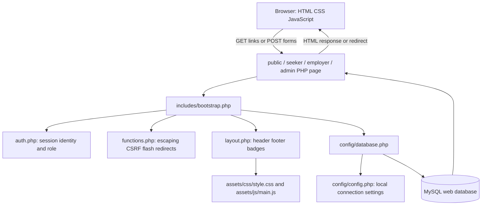
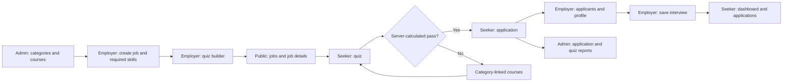
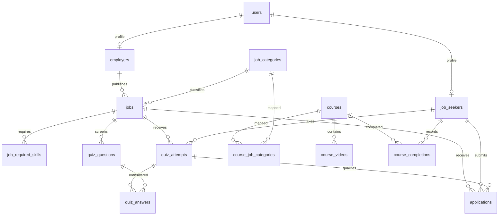

# Member 3: Employer journey, interviews, and regression checks

**Team guides:** [Member 1](member-1-foundations-and-ui.md) · [Member 2](member-2-jobseeker-and-search.md) · [Member 3](member-3-employer-and-interviews.md) · [Member 4](member-4-admin-and-database.md)

## Contents

- [How to study this guide](#how-to-study-this-guide)
- [Equal team responsibilities](#equal-team-responsibilities)
- [Overall architecture everyone must understand](#overall-architecture-everyone-must-understand)
- [Core reading vocabulary used throughout the project](#core-reading-vocabulary-used-throughout-the-project)
- [Member 3 — concepts before your code](#member-3--concepts-before-your-code)
- [Your file ownership and reading order](#your-file-ownership-and-reading-order)
- [Chunk-by-chunk source walkthrough](#chunk-by-chunk-source-walkthrough)
- [File: employer/dashboard.php](#file-employerdashboardphp)
- [File: employer/profile.php](#file-employerprofilephp)
- [File: employer/jobs.php](#file-employerjobsphp)
- [File: employer/create-job.php](#file-employercreate-jobphp)
- [File: employer/edit-job.php](#file-employeredit-jobphp)
- [File: employer/quiz-builder.php](#file-employerquiz-builderphp)
- [File: employer/edit-question.php](#file-employeredit-questionphp)
- [File: employer/applicants.php](#file-employerapplicantsphp)
- [File: employer/applicant-profile.php](#file-employerapplicant-profilephp)
- [File: includes/interview-details.php](#file-includesinterview-detailsphp)
- [File: tests/interview-flow.php](#file-testsinterview-flowphp)
- [Member 3 — schedule state and cross-role contract](#member-3--schedule-state-and-cross-role-contract)
- [Shared final rehearsal checklist](#shared-final-rehearsal-checklist)

## How to study this guide

This is a teaching snapshot of the code on 27 September 2026, with the quiz visibility feature updated on 29 September 2026, not a claim about who originally wrote it. Replace Member 1–4 with your names. Start with the concepts, trace one complete request, then study each assigned file in source order. Source chunks include every line of the assigned runtime files; their headings give the original line ranges. Blank lines and closing braces delimit blocks rather than introducing new behavior. Some existing templates put many statements on one line: read the explanation and the attribute glossary before following that long line.

For each chunk, answer: **What input enters? Which condition runs? What changes in memory/database? What output or redirect leaves? Who is allowed to do this?** Read the actual source alongside the guide if the project has changed since this snapshot. Source hashes identify the version explained. Configuration secrets are deliberately excluded; the example configuration teaches the same structure.

## Equal team responsibilities

| Member | Primary implementation/study responsibility | Main integration handoff |
| --- | --- | --- |
| 1 | Shared PHP foundations, login/register/logout, homepage, all shared HTML/CSS/JavaScript | Provides session identity, CSRF, escaping, navigation, and UI conventions to everyone |
| 2 | Public job discovery, badges, job details, all seeker pages, quiz scoring, applications, learning | Consumes employer jobs/questions and admin courses; creates attempts/applications |
| 3 | All employer pages, candidate review, interview display helper, interview regression checks | Writes jobs/questions/schedules; works with Member 2 to verify candidate visibility |
| 4 | All administrator pages, PDO configuration, full SQL schema/seeds/migration, installation documentation | Supplies shared data model, integrity rules, categories/courses, reports, and setup |

There are three application roles but four engineering responsibilities: shared infrastructure/UI is the fourth responsibility. Equal means comparable learning, explanation, and demonstration effort, not equal file counts. Member 1 has more repetitive CSS lines; Members 2 and 3 have denser business rules; Member 4 has SQL relationships and constraints. Give each member the same **12-hour study allocation**: 2 hours concepts/architecture, 5 hours owned code, 2 hours practical tracing, 1 hour cross-review, and 2 hours viva rehearsal. Each prepares a 6-minute demonstration and answers questions about one other member's handoff. These are suggested allocations, not measured reading times.

## Overall architecture everyone must understand

The project is a **server-rendered, procedural PHP multipage application**. A URL points directly to a PHP file. That file commonly performs request handling, SQL access, and HTML rendering together. Shared functions reduce repetition. It is not a framework MVC implementation, SPA, REST API service, or microservice system.



`bootstrap.php` loads the database function definition; it does not immediately connect. The first `database()` call opens PDO, and a static variable reuses that connection for the rest of this request. PHP variables do not persist between unrelated web requests. MySQL records and session data can persist.

### The stack and its exact role

| Technology | Where and why |
| --- | --- |
| PHP 8.2+ project target | Executes server logic, functions, sessions, validation, scoring, SQL calls, HTML templates; the local checks previously used PHP 8.5 |
| MySQL 8+ / InnoDB | Relational storage, foreign keys, unique/check constraints, transactions, aggregates |
| PDO with pdo_mysql | PHP-to-MySQL connection and parameterized SQL; no ORM |
| HTML5 | Semantic content, links, GET/POST forms, native details/summary disclosure, client validation |
| CSS3 | Custom layout, responsive grid/flex, badges, focus, printing, reduced motion; no Bootstrap/Tailwind |
| Vanilla JavaScript | DOM enhancements, field visibility, and quiz tab-hidden auto-submission after Start; no React, jQuery, Node build step, or AJAX search |
| PHP sessions | Browser has a session identifier cookie; authenticated user ID, CSRF token, and flashes live in server session state |
| Apache/XAMPP or PHP built-in server | Executes PHP and serves assets; the development server command is `php -S localhost:8000` from the root |
| Fontshare / Google Fonts | External font/icon stylesheets requested by the shared header; fonts fall back when unavailable |
| YouTube iframe | Plays an externally hosted video; the database stores a video ID, not a video file |
| Browser print dialog | CV can be printed or saved to PDF; no server PDF library |

### One normal page request

1. Browser requests `seeker/applications.php` with its session cookie.
2. `require_once` loads `bootstrap.php`; PHP opens/resumes the named session and loads shared functions.
3. `require_login('seeker')` uses the session ID to read `users`, checks active status and role, and redirects unauthorized visitors.
4. A prepared query filters applications by the authenticated user's ID, joins the job and employer, and returns associative arrays.
5. `page_header()` outputs the document shell and pulls flash messages.
6. The template loops over rows; `e()` escapes text and attributes; `interview_details()` prints schedule data.
7. The footer loads JavaScript. The browser lays out the HTML with CSS. It never receives raw PHP source.

### One normal write request

POST form → session/role check → CSRF check → read/validate fields → prepared INSERT/UPDATE/DELETE → optional commit → flash → redirect → fresh GET renders the result. This is the Post/Redirect/Get pattern. Redirects must occur before HTML is sent. CSRF validation does not replace role or ownership validation.

### Complete business workflow and file connections



The shared database connects roles; one PHP page does not call another page in the background. For example, the employer updates one `applications` row, then the seeker reads that row on their next request. There is no live push notification or email delivery. `includes/interview-details.php` keeps display logic consistent but does not itself authenticate or query data.

### Relationship map



The six CV detail tables also reference `job_seekers.user_id`: `education`, `experience`, `projects`, `job_seeker_skills`, `certifications`, and `languages`. Role-specific profiles use `user_id` as both primary key and foreign key. There is no separate `admins` table. An interview is stored directly in `applications`, not in a separate meeting table. The diagram shows structural links; the passing-attempt rule is additionally enforced by PHP when submitting an application.

## Core reading vocabulary used throughout the project

| Syntax / concept | Meaning in this project |
| --- | --- |
| `<?php ... ?>`, `<?= ... ?>` | Execute PHP, then return to literal HTML; short echo prints an expression |
| `$variable`, `['key']`, `=>`, `[]` | PHP variable, associative-array lookup, key/value pair, and array creation/append |
| `$_GET`, `$_POST`, `$_SERVER`, `$_SESSION` | URL inputs, submitted body fields, request metadata, server session state |
| `??` versus `?:` | Missing/null fallback versus any falsy-value fallback; a string `"0"` is falsy in PHP |
| `===`, `!==`, `&&`, `\|\|`, `!` | Strict comparisons and Boolean operators; conditions choose which branch executes |
| `(int)`, `(float)`, `(bool)`, `(string)` | Explicit type conversion, not complete validation; casting an ID does not prove ownership |
| `.`, `.=` | String concatenation / append; SQL text and redirect paths use it |
| `function`, `return`, `void`, `never`, `?array` | Named reusable behavior, returned result, no result, never returns normally, nullable array |
| `declare(strict_types=1)` | Scalar type rules for calls made from that PHP file; it is not automatically inherited by all including files |
| `static` local variable | Keeps a cached value across calls in the same request, not a global cross-user login cache |
| `__DIR__`, `__FILE__`, `require_once` | Current file directory/path and load-once inclusion; filesystem paths differ from browser URLs |
| `foreach`, `if: ... endif`, `endforeach` | Iterate records and use template-friendly control syntax |
| `->`, `::` | Object method/property access and class constant/static access, such as `PDO::FETCH_COLUMN` |
| `prepare`, `execute` | SQL structure first, input values second; `?` placeholders bind in array order |
| `query` | Execute fixed SQL directly; do not concatenate untrusted strings into it |
| `fetch`, `fetchAll`, `fetchColumn` | One row, all rows, or one scalar/column; `fetch()` may return false |
| `JOIN` vs `LEFT JOIN` | Require a related row vs retain the left row even if no related row exists |
| `EXISTS`, `COUNT`, `SUM`, `AVG`, `GROUP BY` | Presence check, totals, sums, averages, grouping; not interchangeable |
| `ORDER BY`, `LIMIT` | Result ordering and row cap; a recent-five list is not the complete history |
| `NULL`, `COALESCE` | Missing SQL value and fallback for missing values, distinct from the empty string |
| Transaction | Related statements become one commit; rollback undoes uncommitted changes on that connection |
| Authentication / authorization / ownership | Who you are / whether your role can use the operation / whether this particular row belongs to you |
| Validation / escaping / parameter binding | Check business rules / make output safe as HTML / bind data safely into SQL; each solves a different problem |

### HTML properties and attributes to recognize

`name` becomes the submitted PHP key; `id` identifies an element for a label, fragment link, or JS; `class` selects reusable CSS. `value` supplies a field/option's submitted data. `method="get"` puts filters in a shareable URL; `method="post"` sends changes in a body (it is not encryption). Missing `action` means submit to the current page. `type="hidden"` hides UI but is still editable by a user. `required`, `min`, `max`, `minlength`, `maxlength`, and input types provide browser checks; the server still needs validation. `selected` chooses a select option; `checked` chooses a checkbox/radio; `disabled` prevents normal submission. `placeholder` is a hint, not a label or saved value.

`for` associates a label with an `id`; nesting a control inside a label also associates them. `aria-label` gives an accessible name; `aria-labelledby` points to visible naming text; `aria-describedby` points to help; `aria-current` identifies the current page/filter; `aria-hidden` hides decorative duplicates from assistive technology. `role="status"` marks status text. `tabindex="0"` makes an element focusable. `target="_blank"` opens another tab and `rel="noopener noreferrer"` removes opener/referrer access. `details` and `summary` provide a native disclosure; without `open`, extra filters start collapsed. `data-confirm` exposes a custom string through JS `dataset.confirm`. `href="#id"` links to a fragment; it does not query the database.

### Security explanation every member should be able to give

Use the session for acting-user identity. Use role checks before protected actions and row ownership in SQL. Check a session-bound unpredictable CSRF token for POST operations. Use prepared SQL values and escape HTML output with `htmlspecialchars`. Passwords are hashed and verified, never decrypted. Meeting links also need an HTTP(S) scheme check because HTML escaping alone does not reject a `javascript:` URL. These are defenses present in the code, not a claim of complete production hardening.

### Built-in functions and object methods: quick teaching reference

| Function / method | How to read a line that uses it |
| --- | --- |
| `trim`, `strtolower`, `strtoupper`, `ucwords` | Remove edge whitespace, lowercase, uppercase, or capitalize words. These transform text, not permissions. |
| `str_replace`, `substr`, `strlen` | Replace substrings, take a substring, count bytes. strlen is not a Unicode character count. |
| `strcasecmp`, `str_contains` | Case-insensitive string comparison (zero means equal) and substring presence (Boolean). |
| `explode`, `implode` | Split a string by a separator; join array values with a separator. Skill input uses commas, display aggregation uses a pipe. |
| `array_map`, `array_filter`, `array_unique` | Transform each value, keep matching/truthy values, remove duplicate values. Check the callback/default behavior before assuming normalization. |
| `array_merge`, `array_intersect_key` | Combine maps (later string keys replace earlier ones); keep keys also present in another array. Tests use the latter to compare fixture fields after removing its extra employer_id key. |
| `in_array($value, $list, true)` | Membership check with strict types; an int and a numeric string are not equal in this mode. |
| `isset`, `empty`, `unset`, `count` | Check non-null existence, test falsy/missing state, remove a variable/key, count elements. empty also considers string zero empty. |
| `round`, `intval` | Round a number to precision; convert a value to integer. Neither establishes ownership. |
| `filter_var` and validation constants | Validate URL/email structure. A successful shape check does not prove the email/domain/meeting exists. |
| `preg_match`, `preg_match_all` | Match a regular expression once or count all matches; ^/$ anchor and {11} repeats eleven times. /u uses UTF-8; /s makes dot include newline. |
| `parse_url` | Parse URL components; PHP_URL_SCHEME requests the protocol part. |
| `htmlspecialchars`, `nl2br` | Escape HTML-sensitive characters; add HTML breaks for newlines. Escape first, add breaks second. |
| `http_build_query` | Encode a map into URL query text, including literal plus signs and spaces. Escape that resulting text when inserting into an HTML attribute. |
| `date`, `strtotime`, `time`, `date_default_timezone_get` | Format a timestamp, parse date text, get current Unix time, get the configured PHP timezone. A browser datetime-local input carries no zone. |
| `DateTimeImmutable::createFromFormat`, `format`, `getTimestamp` | Parse an exact wall-clock format into an immutable object, format it again, and obtain epoch seconds for comparison. |
| `session_name`, `session_start`, `session_id` | Choose the cookie/session name, load session state, and read/set the identifier. Set name/identifier before starting as appropriate. |
| `session_regenerate_id`, `session_unset`, `session_destroy` | Replace the identifier, clear in-memory session variables, delete stored session state. They are distinct operations. |
| `random_bytes`, `bin2hex`, `hash_equals` | Secure random bytes, printable hex encoding, timing-safe equality comparison. Used for tokens/test session names. |
| `password_hash`, `password_verify` | Create a password hash and verify a proposed password against it. Never decrypt a password. |
| `header`, `http_response_code`, `exit` | Send response metadata, choose HTTP status, stop execution. A redirect helper calls exit so later writes/output cannot continue. |
| `PDO::prepare`, `PDOStatement::execute` | Prepare SQL with placeholders, then supply bound values in order. A SELECT execution is followed by fetching. |
| `fetch`, `fetchAll`, `fetchColumn`, `PDO::FETCH_COLUMN` | Read one row, all rows, one scalar, or request flat-column results; fetch false means no row. |
| `lastInsertId` | ID allocated by the last relevant auto-increment insert on this connection; retrieve it before unrelated inserts. |
| `beginTransaction`, `commit`, `rollBack`, `inTransaction` | Start, persist, undo, and inspect transaction state. Transactions use the same PDO connection. |
| `error_log`, `PDOException`, `ErrorException`, `RuntimeException` | Log a diagnostic or represent a database/PHP/test failure. A catch block handles only matching exception classes. |
| `ob_start`, `ob_get_clean` | Capture rendered output in a buffer and retrieve it while ending the buffer. Tests inspect the HTML string. |
| `proc_open`, `stream_get_contents`, `proc_close` | Start a child process, read its output pipes, collect its exit status. Used only by the CLI test runner. |
| `set_error_handler`, `register_shutdown_function`, `error_get_last` | Install a PHP error callback, run cleanup/assertions when execution ends, and inspect the last PHP error. |
| `static fn(...) => ...`, `function (...) use (...)` | Arrow callback returning one expression, or closure capturing named outside variables. static prevents binding an object context; it does not create persistent storage here. |

Read `+=` as add-and-assign, `[] =` as append, and `condition ? a : b` as choose one result. A single-line if controls only its following statement. A variable can be reused for different values: quiz.php changes `$job` from a prepared statement to the fetched row, and many `$s` variables are reused for new statements. This is legal procedural PHP but requires following assignment order carefully.

### What is actually implemented, and what is not

Quiz tab visibility: after the caution is acknowledged with Start, a hidden quiz tab triggers submission of current answers. This uses inline JavaScript in `seeker/quiz.php` (Member 2); PHP still scores the attempt. It is a client-side deterrent, not guaranteed cheating prevention or server-enforced attempt locking. No database change is required. See Member 2’s updated quiz walkthrough for the full code and limitations.

The quiz is scored by PHP using current database answers. Failed attempts suggest courses by **job category**, not AI or a semantic skill-matching model. Completion is self-reported with a button, not verified watching. Passing any previous attempt for the same job permits applying; there is no implemented maximum-attempt lock. Database defaults/constraints and browser validation cover some cases, but server validation is uneven. Application POST does not independently recheck the job deadline/current active status. Some broad PDO exception handlers label every database error as a duplicate. Those are current limitations to explain honestly, not features to claim.

Shared CSS names such as a “locked” badge do not prove that corresponding business logic exists. No email notifications, automatic hiring decisions, uploaded CV processing, dedicated REST API, or frontend framework are implemented. This guide documents the current code and does not change those behaviors.

## Member 3 — concepts before your code

1. **Role versus object ownership.** `require_login('employer')` proves an employer account, not ownership of every job. `WHERE employer_id=?` and joins back to jobs constrain the particular record. Read the acting employer ID from the session, not a posted owner ID.
2. **Parent/child writes.** A job is the parent; each required skill is a child. Create the job, read `lastInsertId`, then insert each skill within the same transaction. Editing replaces the skill child rows for that authorized job.
3. **Array pipelines.** `explode(',', text)` splits a skill list; `array_map('trim', ...)` cleans edges; `array_filter` removes falsy entries; `array_unique` deduplicates exact strings. It does not normalize every capitalization or Unicode spelling.
4. **Quiz authoring versus scoring.** Employers store correct answers and positive marks. The seeker GET query excludes correct answers. `MAX(display_order)+1` chooses the next position; it is simple but not concurrency-safe against simultaneous writes.
5. **State transitions.** A status string is not a meeting. Selecting Interview opens the scheduling form. A validated schedule update writes fields and status together. Other statuses are allowlisted but there is no sophisticated state-machine enforcement.
6. **Date/time validation.** `datetime-local` sends a wall-clock value without timezone. PHP parses it against an exact format, checks formatting round-trip, and requires a future timestamp. The UI labels the server timezone. No timezone conversion or separate timezone database column exists.
7. **Conditional fields.** Online requires a valid HTTP(S) link; office requires an address. Server code clears the irrelevant database field with NULL. JS updates `hidden`, `required`, and `disabled` for convenience; server checks still enforce correctness with JS disabled.
8. **Shared rendering and regression tests.** `interview_details(array)` receives an authorized row and prints escaped data. Tests create controlled request globals, execute real PHP pages, inspect output/data, then roll back. They test behavior, not visual layout or real browser cookies/redirect navigation.

**Your handoffs:** Member 2 supplies passing applications and profile data; you show them and save schedules into the same rows their pages read. Member 1 owns shared helper definitions; Member 4 owns constraints that can reject your writes.

**Practice trace:** employer job → add quiz → seeker applies → applicants → schedule office → seeker sees address and notes → switch to online → old address becomes NULL → invalid link produces an error and preserves input.

## Your file ownership and reading order

- [employer/dashboard.php](../../employer/dashboard.php) — Employer-only job and applicant totals.
- [employer/profile.php](../../employer/profile.php) — Update the signed-in company profile.
- [employer/jobs.php](../../employer/jobs.php) — List and activate/deactivate owned job postings.
- [employer/create-job.php](../../employer/create-job.php) — Create a job plus required skill rows.
- [employer/edit-job.php](../../employer/edit-job.php) — Edit an owned job and replace its skill list.
- [employer/quiz-builder.php](../../employer/quiz-builder.php) — Add and delete questions under an owned job.
- [employer/edit-question.php](../../employer/edit-question.php) — Edit an existing question after checking its owning job.
- [employer/applicants.php](../../employer/applicants.php) — Review qualified applicants and route interview status to a real schedule.
- [employer/applicant-profile.php](../../employer/applicant-profile.php) — Read a qualified candidate and schedule/update the interview.
- [includes/interview-details.php](../../includes/interview-details.php) — Shared rendering contract used by employer preview and both seeker views.
- [tests/interview-flow.php](../../tests/interview-flow.php) — CLI regression harness executing real page handlers with rollback-only data changes.

## Chunk-by-chunk source walkthrough

Read each explanation, trace the code below it, and then summarize it aloud before continuing. Every chunk is in original source order; code is reproduced as stored, including existing compact template lines.

## File: employer/dashboard.php

**Responsibility:** Employer-only job and applicant totals.

**Source:** [employer/dashboard.php](../../employer/dashboard.php) · **SHA-256 snapshot prefix:** `da8915cc8cc6`

### Aggregate query — source lines 1–6

Require employer and get PDO. COUNT(*) counts owned jobs; SUM(status=active) totals true comparisons. A scalar subquery counts applications through owned jobs. The same employer ID is bound twice, once for each predicate. SUM may be NULL for no rows; rendering falls back to zero.

```php
<?php require_once __DIR__ . '/../includes/bootstrap.php';
$u = require_login('employer');
$p = database();
$s = $p->prepare("SELECT COUNT(*) jobs,SUM(status='active') active,(SELECT COUNT(*) FROM applications a JOIN jobs j ON j.id=a.job_id WHERE j.employer_id=?) applicants FROM jobs WHERE employer_id=?");
$s->execute([$u['id'],$u['id']]);
$c = $s->fetch();
```

### Statistics and navigation — source lines 7–7

Render jobs/active/applicant cards, coercing values through escaped output. Links open managed jobs, create job, company profile, and quizzes through the job list. This page is read-only.

```php
page_header('Employer dashboard');?><h1>Employer dashboard</h1><section class="stats"><div class="stat"><strong><?=e($c['jobs'] ?? 0)?></strong>Jobs</div><div class="stat"><strong><?=e($c['active'] ?? 0)?></strong>Active jobs</div><div class="stat"><strong><?=e($c['applicants'] ?? 0)?></strong>Applicants</div></section><p><a class="button" href="jobs.php">Manage job postings</a> <a class="button secondary" href="create-job.php">Create job</a> <a class="button secondary" href="profile.php">Company profile</a> <a class="button secondary" href="jobs.php">Manage quizzes</a></p><?php page_footer(); ?>
```

## File: employer/profile.php

**Responsibility:** Update the signed-in company profile.

**Source:** [employer/profile.php](../../employer/profile.php) · **SHA-256 snapshot prefix:** `8d0d3c8009e8`

### POST update — source lines 1–8

CSRF protects POST. Update seven company fields by user_id=session employer ID. company_name stays required in the browser; optional fields use NULL fallback. Feedback plus redirect implements PRG.

```php
<?php require_once __DIR__ . '/../includes/bootstrap.php';
$u = require_login('employer');
$p = database();
if ($_SERVER['REQUEST_METHOD'] === 'POST') {
    verify_csrf();
    $p->prepare('UPDATE employers SET company_name=?,description=?,industry=?,website=?,location=?,contact_name=?,contact_phone=? WHERE user_id=?')->execute([posted('company_name'),posted('description') ?: null,posted('industry') ?: null,posted('website') ?: null,posted('location') ?: null,posted('contact_name') ?: null,posted('contact_phone') ?: null,$u['id']]);
    flash('success', 'Company profile updated.');
    redirect('profile.php');
```

### Read and dynamic form — source lines 9–12

Fetch owned employer record. A fixed field-label map generates name/value controls; company_name alone is marked required. Escape stored values. Description is a separate textarea, followed by submit/footer. $e is a local array variable and e() is still the escaping function.

```php
}$s = $p->prepare('SELECT * FROM employers WHERE user_id=?');
$s->execute([$u['id']]);
$e = $s->fetch();
page_header('Company profile');?><h1>Company profile</h1><form method="post" class="form-grid"><input type="hidden" name="csrf_token" value="<?=csrf_token()?>"><?php foreach (['company_name' => 'Company name','industry' => 'Industry','website' => 'Website','location' => 'Location','contact_name' => 'Contact name','contact_phone' => 'Contact phone'] as $key => $label):?><div><label><?=$label?></label><input name="<?=$key?>" value="<?=e($e[$key])?>" <?= $key === 'company_name' ? 'required' : '' ?>></div><?php endforeach;?><div class="full"><label>Description</label><textarea name="description"><?=e($e['description'])?></textarea></div><div class="full"><button>Save profile</button></div></form><?php page_footer(); ?>
```

## File: employer/jobs.php

**Responsibility:** List and activate/deactivate owned job postings.

**Source:** [employer/jobs.php](../../employer/jobs.php) · **SHA-256 snapshot prefix:** `7ed605909150`

### Status mutation — source lines 1–15

Read submitted job_id as integer and normalize new_status to active or deactivated. CSRF and employer guard run first. UPDATE includes employer_id to prevent cross-employer changes. This is a soft status change, not DELETE. The success flash does not check affected-row count.

```php
<?php
require_once __DIR__ . '/../includes/bootstrap.php';
$u = require_login('employer');
$p = database();

if ($_SERVER['REQUEST_METHOD'] === 'POST') {
    verify_csrf();
    $id = (int)$_POST['job_id'];
    $newStatus = posted('new_status') === 'active' ? 'active' : 'deactivated';
    
    $p->prepare("UPDATE jobs SET status=? WHERE id=? AND employer_id=?")->execute([$newStatus, $id, $u['id']]);
    
    flash('success', $newStatus === 'active' ? 'Job reactivated.' : 'Job deactivated.');
    redirect('jobs.php');
}
```

### Load job list — source lines 16–23

Join categories and filter by current employer; newest jobs first. The Create job link begins authoring.

```php

$s = $p->prepare('SELECT j.*,c.name category FROM jobs j JOIN job_categories c ON c.id=j.category_id WHERE j.employer_id=? ORDER BY j.created_at DESC');
$s->execute([$u['id']]);

page_header('My jobs');
?>
<h1>Job postings</h1>
<p><a class="button" href="create-job.php">Create job</a></p>
```

### Render each job — source lines 24–41

Table shows title/category/status. Edit, Quiz and Applicants links carry the job ID to pages that perform their own guards. Inline flex styles keep action controls together.

```php
<table>
    <tr>
        <th>Title</th>
        <th>Category</th>
        <th>Status</th>
        <th>Actions</th>
    </tr>
    <?php foreach ($s as $job): ?>
    <tr>
        <td><?= e($job['title']) ?></td>
        <td><?= e($job['category']) ?></td>
        <td><?= status_badge($job['status']) ?></td>
        <td>
            <div style="display: flex; align-items: center; gap: 0.5rem; flex-wrap: wrap;">
                <a href="edit-job.php?id=<?= $job['id'] ?>">Edit</a> &middot; 
                <a href="quiz-builder.php?job_id=<?= $job['id'] ?>">Quiz</a> &middot; 
                <a href="applicants.php?job_id=<?= $job['id'] ?>">Applicants</a>
                
```

### Conditional activation forms — source lines 42–62

Active jobs get Deactivate; deactivated jobs get Reactivate; other statuses have neither button in this view. Hidden fields carry CSRF, job ID and target status. data-confirm is used by shared JS for the prompt. The POST query still enforces ownership if HTML is edited.

```php
                <?php if ($job['status'] === 'active'): ?>
                    <form method="post" class="inline-form" style="margin-left: 0.5rem;">
                        <input type="hidden" name="csrf_token" value="<?= csrf_token() ?>">
                        <input type="hidden" name="job_id" value="<?= $job['id'] ?>">
                        <input type="hidden" name="new_status" value="deactivated">
                        <button class="button danger small" data-confirm="Deactivate this job?" style="margin-bottom: 0;">Deactivate</button>
                    </form>
                <?php elseif ($job['status'] === 'deactivated'): ?>
                    <form method="post" class="inline-form" style="margin-left: 0.5rem;">
                        <input type="hidden" name="csrf_token" value="<?= csrf_token() ?>">
                        <input type="hidden" name="job_id" value="<?= $job['id'] ?>">
                        <input type="hidden" name="new_status" value="active">
                        <button class="button small" data-confirm="Reactivate this job?" style="margin-bottom: 0;">Reactivate</button>
                    </form>
                <?php endif; ?>
            </div>
        </td>
    </tr>
    <?php endforeach; ?>
</table>
<?php page_footer(); ?>
```

## File: employer/create-job.php

**Responsibility:** Create a job plus required skill rows.

**Source:** [employer/create-job.php](../../employer/create-job.php) · **SHA-256 snapshot prefix:** `6b4d70ee493a`

### Request guard and category check — source lines 1–10

Require employer/PDO. POST verifies CSRF and checks a category ID was supplied; otherwise flash/redirect. This does not separately verify category active state before INSERT; FK enforces existence.

```php
<?php require_once __DIR__ . '/../includes/bootstrap.php';
$u = require_login('employer');
$p = database();
if ($_SERVER['REQUEST_METHOD'] === 'POST') {
    verify_csrf();
    $categoryId = $_POST['category_id'] ?? null;
    if (!$categoryId) {
        flash('error', 'Please select a job category. If none are available, please contact the administrator.');
        redirect('create-job.php');
    }
```

### Transactional creation — source lines 11–20

Optional salary blanks become NULL; nonblank values are cast to int despite decimal columns, so fractional salary input is truncated here. Insert binds 16 fields in column order and forces status=active. Read new job ID; split/trim/filter/deduplicate comma-separated skills and insert one row each. Commit, flash and redirect to quiz builder. The DB enforces many enum/range/FK constraints; no catch block handles failures locally.

```php
    $salaryMin = trim($_POST['salary_min'] ?? '') !== '' ? (int)$_POST['salary_min'] : null;
    $salaryMax = trim($_POST['salary_max'] ?? '') !== '' ? (int)$_POST['salary_max'] : null;
    $p->beginTransaction();
    $p->prepare('INSERT INTO jobs(employer_id,category_id,title,description,responsibilities,requirements_text,employment_type,workplace_type,location,salary_min,salary_max,vacancies,deadline,minimum_passing_score,status) VALUES(?,?,?,?,?,?,?,?,?,?,?,?,?,?,?)')->execute([$u['id'],(int)$categoryId,posted('title'),posted('description'),posted('responsibilities') ?: null,posted('requirements') ?: null,posted('employment_type'),posted('workplace_type'),posted('location'),$salaryMin,$salaryMax,(int)$_POST['vacancies'],posted('deadline'),posted('minimum_passing_score'),'active']);
    $id = $p->lastInsertId();
    $insertSkill = $p->prepare('INSERT INTO job_required_skills (job_id, skill_name) VALUES (?, ?)');
    foreach (array_unique(array_filter(array_map('trim', explode(',', posted('skills'))))) as $skill) $insertSkill->execute([$id, $skill]);
    $p->commit();
    flash('success', 'Job created. Add its quiz questions next.');
    redirect('quiz-builder.php?job_id='.$id);
```

### Create form — source lines 21–22

Read active categories. The form uses required fields, numeric bounds, date input and enum selects; an empty category list shows an explanatory option. skills input is a comma-separated convenience, not a stored comma list. Name requirements maps to requirements_text; skills maps to child rows. Salary inputs have no currency selector. Submit and shared footer end the page.

```php
}$categories = $p->query('SELECT id,name FROM job_categories WHERE is_active=1 ORDER BY name')->fetchAll();
page_header('Create job');?><h1>Create job</h1><form method="post" class="form-grid"><input type="hidden" name="csrf_token" value="<?=csrf_token()?>"><div><label>Title</label><input name="title" required></div><div><label>Category</label><select name="category_id" required><?php if (!$categories): ?><option value="">No categories available</option><?php endif; ?><?php foreach ($categories as $c):?><option value="<?=$c['id']?>"><?=e($c['name'])?></option><?php endforeach;?></select></div><div><label>Employment type</label><select name="employment_type"><option value="full_time">Full time</option><option value="part_time">Part time</option><option value="contract">Contract</option><option value="internship">Internship</option></select></div><div><label>Workplace</label><select name="workplace_type"><option value="on_site">On site</option><option value="hybrid">Hybrid</option><option value="remote">Remote</option></select></div><div><label>Location</label><input name="location" required></div><div><label>Vacancies</label><input type="number" min="1" name="vacancies" value="1" required></div><div><label>Minimum pass score (%)</label><input type="number" min="0" max="100" name="minimum_passing_score" value="60" required></div><div><label>Deadline</label><input type="date" name="deadline" required></div><div><label>Minimum salary</label><input type="number" name="salary_min"></div><div><label>Maximum salary</label><input type="number" name="salary_max"></div><div class="full"><label>Required skills</label><input name="skills" placeholder="C++, Python, JavaScript"><span class="meta">Separate skills with commas.</span></div><div class="full"><label>Description</label><textarea name="description" required></textarea></div><div><label>Responsibilities</label><textarea name="responsibilities"></textarea></div><div><label>Requirements</label><textarea name="requirements"></textarea></div><div class="full"><button>Create job</button></div></form><?php page_footer(); ?>
```

## File: employer/edit-job.php

**Responsibility:** Edit an owned job and replace its skill list.

**Source:** [employer/edit-job.php](../../employer/edit-job.php) · **SHA-256 snapshot prefix:** `ee2df9ef2827`

### Ownership lookup — source lines 1–10

Prefer query id then posted id. Load job with employer_id=current user. Missing/unowned record exits before rendering or writing.

```php
<?php require_once __DIR__ . '/../includes/bootstrap.php';
$u = require_login('employer');
$p = database();
$id = (int)($_GET['id'] ?? $_POST['id'] ?? 0);
$s = $p->prepare('SELECT * FROM jobs WHERE id=? AND employer_id=?');
$s->execute([$id,$u['id']]);
$j = $s->fetch();
if (!$j) {
    exit('Job not found.');
}
```

### Current skill text — source lines 11–13

Fetch owned job’s skill names ordered alphabetically with FETCH_COLUMN, then implode comma+space for the input field.

```php
$skillStatement = $p->prepare('SELECT skill_name FROM job_required_skills WHERE job_id=? ORDER BY skill_name');
$skillStatement->execute([$id]);
$skills = implode(', ', $skillStatement->fetchAll(PDO::FETCH_COLUMN));
```

### Replace job details and children — source lines 14–23

POST/CSRF starts a transaction. Update title, description, location, deadline, pass threshold, status, scoped by employer again. Delete only this job’s skill rows, then insert the normalized submitted list. Commit/flash/redirect. Not every create-job field is editable here; employment type and salary are not in this update.

```php
if ($_SERVER['REQUEST_METHOD'] === 'POST') {
    verify_csrf();
    $p->beginTransaction();
    $p->prepare('UPDATE jobs SET title=?,description=?,location=?,deadline=?,minimum_passing_score=?,status=? WHERE id=? AND employer_id=?')->execute([posted('title'),posted('description'),posted('location'),posted('deadline'),posted('minimum_passing_score'),posted('status'),$id,$u['id']]);
    $p->prepare('DELETE FROM job_required_skills WHERE job_id=?')->execute([$id]);
    $insertSkill = $p->prepare('INSERT INTO job_required_skills (job_id, skill_name) VALUES (?, ?)');
    foreach (array_unique(array_filter(array_map('trim', explode(',', posted('skills'))))) as $skill) $insertSkill->execute([$id, $skill]);
    $p->commit();
    flash('success', 'Job updated.');
    redirect('jobs.php');
```

### Prefilled form — source lines 24–24

Stored values are escaped. Status options include draft, active, closed, deactivated with the current one selected. No explicit value on these options means the option text is submitted. The URL id remains when the form submits to its current page.

```php
}page_header('Edit job');?><h1>Edit job</h1><form method="post"><input type="hidden" name="csrf_token" value="<?=csrf_token()?>"><label>Title</label><input name="title" value="<?=e($j['title'])?>"><label>Description</label><textarea name="description"><?=e($j['description'])?></textarea><label>Required skills</label><input name="skills" value="<?=e($skills)?>" placeholder="C++, Python, JavaScript"><span class="meta">Separate skills with commas.</span><label>Location</label><input name="location" value="<?=e($j['location'])?>"><label>Deadline</label><input type="date" name="deadline" value="<?=e($j['deadline'])?>"><label>Pass score</label><input type="number" name="minimum_passing_score" value="<?=e($j['minimum_passing_score'])?>"><label>Status</label><select name="status"><?php foreach (['draft','active','closed','deactivated'] as $status):?><option <?=$j['status'] === $status ? 'selected' : ''?>><?=$status?></option><?php endforeach;?></select><p><button>Save changes</button></p></form><?php page_footer(); ?>
```

## File: employer/quiz-builder.php

**Responsibility:** Add and delete questions under an owned job.

**Source:** [employer/quiz-builder.php](../../employer/quiz-builder.php) · **SHA-256 snapshot prefix:** `b2e44baea1e1`

### Authorize parent job — source lines 1–10

Require employer and select job by both id and employer_id. Missing row exits; no arbitrary job can be edited by choosing its URL.

```php
<?php require_once __DIR__ . '/../includes/bootstrap.php';
$u = require_login('employer');
$p = database();
$jobId = (int)($_GET['job_id'] ?? $_POST['job_id'] ?? 0);
$s = $p->prepare('SELECT id,title FROM jobs WHERE id=? AND employer_id=?');
$s->execute([$jobId,$u['id']]);
$job = $s->fetch();
if (!$job) {
    exit('Job not found.');
}if ($_SERVER['REQUEST_METHOD'] === 'POST') {
```

### Delete or add — source lines 11–17

POST verifies CSRF. action=delete executes a joined DELETE constrained by employer. Otherwise find next display_order with MAX+1 (the interpolated jobId has been cast to int), and insert question text, four options, correct letter, marks and order. A database uniqueness constraint can reject concurrent order collisions. Deleting an already-answered question can fail because quiz_answers references it with RESTRICT. No friendly catch is implemented.

```php
    verify_csrf();
    if (posted('action') === 'delete') {
        $p->prepare('DELETE q FROM quiz_questions q JOIN jobs j ON j.id=q.job_id WHERE q.id=? AND j.employer_id=?')->execute([(int)$_POST['question_id'],$u['id']]);
    } else {
        $order = (int)$p->query('SELECT COALESCE(MAX(display_order),0)+1 FROM quiz_questions WHERE job_id='.$jobId)->fetchColumn();
        $p->prepare('INSERT INTO quiz_questions(job_id,question_text,option_a,option_b,option_c,option_d,correct_option,marks,display_order) VALUES(?,?,?,?,?,?,?,?,?)')->execute([$jobId,posted('question'),posted('a'),posted('b'),posted('c'),posted('d'),posted('correct'),posted('marks'),$order]);
    }redirect('quiz-builder.php?job_id='.$jobId);
```

### Authoring view — source lines 18–20

Select questions ordered by display_order. Form posts job/CSRF, question, lowercase a-d field names, uppercase correct answer, numeric marks. A foreach prints four option controls. Table offers edit and deletion forms. This employer view may fetch correct answers; the seeker GET view must not.

```php
}$s = $p->prepare('SELECT * FROM quiz_questions WHERE job_id=? ORDER BY display_order');
$s->execute([$jobId]);
page_header('Quiz builder');?><h1><?=e($job['title'])?> quiz</h1><form method="post" class="form-grid"><input type="hidden" name="csrf_token" value="<?=csrf_token()?>"><input type="hidden" name="job_id" value="<?=$jobId?>"><div class="full"><label>Question</label><textarea name="question" required></textarea></div><?php foreach (['a','b','c','d'] as $letter):?><div><label>Option <?=strtoupper($letter)?></label><input name="<?=$letter?>" required></div><?php endforeach;?><div><label>Correct option</label><select name="correct"><option>A</option><option>B</option><option>C</option><option>D</option></select></div><div><label>Marks</label><input type="number" min="1" name="marks" value="1"></div><div class="full"><button>Add question</button></div></form><table><tr><th>Question</th><th>Marks</th><th></th></tr><?php foreach ($s as $q):?><tr><td><?=e($q['question_text'])?></td><td><?=e($q['marks'])?></td><td><a href="edit-question.php?id=<?=$q['id']?>">Edit</a> <form method="post" style="display:inline"><input type="hidden" name="csrf_token" value="<?=csrf_token()?>"><input type="hidden" name="job_id" value="<?=$jobId?>"><input type="hidden" name="question_id" value="<?=$q['id']?>"><input type="hidden" name="action" value="delete"><button class="small">Delete</button></form></td></tr><?php endforeach;?></table><?php page_footer(); ?>
```

## File: employer/edit-question.php

**Responsibility:** Edit an existing question after checking its owning job.

**Source:** [employer/edit-question.php](../../employer/edit-question.php) · **SHA-256 snapshot prefix:** `3d6c89d5ab80`

### Ownership join — source lines 1–10

Join question to job and filter question ID plus employer ID. Load q or stop. This check is why the later UPDATE can use the loaded question ID alone in the current sequential flow.

```php
<?php require_once __DIR__ . '/../includes/bootstrap.php';
$u = require_login('employer');
$p = database();
$id = (int)($_GET['id'] ?? $_POST['id'] ?? 0);
$s = $p->prepare('SELECT q.* FROM quiz_questions q JOIN jobs j ON j.id=q.job_id WHERE q.id=? AND j.employer_id=?');
$s->execute([$id,$u['id']]);
$q = $s->fetch();
if (!$q) {
    exit('Question not found.');
}if ($_SERVER['REQUEST_METHOD'] === 'POST') {
```

### Save fields — source lines 11–14

CSRF then parameterized UPDATE sets text/options/correct/marks. Flash and return to the loaded question’s job quiz builder. Existing attempt rows are not recalculated; future attempts use the changed key/marks.

```php
    verify_csrf();
    $p->prepare('UPDATE quiz_questions SET question_text=?,option_a=?,option_b=?,option_c=?,option_d=?,correct_option=?,marks=? WHERE id=?')->execute([posted('question'),posted('a'),posted('b'),posted('c'),posted('d'),posted('correct'),posted('marks'),$id]);
    flash('success', 'Question updated.');
    redirect('quiz-builder.php?job_id='.$q['job_id']);
```

### Dynamic option controls — source lines 15–15

Prefill question, four choices using q[option_ concatenated with letter], selected correct option, and marks. These are form values for the author, not the seeker. Browser min=1 is one guard; the SQL marks CHECK also exists.

```php
}page_header('Edit question');?><h1>Edit question</h1><form method="post" class="form-grid"><input type="hidden" name="csrf_token" value="<?=csrf_token()?>"><label class="full">Question<textarea name="question"><?=e($q['question_text'])?></textarea></label><?php foreach (['a','b','c','d'] as $x):?><label>Option <?=strtoupper($x)?><input name="<?=$x?>" value="<?=e($q['option_'.$x])?>"></label><?php endforeach;?><label>Correct<select name="correct"><?php foreach (['A','B','C','D'] as $x):?><option <?=$q['correct_option'] === $x ? 'selected' : ''?>><?=$x?></option><?php endforeach;?></select></label><label>Marks<input name="marks" type="number" min="1" value="<?=e($q['marks'])?>"></label><button class="full">Save question</button></form><?php page_footer(); ?>
```

## File: employer/applicants.php

**Responsibility:** Review qualified applicants and route interview status to a real schedule.

**Source:** [employer/applicants.php](../../employer/applicants.php) · **SHA-256 snapshot prefix:** `d7cbe19b6de9`

### Owned job — source lines 1–14

Look up job title by job ID and employer ID, exit if absent. This gate authorizes the read query later.

```php
<?php
require_once __DIR__ . '/../includes/bootstrap.php';
$u = require_login('employer');
$p = database();

$id = (int)($_GET['job_id'] ?? $_POST['job_id'] ?? 0);
$own = $p->prepare('SELECT title FROM jobs WHERE id=? AND employer_id=?');
$own->execute([$id, $u['id']]);
$job = $own->fetch();

if (!$job) {
    exit('Job not found.');
}

```

### Authorize submitted application — source lines 15–25

On POST verify CSRF and fetch the application constrained simultaneously by application ID, the viewed job ID, and employer ID. This prevents swapping a hidden application_id to another employer/job. Missing match gives 404.

```php
if ($_SERVER['REQUEST_METHOD'] === 'POST') {
    verify_csrf();
    $status = posted('status');
    $applicationId = (int) ($_POST['application_id'] ?? 0);
    $candidate = $p->prepare('SELECT a.* FROM applications a JOIN jobs j ON j.id=a.job_id WHERE a.id=? AND a.job_id=? AND j.employer_id=?');
    $candidate->execute([$applicationId, $id, $u['id']]);
    $application = $candidate->fetch();
    if (!$application) {
        http_response_code(404);
        exit('Application not found.');
    }
```

### Status branch — source lines 26–35

Interview redirects to applicant-profile with #schedule-interview; it does not write interview status yet. Other allowlisted statuses update the scoped application and flash success. Invalid status is ignored then redirected. There is no transition-order or cancellation state machine.

```php
    if ($status === 'interview') {
        redirect('applicant-profile.php?application_id=' . $applicationId . '#schedule-interview');
    }
    if (in_array($status, ['submitted', 'under_review', 'shortlisted', 'interview', 'selected', 'rejected', 'withdrawn'], true)) {
        $p->prepare('UPDATE applications a JOIN jobs j ON j.id=a.job_id SET a.status=? WHERE a.id=? AND a.job_id=? AND j.employer_id=?')
          ->execute([$status, $applicationId, $id, $u['id']]);
        flash('success', 'Application status updated.');
    }
    redirect('applicants.php?job_id='.$id);
}
```

### Fetch passing applicants — source lines 36–47

Join application to seeker identity/email and its qualifying attempt. qa.passed=1 limits displayed applicants; the query uses the already-authorized job ID. fetchAll supports an empty state.

```php

$s = $p->prepare('SELECT a.*, js.full_name, u.email, qa.percentage 
                  FROM applications a 
                  JOIN job_seekers js ON js.user_id=a.seeker_id 
                  JOIN users u ON u.id=js.user_id 
                  JOIN quiz_attempts qa ON qa.id=a.qualifying_attempt_id 
                  WHERE a.job_id=? AND qa.passed=1');
$s->execute([$id]);
$applicants = $s->fetchAll();

page_header('Applicants');
?>
```

### Applicant rows — source lines 48–68

Render role heading, quiz-builder link, headings, no-applicants row when needed, then name/email, profile link, stored qualifying percentage and status badge. Profile URL uses application ID, not seeker ID.

```php

<h1>Applicants: <?= e($job['title']) ?></h1>
<p><a href="quiz-builder.php?job_id=<?= $id ?>">Edit this job's quiz</a></p>

<table>
    <tr>
        <th>Candidate</th>
        <th>Quiz</th>
        <th>Status</th>
        <th>Update</th>
    </tr>
    <?php if (!$applicants): ?><tr><td colspan="4">No applicants yet. Candidates appear here after passing the quiz and applying.</td></tr><?php endif; ?>
    <?php foreach ($applicants as $a): ?>
    <tr>
        <td>
            <a href="applicant-profile.php?application_id=<?= $a['id'] ?>"><strong><?= e($a['full_name']) ?></strong></a><br>
            <span class="meta"><?= e($a['email']) ?></span>
            <br><a href="applicant-profile.php?application_id=<?= $a['id'] ?>">View profile, CV &amp; interview</a>
        </td>
        <td><?= e($a['percentage']) ?>%</td>
        <td><?= status_badge($a['status']) ?></td>
```

### Status update control — source lines 69–87

Every row has a separate compact form with CSRF/job/application IDs and an accessible hidden label. Current status is selected; interview option has friendly text but value=interview. The Save button follows the POST branch described above.

```php
        <td>
            <form method="post" class="inline-form status-form">
                <input type="hidden" name="csrf_token" value="<?= csrf_token() ?>">
                <input type="hidden" name="job_id" value="<?= $id ?>">
                <input type="hidden" name="application_id" value="<?= $a['id'] ?>">
                <label class="sr-only" for="status-<?= $a['id'] ?>">Status for <?= e($a['full_name']) ?></label>
                <select name="status" id="status-<?= $a['id'] ?>">
                    <?php foreach (['submitted', 'under_review', 'shortlisted', 'interview', 'selected', 'rejected', 'withdrawn'] as $status): ?>
                        <option value="<?= $status ?>" <?= $a['status'] === $status ? 'selected' : '' ?>><?= $status === 'interview' ? 'Schedule / edit interview' : status_label($status) ?></option>
                    <?php endforeach; ?>
                </select>
                <button class="small">Save</button>
            </form>
        </td>
    </tr>
    <?php endforeach; ?>
</table>

<?php page_footer(); ?>
```

## File: employer/applicant-profile.php

**Responsibility:** Read a qualified candidate and schedule/update the interview.

**Source:** [employer/applicant-profile.php](../../employer/applicant-profile.php) · **SHA-256 snapshot prefix:** `b566604c8a5e`

### Qualified owned application — source lines 1–14

Require employer, shared renderer, and numeric application ID. Join application/job/profile/user/attempt and constrain owner plus passed=1. Missing/unowned candidate returns 404. SELECT a.* and js.* repeat created_at/updated_at names; associative results may overwrite those unused timestamp keys, so do not assume every a.* key remains unique.

```php
<?php
require_once __DIR__ . '/../includes/bootstrap.php';
$employer = require_login('employer');
$pdo = database();
require_once __DIR__ . '/../includes/interview-details.php';
$applicationId = (int) ($_GET['application_id'] ?? $_POST['application_id'] ?? 0);

$statement = $pdo->prepare('SELECT a.*, j.title job_title, js.*, u.email, qa.percentage FROM applications a JOIN jobs j ON j.id=a.job_id JOIN job_seekers js ON js.user_id=a.seeker_id JOIN users u ON u.id=js.user_id JOIN quiz_attempts qa ON qa.id=a.qualifying_attempt_id WHERE a.id=? AND j.employer_id=? AND qa.passed=1');
$statement->execute([$applicationId, $employer['id']]);
$application = $statement->fetch();
if (!$application) {
    http_response_code(404);
    exit('Applicant not found.');
}
```

### Preserve form state — source lines 15–26

errors starts empty and form starts from database values. For POST, verify CSRF, read fields, and copy submitted values into form. On validation error the user’s input is retained rather than replaced by old database values.

```php

$errors = [];
$form = $application;
if ($_SERVER['REQUEST_METHOD'] === 'POST') {
    verify_csrf();
    $mode = posted('interview_mode');
    $interviewAt = posted('interview_at');
    $meetingUrl = posted('meeting_url');
    $location = posted('interview_location');
    foreach (['interview_mode', 'interview_at', 'meeting_url', 'interview_location', 'interview_notes'] as $field) {
        $form[$field] = posted($field);
    }
```

### Validate mode, date, link and location — source lines 27–37

Mode must be online/office. createFromFormat with ! resets unspecified components; escaped T means literal T. Format round-trip rejects impossible normalized dates like February 30; timestamp must exceed time(). Online URL needs HTTP(S) and <=500 bytes (strlen counts bytes). Office requires nonempty text and at most 255 Unicode characters via /./us. Server timezone interprets datetime-local.

```php
    if (!in_array($mode, ['online', 'office'], true))
        $errors[] = 'Choose an interview type.';
    $date = DateTimeImmutable::createFromFormat('!Y-m-d\TH:i', $interviewAt);
    if (!$date || $date->format('Y-m-d\TH:i') !== $interviewAt || $date->getTimestamp() <= time())
        $errors[] = 'Choose a future interview date and time.';
    if ($mode === 'online' && (!is_http_url($meetingUrl) || strlen($meetingUrl) > 500))
        $errors[] = 'Enter an http:// or https:// meeting link of no more than 500 characters.';
    if ($mode === 'office' && $location === '')
        $errors[] = 'Enter the office interview location.';
    if ($mode === 'office' && preg_match_all('/./us', $location) > 255)
        $errors[] = 'Keep the office location within 255 characters.';
```

### Atomic schedule update — source lines 38–43

A single UPDATE writes mode/time, only the relevant link/address, optional notes, and status=interview. WHERE again checks employer ownership. Empty unused fields become SQL NULL so switching modes cannot leave stale addresses/links. Flash tells candidate visibility, then redirect to avoid duplicate POST. No calendar invitation or email is sent.

```php
    if (!$errors) {
        $pdo->prepare("UPDATE applications a JOIN jobs j ON j.id=a.job_id SET a.interview_mode=?,a.interview_at=?,a.meeting_url=?,a.interview_location=?,a.interview_notes=?,a.status='interview' WHERE a.id=? AND j.employer_id=?")->execute([$mode, date('Y-m-d H:i:s', strtotime($interviewAt)), $mode === 'online' ? $meetingUrl : null, $mode === 'office' ? $location : null, posted('interview_notes') ?: null, $applicationId, $employer['id']]);
        flash('success', 'Interview saved. The candidate can now see the date, joining details, and instructions in My applications.');
        redirect('applicant-profile.php?application_id=' . $applicationId);
    }
}
```

### Candidate summary and CV query definitions — source lines 44–62

sections maps six headings to fixed SQL; each uses seeker_id=? later. Header/back link, quiz percentage, contact, summary and job title come from the authorized candidate. Do not bind the employer ID into the candidate CV queries.

```php

$sections = [
    'Education' => 'SELECT institution, degree, field_of_study, result_gpa FROM education WHERE seeker_id=? ORDER BY start_date DESC',
    'Experience' => 'SELECT company, position_title, description FROM experience WHERE seeker_id=? ORDER BY start_date DESC',
    'Projects' => 'SELECT title, description, technologies, project_url FROM projects WHERE seeker_id=?',
    'Skills' => 'SELECT skill_name, skill_level FROM job_seeker_skills WHERE seeker_id=? ORDER BY skill_name',
    'Certifications' => 'SELECT certification_name, issuing_organization, issue_date, credential_url FROM certifications WHERE seeker_id=?',
    'Languages' => 'SELECT language_name, proficiency FROM languages WHERE seeker_id=? ORDER BY language_name',
];
page_header('Applicant profile');
?>
<p><a href="applicants.php?job_id=<?= $application['job_id'] ?>">Back to applicants</a></p>
<section class="card applicant-summary">
    <span class="badge">Quiz: <?= e($application['percentage']) ?>%</span>
    <h1><?= e($application['full_name']) ?></h1>
    <p class="lead"><?= e($application['email']) ?> · <?= e($application['phone']) ?></p>
    <p><?= nl2br(e($application['profile_summary'])) ?></p>
    <p class="meta">Applied for <?= e($application['job_title']) ?></p>
</section>
```

### CV sections — source lines 63–78

For each section prepare and execute with application.seeker_id. Skip empty results; nested rows/values produce escaped spans. This is viewing stored profile data, not parsing an uploaded CV. Truthy checks omit empty/zero values.

```php

<div class="profile-sections">
    <?php foreach ($sections as $title => $query):
        $items = $pdo->prepare($query);
        $items->execute([$application['seeker_id']]);
        $rows = $items->fetchAll();
        if ($rows): ?>
            <section class="card">
                <h2><?= e($title) ?></h2><?php foreach ($rows as $row): ?>
                    <div class="cv-line">
                        <?php foreach ($row as $value):
                            if ($value): ?><span><?= e((string) $value) ?></span><?php endif; endforeach; ?>
                    </div><?php endforeach; ?>
            </section>
        <?php endif; endforeach; ?>
</div>
```

### Schedule form and current preview — source lines 79–102

Heading changes between Schedule/Update. The anchor matches the status redirect. Show server timezone, errors, and current details using shared renderer. Form selects persisted mode, repopulates datetime on GET/POST, and preserves notes. URL maxlength and office maxlength are browser hints; PHP repeats checks. CSRF and application ID accompany save.

```php

<h2 id="schedule-interview"><?= !empty($application['interview_at']) ? 'Update interview' : 'Schedule interview' ?></h2>
<p class="meta">The candidate will see these details on their dashboard and in My applications. Times use <?= e(date_default_timezone_get()) ?>.</p>
<?php foreach ($errors as $error): ?>
    <div class="notice error"><?= e($error) ?></div><?php endforeach; ?>
<?php if (!empty($application['interview_at'])): ?>
    <section class="card interview-card"><h3>Current interview details</h3><?php interview_details($application); ?></section>
<?php endif; ?>
<form method="post" class="form-grid" id="interview-form">
    <input type="hidden" name="csrf_token" value="<?= csrf_token() ?>">
    <input type="hidden" name="application_id" value="<?= $applicationId ?>">
    <label>Interview type<select name="interview_mode" id="interview-mode">
            <option value="online" <?= ($form['interview_mode'] ?? '') === 'online' ? 'selected' : '' ?>>Online meeting</option>
            <option value="office" <?= ($form['interview_mode'] ?? '') === 'office' ? 'selected' : '' ?>>Office interview</option>
        </select></label>
    <label>Date and time<input type="datetime-local" name="interview_at" value="<?= e($_SERVER['REQUEST_METHOD'] === 'POST' ? $form['interview_at'] : (!empty($form['interview_at']) ? date('Y-m-d\TH:i', strtotime($form['interview_at'])) : '')) ?>" required></label>
    <label id="meeting-url-field">Meeting URL<input type="url" name="meeting_url"
            value="<?= e($form['meeting_url'] ?? '') ?>" maxlength="500" placeholder="https://meet.google.com/..."></label>
    <label id="office-location-field">Office location<input name="interview_location"
            value="<?= e($form['interview_location'] ?? '') ?>" maxlength="255" placeholder="Building, street, city, floor and room"></label>
    <label class="full">Notes<textarea name="interview_notes"
            placeholder="What to bring, arrival instructions, or meeting passcode"><?= e($form['interview_notes'] ?? '') ?></textarea></label>
    <div class="full"><button><?= !empty($application['interview_at']) ? 'Save interview changes' : 'Schedule interview' ?></button></div>
</form>
```

### Client-side mode switch — source lines 103–119

Find select and label containers; online Boolean determines each hidden state. required is enabled only for the current mode and disabled prevents hidden irrelevant input submission/validation. Attach change listener and call immediately. This changes the DOM only; the PHP conditions perform trusted validation.

```php
<script>
    const mode = document.getElementById('interview-mode');
    const meetingField = document.getElementById('meeting-url-field');
    const officeField = document.getElementById('office-location-field');
    const updateInterviewFields = () => {
        const online = mode.value === 'online';
        meetingField.hidden = !online;
        officeField.hidden = online;
        meetingField.querySelector('input').required = online;
        meetingField.querySelector('input').disabled = !online;
        officeField.querySelector('input').required = !online;
        officeField.querySelector('input').disabled = online;
    };
    mode.addEventListener('change', updateInterviewFields);
    updateInterviewFields();
</script>
<?php page_footer(); ?>
```

## File: includes/interview-details.php

**Responsibility:** Shared rendering contract used by employer preview and both seeker views.

**Source:** [includes/interview-details.php](../../includes/interview-details.php) · **SHA-256 snapshot prefix:** `053962bd1d5d`

### Function and missing schedule — source lines 1–12

Function accepts an application array and returns void by printing HTML. Determine scheduled from nonempty interview_at. With no date, choose a pending-details explanation for interview status or a general no-schedule explanation. This helper has no query or permission check; callers must authorize first.

```php
<?php
// Shared by the seeker dashboard, application history, and employer preview.
// The calling page must load an application belonging to the signed-in user.
function interview_details(array $application): void
{
    $scheduled = !empty($application['interview_at']);
    ?>
    <div class="interview-details">
        <?php if (!$scheduled): ?>
            <p class="meta"><?= $application['status'] === 'interview'
                ? 'The employer has marked this application for interview. The date and joining details have not been shared yet.'
                : 'No interview scheduled yet. Details will appear here when the employer schedules one.' ?></p>
```

### Date, mode, location, link — source lines 13–29

Definition list gives semantic label/value pairs. time datetime uses machine-readable formatting; visible date uses friendly text and server timezone. Type maps office/online explicitly with fallback. Escape optional location; validate URL scheme before rendering a clickable link; online without a valid link or office without address gets a fallback explanation.

```php
        <?php else: ?>
            <dl class="detail-list">
                <div><dt>Date &amp; time</dt><dd><time datetime="<?= e(date('Y-m-d\TH:i:s', strtotime($application['interview_at']))) ?>"><?= e(date('D, M j, Y · g:i A', strtotime($application['interview_at']))) ?></time><span class="timezone-label"><?= e(date_default_timezone_get()) ?></span></dd></div>
                <div><dt>Interview type</dt><dd><?= ($application['interview_mode'] ?? '') === 'office' ? 'Office interview' : (($application['interview_mode'] ?? '') === 'online' ? 'Online meeting' : 'Not specified') ?></dd></div>
                <?php if (!empty($application['interview_location'])): ?>
                    <div><dt>Office location</dt><dd><?= nl2br(e($application['interview_location'])) ?></dd></div>
                <?php endif; ?>
                <?php if (!empty($application['meeting_url']) && is_http_url($application['meeting_url'])): ?>
                    <div><dt>Meeting link</dt><dd><a class="text-link" href="<?= e($application['meeting_url']) ?>" target="_blank" rel="noopener noreferrer"><?= e($application['meeting_url']) ?></a></dd></div>
                <?php elseif (($application['interview_mode'] ?? '') === 'online'): ?>
                    <div><dt>Meeting link</dt><dd>The employer has not provided a valid meeting link yet.</dd></div>
                <?php endif; ?>
                <?php if (($application['interview_mode'] ?? '') === 'office' && empty($application['interview_location'])): ?>
                    <div><dt>Office location</dt><dd>The employer has not provided an office address yet.</dd></div>
                <?php endif; ?>
            </dl>
        <?php endif; ?>
```

### Instructions and meeting action — source lines 30–38

Render escaped multiline notes even if schedule is still incomplete. nl2br follows e so script-like text stays text. Render the meeting button only when scheduled plus valid HTTP(S) URL. target blank with noopener/noreferrer isolates the new tab. This function does not guarantee the external meeting exists.

```php
        <?php if (!empty($application['interview_notes'])): ?>
            <div class="interview-notes"><strong>Instructions from the employer</strong><p><?= nl2br(e($application['interview_notes'])) ?></p></div>
        <?php endif; ?>
        <?php if ($scheduled && !empty($application['meeting_url']) && is_http_url($application['meeting_url'])): ?>
            <a class="button small" href="<?= e($application['meeting_url']) ?>" target="_blank" rel="noopener noreferrer">Open meeting (new tab)</a>
        <?php endif; ?>
    </div>
    <?php
}
```

## File: tests/interview-flow.php

**Responsibility:** CLI regression harness executing real page handlers with rollback-only data changes.

**Source:** [tests/interview-flow.php](../../tests/interview-flow.php) · **SHA-256 snapshot prefix:** `9e86ae0b2269`

### Parent test runner — source lines 1–14

Reject non-CLI requests with 404. cases lists 12 checks. Without an argv case, spawn a separate PHP process per case using proc_open argument arrays; pipe stdout/stderr, collect result, and exit nonzero if any fail. Process isolation resets function statics and sessions between cases.

```php
<?php
// Run with: php tests/interview-flow.php
// Uses one existing application; every database change is rolled back.
if (PHP_SAPI !== 'cli') { http_response_code(404); exit; }
$cases = ['online-save', 'office-save', 'invalid-link', 'invalid-date', 'missing-location', 'dashboard', 'office-history', 'pending-history', 'status-schedule', 'unsafe-link', 'employer-ownership', 'seeker-ownership'];
if (!isset($argv[1])) {
    $failed = false;
    foreach ($cases as $case) {
        $process = proc_open([PHP_BINARY, __FILE__, $case], [1 => ['pipe', 'w'], 2 => ['pipe', 'w']], $pipes);
        echo stream_get_contents($pipes[1]), stream_get_contents($pipes[2]);
        $failed = proc_close($process) !== 0 || $failed;
    }
    exit($failed ? 1 : 0);
}
```

### Fixture and transaction — source lines 15–26

Convert PHP errors to exceptions, give the test a random session ID, bootstrap and fetch one existing application with owner. Fail if no application. Start transaction, construct a future date and harmless test link/address, and notes containing script-like text for escaping checks. Run on a local development database, not while editing the same record interactively.

```php
set_error_handler(static function ($severity, $message, $file, $line) { throw new ErrorException($message, 0, $severity, $file, $line); });
session_id('interview-check-' . bin2hex(random_bytes(8)));
require __DIR__ . '/../includes/bootstrap.php';
$pdo = database();
$fixture = $pdo->query('SELECT a.*,j.employer_id FROM applications a JOIN jobs j ON j.id=a.job_id ORDER BY a.id LIMIT 1')->fetch();
if (!$fixture) { throw new RuntimeException('An existing application is needed for this rollback-only check.'); }
$case = $argv[1];
$pdo->beginTransaction();
$future = date('Y-m-d\TH:i', time() + 7 * 86400);
$url = 'https://example.com/meeting?code=demo&candidate=test';
$location = 'Demo office, 12 Example Road, floor 4, room 402';
$notes = "Bring your CV.\nAsk for the hiring team. <script>unsafe</script>";
```

### Simulate requests — source lines 27–44

Populate session identity and GET/POST/server globals. Modify one field for each save/validation case. View cases update the existing row inside the transaction, switch to seeker GET, and select the actual dashboard/history page. status-schedule targets applicants. This is execution of PHP handlers, not browser automation.

```php
$_SESSION['user_id'] = $fixture['employer_id'];
$_SERVER['REQUEST_METHOD'] = 'POST';
$_GET = ['application_id' => $fixture['id'], 'job_id' => $fixture['job_id']];
$_POST = ['csrf_token' => csrf_token(), 'application_id' => $fixture['id'], 'job_id' => $fixture['job_id'], 'interview_mode' => 'online', 'interview_at' => $future, 'meeting_url' => $url, 'interview_location' => $location, 'interview_notes' => $notes];
$page = 'employer/applicant-profile.php';
if ($case === 'office-save') { $_POST['interview_mode'] = 'office'; }
if ($case === 'invalid-link') { $_POST['meeting_url'] = 'javascript:alert(1)'; }
if ($case === 'invalid-date') { $_POST['interview_at'] = '2030-02-30T12:00'; }
if ($case === 'missing-location') { $_POST['interview_mode'] = 'office'; $_POST['interview_location'] = ''; }
if (in_array($case, ['dashboard', 'office-history', 'pending-history', 'unsafe-link', 'seeker-ownership'], true)) {
    $_SESSION['user_id'] = $fixture['seeker_id'];
    $_SERVER['REQUEST_METHOD'] = 'GET';
    $_POST = []; $_GET = [];
    $pdo->prepare("UPDATE applications SET status='interview',interview_mode=?,interview_at=?,meeting_url=?,interview_location=?,interview_notes=? WHERE id=?")
        ->execute([$case === 'office-history' ? 'office' : 'online', $case === 'pending-history' ? null : str_replace('T', ' ', $future), $case === 'unsafe-link' ? 'javascript:alert(1)' : ($case === 'office-history' ? null : $url), $case === 'office-history' ? $location : null, $notes, $fixture['id']]);
    $page = $case === 'dashboard' ? 'seeker/dashboard.php' : 'seeker/applications.php';
}
if ($case === 'status-schedule') { $_POST['status'] = 'interview'; $page = 'employer/applicants.php'; }
```

### Ownership fixtures — source lines 45–53

Select another active user of the requested role, not the original owner. If none exists, roll back, destroy session and report SKIP. Otherwise use that user in the session. Therefore a successful run may include skips; check the output, not just exit status.

```php
if ($case === 'employer-ownership' || $case === 'seeker-ownership') {
    $role = $case === 'employer-ownership' ? 'employer' : 'seeker';
    $ownerId = $role === 'employer' ? $fixture['employer_id'] : $fixture['seeker_id'];
    $other = $pdo->prepare('SELECT id FROM users WHERE role=? AND id<>? AND is_active=1 LIMIT 1');
    $other->execute([$role, $ownerId]);
    $otherId = $other->fetchColumn();
    if (!$otherId) { $pdo->rollBack(); session_destroy(); echo 'SKIP ' . $case . ' (needs a second ' . $role . ')' . PHP_EOL; exit; }
    $_SESSION['user_id'] = $otherId;
}
```

### Capture output and shutdown inspection — source lines 54–59

ob_start captures generated HTML. register_shutdown_function installs a closure that also runs when a page calls exit/redirect. use captures fixture and expected values. Read the saved application on the same transaction/connection and start the result flag from absence of a PHP error.

```php
ob_start();
register_shutdown_function(static function () use ($pdo, $case, $fixture, $url, $location, $notes, $future) {
    $html = ob_get_clean();
    $s = $pdo->prepare('SELECT * FROM applications WHERE id=?'); $s->execute([$fixture['id']]); $saved = $s->fetch();
    $ok = !error_get_last();
    if ($case === 'online-save' || $case === 'office-save') {
```

### Assertions — source lines 60–80

Save checks compare status, notes, time and NULL-clearing of the opposite mode. Invalid inputs must leave the original row unchanged and show expected messages/preserved inputs. Ownership checks reject employer access or omit seeker data. View tests require escaped notes, correct link/address/pending explanation; unsafe URL must not become an href. Status-schedule verifies unchanged data and empty body, but does not inspect Location headers or real browser routing.

```php
        $ok = $ok && $saved['status'] === 'interview' && $saved['interview_notes'] === $notes
            && $saved['interview_at'] === str_replace('T', ' ', $future) . ':00';
        $ok = $ok && ($case === 'online-save' ? $saved['meeting_url'] === $url && $saved['interview_location'] === null : $saved['interview_location'] === $location && $saved['meeting_url'] === null);
    } elseif ($case === 'invalid-link') {
        $ok = $ok && $saved === array_intersect_key($fixture, $saved) && str_contains($html, 'Enter an http:// or https://') && str_contains($html, 'javascript:alert(1)');
    } elseif ($case === 'invalid-date') {
        $ok = $ok && $saved === array_intersect_key($fixture, $saved) && str_contains($html, 'Choose a future interview date') && str_contains($html, '2030-02-30T12:00');
    } elseif ($case === 'missing-location') {
        $ok = $ok && $saved === array_intersect_key($fixture, $saved) && str_contains($html, 'Enter the office interview location');
    } elseif ($case === 'employer-ownership') {
        $ok = $ok && http_response_code() === 404 && $saved === array_intersect_key($fixture, $saved) && str_contains($html, 'Applicant not found.');
    } elseif ($case === 'seeker-ownership') {
        $ok = $ok && !str_contains($html, e($notes)) && !str_contains($html, 'Ask for the hiring team.') && !str_contains($html, 'id="application-' . $fixture['id'] . '"');
    } elseif ($case === 'status-schedule') {
        $ok = $ok && $saved === array_intersect_key($fixture, $saved) && $html === '';
    } else {
        $ok = $ok && str_contains($html, 'Instructions from the employer') && str_contains($html, '&lt;script&gt;unsafe&lt;/script&gt;') && !str_contains($html, '<script>unsafe</script>');
        if ($case === 'dashboard') $ok = $ok && str_contains($html, e($url)) && str_contains($html, 'Your interviews');
        if ($case === 'office-history') $ok = $ok && str_contains($html, $location) && str_contains($html, 'Office interview');
        if ($case === 'pending-history') $ok = $ok && str_contains($html, 'have not been shared yet');
        if ($case === 'unsafe-link') $ok = $ok && !str_contains($html, 'href="javascript:');
```

### Rollback and report — source lines 81–86

Always roll back inside normal shutdown completion, destroy the test session, and print PASS/FAIL with exit code. Finally require the chosen production page to trigger everything. This harness does not test CSS layout, browser JS, actual external meetings, or every malformed input.

```php
    }
    $pdo->rollBack(); session_destroy();
    echo ($ok ? 'PASS ' : 'FAIL ') . $case . PHP_EOL;
    if (!$ok) exit(1);
});
require __DIR__ . '/../' . $page;
```

## Member 3 — schedule state and cross-role contract

| Field | Online schedule | Office schedule |
| --- | --- | --- |
| interview_mode | online | office |
| interview_at | Valid future local datetime interpreted in server timezone | Same validation |
| meeting_url | Required valid HTTP(S) URL | Explicitly NULL |
| interview_location | Explicitly NULL | Required address, at most 255 characters |
| interview_notes | Optional instructions | Optional instructions |
| status | interview after successful validation/save | interview after successful validation/save |

The displayed timezone comes from PHP configuration, not the candidate browser. Existing DATETIME values do not include an offset. Changing server timezone does not rewrite old DATETIME rows. A meeting URL is provided by the employer; the system does not create a Google Meet/Zoom room.

### Regression cases and what they prove

| Case | Main assertion |
| --- | --- |
| online-save | Link/time/notes saved, office address NULL |
| office-save | Address/time/notes saved, meeting URL NULL |
| invalid-link | Unsafe scheme rejected; old data unchanged |
| invalid-date | Invalid calendar date rejected and form input retained |
| missing-location | Office interview cannot be saved without location |
| dashboard | Seeker dashboard shows scheduled link/instructions |
| office-history | Application history shows office address |
| pending-history | Incomplete legacy schedule gets explanatory text |
| status-schedule | Selecting Interview avoids an immediate status-only mutation |
| unsafe-link | Legacy unsafe URL is not rendered as a clickable href |
| employer-ownership | Another employer receives 404 for candidate profile |
| seeker-ownership | Another seeker does not see the fixture application/instructions |

Run `php tests/interview-flow.php` from the project root on the local development database. It needs an existing application. The two cross-account cases need second active users of their respective roles or report SKIP. It temporarily updates an existing application inside transactions and rolls back; avoid simultaneous manual edits to that fixture. It is not a browser visual test.

### Member 3 viva questions and answers

1. **Why check employer_id after checking role?** Different employers share the role but must not share ownership of job/application records.
2. **How does a comma-separated input become searchable badges?** Split/trim/deduplicate, then store one job_required_skills row per skill; search reads those rows.
3. **Why is Interview different from other status choices?** A complete meeting needs type, time, and joining information, so it opens the schedule form first.
4. **Why clear the other mode's field?** To prevent a stale office address appearing after switching to an online interview or vice versa.
5. **Does HTML type=url guarantee a safe meeting link?** No. PHP additionally validates structure and HTTP(S) scheme; rendering repeats the check for legacy data.
6. **Why format the parsed date again?** Parsing may normalize an impossible date; equality with the submitted format rejects that normalization.
7. **Where do seeker pages get schedule updates?** The same applications row, queried on their next request.
8. **Does shared rendering perform authorization?** No; each calling page must load an authorized row first.
9. **Why might deleting a question fail?** Existing answer rows reference it with a RESTRICT foreign key.
10. **Are question edits versioned?** No. Stored attempt results remain, while future scoring uses current questions/answers.
11. **Does status change cancel stored meeting data?** Ordinary status updates do not clear schedule fields. History can still display them; dashboard only lists current interview-status applications.
12. **Do tests verify actual redirects in a browser?** No; the CLI harness checks selected output/data conditions and exercises exit paths.

**Six-minute demo:** 1 minute job/skill authoring; 1 minute quiz authoring; 1 minute ownership; 2 minutes online/office scheduling and seeker handoff; 1 minute regression result explanation. Ask Member 2 to trace the source of the qualifying attempt.

## Shared final rehearsal checklist

Each member should be able to narrate the architecture diagram without reading it. On every owned form, name the HTTP method, field names, CSRF check, session-derived identity, SQL operation, and redirect. On every SELECT, explain joins and ownership predicates. On every rendered variable, explain escaping. On every shared class/attribute, identify whether HTML, CSS, JS, or PHP gives it meaning.

Round-robin handoff: Member 4 creates the category/course → Member 3 creates job/questions → Member 2 browses, takes quiz and applies → Member 3 schedules → Member 2 views details → Member 4 opens reports → Member 1 explains the shared session/security/UI supporting every step. Give everyone equal presentation time.

If faculty points at a line: identify its language first (PHP, SQL string, HTML, CSS or JS), identify variable origin, explain the operator/function/attribute, say whether it reads/writes/output, and connect it to the next step. Do not memorize a sentence without tracing the values. Existing limitations in these guides are discussion points, not claims of implemented fixes.
