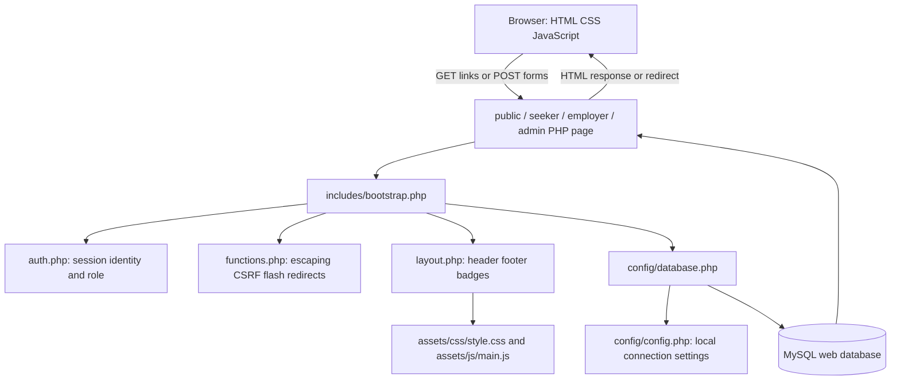
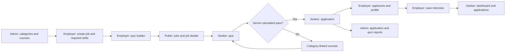
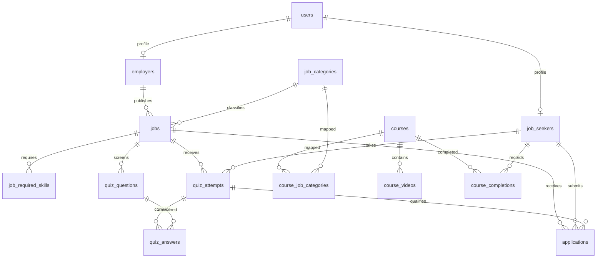

# Member 4: Administration, database design, and setup

**Team guides:** [Member 1](member-1-foundations-and-ui.md) · [Member 2](member-2-jobseeker-and-search.md) · [Member 3](member-3-employer-and-interviews.md) · [Member 4](member-4-admin-and-database.md)

## Contents

- [How to study this guide](#how-to-study-this-guide)
- [Equal team responsibilities](#equal-team-responsibilities)
- [Overall architecture everyone must understand](#overall-architecture-everyone-must-understand)
- [Core reading vocabulary used throughout the project](#core-reading-vocabulary-used-throughout-the-project)
- [Member 4 — concepts before your code](#member-4--concepts-before-your-code)
- [Your file ownership and reading order](#your-file-ownership-and-reading-order)
- [Chunk-by-chunk source walkthrough](#chunk-by-chunk-source-walkthrough)
- [File: config/config.example.php](#file-configconfigexamplephp)
- [File: config/database.php](#file-configdatabasephp)
- [File: admin/dashboard.php](#file-admindashboardphp)
- [File: admin/users.php](#file-adminusersphp)
- [File: admin/jobs.php](#file-adminjobsphp)
- [File: admin/categories.php](#file-admincategoriesphp)
- [File: admin/courses.php](#file-admincoursesphp)
- [File: admin/edit-course.php](#file-adminedit-coursephp)
- [File: admin/videos.php](#file-adminvideosphp)
- [File: admin/applications.php](#file-adminapplicationsphp)
- [File: admin/quiz-statistics.php](#file-adminquiz-statisticsphp)
- [File: database/add_interview_scheduling.sql](#file-databaseadd_interview_schedulingsql)
- [File: database/web.sql](#file-databasewebsql)
- [Member 4 — setup, migrations, and integrity exercises](#member-4--setup-migrations-and-integrity-exercises)
- [Shared final rehearsal checklist](#shared-final-rehearsal-checklist)

## How to study this guide

This is a teaching snapshot of the code on 27 September 2026, not a claim about who originally wrote it. Replace Member 1–4 with your names. Start with the concepts, trace one complete request, then study each assigned file in source order. Source chunks include every line of the assigned runtime files; their headings give the original line ranges. Blank lines and closing braces delimit blocks rather than introducing new behavior. Some existing templates put many statements on one line: read the explanation and the attribute glossary before following that long line.

For each chunk, answer: **What input enters? Which condition runs? What changes in memory/database? What output or redirect leaves? Who is allowed to do this?** Read the actual source alongside the guide if the project has changed since this snapshot. Source hashes identify the version explained. Configuration secrets are deliberately excluded; the example configuration teaches the same structure.

## Equal team responsibilities

| Member | Primary implementation/study responsibility | Main integration handoff |
| --- | --- | --- |
| 1 | Shared PHP foundations, login/register/logout, homepage, all shared HTML/CSS/JavaScript | Provides session identity, CSRF, escaping, navigation, and UI conventions to everyone |
| 2 | Public job discovery, badges, job details, all seeker pages, quiz scoring, applications, learning | Consumes employer jobs/questions and admin courses; creates attempts/applications |
| 3 | All employer pages, candidate review, interview display helper, interview regression checks | Writes jobs/questions/schedules; works with Member 2 to verify candidate visibility |
| 4 | All administrator pages, PDO configuration, full SQL schema/seeds/migration, installation documentation | Supplies shared data model, integrity rules, categories/courses, reports, and setup |

There are three application roles but four engineering responsibilities: shared infrastructure/UI is the fourth responsibility. Equal means comparable learning, explanation, and demonstration effort, not equal file counts. Member 1 has more repetitive CSS lines; Members 2 and 3 have denser business rules; Member 4 has SQL relationships and constraints. Give each member the same **12-hour study allocation**: 2 hours concepts/architecture, 5 hours owned code, 2 hours practical tracing, 1 hour cross-review, and 2 hours viva rehearsal. Each prepares a 6-minute demonstration and answers questions about one other member's handoff. These are suggested allocations, not measured reading times.

## Overall architecture everyone must understand

The project is a **server-rendered, procedural PHP multipage application**. A URL points directly to a PHP file. That file commonly performs request handling, SQL access, and HTML rendering together. Shared functions reduce repetition. It is not a framework MVC implementation, SPA, REST API service, or microservice system.



`bootstrap.php` loads the database function definition; it does not immediately connect. The first `database()` call opens PDO, and a static variable reuses that connection for the rest of this request. PHP variables do not persist between unrelated web requests. MySQL records and session data can persist.

### The stack and its exact role

| Technology | Where and why |
| --- | --- |
| PHP 8.2+ project target | Executes server logic, functions, sessions, validation, scoring, SQL calls, HTML templates; the local checks previously used PHP 8.5 |
| MySQL 8+ / InnoDB | Relational storage, foreign keys, unique/check constraints, transactions, aggregates |
| PDO with pdo_mysql | PHP-to-MySQL connection and parameterized SQL; no ORM |
| HTML5 | Semantic content, links, GET/POST forms, native details/summary disclosure, client validation |
| CSS3 | Custom layout, responsive grid/flex, badges, focus, printing, reduced motion; no Bootstrap/Tailwind |
| Vanilla JavaScript | Small DOM enhancements and field visibility; no React, jQuery, Node build step, or AJAX search |
| PHP sessions | Browser has a session identifier cookie; authenticated user ID, CSRF token, and flashes live in server session state |
| Apache/XAMPP or PHP built-in server | Executes PHP and serves assets; the development server command is `php -S localhost:8000` from the root |
| Fontshare / Google Fonts | External font/icon stylesheets requested by the shared header; fonts fall back when unavailable |
| YouTube iframe | Plays an externally hosted video; the database stores a video ID, not a video file |
| Browser print dialog | CV can be printed or saved to PDF; no server PDF library |

### One normal page request

1. Browser requests `seeker/applications.php` with its session cookie.
2. `require_once` loads `bootstrap.php`; PHP opens/resumes the named session and loads shared functions.
3. `require_login('seeker')` uses the session ID to read `users`, checks active status and role, and redirects unauthorized visitors.
4. A prepared query filters applications by the authenticated user's ID, joins the job and employer, and returns associative arrays.
5. `page_header()` outputs the document shell and pulls flash messages.
6. The template loops over rows; `e()` escapes text and attributes; `interview_details()` prints schedule data.
7. The footer loads JavaScript. The browser lays out the HTML with CSS. It never receives raw PHP source.

### One normal write request

POST form → session/role check → CSRF check → read/validate fields → prepared INSERT/UPDATE/DELETE → optional commit → flash → redirect → fresh GET renders the result. This is the Post/Redirect/Get pattern. Redirects must occur before HTML is sent. CSRF validation does not replace role or ownership validation.

### Complete business workflow and file connections



The shared database connects roles; one PHP page does not call another page in the background. For example, the employer updates one `applications` row, then the seeker reads that row on their next request. There is no live push notification or email delivery. `includes/interview-details.php` keeps display logic consistent but does not itself authenticate or query data.

### Relationship map



The six CV detail tables also reference `job_seekers.user_id`: `education`, `experience`, `projects`, `job_seeker_skills`, `certifications`, and `languages`. Role-specific profiles use `user_id` as both primary key and foreign key. There is no separate `admins` table. An interview is stored directly in `applications`, not in a separate meeting table. The diagram shows structural links; the passing-attempt rule is additionally enforced by PHP when submitting an application.

## Core reading vocabulary used throughout the project

| Syntax / concept | Meaning in this project |
| --- | --- |
| `<?php ... ?>`, `<?= ... ?>` | Execute PHP, then return to literal HTML; short echo prints an expression |
| `$variable`, `['key']`, `=>`, `[]` | PHP variable, associative-array lookup, key/value pair, and array creation/append |
| `$_GET`, `$_POST`, `$_SERVER`, `$_SESSION` | URL inputs, submitted body fields, request metadata, server session state |
| `??` versus `?:` | Missing/null fallback versus any falsy-value fallback; a string `"0"` is falsy in PHP |
| `===`, `!==`, `&&`, `\|\|`, `!` | Strict comparisons and Boolean operators; conditions choose which branch executes |
| `(int)`, `(float)`, `(bool)`, `(string)` | Explicit type conversion, not complete validation; casting an ID does not prove ownership |
| `.`, `.=` | String concatenation / append; SQL text and redirect paths use it |
| `function`, `return`, `void`, `never`, `?array` | Named reusable behavior, returned result, no result, never returns normally, nullable array |
| `declare(strict_types=1)` | Scalar type rules for calls made from that PHP file; it is not automatically inherited by all including files |
| `static` local variable | Keeps a cached value across calls in the same request, not a global cross-user login cache |
| `__DIR__`, `__FILE__`, `require_once` | Current file directory/path and load-once inclusion; filesystem paths differ from browser URLs |
| `foreach`, `if: ... endif`, `endforeach` | Iterate records and use template-friendly control syntax |
| `->`, `::` | Object method/property access and class constant/static access, such as `PDO::FETCH_COLUMN` |
| `prepare`, `execute` | SQL structure first, input values second; `?` placeholders bind in array order |
| `query` | Execute fixed SQL directly; do not concatenate untrusted strings into it |
| `fetch`, `fetchAll`, `fetchColumn` | One row, all rows, or one scalar/column; `fetch()` may return false |
| `JOIN` vs `LEFT JOIN` | Require a related row vs retain the left row even if no related row exists |
| `EXISTS`, `COUNT`, `SUM`, `AVG`, `GROUP BY` | Presence check, totals, sums, averages, grouping; not interchangeable |
| `ORDER BY`, `LIMIT` | Result ordering and row cap; a recent-five list is not the complete history |
| `NULL`, `COALESCE` | Missing SQL value and fallback for missing values, distinct from the empty string |
| Transaction | Related statements become one commit; rollback undoes uncommitted changes on that connection |
| Authentication / authorization / ownership | Who you are / whether your role can use the operation / whether this particular row belongs to you |
| Validation / escaping / parameter binding | Check business rules / make output safe as HTML / bind data safely into SQL; each solves a different problem |

### HTML properties and attributes to recognize

`name` becomes the submitted PHP key; `id` identifies an element for a label, fragment link, or JS; `class` selects reusable CSS. `value` supplies a field/option's submitted data. `method="get"` puts filters in a shareable URL; `method="post"` sends changes in a body (it is not encryption). Missing `action` means submit to the current page. `type="hidden"` hides UI but is still editable by a user. `required`, `min`, `max`, `minlength`, `maxlength`, and input types provide browser checks; the server still needs validation. `selected` chooses a select option; `checked` chooses a checkbox/radio; `disabled` prevents normal submission. `placeholder` is a hint, not a label or saved value.

`for` associates a label with an `id`; nesting a control inside a label also associates them. `aria-label` gives an accessible name; `aria-labelledby` points to visible naming text; `aria-describedby` points to help; `aria-current` identifies the current page/filter; `aria-hidden` hides decorative duplicates from assistive technology. `role="status"` marks status text. `tabindex="0"` makes an element focusable. `target="_blank"` opens another tab and `rel="noopener noreferrer"` removes opener/referrer access. `details` and `summary` provide a native disclosure; without `open`, extra filters start collapsed. `data-confirm` exposes a custom string through JS `dataset.confirm`. `href="#id"` links to a fragment; it does not query the database.

### Security explanation every member should be able to give

Use the session for acting-user identity. Use role checks before protected actions and row ownership in SQL. Check a session-bound unpredictable CSRF token for POST operations. Use prepared SQL values and escape HTML output with `htmlspecialchars`. Passwords are hashed and verified, never decrypted. Meeting links also need an HTTP(S) scheme check because HTML escaping alone does not reject a `javascript:` URL. These are defenses present in the code, not a claim of complete production hardening.

### Built-in functions and object methods: quick teaching reference

| Function / method | How to read a line that uses it |
| --- | --- |
| `trim`, `strtolower`, `strtoupper`, `ucwords` | Remove edge whitespace, lowercase, uppercase, or capitalize words. These transform text, not permissions. |
| `str_replace`, `substr`, `strlen` | Replace substrings, take a substring, count bytes. strlen is not a Unicode character count. |
| `strcasecmp`, `str_contains` | Case-insensitive string comparison (zero means equal) and substring presence (Boolean). |
| `explode`, `implode` | Split a string by a separator; join array values with a separator. Skill input uses commas, display aggregation uses a pipe. |
| `array_map`, `array_filter`, `array_unique` | Transform each value, keep matching/truthy values, remove duplicate values. Check the callback/default behavior before assuming normalization. |
| `array_merge`, `array_intersect_key` | Combine maps (later string keys replace earlier ones); keep keys also present in another array. Tests use the latter to compare fixture fields after removing its extra employer_id key. |
| `in_array($value, $list, true)` | Membership check with strict types; an int and a numeric string are not equal in this mode. |
| `isset`, `empty`, `unset`, `count` | Check non-null existence, test falsy/missing state, remove a variable/key, count elements. empty also considers string zero empty. |
| `round`, `intval` | Round a number to precision; convert a value to integer. Neither establishes ownership. |
| `filter_var` and validation constants | Validate URL/email structure. A successful shape check does not prove the email/domain/meeting exists. |
| `preg_match`, `preg_match_all` | Match a regular expression once or count all matches; ^/$ anchor and {11} repeats eleven times. /u uses UTF-8; /s makes dot include newline. |
| `parse_url` | Parse URL components; PHP_URL_SCHEME requests the protocol part. |
| `htmlspecialchars`, `nl2br` | Escape HTML-sensitive characters; add HTML breaks for newlines. Escape first, add breaks second. |
| `http_build_query` | Encode a map into URL query text, including literal plus signs and spaces. Escape that resulting text when inserting into an HTML attribute. |
| `date`, `strtotime`, `time`, `date_default_timezone_get` | Format a timestamp, parse date text, get current Unix time, get the configured PHP timezone. A browser datetime-local input carries no zone. |
| `DateTimeImmutable::createFromFormat`, `format`, `getTimestamp` | Parse an exact wall-clock format into an immutable object, format it again, and obtain epoch seconds for comparison. |
| `session_name`, `session_start`, `session_id` | Choose the cookie/session name, load session state, and read/set the identifier. Set name/identifier before starting as appropriate. |
| `session_regenerate_id`, `session_unset`, `session_destroy` | Replace the identifier, clear in-memory session variables, delete stored session state. They are distinct operations. |
| `random_bytes`, `bin2hex`, `hash_equals` | Secure random bytes, printable hex encoding, timing-safe equality comparison. Used for tokens/test session names. |
| `password_hash`, `password_verify` | Create a password hash and verify a proposed password against it. Never decrypt a password. |
| `header`, `http_response_code`, `exit` | Send response metadata, choose HTTP status, stop execution. A redirect helper calls exit so later writes/output cannot continue. |
| `PDO::prepare`, `PDOStatement::execute` | Prepare SQL with placeholders, then supply bound values in order. A SELECT execution is followed by fetching. |
| `fetch`, `fetchAll`, `fetchColumn`, `PDO::FETCH_COLUMN` | Read one row, all rows, one scalar, or request flat-column results; fetch false means no row. |
| `lastInsertId` | ID allocated by the last relevant auto-increment insert on this connection; retrieve it before unrelated inserts. |
| `beginTransaction`, `commit`, `rollBack`, `inTransaction` | Start, persist, undo, and inspect transaction state. Transactions use the same PDO connection. |
| `error_log`, `PDOException`, `ErrorException`, `RuntimeException` | Log a diagnostic or represent a database/PHP/test failure. A catch block handles only matching exception classes. |
| `ob_start`, `ob_get_clean` | Capture rendered output in a buffer and retrieve it while ending the buffer. Tests inspect the HTML string. |
| `proc_open`, `stream_get_contents`, `proc_close` | Start a child process, read its output pipes, collect its exit status. Used only by the CLI test runner. |
| `set_error_handler`, `register_shutdown_function`, `error_get_last` | Install a PHP error callback, run cleanup/assertions when execution ends, and inspect the last PHP error. |
| `static fn(...) => ...`, `function (...) use (...)` | Arrow callback returning one expression, or closure capturing named outside variables. static prevents binding an object context; it does not create persistent storage here. |

Read `+=` as add-and-assign, `[] =` as append, and `condition ? a : b` as choose one result. A single-line if controls only its following statement. A variable can be reused for different values: quiz.php changes `$job` from a prepared statement to the fetched row, and many `$s` variables are reused for new statements. This is legal procedural PHP but requires following assignment order carefully.

### What is actually implemented, and what is not

The quiz is scored by PHP using current database answers. Failed attempts suggest courses by **job category**, not AI or a semantic skill-matching model. Completion is self-reported with a button, not verified watching. Passing any previous attempt for the same job permits applying; there is no implemented maximum-attempt lock. Database defaults/constraints and browser validation cover some cases, but server validation is uneven. Application POST does not independently recheck the job deadline/current active status. Some broad PDO exception handlers label every database error as a duplicate. Those are current limitations to explain honestly, not features to claim.

Shared CSS names such as a “locked” badge do not prove that corresponding business logic exists. No email notifications, automatic hiring decisions, uploaded CV processing, dedicated REST API, or frontend framework are implemented. This guide documents the current code and does not change those behaviors.

## Member 4 — concepts before your code

1. **Relational design.** A table holds one kind of record; a row is one record; a column is one property. Separate users, role profiles, jobs, questions, attempts, and applications so unrelated data is not repeated in every row.
2. **Keys.** A primary key identifies a row. A foreign key references another row. A unique key disallows repeated values/tuples. A normal index speeds some lookups but does not forbid duplicates. Composite keys use multiple columns together, in an ordered index.
3. **Cardinality.** One employer has many jobs. A course can belong to many categories and each category can have many courses, so a junction table stores pairs. A role profile uses its user ID as its own key.
4. **Types.** `BIGINT UNSIGNED` is a large nonnegative ID; `VARCHAR(n)` is bounded text; `TEXT` is longer text; `DECIMAL(p,s)` is exact fixed precision; `ENUM` limits allowed strings. MySQL BOOLEAN is an alias of a small integer type. DATE has no time; DATETIME stores wall-clock date/time; TIMESTAMP is affected by database session timezone conversion.
5. **Defaults and constraints.** NULL means absent/unknown. NOT NULL is not the same as a nonempty string check. DEFAULT is used when the column is omitted. CHECK limits values, FOREIGN KEY limits relationships, and UNIQUE prevents duplicates. No constraint here proves an application points to a passing attempt by the same seeker/job; PHP checks that path.
6. **Deletion rules.** CASCADE removes dependent rows, RESTRICT prevents deletion while referenced, and SET NULL keeps the dependent row but removes the pointer. Other constraints elsewhere may still prevent a cascade. A schema reset is very different from deactivating a job.
7. **Aggregates.** COUNT counts rows/non-null values. LEFT JOIN keeps jobs with zero attempts. AVG of 0/1 pass flags gives pass fraction; multiply by 100 for percent. COALESCE supplies zero for empty aggregates. GROUP_CONCAT produces display text, not a normalized stored relationship.
8. **PDO configuration.** DSN gives driver, host, port, database and charset. Exceptions expose errors to PHP, associative fetch mode names columns, and native prepares separate SQL from bound inputs. Configuration is local and should not be committed with real passwords.
9. **Transactions and migrations.** A transaction groups data writes; an ALTER script changes structure. `web.sql` drops existing tables and rebuilds/seeds them; the interview ALTER adds columns once. Do not run either just to display the new badges: badge search uses an existing table.

**Your handoffs:** the administrator creates categories before employers create jobs; category-course mappings drive seeker recommendations. User deactivation is noticed by Member 1's active-user check. Job moderation changes visibility in Member 2's search. Your schema supports Member 3's authoring/schedules.

**Practice trace:** add category → employer uses it → create course and map category → fail the job quiz → see course → mark complete → inspect statistics. Explain why an unattempted job remains visible in the admin quiz report.

## Your file ownership and reading order

- [config/config.example.php](../../config/config.example.php) — Safe template for local configuration; never publish actual credentials.
- [config/database.php](../../config/database.php) — Lazy PDO connection reused for one PHP request.
- [admin/dashboard.php](../../admin/dashboard.php) — Administrative counts and navigation.
- [admin/users.php](../../admin/users.php) — Activate/deactivate non-admin accounts.
- [admin/jobs.php](../../admin/jobs.php) — Moderate any employer’s job status.
- [admin/categories.php](../../admin/categories.php) — Add categories used by job posting and course mappings.
- [admin/courses.php](../../admin/courses.php) — Create courses and assign one or more job categories.
- [admin/edit-course.php](../../admin/edit-course.php) — Edit course metadata and replace its category assignments.
- [admin/videos.php](../../admin/videos.php) — Manage ordered YouTube video references for a course.
- [admin/applications.php](../../admin/applications.php) — Read-only application report across employers and seekers.
- [admin/quiz-statistics.php](../../admin/quiz-statistics.php) — Per-job attempts, average score and pass rate.
- [database/add_interview_scheduling.sql](../../database/add_interview_scheduling.sql) — One-time structural upgrade for databases created before interview fields existed.
- [database/web.sql](../../database/web.sql) — Full schema, every column/constraint, and seeded records.
- `config/config.php` — Local configuration, explained from the safe template; secret contents excluded.
- [README.md](../../README.md) and [.gitignore](../../.gitignore) — Setup, demo documentation and ignored local files.

## Chunk-by-chunk source walkthrough

Read each explanation, trace the code below it, and then summarize it aloud before continuing. Every chunk is in original source order; code is reproduced as stored, including existing compact template lines.

## File: config/config.example.php

**Responsibility:** Safe template for local configuration; never publish actual credentials.

**Source:** [config/config.example.php](../../config/config.example.php) · **SHA-256 snapshot prefix:** `8a651f0d3b19`

### Configuration array — source lines 1–16

declare enables strict calls in this file. return returns the associative array to the requiring database() function. app_name/app_url/environment are descriptive configuration values but are not read by the current database function or used to generate this app’s layout/routing. database contains host, integer port, schema name, username and password. Copy to config/config.php and set local credentials; do not copy real secrets into a study guide. No production connection pool or environment-variable loader is implemented.

```php
<?php

declare(strict_types=1);

return [
    'app_name' => 'Job Grooming & Placement Platform',
    'app_url' => 'http://localhost/job-grooming-placement',
    'environment' => 'development',
    'database' => [
        'host' => 'localhost',
        'port' => 3306,
        'name' => 'web',
        'username' => 'root',
        'password' => 'replace-with-your-local-password',
    ],
];
```

## File: config/database.php

**Responsibility:** Lazy PDO connection reused for one PHP request.

**Source:** [config/database.php](../../config/database.php) · **SHA-256 snapshot prefix:** `bcf103ef9d61`

### Static connection cache — source lines 1–12

database(): PDO promises a PDO object. static connection initially NULL is tested with instanceof; a previously opened PDO is returned. The connection cache is per PHP request, not a globally shared object for every visitor.

```php
<?php

declare(strict_types=1);

function database(): PDO
{
    static $connection = null;

    if ($connection instanceof PDO) {
        return $connection;
    }

```

### Configuration and DSN — source lines 13–16

require returns the local config array. Select its database subsection; sprintf formats host as %s, port as %d, and database name as %s into a mysql DSN with utf8mb4. This is connection configuration, not a SQL query.

```php
    $config = require __DIR__ . '/config.php';
    $db = $config['database'];
    $dsn = sprintf('mysql:host=%s;port=%d;dbname=%s;charset=utf8mb4', $db['host'], $db['port'], $db['name']);

```

### PDO options — source lines 17–24

new PDO receives DSN, username, password and an options array. ERRMODE_EXCEPTION turns database errors into exceptions. FETCH_ASSOC returns keys named after selected columns. EMULATE_PREPARES=false requests native prepared statements. These options reduce boilerplate but do not validate application business rules.

```php
    try {
        $connection = new PDO($dsn, $db['username'], $db['password'], [
            PDO::ATTR_ERRMODE => PDO::ERRMODE_EXCEPTION,
            PDO::ATTR_DEFAULT_FETCH_MODE => PDO::FETCH_ASSOC,
            PDO::ATTR_EMULATE_PREPARES => false,
        ]);
    } catch (PDOException $exception) {
        error_log($exception->getMessage());
```

### Connection failure and return — source lines 25–30

Catch a connection PDOException, log the technical message server-side, send HTTP 500 and stop with a generic configuration hint. A successful call returns PDO. This catch does not wrap later SQL statements run by other pages.

```php
        http_response_code(500);
        exit('Database connection could not be established. Check the local database configuration.');
    }

    return $connection;
}
```

## File: admin/dashboard.php

**Responsibility:** Administrative counts and navigation.

**Source:** [admin/dashboard.php](../../admin/dashboard.php) · **SHA-256 snapshot prefix:** `39d45fb093fd`

### Admin guard and fixed query map — source lines 1–4

Require admin before reading aggregate data. Map seven labels to fixed SQL: users, seeker users, employer users, jobs, applications, courses, attempts. Values are safe fixed queries; role comparisons are literal strings.

```php
<?php require_once __DIR__ . '/../includes/bootstrap.php';
require_login('admin');
$p = database();
$queries = ['Users' => 'SELECT COUNT(*) FROM users','Job seekers' => "SELECT COUNT(*) FROM users WHERE role='seeker'",'Employers' => "SELECT COUNT(*) FROM users WHERE role='employer'",'Jobs' => 'SELECT COUNT(*) FROM jobs','Applications' => 'SELECT COUNT(*) FROM applications','Courses' => 'SELECT COUNT(*) FROM courses','Quiz attempts' => 'SELECT COUNT(*) FROM quiz_attempts'];
```

### Aggregate rendering — source lines 5–5

Loop queries and fetchColumn for each statistic. AVG(passed) of Boolean 0/1 values is pass fraction; multiply by 100, round to one decimal, COALESCE to zero when no attempts. Links reach admin maintenance/report pages. There is no time-range filter or chart engine.

```php
page_header('Admin dashboard');?><h1>Platform dashboard</h1><section class="stats"><?php foreach ($queries as $label => $sql):?><div class="stat"><strong><?=e($p->query($sql)->fetchColumn())?></strong><?=e($label)?></div><?php endforeach;?></section><?php $rate = $p->query('SELECT COALESCE(ROUND(AVG(passed)*100,1),0) FROM quiz_attempts')->fetchColumn();?><p class="notice">Quiz pass rate: <?=e($rate)?>%</p><p><a class="button" href="users.php">Users</a> <a class="button secondary" href="jobs.php">Jobs</a> <a class="button secondary" href="categories.php">Categories</a> <a class="button secondary" href="courses.php">Courses</a> <a class="button secondary" href="applications.php">Applications</a> <a class="button secondary" href="quiz-statistics.php">Quiz statistics</a></p><?php page_footer(); ?>
```

## File: admin/users.php

**Responsibility:** Activate/deactivate non-admin accounts.

**Source:** [admin/users.php](../../admin/users.php) · **SHA-256 snapshot prefix:** `d2bc6b4a7362`

### Guard and write — source lines 1–8

Require admin and verify CSRF on POST. Update is_active using the submitted integer and user ID. The SQL role<>admin protects all administrator accounts, including direct crafted requests. Redirect after write. It does not DELETE users or change passwords.

```php
<?php require_once __DIR__ . '/../includes/bootstrap.php';
require_login('admin');
$p = database();
if ($_SERVER['REQUEST_METHOD'] === 'POST') {
    verify_csrf();
    $p->prepare('UPDATE users SET is_active=? WHERE id=? AND role<>"admin"')->execute([(int) $_POST['active'], (int) $_POST['id']]);
    redirect('users.php');
}
```

### Read and table header — source lines 9–18

Select only list fields, excluding password hashes, ordered newest first. Print column headings and start the loop.

```php
$users = $p->query('SELECT id,email,role,is_active,created_at FROM users ORDER BY created_at DESC')->fetchAll();
page_header('Manage users'); ?>
<h1>Users</h1>
<table>
    <tr>
        <th>Email</th>
        <th>Role</th>
        <th>Status</th>
        <th></th>
    </tr><?php foreach ($users as $item): ?>
```

### Toggle controls — source lines 19–30

Show escaped email/role and a friendly active label. Only non-admin rows get a form. Hidden active value is the opposite of current status; button label matches it. CSRF protects the change. Existing sessions are rejected by current_user on their next checked request after deactivation; there is no live socket logout.

```php
        <tr>
            <td><?= e($item['email']) ?></td>
            <td><?= e($item['role']) ?></td>
            <td><?= $item['is_active'] ? 'Active' : 'Inactive' ?></td>
            <td><?php if ($item['role'] !== 'admin'): ?>
                    <form method="post"><input type="hidden" name="csrf_token" value="<?= csrf_token() ?>"><input type="hidden"
                            name="id" value="<?= $item['id'] ?>"><input type="hidden" name="active"
                            value="<?= $item['is_active'] ? 0 : 1 ?>"><button
                            class="small"><?= $item['is_active'] ? 'Deactivate' : 'Activate' ?></button></form><?php endif; ?>
            </td>
        </tr><?php endforeach; ?>
</table><?php page_footer(); ?>
```

## File: admin/jobs.php

**Responsibility:** Moderate any employer’s job status.

**Source:** [admin/jobs.php](../../admin/jobs.php) · **SHA-256 snapshot prefix:** `548d26db023c`

### Status moderation — source lines 1–13

Role/CSRF guard, then strict allowlist active/closed/deactivated. Cast posted ID and bind both values. Queue success and redirect. Unlike employer operations, this privileged admin query intentionally has no employer_id restriction.

```php
<?php
require_once __DIR__ . '/../includes/bootstrap.php';
require_login('admin');
$pdo = database();
if ($_SERVER['REQUEST_METHOD'] === 'POST') {
    verify_csrf();
    $status = posted('status');
    if (in_array($status, ['active', 'closed', 'deactivated'], true)) {
        $pdo->prepare('UPDATE jobs SET status = ? WHERE id = ?')->execute([$status, (int) $_POST['job_id']]);
        flash('success', 'Job status updated.');
    }
    redirect('jobs.php');
}
```

### Joined moderation list — source lines 14–21

Join job to company/category and order newest first. Each row shows escaped attributes and a status badge, then its own CSRF/job-ID form. The select currently defaults to its first option rather than marking the row’s existing status selected. Reactivating a job does not extend its deadline.

```php
$jobs = $pdo->query('SELECT j.*, e.company_name, c.name category_name FROM jobs j JOIN employers e ON e.user_id=j.employer_id JOIN job_categories c ON c.id=j.category_id ORDER BY j.created_at DESC')->fetchAll();
page_header('Moderate jobs');
?>
<h1>Job moderation</h1>
<table><tr><th>Role</th><th>Company</th><th>Category</th><th>Status</th><th>Moderate</th></tr>
<?php foreach ($jobs as $job): ?><tr><td><?= e($job['title']) ?></td><td><?= e($job['company_name']) ?></td><td><?= e($job['category_name']) ?></td><td><?= status_badge($job['status']) ?></td><td><form method="post"><input type="hidden" name="csrf_token" value="<?= csrf_token() ?>"><input type="hidden" name="job_id" value="<?= $job['id'] ?>"><select name="status"><option value="active">Active</option><option value="closed">Closed</option><option value="deactivated">Deactivated</option></select><button class="small">Save</button></form></td></tr><?php endforeach; ?>
</table>
<?php page_footer(); ?>
```

## File: admin/categories.php

**Responsibility:** Add categories used by job posting and course mappings.

**Source:** [admin/categories.php](../../admin/categories.php) · **SHA-256 snapshot prefix:** `60e40e4a51c7`

### Create and reload — source lines 1–9

Require admin, get PDO, verify CSRF, insert only when name is nonempty, optional description→NULL. Redirect then load all categories alphabetically. UNIQUE(name) rejects duplicates; there is no local exception handler.

```php
<?php require_once __DIR__ . '/../includes/bootstrap.php';
require_login('admin');
$p = database();
if ($_SERVER['REQUEST_METHOD'] === 'POST') {
    verify_csrf();
    if (posted('name') !== '') {
        $p->prepare('INSERT INTO job_categories(name,description) VALUES(?,?)')->execute([posted('name'),posted('description') ?: null]);
    }redirect('categories.php');
}$items = $p->query('SELECT * FROM job_categories ORDER BY name')->fetchAll();
```

### Category UI — source lines 10–10

POST form holds token/name/description and Add category. Table loops items and displays name, description and active flag as text. The page does not implement category editing, deletion, or activation toggle despite showing the flag.

```php
page_header('Categories');?><h1>Job categories</h1><form method="post"><input type="hidden" name="csrf_token" value="<?=csrf_token()?>"><label>Name</label><input name="name" required><label>Description</label><textarea name="description"></textarea><p><button>Add category</button></p></form><table><tr><th>Name</th><th>Description</th><th>Active</th></tr><?php foreach ($items as $i):?><tr><td><?=e($i['name'])?></td><td><?=e($i['description'])?></td><td><?=e((string)$i['is_active'])?></td></tr><?php endforeach;?></table><?php page_footer(); ?>
```

## File: admin/courses.php

**Responsibility:** Create courses and assign one or more job categories.

**Source:** [admin/courses.php](../../admin/courses.php) · **SHA-256 snapshot prefix:** `4244f21aa05a`

### Course plus mapping inserts — source lines 1–10

Require admin and CSRF. Insert course metadata, optional objectives/skills, difficulty/duration and creator=user ID. Get course ID then loop posted categories[] and insert junction pairs. There is no encompassing transaction here, unlike edit-course; a later mapping failure can leave a newly created course.

```php
<?php require_once __DIR__ . '/../includes/bootstrap.php';
$u = require_login('admin');
$p = database();
if ($_SERVER['REQUEST_METHOD'] === 'POST') {
    verify_csrf();
    $p->prepare('INSERT INTO courses(title,description,objectives,skills_covered,difficulty,duration_hours,created_by) VALUES(?,?,?,?,?,?,?)')->execute([posted('title'),posted('description'),posted('objectives') ?: null,posted('skills') ?: null,posted('difficulty'),posted('duration'),$u['id']]);
    $id = $p->lastInsertId();
    foreach ($_POST['categories'] ?? [] as $category) {
        $p->prepare('INSERT INTO course_job_categories(course_id,category_id) VALUES(?,?)')->execute([$id,(int)$category]);
    }redirect('courses.php');
```

### Catalog queries — source lines 11–12

Read active categories. LEFT JOIN course mappings and categories so unmapped courses still appear. GROUP_CONCAT produces comma-separated labels grouped by course ID; newest courses first.

```php
}$categories = $p->query('SELECT id,name FROM job_categories WHERE is_active=1')->fetchAll();
$courses = $p->query('SELECT c.*,GROUP_CONCAT(j.name SEPARATOR ", ") categories FROM courses c LEFT JOIN course_job_categories x ON x.course_id=c.id LEFT JOIN job_categories j ON j.id=x.category_id GROUP BY c.id ORDER BY c.created_at DESC')->fetchAll();
```

### Create form and catalog table — source lines 13–13

Form names map title/description/objectives/skills/difficulty/duration to the INSERT. Checkboxes named categories[] create a PHP array of IDs. The list links to edit-course?id and videos?course_id. These links perform GET navigation; creation requires POST.

```php
page_header('Courses');?><h1>Course catalog</h1><form method="post" class="form-grid"><input type="hidden" name="csrf_token" value="<?=csrf_token()?>"><div><label>Title</label><input name="title" required></div><div><label>Difficulty</label><select name="difficulty"><option>beginner</option><option>intermediate</option><option>advanced</option></select></div><div><label>Duration (hours)</label><input type="number" min="1" name="duration" required></div><div><label>Categories</label><?php foreach ($categories as $c):?><label><input type="checkbox" name="categories[]" value="<?=$c['id']?>"> <?=e($c['name'])?></label><?php endforeach;?></div><div class="full"><label>Description</label><textarea name="description" required></textarea></div><div><label>Objectives</label><textarea name="objectives"></textarea></div><div><label>Skills covered</label><textarea name="skills"></textarea></div><div class="full"><button>Add course</button></div></form><table><tr><th>Course</th><th>Categories</th><th>Actions</th></tr><?php foreach ($courses as $c):?><tr><td><?=e($c['title'])?></td><td><?=e($c['categories'])?></td><td><a href="edit-course.php?id=<?=$c['id']?>">Edit</a> · <a href="videos.php?course_id=<?=$c['id']?>">Manage videos</a></td></tr><?php endforeach;?></table><?php page_footer(); ?>
```

## File: admin/edit-course.php

**Responsibility:** Edit course metadata and replace its category assignments.

**Source:** [admin/edit-course.php](../../admin/edit-course.php) · **SHA-256 snapshot prefix:** `7410930b8518`

### Fetch record — source lines 1–11

Require admin, get course ID, prepare/select row and exit if missing. Admin has access across courses; no creator ownership restriction is intended.

```php
<?php
require_once __DIR__ . '/../includes/bootstrap.php';
require_login('admin');
$pdo = database();
$id = (int) ($_GET['id'] ?? $_POST['id'] ?? 0);
$statement = $pdo->prepare('SELECT * FROM courses WHERE id = ?');
$statement->execute([$id]);
$course = $statement->fetch();
if (!$course) {
    exit('Course not found.');
}
```

### Transactional update — source lines 12–27

CSRF then transaction. Update seven metadata/status fields. Delete existing mappings, insert each selected category pair, commit, flash and redirect. The transaction groups metadata and mapping replacement. There is no explicit local catch/rollback block; exceptions propagate if a write fails.

```php
if ($_SERVER['REQUEST_METHOD'] === 'POST') {
    verify_csrf();
    $pdo->beginTransaction();
    $pdo->prepare('UPDATE courses SET title=?,description=?,objectives=?,skills_covered=?,difficulty=?,duration_hours=?,is_active=? WHERE id=?')->execute([
        posted('title'), posted('description'), posted('objectives') ?: null, posted('skills') ?: null,
        posted('difficulty'), posted('duration'), (int) $_POST['is_active'], $id,
    ]);
    $pdo->prepare('DELETE FROM course_job_categories WHERE course_id = ?')->execute([$id]);
    $insertCategory = $pdo->prepare('INSERT INTO course_job_categories (course_id, category_id) VALUES (?, ?)');
    foreach ($_POST['categories'] ?? [] as $categoryId) {
        $insertCategory->execute([$id, (int) $categoryId]);
    }
    $pdo->commit();
    flash('success', 'Course updated.');
    redirect('courses.php');
}
```

### Prepare selected options — source lines 28–34

Read active categories and the existing course category IDs. FETCH_COLUMN gives a flat list; array_map(intval) ensures strict in_array compares integers rather than int/string mismatches.

```php

$categories = $pdo->query('SELECT id, name FROM job_categories WHERE is_active = 1 ORDER BY name')->fetchAll();
$selectedStatement = $pdo->prepare('SELECT category_id FROM course_job_categories WHERE course_id = ?');
$selectedStatement->execute([$id]);
$selectedCategories = array_map('intval', $selectedStatement->fetchAll(PDO::FETCH_COLUMN));
page_header('Edit course');
?>
```

### Edit form — source lines 35–48

Current difficulty/status selected; checkbox checked only if its integer category ID exists in selectedCategories with strict comparison. Escaped text fills inputs/textareas. active flag deactivates a course without deleting history. Only active categories are selectable; saving may remove mappings to inactive categories absent from the controls.

```php
<h1>Edit course</h1>
<form method="post" class="form-grid">
	<input type="hidden" name="csrf_token" value="<?= csrf_token() ?>">
	<label>Title<input name="title" value="<?= e($course['title']) ?>" required></label>
	<label>Difficulty<select name="difficulty"><?php foreach (['beginner','intermediate','advanced'] as $level): ?><option <?= $course['difficulty'] === $level ? 'selected' : '' ?>><?= e($level) ?></option><?php endforeach; ?></select></label>
	<label>Duration (hours)<input type="number" min="1" name="duration" value="<?= e($course['duration_hours']) ?>" required></label>
	<label>Active<select name="is_active"><option value="1" <?= $course['is_active'] ? 'selected' : '' ?>>Yes</option><option value="0" <?= $course['is_active'] ? '' : 'selected' ?>>No</option></select></label>
	<div class="full"><label>Related job categories</label><?php foreach ($categories as $category): ?><label><input type="checkbox" name="categories[]" value="<?= $category['id'] ?>" <?= in_array((int) $category['id'], $selectedCategories, true) ? 'checked' : '' ?>> <?= e($category['name']) ?></label><?php endforeach; ?></div>
	<label class="full">Description<textarea name="description" required><?= e($course['description']) ?></textarea></label>
	<label>Objectives<textarea name="objectives"><?= e($course['objectives']) ?></textarea></label>
	<label>Skills covered<textarea name="skills"><?= e($course['skills_covered']) ?></textarea></label>
	<button class="full">Save course</button>
</form>
<?php page_footer(); ?>
```

## File: admin/videos.php

**Responsibility:** Manage ordered YouTube video references for a course.

**Source:** [admin/videos.php](../../admin/videos.php) · **SHA-256 snapshot prefix:** `21b22ca3b452`

### Add video — source lines 1–13

Require admin and integer course ID. POST verifies CSRF and checks video ID regex, then computes next order as MAX+1 and inserts course/title/YouTube ID/order. The order query concatenates only the already-cast integer. Invalid ID gets a flash error. Concurrent inserts can collide on unique order; this page does not handle that race.

```php
<?php require_once __DIR__ . '/../includes/bootstrap.php';
require_login('admin');
$p = database();
$id = (int)($_GET['course_id'] ?? $_POST['course_id'] ?? 0);
if ($_SERVER['REQUEST_METHOD'] === 'POST') {
    verify_csrf();
    $youtube = posted('youtube_video_id');
    if (is_valid_youtube_id($youtube)) {
        $order = (int)$p->query('SELECT COALESCE(MAX(display_order),0)+1 FROM course_videos WHERE course_id='.$id)->fetchColumn();
        $p->prepare('INSERT INTO course_videos(course_id,title,youtube_video_id,display_order) VALUES(?,?,?,?)')->execute([$id,posted('title'),$youtube,$order]);
    } else {
        flash('error', 'Enter an 11-character YouTube video ID.');
    }redirect('videos.php?course_id='.$id);
```

### Read course and videos — source lines 14–20

After POST handling, load the course or exit, then load video rows. The write happens before this course-existence check; the foreign key protects invalid course IDs. The list query does not explicitly ORDER BY, although the seeker player does.

```php
}$s = $p->prepare('SELECT * FROM courses WHERE id=?');
$s->execute([$id]);
$course = $s->fetch();
if (!$course) {
    exit('Course not found.');
}$s = $p->prepare('SELECT * FROM course_videos WHERE course_id=?');
$s->execute([$id]);
```

### Video form/table — source lines 21–21

Hidden course ID/CSRF accompany title and 11-character ID. Users supply only ID, not a whole watch URL. Table displays title and ID; no delete/reorder control is implemented. Video media remains hosted by YouTube.

```php
page_header('Course videos');?><h1>Videos: <?=e($course['title'])?></h1><form method="post"><input type="hidden" name="csrf_token" value="<?=csrf_token()?>"><input type="hidden" name="course_id" value="<?=$id?>"><label>Video title</label><input name="title" required><label>YouTube video ID</label><input name="youtube_video_id" maxlength="11" required><p><button>Add video</button></p></form><table><tr><th>Title</th><th>Video ID</th></tr><?php foreach ($s as $v):?><tr><td><?=e($v['title'])?></td><td><?=e($v['youtube_video_id'])?></td></tr><?php endforeach;?></table><?php page_footer(); ?>
```

## File: admin/applications.php

**Responsibility:** Read-only application report across employers and seekers.

**Source:** [admin/applications.php](../../admin/applications.php) · **SHA-256 snapshot prefix:** `99c7206b92d8`

### Report query — source lines 1–4

Require admin. Join applications to jobs, seeker profiles and employers to select status/date/title/full_name/company. There is no seeker/employer ownership predicate because this is an admin-wide report. Newest applications first.

```php
<?php require_once __DIR__ . '/../includes/bootstrap.php';
require_login('admin');
$rows = database()->query('SELECT a.status,a.applied_at,j.title,js.full_name,e.company_name FROM applications a JOIN jobs j ON j.id=a.job_id JOIN job_seekers js ON js.user_id=a.seeker_id JOIN employers e ON e.user_id=j.employer_id ORDER BY a.applied_at DESC')->fetchAll();
page_header('Applications'); ?>
```

### Report table — source lines 5–21

Print headings then one row per application, escaping user text and using status_badge. No status mutation form is on this page. An empty report displays headers without a dedicated empty-state row. Shared JS makes a wide table scrollable.

```php
<h1>All applications</h1>
<table>
    <tr>
        <th>Candidate</th>
        <th>Job</th>
        <th>Company</th>
        <th>Status</th>
        <th>Date</th>
    </tr><?php foreach ($rows as $r): ?>
        <tr>
            <td><?= e($r['full_name']) ?></td>
            <td><?= e($r['title']) ?></td>
            <td><?= e($r['company_name']) ?></td>
            <td><?= status_badge($r['status']) ?></td>
            <td><?= e($r['applied_at']) ?></td>
        </tr><?php endforeach; ?>
</table><?php page_footer(); ?>
```

## File: admin/quiz-statistics.php

**Responsibility:** Per-job attempts, average score and pass rate.

**Source:** [admin/quiz-statistics.php](../../admin/quiz-statistics.php) · **SHA-256 snapshot prefix:** `9faef37d799a`

### Aggregate report — source lines 1–3

Require admin. LEFT JOIN attempts so unattempted jobs remain. COUNT(qa.id), unlike COUNT(*), returns zero for a job’s NULL joined row. AVG(percentage) measures score; AVG(passed)*100 measures pass rate; ROUND(...,1) and COALESCE produce readable non-null values. GROUP BY job ID groups attempts, ordering is attempt count descending then title.

```php
<?php require_once __DIR__ . '/../includes/bootstrap.php';
require_login('admin');
$rows = database()->query('SELECT j.title,COUNT(qa.id) attempts,COALESCE(ROUND(AVG(qa.percentage),1),0) average_score,COALESCE(ROUND(AVG(qa.passed)*100,1),0) pass_rate FROM jobs j LEFT JOIN quiz_attempts qa ON qa.job_id=j.id GROUP BY j.id ORDER BY attempts DESC,j.title')->fetchAll();
```

### Output table — source lines 4–4

Render job title, attempts, average score percent and pass rate percent. These are statistics over stored attempts, not unique people or application-selection percentages. One person retrying several times contributes several rows.

```php
page_header('Quiz statistics');?><h1>Quiz statistics</h1><table><tr><th>Job</th><th>Attempts</th><th>Average score</th><th>Pass rate</th></tr><?php foreach ($rows as $r):?><tr><td><?=e($r['title'])?></td><td><?=e($r['attempts'])?></td><td><?=e($r['average_score'])?>%</td><td><?=e($r['pass_rate'])?>%</td></tr><?php endforeach;?></table><?php page_footer(); ?>
```

## File: database/add_interview_scheduling.sql

**Responsibility:** One-time structural upgrade for databases created before interview fields existed.

**Source:** [database/add_interview_scheduling.sql](../../database/add_interview_scheduling.sql) · **SHA-256 snapshot prefix:** `a5cf446b1971`

### Add five optional fields — source lines 1–8

USE chooses web. ALTER TABLE applications adds nullable interview_mode ENUM online/office, interview_at DATETIME, meeting_url VARCHAR(500), interview_location VARCHAR(255), and interview_notes TEXT. AFTER controls column ordering, not lookup semantics. Existing application rows receive NULL in the new fields. Run only on an old schema missing these columns; rerunning or applying after fresh web.sql causes duplicate-column errors. The current schema already includes them, so new search/UI features require no ALTER.

```sql
USE web;

ALTER TABLE applications
    ADD COLUMN interview_mode ENUM('online', 'office') NULL AFTER status,
    ADD COLUMN interview_at DATETIME NULL AFTER interview_mode,
    ADD COLUMN meeting_url VARCHAR(500) NULL AFTER interview_at,
    ADD COLUMN interview_location VARCHAR(255) NULL AFTER meeting_url,
    ADD COLUMN interview_notes TEXT NULL AFTER interview_location;
```

## File: database/web.sql

**Responsibility:** Complete schema and demo seed data. Understand every table, column, constraint and seed relationship.

**Source:** [database/web.sql](../../database/web.sql) · **SHA-256 snapshot prefix:** `3234799cfb4e`

### Before reading the SQL

This file is a **destructive rebuild script**, not a safe incremental migration. It disables foreign-key checks, drops existing tables, reenables checks, creates the model, then inserts fictional demonstration data. Do not run it on a database containing work you need to retain. Reading this guide does not require executing it.

`VARCHAR(n)` bounds text length; `DECIMAL(p,s)` gives total digits and fractional digits (12,2 allows ten integer digits and two fractional); `TIMESTAMP DEFAULT CURRENT_TIMESTAMP ON UPDATE CURRENT_TIMESTAMP` manages creation/update times as declared. `AUTO_INCREMENT` allocates an ID and `PRIMARY KEY` uniquely identifies a row. NULL is allowed only where stated. An omitted nullable column defaults to NULL unless another default is given. `ENUM` declarations show every allowed stored string. InnoDB supplies transaction/FK behavior, and utf8mb4 supports Unicode. The database collation utf8mb4_unicode_ci provides case-insensitive comparisons for relevant character data.

Read each foreign key as child columns → parent table/columns → deletion behavior. A CHECK validates values in that row; it cannot substitute for all cross-table business rules. Read composite index columns left-to-right: leading columns affect lookup usefulness. An index containing title does not make `%keyword%` a full-text search engine.

### Create/select database and reset tables — source lines 1–32

CREATE DATABASE IF NOT EXISTS creates web with charset/collation if absent; USE selects it. FOREIGN_KEY_CHECKS=0 permits dropping mutually referenced tables; each DROP TABLE IF EXISTS removes that named table and all its data. Checks are restored before tables/data are recreated. This setup script uses hardcoded web, which must match config/database name. There is no schema version tracker.

```sql
-- Job Grooming & Placement Platform database schema
-- Import this file in MySQL Workbench. It creates and selects the `web` database.

CREATE DATABASE IF NOT EXISTS web
    CHARACTER SET utf8mb4
    COLLATE utf8mb4_unicode_ci;

USE web;

SET FOREIGN_KEY_CHECKS = 0;
DROP TABLE IF EXISTS course_completions;
DROP TABLE IF EXISTS course_videos;
DROP TABLE IF EXISTS course_job_categories;
DROP TABLE IF EXISTS courses;
DROP TABLE IF EXISTS applications;
DROP TABLE IF EXISTS quiz_answers;
DROP TABLE IF EXISTS quiz_attempts;
DROP TABLE IF EXISTS quiz_questions;
DROP TABLE IF EXISTS job_required_skills;
DROP TABLE IF EXISTS jobs;
DROP TABLE IF EXISTS languages;
DROP TABLE IF EXISTS certifications;
DROP TABLE IF EXISTS projects;
DROP TABLE IF EXISTS experience;
DROP TABLE IF EXISTS education;
DROP TABLE IF EXISTS job_seeker_skills;
DROP TABLE IF EXISTS job_categories;
DROP TABLE IF EXISTS employers;
DROP TABLE IF EXISTS job_seekers;
DROP TABLE IF EXISTS users;
SET FOREIGN_KEY_CHECKS = 1;

```

### Table users — source lines 33–44

Shared login identity for all roles. UNIQUE email prevents duplicate accounts. The role/active index helps role and activation queries. Password hashes are stored, not plain passwords.

**Properties, keys, and integrity rules in declaration order:**

- `id BIGINT UNSIGNED AUTO_INCREMENT PRIMARY KEY` — Surrogate record identifier; AUTO_INCREMENT allocates a new number when omitted. The declaration gives its exact type, nullability, and default.
- `email VARCHAR(255) NOT NULL` — Account sign-in identifier. The declaration gives its exact type, nullability, and default.
- `password_hash VARCHAR(255) NOT NULL` — One-way password hash consumed by password_verify, never plaintext. The declaration gives its exact type, nullability, and default.
- `role ENUM('admin', 'seeker', 'employer') NOT NULL` — Account permission category: admin, seeker, employer. The declaration gives its exact type, nullability, and default.
- `is_active BOOLEAN NOT NULL DEFAULT TRUE` — Availability flag; meaning depends on the owning table (account, category or course). The declaration gives its exact type, nullability, and default.
- `last_login_at DATETIME NULL` — Most recent successful-login time, set by login.php. The declaration gives its exact type, nullability, and default.
- `created_at TIMESTAMP NOT NULL DEFAULT CURRENT_TIMESTAMP` — Creation time; database default applies if omitted. The declaration gives its exact type, nullability, and default.
- `updated_at TIMESTAMP NOT NULL DEFAULT CURRENT_TIMESTAMP ON UPDATE CURRENT_TIMESTAMP` — Last update timestamp, automatically changed by the database clause. The declaration gives its exact type, nullability, and default.
- `UNIQUE KEY uq_users_email (email)` — The entire column tuple must be unique; uniqueness does not mean each individual column is unique when used in a composite key.
- `KEY idx_users_role_active (role, is_active)` — Nonunique lookup index; improves applicable queries without enforcing uniqueness.

The closing ENGINE/CHARSET clause chooses InnoDB and Unicode text storage for this table.

```sql
CREATE TABLE users (
    id BIGINT UNSIGNED AUTO_INCREMENT PRIMARY KEY,
    email VARCHAR(255) NOT NULL,
    password_hash VARCHAR(255) NOT NULL,
    role ENUM('admin', 'seeker', 'employer') NOT NULL,
    is_active BOOLEAN NOT NULL DEFAULT TRUE,
    last_login_at DATETIME NULL,
    created_at TIMESTAMP NOT NULL DEFAULT CURRENT_TIMESTAMP,
    updated_at TIMESTAMP NOT NULL DEFAULT CURRENT_TIMESTAMP ON UPDATE CURRENT_TIMESTAMP,
    UNIQUE KEY uq_users_email (email),
    KEY idx_users_role_active (role, is_active)
) ENGINE=InnoDB DEFAULT CHARSET=utf8mb4;
```

### Table job_seekers — source lines 45–57

One seeker profile per user. user_id is both PK and FK, which enforces at most one profile row for a user. Profile_photo_path is a placeholder property; current pages do not implement image upload.

**Properties, keys, and integrity rules in declaration order:**

- `user_id BIGINT UNSIGNED PRIMARY KEY` — References the login account; role-profile tables also use it as their primary key. The declaration gives its exact type, nullability, and default.
- `full_name VARCHAR(150) NOT NULL` — Seeker display/CV name. The declaration gives its exact type, nullability, and default.
- `phone VARCHAR(30) NULL` — Contact telephone stored as text to retain symbols/leading zeros. The declaration gives its exact type, nullability, and default.
- `address VARCHAR(255) NULL` — Personal contact address, distinct from interview office location. The declaration gives its exact type, nullability, and default.
- `date_of_birth DATE NULL` — Optional birth date. The declaration gives its exact type, nullability, and default.
- `profile_summary TEXT NULL` — Free-text professional summary. The declaration gives its exact type, nullability, and default.
- `profile_photo_path VARCHAR(255) NULL` — Reserved profile-photo path; upload not implemented. The declaration gives its exact type, nullability, and default.
- `created_at TIMESTAMP NOT NULL DEFAULT CURRENT_TIMESTAMP` — Creation time; database default applies if omitted. The declaration gives its exact type, nullability, and default.
- `updated_at TIMESTAMP NOT NULL DEFAULT CURRENT_TIMESTAMP ON UPDATE CURRENT_TIMESTAMP` — Last update timestamp, automatically changed by the database clause. The declaration gives its exact type, nullability, and default.
- `CONSTRAINT fk_job_seekers_user FOREIGN KEY (user_id) REFERENCES users(id) ON DELETE CASCADE` — Child `user_id` references `users.id`; removes these dependent rows when the parent is deleted, subject to other constraints.

The closing ENGINE/CHARSET clause chooses InnoDB and Unicode text storage for this table.

```sql

CREATE TABLE job_seekers (
    user_id BIGINT UNSIGNED PRIMARY KEY,
    full_name VARCHAR(150) NOT NULL,
    phone VARCHAR(30) NULL,
    address VARCHAR(255) NULL,
    date_of_birth DATE NULL,
    profile_summary TEXT NULL,
    profile_photo_path VARCHAR(255) NULL,
    created_at TIMESTAMP NOT NULL DEFAULT CURRENT_TIMESTAMP,
    updated_at TIMESTAMP NOT NULL DEFAULT CURRENT_TIMESTAMP ON UPDATE CURRENT_TIMESTAMP,
    CONSTRAINT fk_job_seekers_user FOREIGN KEY (user_id) REFERENCES users(id) ON DELETE CASCADE
) ENGINE=InnoDB DEFAULT CHARSET=utf8mb4;
```

### Table employers — source lines 58–72

One employer profile per user. Jobs reference employers.user_id. logo_path exists in storage but current forms do not implement uploading a logo.

**Properties, keys, and integrity rules in declaration order:**

- `user_id BIGINT UNSIGNED PRIMARY KEY` — References the login account; role-profile tables also use it as their primary key. The declaration gives its exact type, nullability, and default.
- `company_name VARCHAR(150) NOT NULL` — Employer/company display name. The declaration gives its exact type, nullability, and default.
- `logo_path VARCHAR(255) NULL` — Reserved company logo path; upload not implemented. The declaration gives its exact type, nullability, and default.
- `description TEXT NULL` — Long descriptive content for this record. The declaration gives its exact type, nullability, and default.
- `industry VARCHAR(100) NULL` — Employer industry text. The declaration gives its exact type, nullability, and default.
- `website VARCHAR(255) NULL` — Employer website string. The declaration gives its exact type, nullability, and default.
- `location VARCHAR(150) NULL` — Job workplace or company location; separate from applications.interview_location. The declaration gives its exact type, nullability, and default.
- `contact_name VARCHAR(150) NULL` — Employer contact person. The declaration gives its exact type, nullability, and default.
- `contact_phone VARCHAR(30) NULL` — Employer contact telephone. The declaration gives its exact type, nullability, and default.
- `created_at TIMESTAMP NOT NULL DEFAULT CURRENT_TIMESTAMP` — Creation time; database default applies if omitted. The declaration gives its exact type, nullability, and default.
- `updated_at TIMESTAMP NOT NULL DEFAULT CURRENT_TIMESTAMP ON UPDATE CURRENT_TIMESTAMP` — Last update timestamp, automatically changed by the database clause. The declaration gives its exact type, nullability, and default.
- `CONSTRAINT fk_employers_user FOREIGN KEY (user_id) REFERENCES users(id) ON DELETE CASCADE` — Child `user_id` references `users.id`; removes these dependent rows when the parent is deleted, subject to other constraints.

The closing ENGINE/CHARSET clause chooses InnoDB and Unicode text storage for this table.

```sql

CREATE TABLE employers (
    user_id BIGINT UNSIGNED PRIMARY KEY,
    company_name VARCHAR(150) NOT NULL,
    logo_path VARCHAR(255) NULL,
    description TEXT NULL,
    industry VARCHAR(100) NULL,
    website VARCHAR(255) NULL,
    location VARCHAR(150) NULL,
    contact_name VARCHAR(150) NULL,
    contact_phone VARCHAR(30) NULL,
    created_at TIMESTAMP NOT NULL DEFAULT CURRENT_TIMESTAMP,
    updated_at TIMESTAMP NOT NULL DEFAULT CURRENT_TIMESTAMP ON UPDATE CURRENT_TIMESTAMP,
    CONSTRAINT fk_employers_user FOREIGN KEY (user_id) REFERENCES users(id) ON DELETE CASCADE
) ENGINE=InnoDB DEFAULT CHARSET=utf8mb4;
```

### Table job_categories — source lines 73–83

Named categories for jobs and course mappings. Name is unique. is_active controls category availability in several forms; not every query rechecks it.

**Properties, keys, and integrity rules in declaration order:**

- `id BIGINT UNSIGNED AUTO_INCREMENT PRIMARY KEY` — Surrogate record identifier; AUTO_INCREMENT allocates a new number when omitted. The declaration gives its exact type, nullability, and default.
- `name VARCHAR(100) NOT NULL` — Category label. The declaration gives its exact type, nullability, and default.
- `description TEXT NULL` — Long descriptive content for this record. The declaration gives its exact type, nullability, and default.
- `is_active BOOLEAN NOT NULL DEFAULT TRUE` — Availability flag; meaning depends on the owning table (account, category or course). The declaration gives its exact type, nullability, and default.
- `created_at TIMESTAMP NOT NULL DEFAULT CURRENT_TIMESTAMP` — Creation time; database default applies if omitted. The declaration gives its exact type, nullability, and default.
- `updated_at TIMESTAMP NOT NULL DEFAULT CURRENT_TIMESTAMP ON UPDATE CURRENT_TIMESTAMP` — Last update timestamp, automatically changed by the database clause. The declaration gives its exact type, nullability, and default.
- `UNIQUE KEY uq_job_categories_name (name)` — The entire column tuple must be unique; uniqueness does not mean each individual column is unique when used in a composite key.
- `KEY idx_categories_active (is_active)` — Nonunique lookup index; improves applicable queries without enforcing uniqueness.

The closing ENGINE/CHARSET clause chooses InnoDB and Unicode text storage for this table.

```sql

CREATE TABLE job_categories (
    id BIGINT UNSIGNED AUTO_INCREMENT PRIMARY KEY,
    name VARCHAR(100) NOT NULL,
    description TEXT NULL,
    is_active BOOLEAN NOT NULL DEFAULT TRUE,
    created_at TIMESTAMP NOT NULL DEFAULT CURRENT_TIMESTAMP,
    updated_at TIMESTAMP NOT NULL DEFAULT CURRENT_TIMESTAMP ON UPDATE CURRENT_TIMESTAMP,
    UNIQUE KEY uq_job_categories_name (name),
    KEY idx_categories_active (is_active)
) ENGINE=InnoDB DEFAULT CHARSET=utf8mb4;
```

### Table jobs — source lines 84–112

Job parent record. Employer/category foreign keys use RESTRICT to preserve referenced parents. CHECKs enforce salary ordering, positive vacancies and threshold 0–100. Browse/search/employer indexes support common predicates, though a leading-wildcard LIKE cannot efficiently use a normal prefix index for that term.

**Properties, keys, and integrity rules in declaration order:**

- `id BIGINT UNSIGNED AUTO_INCREMENT PRIMARY KEY` — Surrogate record identifier; AUTO_INCREMENT allocates a new number when omitted. The declaration gives its exact type, nullability, and default.
- `employer_id BIGINT UNSIGNED NOT NULL` — Job owner, referencing employers.user_id. The declaration gives its exact type, nullability, and default.
- `category_id BIGINT UNSIGNED NOT NULL` — Related job category ID. The declaration gives its exact type, nullability, and default.
- `title VARCHAR(180) NOT NULL` — Human-readable job, course, project or video title. The declaration gives its exact type, nullability, and default.
- `description TEXT NOT NULL` — Long descriptive content for this record. The declaration gives its exact type, nullability, and default.
- `responsibilities TEXT NULL` — Job duties. The declaration gives its exact type, nullability, and default.
- `requirements_text TEXT NULL` — Job eligibility/requirements narrative. The declaration gives its exact type, nullability, and default.
- `employment_type ENUM('full_time', 'part_time', 'contract', 'internship', 'temporary') NOT NULL` — Allowed employment arrangement. The declaration gives its exact type, nullability, and default.
- `workplace_type ENUM('on_site', 'hybrid', 'remote') NOT NULL` — On-site/hybrid/remote arrangement. The declaration gives its exact type, nullability, and default.
- `location VARCHAR(150) NOT NULL` — Job workplace or company location; separate from applications.interview_location. The declaration gives its exact type, nullability, and default.
- `salary_min DECIMAL(12,2) NULL` — Optional lower salary amount; no currency column exists. The declaration gives its exact type, nullability, and default.
- `salary_max DECIMAL(12,2) NULL` — Optional upper salary amount. The declaration gives its exact type, nullability, and default.
- `vacancies SMALLINT UNSIGNED NOT NULL DEFAULT 1` — Number of open positions; must be positive. The declaration gives its exact type, nullability, and default.
- `deadline DATE NOT NULL` — Last application date used by public listing predicate. The declaration gives its exact type, nullability, and default.
- `minimum_passing_score DECIMAL(5,2) NOT NULL DEFAULT 60.00` — Percentage threshold used by PHP quiz scoring. The declaration gives its exact type, nullability, and default.
- `status ENUM('draft', 'active', 'closed', 'deactivated') NOT NULL DEFAULT 'draft'` — Allowed job/application lifecycle label; ENUM membership is not a full transition policy. The declaration gives its exact type, nullability, and default.
- `created_at TIMESTAMP NOT NULL DEFAULT CURRENT_TIMESTAMP` — Creation time; database default applies if omitted. The declaration gives its exact type, nullability, and default.
- `updated_at TIMESTAMP NOT NULL DEFAULT CURRENT_TIMESTAMP ON UPDATE CURRENT_TIMESTAMP` — Last update timestamp, automatically changed by the database clause. The declaration gives its exact type, nullability, and default.
- `CONSTRAINT fk_jobs_employer FOREIGN KEY (employer_id) REFERENCES employers(user_id) ON DELETE RESTRICT` — Child `employer_id` references `employers.user_id`; prevents deleting a parent while these references exist.
- `CONSTRAINT fk_jobs_category FOREIGN KEY (category_id) REFERENCES job_categories(id) ON DELETE RESTRICT` — Child `category_id` references `job_categories.id`; prevents deleting a parent while these references exist.
- `CONSTRAINT chk_jobs_salary_range CHECK (salary_min IS NULL OR salary_max IS NULL OR salary_min <= salary_max)` — Named CHECK: the Boolean expression must not evaluate false. Read its OR/AND clauses to see how missing optional values are treated.
- `CONSTRAINT chk_jobs_vacancies CHECK (vacancies > 0)` — Named CHECK: the Boolean expression must not evaluate false. Read its OR/AND clauses to see how missing optional values are treated.
- `CONSTRAINT chk_jobs_passing_score CHECK (minimum_passing_score >= 0 AND minimum_passing_score <= 100)` — Named CHECK: the Boolean expression must not evaluate false. Read its OR/AND clauses to see how missing optional values are treated.
- `KEY idx_jobs_browse (status, deadline, category_id)` — Nonunique lookup index; improves applicable queries without enforcing uniqueness.
- `KEY idx_jobs_search (title, location)` — Nonunique lookup index; improves applicable queries without enforcing uniqueness.
- `KEY idx_jobs_employer (employer_id)` — Nonunique lookup index; improves applicable queries without enforcing uniqueness.

The closing ENGINE/CHARSET clause chooses InnoDB and Unicode text storage for this table.

```sql

CREATE TABLE jobs (
    id BIGINT UNSIGNED AUTO_INCREMENT PRIMARY KEY,
    employer_id BIGINT UNSIGNED NOT NULL,
    category_id BIGINT UNSIGNED NOT NULL,
    title VARCHAR(180) NOT NULL,
    description TEXT NOT NULL,
    responsibilities TEXT NULL,
    requirements_text TEXT NULL,
    employment_type ENUM('full_time', 'part_time', 'contract', 'internship', 'temporary') NOT NULL,
    workplace_type ENUM('on_site', 'hybrid', 'remote') NOT NULL,
    location VARCHAR(150) NOT NULL,
    salary_min DECIMAL(12,2) NULL,
    salary_max DECIMAL(12,2) NULL,
    vacancies SMALLINT UNSIGNED NOT NULL DEFAULT 1,
    deadline DATE NOT NULL,
    minimum_passing_score DECIMAL(5,2) NOT NULL DEFAULT 60.00,
    status ENUM('draft', 'active', 'closed', 'deactivated') NOT NULL DEFAULT 'draft',
    created_at TIMESTAMP NOT NULL DEFAULT CURRENT_TIMESTAMP,
    updated_at TIMESTAMP NOT NULL DEFAULT CURRENT_TIMESTAMP ON UPDATE CURRENT_TIMESTAMP,
    CONSTRAINT fk_jobs_employer FOREIGN KEY (employer_id) REFERENCES employers(user_id) ON DELETE RESTRICT,
    CONSTRAINT fk_jobs_category FOREIGN KEY (category_id) REFERENCES job_categories(id) ON DELETE RESTRICT,
    CONSTRAINT chk_jobs_salary_range CHECK (salary_min IS NULL OR salary_max IS NULL OR salary_min <= salary_max),
    CONSTRAINT chk_jobs_vacancies CHECK (vacancies > 0),
    CONSTRAINT chk_jobs_passing_score CHECK (minimum_passing_score >= 0 AND minimum_passing_score <= 100),
    KEY idx_jobs_browse (status, deadline, category_id),
    KEY idx_jobs_search (title, location),
    KEY idx_jobs_employer (employer_id)
) ENGINE=InnoDB DEFAULT CHARSET=utf8mb4;
```

### Table job_required_skills — source lines 113–121

One skill label per job row. A unique (job_id,skill_name) prevents duplicate labels under database collation. Jobs search uses these rows with EXISTS. They are not the seeker’s self-reported skills.

**Properties, keys, and integrity rules in declaration order:**

- `id BIGINT UNSIGNED AUTO_INCREMENT PRIMARY KEY` — Surrogate record identifier; AUTO_INCREMENT allocates a new number when omitted. The declaration gives its exact type, nullability, and default.
- `job_id BIGINT UNSIGNED NOT NULL` — Related job; shared across quiz, skill and application records. The declaration gives its exact type, nullability, and default.
- `skill_name VARCHAR(100) NOT NULL` — Skill label; required-job and personal-skill tables have different meanings. The declaration gives its exact type, nullability, and default.
- `created_at TIMESTAMP NOT NULL DEFAULT CURRENT_TIMESTAMP` — Creation time; database default applies if omitted. The declaration gives its exact type, nullability, and default.
- `CONSTRAINT fk_job_skills_job FOREIGN KEY (job_id) REFERENCES jobs(id) ON DELETE CASCADE` — Child `job_id` references `jobs.id`; removes these dependent rows when the parent is deleted, subject to other constraints.
- `UNIQUE KEY uq_job_required_skill (job_id, skill_name)` — The entire column tuple must be unique; uniqueness does not mean each individual column is unique when used in a composite key.

The closing ENGINE/CHARSET clause chooses InnoDB and Unicode text storage for this table.

```sql

CREATE TABLE job_required_skills (
    id BIGINT UNSIGNED AUTO_INCREMENT PRIMARY KEY,
    job_id BIGINT UNSIGNED NOT NULL,
    skill_name VARCHAR(100) NOT NULL,
    created_at TIMESTAMP NOT NULL DEFAULT CURRENT_TIMESTAMP,
    CONSTRAINT fk_job_skills_job FOREIGN KEY (job_id) REFERENCES jobs(id) ON DELETE CASCADE,
    UNIQUE KEY uq_job_required_skill (job_id, skill_name)
) ENGINE=InnoDB DEFAULT CHARSET=utf8mb4;
```

### Table quiz_questions — source lines 122–141

Four-option multiple-choice question. Unique job/order controls display positions; unique job/id supplies a composite referenced key for answer consistency. Correct option is stored for trusted scoring. Marks must be positive.

**Properties, keys, and integrity rules in declaration order:**

- `id BIGINT UNSIGNED AUTO_INCREMENT PRIMARY KEY` — Surrogate record identifier; AUTO_INCREMENT allocates a new number when omitted. The declaration gives its exact type, nullability, and default.
- `job_id BIGINT UNSIGNED NOT NULL` — Related job; shared across quiz, skill and application records. The declaration gives its exact type, nullability, and default.
- `question_text TEXT NOT NULL` — Question prompt. The declaration gives its exact type, nullability, and default.
- `option_a VARCHAR(500) NOT NULL` — Text of option A. The declaration gives its exact type, nullability, and default.
- `option_b VARCHAR(500) NOT NULL` — Text of option B. The declaration gives its exact type, nullability, and default.
- `option_c VARCHAR(500) NOT NULL` — Text of option C. The declaration gives its exact type, nullability, and default.
- `option_d VARCHAR(500) NOT NULL` — Text of option D. The declaration gives its exact type, nullability, and default.
- `correct_option ENUM('A', 'B', 'C', 'D') NOT NULL` — Stored grading key A/B/C/D; excluded from seeker quiz GET output. The declaration gives its exact type, nullability, and default.
- `marks DECIMAL(6,2) NOT NULL DEFAULT 1.00` — Weight earned for a correct answer. The declaration gives its exact type, nullability, and default.
- `display_order SMALLINT UNSIGNED NOT NULL DEFAULT 1` — Ordering position within a job quiz or course. The declaration gives its exact type, nullability, and default.
- `created_at TIMESTAMP NOT NULL DEFAULT CURRENT_TIMESTAMP` — Creation time; database default applies if omitted. The declaration gives its exact type, nullability, and default.
- `updated_at TIMESTAMP NOT NULL DEFAULT CURRENT_TIMESTAMP ON UPDATE CURRENT_TIMESTAMP` — Last update timestamp, automatically changed by the database clause. The declaration gives its exact type, nullability, and default.
- `CONSTRAINT fk_quiz_questions_job FOREIGN KEY (job_id) REFERENCES jobs(id) ON DELETE CASCADE` — Child `job_id` references `jobs.id`; removes these dependent rows when the parent is deleted, subject to other constraints.
- `CONSTRAINT chk_quiz_question_marks CHECK (marks > 0)` — Named CHECK: the Boolean expression must not evaluate false. Read its OR/AND clauses to see how missing optional values are treated.
- `UNIQUE KEY uq_quiz_question_order (job_id, display_order)` — The entire column tuple must be unique; uniqueness does not mean each individual column is unique when used in a composite key.
- `UNIQUE KEY uq_quiz_question_job_id (job_id, id)` — The entire column tuple must be unique; uniqueness does not mean each individual column is unique when used in a composite key.
- `KEY idx_quiz_questions_job (job_id)` — Nonunique lookup index; improves applicable queries without enforcing uniqueness.

The closing ENGINE/CHARSET clause chooses InnoDB and Unicode text storage for this table.

```sql

CREATE TABLE quiz_questions (
    id BIGINT UNSIGNED AUTO_INCREMENT PRIMARY KEY,
    job_id BIGINT UNSIGNED NOT NULL,
    question_text TEXT NOT NULL,
    option_a VARCHAR(500) NOT NULL,
    option_b VARCHAR(500) NOT NULL,
    option_c VARCHAR(500) NOT NULL,
    option_d VARCHAR(500) NOT NULL,
    correct_option ENUM('A', 'B', 'C', 'D') NOT NULL,
    marks DECIMAL(6,2) NOT NULL DEFAULT 1.00,
    display_order SMALLINT UNSIGNED NOT NULL DEFAULT 1,
    created_at TIMESTAMP NOT NULL DEFAULT CURRENT_TIMESTAMP,
    updated_at TIMESTAMP NOT NULL DEFAULT CURRENT_TIMESTAMP ON UPDATE CURRENT_TIMESTAMP,
    CONSTRAINT fk_quiz_questions_job FOREIGN KEY (job_id) REFERENCES jobs(id) ON DELETE CASCADE,
    CONSTRAINT chk_quiz_question_marks CHECK (marks > 0),
    UNIQUE KEY uq_quiz_question_order (job_id, display_order),
    UNIQUE KEY uq_quiz_question_job_id (job_id, id),
    KEY idx_quiz_questions_job (job_id)
) ENGINE=InnoDB DEFAULT CHARSET=utf8mb4;
```

### Table quiz_attempts — source lines 142–159

One quiz submission, including score snapshot, total, percentage and pass flag. Checks keep score within total and percentage 0–100. The seeker/job/pass index supports application eligibility. Retakes create new rows.

**Properties, keys, and integrity rules in declaration order:**

- `id BIGINT UNSIGNED AUTO_INCREMENT PRIMARY KEY` — Surrogate record identifier; AUTO_INCREMENT allocates a new number when omitted. The declaration gives its exact type, nullability, and default.
- `job_id BIGINT UNSIGNED NOT NULL` — Related job; shared across quiz, skill and application records. The declaration gives its exact type, nullability, and default.
- `seeker_id BIGINT UNSIGNED NOT NULL` — Owner/participant referencing job_seekers.user_id. The declaration gives its exact type, nullability, and default.
- `score DECIMAL(8,2) NOT NULL` — Marks earned on an attempt. The declaration gives its exact type, nullability, and default.
- `total_marks DECIMAL(8,2) NOT NULL` — Possible marks for that attempt. The declaration gives its exact type, nullability, and default.
- `percentage DECIMAL(5,2) NOT NULL` — Rounded earned/possible percentage snapshot. The declaration gives its exact type, nullability, and default.
- `passed BOOLEAN NOT NULL` — Stored result of comparing percentage to the job threshold. The declaration gives its exact type, nullability, and default.
- `attempted_at TIMESTAMP NOT NULL DEFAULT CURRENT_TIMESTAMP` — Submission timestamp. The declaration gives its exact type, nullability, and default.
- `CONSTRAINT fk_quiz_attempts_job FOREIGN KEY (job_id) REFERENCES jobs(id) ON DELETE CASCADE` — Child `job_id` references `jobs.id`; removes these dependent rows when the parent is deleted, subject to other constraints.
- `CONSTRAINT fk_quiz_attempts_seeker FOREIGN KEY (seeker_id) REFERENCES job_seekers(user_id) ON DELETE CASCADE` — Child `seeker_id` references `job_seekers.user_id`; removes these dependent rows when the parent is deleted, subject to other constraints.
- `CONSTRAINT chk_quiz_attempt_score CHECK (score >= 0 AND total_marks > 0 AND score <= total_marks)` — Named CHECK: the Boolean expression must not evaluate false. Read its OR/AND clauses to see how missing optional values are treated.
- `CONSTRAINT chk_quiz_attempt_percentage CHECK (percentage >= 0 AND percentage <= 100)` — Named CHECK: the Boolean expression must not evaluate false. Read its OR/AND clauses to see how missing optional values are treated.
- `UNIQUE KEY uq_quiz_attempt_job_id (id, job_id)` — The entire column tuple must be unique; uniqueness does not mean each individual column is unique when used in a composite key.
- `KEY idx_quiz_attempts_seeker_job (seeker_id, job_id, passed)` — Nonunique lookup index; improves applicable queries without enforcing uniqueness.
- `KEY idx_quiz_attempts_job (job_id)` — Nonunique lookup index; improves applicable queries without enforcing uniqueness.

The closing ENGINE/CHARSET clause chooses InnoDB and Unicode text storage for this table.

```sql

CREATE TABLE quiz_attempts (
    id BIGINT UNSIGNED AUTO_INCREMENT PRIMARY KEY,
    job_id BIGINT UNSIGNED NOT NULL,
    seeker_id BIGINT UNSIGNED NOT NULL,
    score DECIMAL(8,2) NOT NULL,
    total_marks DECIMAL(8,2) NOT NULL,
    percentage DECIMAL(5,2) NOT NULL,
    passed BOOLEAN NOT NULL,
    attempted_at TIMESTAMP NOT NULL DEFAULT CURRENT_TIMESTAMP,
    CONSTRAINT fk_quiz_attempts_job FOREIGN KEY (job_id) REFERENCES jobs(id) ON DELETE CASCADE,
    CONSTRAINT fk_quiz_attempts_seeker FOREIGN KEY (seeker_id) REFERENCES job_seekers(user_id) ON DELETE CASCADE,
    CONSTRAINT chk_quiz_attempt_score CHECK (score >= 0 AND total_marks > 0 AND score <= total_marks),
    CONSTRAINT chk_quiz_attempt_percentage CHECK (percentage >= 0 AND percentage <= 100),
    UNIQUE KEY uq_quiz_attempt_job_id (id, job_id),
    KEY idx_quiz_attempts_seeker_job (seeker_id, job_id, passed),
    KEY idx_quiz_attempts_job (job_id)
) ENGINE=InnoDB DEFAULT CHARSET=utf8mb4;
```

### Table quiz_answers — source lines 160–176

One answer per attempt/question. Besides ordinary FKs, composite attempt_id/job_id and job_id/question_id FKs make the attempt and question belong to the same job. Unique attempt/question prevents duplicate answers. RESTRICT on referenced questions can block deletion after attempts.

**Properties, keys, and integrity rules in declaration order:**

- `id BIGINT UNSIGNED AUTO_INCREMENT PRIMARY KEY` — Surrogate record identifier; AUTO_INCREMENT allocates a new number when omitted. The declaration gives its exact type, nullability, and default.
- `attempt_id BIGINT UNSIGNED NOT NULL` — Parent quiz attempt. The declaration gives its exact type, nullability, and default.
- `job_id BIGINT UNSIGNED NOT NULL` — Related job; shared across quiz, skill and application records. The declaration gives its exact type, nullability, and default.
- `question_id BIGINT UNSIGNED NOT NULL` — Question answered. The declaration gives its exact type, nullability, and default.
- `selected_option ENUM('A', 'B', 'C', 'D') NULL` — Chosen letter or NULL when absent/invalid. The declaration gives its exact type, nullability, and default.
- `is_correct BOOLEAN NOT NULL` — Whether choice matched the stored key at submission. The declaration gives its exact type, nullability, and default.
- `marks_awarded DECIMAL(6,2) NOT NULL DEFAULT 0.00` — Question marks earned for this answer. The declaration gives its exact type, nullability, and default.
- `created_at TIMESTAMP NOT NULL DEFAULT CURRENT_TIMESTAMP` — Creation time; database default applies if omitted. The declaration gives its exact type, nullability, and default.
- `CONSTRAINT fk_quiz_answers_attempt FOREIGN KEY (attempt_id) REFERENCES quiz_attempts(id) ON DELETE CASCADE` — Child `attempt_id` references `quiz_attempts.id`; removes these dependent rows when the parent is deleted, subject to other constraints.
- `CONSTRAINT fk_quiz_answers_question FOREIGN KEY (question_id) REFERENCES quiz_questions(id) ON DELETE RESTRICT` — Child `question_id` references `quiz_questions.id`; prevents deleting a parent while these references exist.
- `CONSTRAINT fk_quiz_answers_attempt_job FOREIGN KEY (attempt_id, job_id) REFERENCES quiz_attempts(id, job_id) ON DELETE CASCADE` — Child `attempt_id, job_id` references `quiz_attempts.id, job_id`; removes these dependent rows when the parent is deleted, subject to other constraints.
- `CONSTRAINT fk_quiz_answers_question_job FOREIGN KEY (job_id, question_id) REFERENCES quiz_questions(job_id, id) ON DELETE RESTRICT` — Child `job_id, question_id` references `quiz_questions.job_id, id`; prevents deleting a parent while these references exist.
- `CONSTRAINT chk_quiz_answers_marks CHECK (marks_awarded >= 0)` — Named CHECK: the Boolean expression must not evaluate false. Read its OR/AND clauses to see how missing optional values are treated.
- `UNIQUE KEY uq_quiz_answer_question (attempt_id, question_id)` — The entire column tuple must be unique; uniqueness does not mean each individual column is unique when used in a composite key.

The closing ENGINE/CHARSET clause chooses InnoDB and Unicode text storage for this table.

```sql

CREATE TABLE quiz_answers (
    id BIGINT UNSIGNED AUTO_INCREMENT PRIMARY KEY,
    attempt_id BIGINT UNSIGNED NOT NULL,
    job_id BIGINT UNSIGNED NOT NULL,
    question_id BIGINT UNSIGNED NOT NULL,
    selected_option ENUM('A', 'B', 'C', 'D') NULL,
    is_correct BOOLEAN NOT NULL,
    marks_awarded DECIMAL(6,2) NOT NULL DEFAULT 0.00,
    created_at TIMESTAMP NOT NULL DEFAULT CURRENT_TIMESTAMP,
    CONSTRAINT fk_quiz_answers_attempt FOREIGN KEY (attempt_id) REFERENCES quiz_attempts(id) ON DELETE CASCADE,
    CONSTRAINT fk_quiz_answers_question FOREIGN KEY (question_id) REFERENCES quiz_questions(id) ON DELETE RESTRICT,
    CONSTRAINT fk_quiz_answers_attempt_job FOREIGN KEY (attempt_id, job_id) REFERENCES quiz_attempts(id, job_id) ON DELETE CASCADE,
    CONSTRAINT fk_quiz_answers_question_job FOREIGN KEY (job_id, question_id) REFERENCES quiz_questions(job_id, id) ON DELETE RESTRICT,
    CONSTRAINT chk_quiz_answers_marks CHECK (marks_awarded >= 0),
    UNIQUE KEY uq_quiz_answer_question (attempt_id, question_id)
) ENGINE=InnoDB DEFAULT CHARSET=utf8mb4;
```

### Table applications — source lines 177–198

One application per job/seeker pair, referencing one qualifying attempt and storing interview fields on the same record. Default status is submitted. The FK proves the attempt exists, but does not prove it passed or belongs to the same seeker/job; PHP checks those facts during submission. There is no interview-mode-specific SQL CHECK.

**Properties, keys, and integrity rules in declaration order:**

- `id BIGINT UNSIGNED AUTO_INCREMENT PRIMARY KEY` — Surrogate record identifier; AUTO_INCREMENT allocates a new number when omitted. The declaration gives its exact type, nullability, and default.
- `job_id BIGINT UNSIGNED NOT NULL` — Related job; shared across quiz, skill and application records. The declaration gives its exact type, nullability, and default.
- `seeker_id BIGINT UNSIGNED NOT NULL` — Owner/participant referencing job_seekers.user_id. The declaration gives its exact type, nullability, and default.
- `qualifying_attempt_id BIGINT UNSIGNED NOT NULL` — Attempt selected by the PHP eligibility query when applying. The declaration gives its exact type, nullability, and default.
- `cover_letter TEXT NULL` — Optional application message. The declaration gives its exact type, nullability, and default.
- `status ENUM('submitted', 'under_review', 'shortlisted', 'interview', 'selected', 'rejected', 'withdrawn') NOT NULL DEFAULT 'submitted'` — Allowed job/application lifecycle label; ENUM membership is not a full transition policy. The declaration gives its exact type, nullability, and default.
- `interview_mode ENUM('online', 'office') NULL` — Online or office; NULL before scheduling. The declaration gives its exact type, nullability, and default.
- `interview_at DATETIME NULL` — Scheduled wall-clock datetime; interpreted using PHP server timezone. The declaration gives its exact type, nullability, and default.
- `meeting_url VARCHAR(500) NULL` — Online meeting URL; PHP allows HTTP(S) only for new schedules/clickable output. The declaration gives its exact type, nullability, and default.
- `interview_location VARCHAR(255) NULL` — Office address/floor/room, not the general job location. The declaration gives its exact type, nullability, and default.
- `interview_notes TEXT NULL` — Candidate instructions, rendered escaped with line breaks. The declaration gives its exact type, nullability, and default.
- `applied_at TIMESTAMP NOT NULL DEFAULT CURRENT_TIMESTAMP` — Application submission timestamp. The declaration gives its exact type, nullability, and default.
- `updated_at TIMESTAMP NOT NULL DEFAULT CURRENT_TIMESTAMP ON UPDATE CURRENT_TIMESTAMP` — Last update timestamp, automatically changed by the database clause. The declaration gives its exact type, nullability, and default.
- `CONSTRAINT fk_applications_job FOREIGN KEY (job_id) REFERENCES jobs(id) ON DELETE RESTRICT` — Child `job_id` references `jobs.id`; prevents deleting a parent while these references exist.
- `CONSTRAINT fk_applications_seeker FOREIGN KEY (seeker_id) REFERENCES job_seekers(user_id) ON DELETE RESTRICT` — Child `seeker_id` references `job_seekers.user_id`; prevents deleting a parent while these references exist.
- `CONSTRAINT fk_applications_attempt FOREIGN KEY (qualifying_attempt_id) REFERENCES quiz_attempts(id) ON DELETE RESTRICT` — Child `qualifying_attempt_id` references `quiz_attempts.id`; prevents deleting a parent while these references exist.
- `UNIQUE KEY uq_application_per_job (job_id, seeker_id)` — The entire column tuple must be unique; uniqueness does not mean each individual column is unique when used in a composite key.
- `KEY idx_applications_job_status (job_id, status)` — Nonunique lookup index; improves applicable queries without enforcing uniqueness.
- `KEY idx_applications_seeker (seeker_id)` — Nonunique lookup index; improves applicable queries without enforcing uniqueness.

The closing ENGINE/CHARSET clause chooses InnoDB and Unicode text storage for this table.

```sql

CREATE TABLE applications (
    id BIGINT UNSIGNED AUTO_INCREMENT PRIMARY KEY,
    job_id BIGINT UNSIGNED NOT NULL,
    seeker_id BIGINT UNSIGNED NOT NULL,
    qualifying_attempt_id BIGINT UNSIGNED NOT NULL,
    cover_letter TEXT NULL,
    status ENUM('submitted', 'under_review', 'shortlisted', 'interview', 'selected', 'rejected', 'withdrawn') NOT NULL DEFAULT 'submitted',
    interview_mode ENUM('online', 'office') NULL,
    interview_at DATETIME NULL,
    meeting_url VARCHAR(500) NULL,
    interview_location VARCHAR(255) NULL,
    interview_notes TEXT NULL,
    applied_at TIMESTAMP NOT NULL DEFAULT CURRENT_TIMESTAMP,
    updated_at TIMESTAMP NOT NULL DEFAULT CURRENT_TIMESTAMP ON UPDATE CURRENT_TIMESTAMP,
    CONSTRAINT fk_applications_job FOREIGN KEY (job_id) REFERENCES jobs(id) ON DELETE RESTRICT,
    CONSTRAINT fk_applications_seeker FOREIGN KEY (seeker_id) REFERENCES job_seekers(user_id) ON DELETE RESTRICT,
    CONSTRAINT fk_applications_attempt FOREIGN KEY (qualifying_attempt_id) REFERENCES quiz_attempts(id) ON DELETE RESTRICT,
    UNIQUE KEY uq_application_per_job (job_id, seeker_id),
    KEY idx_applications_job_status (job_id, status),
    KEY idx_applications_seeker (seeker_id)
) ENGINE=InnoDB DEFAULT CHARSET=utf8mb4;
```

### Table courses — source lines 199–215

Learning course metadata with optional creator. Deleting creator uses SET NULL, keeping course content. Positive duration CHECK and active index support catalog behavior.

**Properties, keys, and integrity rules in declaration order:**

- `id BIGINT UNSIGNED AUTO_INCREMENT PRIMARY KEY` — Surrogate record identifier; AUTO_INCREMENT allocates a new number when omitted. The declaration gives its exact type, nullability, and default.
- `title VARCHAR(180) NOT NULL` — Human-readable job, course, project or video title. The declaration gives its exact type, nullability, and default.
- `description TEXT NOT NULL` — Long descriptive content for this record. The declaration gives its exact type, nullability, and default.
- `objectives TEXT NULL` — Learning objectives. The declaration gives its exact type, nullability, and default.
- `skills_covered TEXT NULL` — Course skills description, not normalized badge relationships. The declaration gives its exact type, nullability, and default.
- `difficulty ENUM('beginner', 'intermediate', 'advanced') NOT NULL DEFAULT 'beginner'` — Course level enumeration. The declaration gives its exact type, nullability, and default.
- `duration_hours DECIMAL(6,2) NOT NULL` — Positive course duration in decimal hours. The declaration gives its exact type, nullability, and default.
- `is_active BOOLEAN NOT NULL DEFAULT TRUE` — Availability flag; meaning depends on the owning table (account, category or course). The declaration gives its exact type, nullability, and default.
- `created_by BIGINT UNSIGNED NULL` — Optional creator account ID, usually the admin. The declaration gives its exact type, nullability, and default.
- `created_at TIMESTAMP NOT NULL DEFAULT CURRENT_TIMESTAMP` — Creation time; database default applies if omitted. The declaration gives its exact type, nullability, and default.
- `updated_at TIMESTAMP NOT NULL DEFAULT CURRENT_TIMESTAMP ON UPDATE CURRENT_TIMESTAMP` — Last update timestamp, automatically changed by the database clause. The declaration gives its exact type, nullability, and default.
- `CONSTRAINT fk_courses_admin FOREIGN KEY (created_by) REFERENCES users(id) ON DELETE SET NULL` — Child `created_by` references `users.id`; retains the child record and clears its parent pointer.
- `CONSTRAINT chk_courses_duration CHECK (duration_hours > 0)` — Named CHECK: the Boolean expression must not evaluate false. Read its OR/AND clauses to see how missing optional values are treated.
- `KEY idx_courses_active (is_active)` — Nonunique lookup index; improves applicable queries without enforcing uniqueness.

The closing ENGINE/CHARSET clause chooses InnoDB and Unicode text storage for this table.

```sql

CREATE TABLE courses (
    id BIGINT UNSIGNED AUTO_INCREMENT PRIMARY KEY,
    title VARCHAR(180) NOT NULL,
    description TEXT NOT NULL,
    objectives TEXT NULL,
    skills_covered TEXT NULL,
    difficulty ENUM('beginner', 'intermediate', 'advanced') NOT NULL DEFAULT 'beginner',
    duration_hours DECIMAL(6,2) NOT NULL,
    is_active BOOLEAN NOT NULL DEFAULT TRUE,
    created_by BIGINT UNSIGNED NULL,
    created_at TIMESTAMP NOT NULL DEFAULT CURRENT_TIMESTAMP,
    updated_at TIMESTAMP NOT NULL DEFAULT CURRENT_TIMESTAMP ON UPDATE CURRENT_TIMESTAMP,
    CONSTRAINT fk_courses_admin FOREIGN KEY (created_by) REFERENCES users(id) ON DELETE SET NULL,
    CONSTRAINT chk_courses_duration CHECK (duration_hours > 0),
    KEY idx_courses_active (is_active)
) ENGINE=InnoDB DEFAULT CHARSET=utf8mb4;
```

### Table course_job_categories — source lines 216–223

Many-to-many junction: composite PK(course_id,category_id) permits multiple categories per course but forbids repeated pairs. Deleting either parent cascades its mapping rows.

**Properties, keys, and integrity rules in declaration order:**

- `course_id BIGINT UNSIGNED NOT NULL` — Related learning course. The declaration gives its exact type, nullability, and default.
- `category_id BIGINT UNSIGNED NOT NULL` — Related job category ID. The declaration gives its exact type, nullability, and default.
- `PRIMARY KEY (course_id, category_id)` — The entire column tuple must be unique; uniqueness does not mean each individual column is unique when used in a composite key.
- `CONSTRAINT fk_course_categories_course FOREIGN KEY (course_id) REFERENCES courses(id) ON DELETE CASCADE` — Child `course_id` references `courses.id`; removes these dependent rows when the parent is deleted, subject to other constraints.
- `CONSTRAINT fk_course_categories_category FOREIGN KEY (category_id) REFERENCES job_categories(id) ON DELETE CASCADE` — Child `category_id` references `job_categories.id`; removes these dependent rows when the parent is deleted, subject to other constraints.

The closing ENGINE/CHARSET clause chooses InnoDB and Unicode text storage for this table.

```sql

CREATE TABLE course_job_categories (
    course_id BIGINT UNSIGNED NOT NULL,
    category_id BIGINT UNSIGNED NOT NULL,
    PRIMARY KEY (course_id, category_id),
    CONSTRAINT fk_course_categories_course FOREIGN KEY (course_id) REFERENCES courses(id) ON DELETE CASCADE,
    CONSTRAINT fk_course_categories_category FOREIGN KEY (category_id) REFERENCES job_categories(id) ON DELETE CASCADE
) ENGINE=InnoDB DEFAULT CHARSET=utf8mb4;
```

### Table course_videos — source lines 224–235

A course’s ordered video references. Unique course/order and course/YouTube-ID avoid duplicate positions/videos within a course. Database allows 30 characters but PHP requires the expected 11-character ID shape.

**Properties, keys, and integrity rules in declaration order:**

- `id BIGINT UNSIGNED AUTO_INCREMENT PRIMARY KEY` — Surrogate record identifier; AUTO_INCREMENT allocates a new number when omitted. The declaration gives its exact type, nullability, and default.
- `course_id BIGINT UNSIGNED NOT NULL` — Related learning course. The declaration gives its exact type, nullability, and default.
- `title VARCHAR(180) NOT NULL` — Human-readable job, course, project or video title. The declaration gives its exact type, nullability, and default.
- `youtube_video_id VARCHAR(30) NOT NULL` — YouTube reference used in a fixed embed URL. The declaration gives its exact type, nullability, and default.
- `display_order SMALLINT UNSIGNED NOT NULL DEFAULT 1` — Ordering position within a job quiz or course. The declaration gives its exact type, nullability, and default.
- `created_at TIMESTAMP NOT NULL DEFAULT CURRENT_TIMESTAMP` — Creation time; database default applies if omitted. The declaration gives its exact type, nullability, and default.
- `CONSTRAINT fk_course_videos_course FOREIGN KEY (course_id) REFERENCES courses(id) ON DELETE CASCADE` — Child `course_id` references `courses.id`; removes these dependent rows when the parent is deleted, subject to other constraints.
- `UNIQUE KEY uq_course_video_order (course_id, display_order)` — The entire column tuple must be unique; uniqueness does not mean each individual column is unique when used in a composite key.
- `UNIQUE KEY uq_course_video_id (course_id, youtube_video_id)` — The entire column tuple must be unique; uniqueness does not mean each individual column is unique when used in a composite key.

The closing ENGINE/CHARSET clause chooses InnoDB and Unicode text storage for this table.

```sql

CREATE TABLE course_videos (
    id BIGINT UNSIGNED AUTO_INCREMENT PRIMARY KEY,
    course_id BIGINT UNSIGNED NOT NULL,
    title VARCHAR(180) NOT NULL,
    youtube_video_id VARCHAR(30) NOT NULL,
    display_order SMALLINT UNSIGNED NOT NULL DEFAULT 1,
    created_at TIMESTAMP NOT NULL DEFAULT CURRENT_TIMESTAMP,
    CONSTRAINT fk_course_videos_course FOREIGN KEY (course_id) REFERENCES courses(id) ON DELETE CASCADE,
    UNIQUE KEY uq_course_video_order (course_id, display_order),
    UNIQUE KEY uq_course_video_id (course_id, youtube_video_id)
) ENGINE=InnoDB DEFAULT CHARSET=utf8mb4;
```

### Table course_completions — source lines 236–246

Self-reported course completion. Unique course/seeker enables upsert; repeated completion updates the time. It stores no playback duration or exam verification.

**Properties, keys, and integrity rules in declaration order:**

- `id BIGINT UNSIGNED AUTO_INCREMENT PRIMARY KEY` — Surrogate record identifier; AUTO_INCREMENT allocates a new number when omitted. The declaration gives its exact type, nullability, and default.
- `course_id BIGINT UNSIGNED NOT NULL` — Related learning course. The declaration gives its exact type, nullability, and default.
- `seeker_id BIGINT UNSIGNED NOT NULL` — Owner/participant referencing job_seekers.user_id. The declaration gives its exact type, nullability, and default.
- `completed_at TIMESTAMP NOT NULL DEFAULT CURRENT_TIMESTAMP` — Self-reported completion timestamp. The declaration gives its exact type, nullability, and default.
- `CONSTRAINT fk_course_completions_course FOREIGN KEY (course_id) REFERENCES courses(id) ON DELETE CASCADE` — Child `course_id` references `courses.id`; removes these dependent rows when the parent is deleted, subject to other constraints.
- `CONSTRAINT fk_course_completions_seeker FOREIGN KEY (seeker_id) REFERENCES job_seekers(user_id) ON DELETE CASCADE` — Child `seeker_id` references `job_seekers.user_id`; removes these dependent rows when the parent is deleted, subject to other constraints.
- `UNIQUE KEY uq_course_completion (course_id, seeker_id)` — The entire column tuple must be unique; uniqueness does not mean each individual column is unique when used in a composite key.
- `KEY idx_course_completions_seeker (seeker_id)` — Nonunique lookup index; improves applicable queries without enforcing uniqueness.

The closing ENGINE/CHARSET clause chooses InnoDB and Unicode text storage for this table.

```sql

CREATE TABLE course_completions (
    id BIGINT UNSIGNED AUTO_INCREMENT PRIMARY KEY,
    course_id BIGINT UNSIGNED NOT NULL,
    seeker_id BIGINT UNSIGNED NOT NULL,
    completed_at TIMESTAMP NOT NULL DEFAULT CURRENT_TIMESTAMP,
    CONSTRAINT fk_course_completions_course FOREIGN KEY (course_id) REFERENCES courses(id) ON DELETE CASCADE,
    CONSTRAINT fk_course_completions_seeker FOREIGN KEY (seeker_id) REFERENCES job_seekers(user_id) ON DELETE CASCADE,
    UNIQUE KEY uq_course_completion (course_id, seeker_id),
    KEY idx_course_completions_seeker (seeker_id)
) ENGINE=InnoDB DEFAULT CHARSET=utf8mb4;
```

### Table job_seeker_skills — source lines 247–255

Personal skill label and level. Unique seeker/skill enables level upsert. These rows appear in CVs but do not automatically filter job results.

**Properties, keys, and integrity rules in declaration order:**

- `id BIGINT UNSIGNED AUTO_INCREMENT PRIMARY KEY` — Surrogate record identifier; AUTO_INCREMENT allocates a new number when omitted. The declaration gives its exact type, nullability, and default.
- `seeker_id BIGINT UNSIGNED NOT NULL` — Owner/participant referencing job_seekers.user_id. The declaration gives its exact type, nullability, and default.
- `skill_name VARCHAR(100) NOT NULL` — Skill label; required-job and personal-skill tables have different meanings. The declaration gives its exact type, nullability, and default.
- `skill_level ENUM('beginner', 'intermediate', 'advanced', 'expert') NOT NULL DEFAULT 'beginner'` — Self-reported beginner/intermediate/advanced/expert proficiency. The declaration gives its exact type, nullability, and default.
- `CONSTRAINT fk_seeker_skills_seeker FOREIGN KEY (seeker_id) REFERENCES job_seekers(user_id) ON DELETE CASCADE` — Child `seeker_id` references `job_seekers.user_id`; removes these dependent rows when the parent is deleted, subject to other constraints.
- `UNIQUE KEY uq_seeker_skill (seeker_id, skill_name)` — The entire column tuple must be unique; uniqueness does not mean each individual column is unique when used in a composite key.

The closing ENGINE/CHARSET clause chooses InnoDB and Unicode text storage for this table.

```sql

CREATE TABLE job_seeker_skills (
    id BIGINT UNSIGNED AUTO_INCREMENT PRIMARY KEY,
    seeker_id BIGINT UNSIGNED NOT NULL,
    skill_name VARCHAR(100) NOT NULL,
    skill_level ENUM('beginner', 'intermediate', 'advanced', 'expert') NOT NULL DEFAULT 'beginner',
    CONSTRAINT fk_seeker_skills_seeker FOREIGN KEY (seeker_id) REFERENCES job_seekers(user_id) ON DELETE CASCADE,
    UNIQUE KEY uq_seeker_skill (seeker_id, skill_name)
) ENGINE=InnoDB DEFAULT CHARSET=utf8mb4;
```

### Table education — source lines 256–269

Multiple education records per seeker. Date range is checked only when both dates exist. result_gpa is text so formats such as 3.4/4.0 can be stored.

**Properties, keys, and integrity rules in declaration order:**

- `id BIGINT UNSIGNED AUTO_INCREMENT PRIMARY KEY` — Surrogate record identifier; AUTO_INCREMENT allocates a new number when omitted. The declaration gives its exact type, nullability, and default.
- `seeker_id BIGINT UNSIGNED NOT NULL` — Owner/participant referencing job_seekers.user_id. The declaration gives its exact type, nullability, and default.
- `institution VARCHAR(180) NOT NULL` — School or institution. The declaration gives its exact type, nullability, and default.
- `degree VARCHAR(150) NOT NULL` — Qualification name. The declaration gives its exact type, nullability, and default.
- `field_of_study VARCHAR(150) NULL` — Optional subject/major. The declaration gives its exact type, nullability, and default.
- `start_date DATE NULL` — Beginning date of education/experience. The declaration gives its exact type, nullability, and default.
- `end_date DATE NULL` — Optional ending date. The declaration gives its exact type, nullability, and default.
- `result_gpa VARCHAR(50) NULL` — Textual academic result. The declaration gives its exact type, nullability, and default.
- `CONSTRAINT fk_education_seeker FOREIGN KEY (seeker_id) REFERENCES job_seekers(user_id) ON DELETE CASCADE` — Child `seeker_id` references `job_seekers.user_id`; removes these dependent rows when the parent is deleted, subject to other constraints.
- `CONSTRAINT chk_education_dates CHECK (start_date IS NULL OR end_date IS NULL OR start_date <= end_date)` — Named CHECK: the Boolean expression must not evaluate false. Read its OR/AND clauses to see how missing optional values are treated.
- `KEY idx_education_seeker (seeker_id)` — Nonunique lookup index; improves applicable queries without enforcing uniqueness.

The closing ENGINE/CHARSET clause chooses InnoDB and Unicode text storage for this table.

```sql

CREATE TABLE education (
    id BIGINT UNSIGNED AUTO_INCREMENT PRIMARY KEY,
    seeker_id BIGINT UNSIGNED NOT NULL,
    institution VARCHAR(180) NOT NULL,
    degree VARCHAR(150) NOT NULL,
    field_of_study VARCHAR(150) NULL,
    start_date DATE NULL,
    end_date DATE NULL,
    result_gpa VARCHAR(50) NULL,
    CONSTRAINT fk_education_seeker FOREIGN KEY (seeker_id) REFERENCES job_seekers(user_id) ON DELETE CASCADE,
    CONSTRAINT chk_education_dates CHECK (start_date IS NULL OR end_date IS NULL OR start_date <= end_date),
    KEY idx_education_seeker (seeker_id)
) ENGINE=InnoDB DEFAULT CHARSET=utf8mb4;
```

### Table experience — source lines 270–282

Multiple work-history records. Start date is required; optional end date represents ongoing work. CHECK prevents an earlier end date.

**Properties, keys, and integrity rules in declaration order:**

- `id BIGINT UNSIGNED AUTO_INCREMENT PRIMARY KEY` — Surrogate record identifier; AUTO_INCREMENT allocates a new number when omitted. The declaration gives its exact type, nullability, and default.
- `seeker_id BIGINT UNSIGNED NOT NULL` — Owner/participant referencing job_seekers.user_id. The declaration gives its exact type, nullability, and default.
- `company VARCHAR(180) NOT NULL` — Employer name in seeker work history, not an FK to employers. The declaration gives its exact type, nullability, and default.
- `position_title VARCHAR(150) NOT NULL` — Role in work history. The declaration gives its exact type, nullability, and default.
- `description TEXT NULL` — Long descriptive content for this record. The declaration gives its exact type, nullability, and default.
- `start_date DATE NOT NULL` — Beginning date of education/experience. The declaration gives its exact type, nullability, and default.
- `end_date DATE NULL` — Optional ending date. The declaration gives its exact type, nullability, and default.
- `CONSTRAINT fk_experience_seeker FOREIGN KEY (seeker_id) REFERENCES job_seekers(user_id) ON DELETE CASCADE` — Child `seeker_id` references `job_seekers.user_id`; removes these dependent rows when the parent is deleted, subject to other constraints.
- `CONSTRAINT chk_experience_dates CHECK (end_date IS NULL OR start_date <= end_date)` — Named CHECK: the Boolean expression must not evaluate false. Read its OR/AND clauses to see how missing optional values are treated.
- `KEY idx_experience_seeker (seeker_id)` — Nonunique lookup index; improves applicable queries without enforcing uniqueness.

The closing ENGINE/CHARSET clause chooses InnoDB and Unicode text storage for this table.

```sql

CREATE TABLE experience (
    id BIGINT UNSIGNED AUTO_INCREMENT PRIMARY KEY,
    seeker_id BIGINT UNSIGNED NOT NULL,
    company VARCHAR(180) NOT NULL,
    position_title VARCHAR(150) NOT NULL,
    description TEXT NULL,
    start_date DATE NOT NULL,
    end_date DATE NULL,
    CONSTRAINT fk_experience_seeker FOREIGN KEY (seeker_id) REFERENCES job_seekers(user_id) ON DELETE CASCADE,
    CONSTRAINT chk_experience_dates CHECK (end_date IS NULL OR start_date <= end_date),
    KEY idx_experience_seeker (seeker_id)
) ENGINE=InnoDB DEFAULT CHARSET=utf8mb4;
```

### Table projects — source lines 283–293

Multiple portfolio project descriptions, technologies and optional external URL. No source archive or upload is stored.

**Properties, keys, and integrity rules in declaration order:**

- `id BIGINT UNSIGNED AUTO_INCREMENT PRIMARY KEY` — Surrogate record identifier; AUTO_INCREMENT allocates a new number when omitted. The declaration gives its exact type, nullability, and default.
- `seeker_id BIGINT UNSIGNED NOT NULL` — Owner/participant referencing job_seekers.user_id. The declaration gives its exact type, nullability, and default.
- `title VARCHAR(180) NOT NULL` — Human-readable job, course, project or video title. The declaration gives its exact type, nullability, and default.
- `description TEXT NULL` — Long descriptive content for this record. The declaration gives its exact type, nullability, and default.
- `technologies VARCHAR(500) NULL` — Portfolio technology description. The declaration gives its exact type, nullability, and default.
- `project_url VARCHAR(255) NULL` — Optional project link. The declaration gives its exact type, nullability, and default.
- `CONSTRAINT fk_projects_seeker FOREIGN KEY (seeker_id) REFERENCES job_seekers(user_id) ON DELETE CASCADE` — Child `seeker_id` references `job_seekers.user_id`; removes these dependent rows when the parent is deleted, subject to other constraints.
- `KEY idx_projects_seeker (seeker_id)` — Nonunique lookup index; improves applicable queries without enforcing uniqueness.

The closing ENGINE/CHARSET clause chooses InnoDB and Unicode text storage for this table.

```sql

CREATE TABLE projects (
    id BIGINT UNSIGNED AUTO_INCREMENT PRIMARY KEY,
    seeker_id BIGINT UNSIGNED NOT NULL,
    title VARCHAR(180) NOT NULL,
    description TEXT NULL,
    technologies VARCHAR(500) NULL,
    project_url VARCHAR(255) NULL,
    CONSTRAINT fk_projects_seeker FOREIGN KEY (seeker_id) REFERENCES job_seekers(user_id) ON DELETE CASCADE,
    KEY idx_projects_seeker (seeker_id)
) ENGINE=InnoDB DEFAULT CHARSET=utf8mb4;
```

### Table certifications — source lines 294–304

Certificate title, issuer, optional date and credential URL, attached to a seeker. The URL is stored text, not proof of verification.

**Properties, keys, and integrity rules in declaration order:**

- `id BIGINT UNSIGNED AUTO_INCREMENT PRIMARY KEY` — Surrogate record identifier; AUTO_INCREMENT allocates a new number when omitted. The declaration gives its exact type, nullability, and default.
- `seeker_id BIGINT UNSIGNED NOT NULL` — Owner/participant referencing job_seekers.user_id. The declaration gives its exact type, nullability, and default.
- `certification_name VARCHAR(180) NOT NULL` — Certificate name. The declaration gives its exact type, nullability, and default.
- `issuing_organization VARCHAR(180) NOT NULL` — Certificate issuer. The declaration gives its exact type, nullability, and default.
- `issue_date DATE NULL` — Optional certificate date. The declaration gives its exact type, nullability, and default.
- `credential_url VARCHAR(255) NULL` — Optional credential reference. The declaration gives its exact type, nullability, and default.
- `CONSTRAINT fk_certifications_seeker FOREIGN KEY (seeker_id) REFERENCES job_seekers(user_id) ON DELETE CASCADE` — Child `seeker_id` references `job_seekers.user_id`; removes these dependent rows when the parent is deleted, subject to other constraints.
- `KEY idx_certifications_seeker (seeker_id)` — Nonunique lookup index; improves applicable queries without enforcing uniqueness.

The closing ENGINE/CHARSET clause chooses InnoDB and Unicode text storage for this table.

```sql

CREATE TABLE certifications (
    id BIGINT UNSIGNED AUTO_INCREMENT PRIMARY KEY,
    seeker_id BIGINT UNSIGNED NOT NULL,
    certification_name VARCHAR(180) NOT NULL,
    issuing_organization VARCHAR(180) NOT NULL,
    issue_date DATE NULL,
    credential_url VARCHAR(255) NULL,
    CONSTRAINT fk_certifications_seeker FOREIGN KEY (seeker_id) REFERENCES job_seekers(user_id) ON DELETE CASCADE,
    KEY idx_certifications_seeker (seeker_id)
) ENGINE=InnoDB DEFAULT CHARSET=utf8mb4;
```

### Table languages — source lines 305–313

Language/proficiency pair per seeker. Unique seeker/language enables upsert of proficiency.

**Properties, keys, and integrity rules in declaration order:**

- `id BIGINT UNSIGNED AUTO_INCREMENT PRIMARY KEY` — Surrogate record identifier; AUTO_INCREMENT allocates a new number when omitted. The declaration gives its exact type, nullability, and default.
- `seeker_id BIGINT UNSIGNED NOT NULL` — Owner/participant referencing job_seekers.user_id. The declaration gives its exact type, nullability, and default.
- `language_name VARCHAR(100) NOT NULL` — Language label. The declaration gives its exact type, nullability, and default.
- `proficiency ENUM('basic', 'conversational', 'professional', 'native') NOT NULL` — Allowed language-proficiency level. The declaration gives its exact type, nullability, and default.
- `CONSTRAINT fk_languages_seeker FOREIGN KEY (seeker_id) REFERENCES job_seekers(user_id) ON DELETE CASCADE` — Child `seeker_id` references `job_seekers.user_id`; removes these dependent rows when the parent is deleted, subject to other constraints.
- `UNIQUE KEY uq_seeker_language (seeker_id, language_name)` — The entire column tuple must be unique; uniqueness does not mean each individual column is unique when used in a composite key.

The closing ENGINE/CHARSET clause chooses InnoDB and Unicode text storage for this table.

```sql

CREATE TABLE languages (
    id BIGINT UNSIGNED AUTO_INCREMENT PRIMARY KEY,
    seeker_id BIGINT UNSIGNED NOT NULL,
    language_name VARCHAR(100) NOT NULL,
    proficiency ENUM('basic', 'conversational', 'professional', 'native') NOT NULL,
    CONSTRAINT fk_languages_seeker FOREIGN KEY (seeker_id) REFERENCES job_seekers(user_id) ON DELETE CASCADE,
    UNIQUE KEY uq_seeker_language (seeker_id, language_name)
) ENGINE=InnoDB DEFAULT CHARSET=utf8mb4;
```

### Demo data: users — source lines 314–323

This seed INSERT targets `users` in column order `id, email, password_hash, role`. Each parenthesized tuple is one record; its first value maps to the first listed column, and so on. Commas separate values/rows; the final semicolon ends the statement. These are fictional example records, not runtime algorithms. Columns omitted here use their declared default or NULL. Follow IDs back to the parent inserts before explaining a child row. The demo hashes correspond to the published demo password in the source comment. Fixed IDs make following sample relationships easy. They are demonstration credentials, not real local configuration secrets.

```sql

-- All demo accounts use the password: DemoPass123!
INSERT INTO users (id, email, password_hash, role) VALUES
    (1, 'admin@demo.test', '$2y$12$GmkuHvJ3ME1cUFqkFE8bo.EK7MQIAjwE2t0yaw2MXkmcQm42D6j1.', 'admin'),
    (2, 'alex.seeker@demo.test', '$2y$12$GmkuHvJ3ME1cUFqkFE8bo.EK7MQIAjwE2t0yaw2MXkmcQm42D6j1.', 'seeker'),
    (3, 'sam.seeker@demo.test', '$2y$12$GmkuHvJ3ME1cUFqkFE8bo.EK7MQIAjwE2t0yaw2MXkmcQm42D6j1.', 'seeker'),
    (4, 'priya.seeker@demo.test', '$2y$12$GmkuHvJ3ME1cUFqkFE8bo.EK7MQIAjwE2t0yaw2MXkmcQm42D6j1.', 'seeker'),
    (5, 'talent@northstar.demo', '$2y$12$GmkuHvJ3ME1cUFqkFE8bo.EK7MQIAjwE2t0yaw2MXkmcQm42D6j1.', 'employer'),
    (6, 'careers@pixelcraft.demo', '$2y$12$GmkuHvJ3ME1cUFqkFE8bo.EK7MQIAjwE2t0yaw2MXkmcQm42D6j1.', 'employer'),
    (7, 'hiring@dataforge.demo', '$2y$12$GmkuHvJ3ME1cUFqkFE8bo.EK7MQIAjwE2t0yaw2MXkmcQm42D6j1.', 'employer');
```

### Demo data: job_seekers — source lines 324–328

This seed INSERT targets `job_seekers` in column order `user_id, full_name, phone, address, profile_summary`. Each parenthesized tuple is one record; its first value maps to the first listed column, and so on. Commas separate values/rows; the final semicolon ends the statement. These are fictional example records, not runtime algorithms. Columns omitted here use their declared default or NULL. Follow IDs back to the parent inserts before explaining a child row.

```sql

INSERT INTO job_seekers (user_id, full_name, phone, address, profile_summary) VALUES
    (2, 'Alex Morgan', '555-0101', 'Colombo', 'Entry-level web developer focused on accessible interfaces.'),
    (3, 'Sam Rivera', '555-0102', 'Kandy', 'Data graduate interested in analysis and visualization.'),
    (4, 'Priya Shah', '555-0103', 'Galle', 'Computer science student seeking practical software experience.');
```

### Demo data: employers — source lines 329–333

This seed INSERT targets `employers` in column order `user_id, company_name, description, industry, website, location, contact_name, contact_phone`. Each parenthesized tuple is one record; its first value maps to the first listed column, and so on. Commas separate values/rows; the final semicolon ends the statement. These are fictional example records, not runtime algorithms. Columns omitted here use their declared default or NULL. Follow IDs back to the parent inserts before explaining a child row.

```sql

INSERT INTO employers (user_id, company_name, description, industry, website, location, contact_name, contact_phone) VALUES
    (5, 'Northstar Systems', 'Fictional technology consultancy.', 'Information Technology', 'https://example.test/northstar', 'Colombo', 'Maya Chen', '555-0201'),
    (6, 'Pixelcraft Studio', 'Fictional product design studio.', 'Design', 'https://example.test/pixelcraft', 'Kandy', 'Jordan Lee', '555-0202'),
    (7, 'Dataforge Labs', 'Fictional data services company.', 'Data Services', 'https://example.test/dataforge', 'Avery Kim', '555-0203');
```

### Demo data: job_categories — source lines 334–345

This seed INSERT targets `job_categories` in column order `id, name, description`. Each parenthesized tuple is one record; its first value maps to the first listed column, and so on. Commas separate values/rows; the final semicolon ends the statement. These are fictional example records, not runtime algorithms. Columns omitted here use their declared default or NULL. Follow IDs back to the parent inserts before explaining a child row.

```sql

INSERT INTO job_categories (id, name, description) VALUES
    (1, 'Software Engineer', 'Software design, development, and testing.'),
    (2, 'Web Developer', 'Frontend and backend web development.'),
    (3, 'Data Analyst', 'Data cleaning, reporting, and visualization.'),
    (4, 'Data Scientist', 'Statistical modeling and machine learning.'),
    (5, 'Network Engineer', 'Network infrastructure and operations.'),
    (6, 'DevOps Engineer', 'Deployment automation and infrastructure operations.'),
    (7, 'Cybersecurity Analyst', 'Security monitoring and incident response.'),
    (8, 'UI/UX Designer', 'User research and interface design.'),
    (9, 'Mobile App Developer', 'Mobile application development.'),
    (10, 'Database Administrator', 'Database performance, reliability, and security.');
```

### Demo data: jobs — source lines 346–357

This seed INSERT targets `jobs` in column order `id, employer_id, category_id, title, description, responsibilities,requirements_text, employment_type, workplace_type, location, salary_min, salary_max, vacancies, deadline, minimum_passing_score, status`. Each parenthesized tuple is one record; its first value maps to the first listed column, and so on. Commas separate values/rows; the final semicolon ends the statement. These are fictional example records, not runtime algorithms. Columns omitted here use their declared default or NULL. Follow IDs back to the parent inserts before explaining a child row.

```sql

INSERT INTO jobs (id, employer_id, category_id, title, description, responsibilities,requirements_text, employment_type, workplace_type, location, salary_min, salary_max, vacancies, deadline, minimum_passing_score, status) VALUES
    (1, 5, 1, 'Junior Software Engineer', 'Build and test web platform features.', 'Write maintainable PHP and JavaScript.', 'Basic programming and SQL knowledge.', 'full_time', 'hybrid', 'Colombo', 65000, 85000, 2, '2027-01-31', 60, 'active'),
    (2, 5, 2, 'Frontend Web Developer Intern', 'Support responsive web interface delivery.', 'Implement accessible HTML, CSS, and JavaScript.', 'Portfolio or coursework in web development.', 'internship', 'remote', 'Sri Lanka', 30000, 40000, 2, '2027-02-15', 60, 'active'),
    (3, 7, 3, 'Junior Data Analyst', 'Prepare reports from operational data.', 'Create SQL queries and dashboards.', 'Excel and SQL fundamentals.', 'full_time', 'on_site', 'Colombo', 70000, 95000, 1, '2027-02-28', 65, 'active'),
    (4, 7, 4, 'Data Science Trainee', 'Assist with data preparation and models.', 'Explore and clean datasets.', 'Python and statistics basics.', 'internship', 'hybrid', 'Colombo', 35000, 50000, 1, '2027-03-15', 60, 'active'),
    (5, 5, 5, 'Network Support Engineer', 'Maintain office network services.', 'Troubleshoot connectivity issues.', 'Networking fundamentals.', 'full_time', 'on_site', 'Galle', 60000, 80000, 1, '2027-02-20', 60, 'active'),
    (6, 5, 6, 'DevOps Engineer Intern', 'Support CI/CD and cloud operations.', 'Assist with deployment automation.', 'Linux and Git basics.', 'internship', 'hybrid', 'Colombo', 35000, 50000, 1, '2027-03-01', 60, 'active'),
    (7, 5, 7, 'Cybersecurity Analyst Intern', 'Support security monitoring tasks.', 'Review security events.', 'Security fundamentals.', 'internship', 'on_site', 'Colombo', 35000, 50000, 1, '2027-03-10', 70, 'active'),
    (8, 6, 8, 'Junior UI/UX Designer', 'Create user-centered product interfaces.', 'Produce wireframes and prototypes.', 'Portfolio and design fundamentals.', 'full_time', 'hybrid', 'Kandy', 65000, 90000, 1, '2027-02-25', 65, 'active'),
    (9, 6, 9, 'Mobile App Developer Intern', 'Help build mobile product features.', 'Implement and test application screens.', 'Mobile development coursework.', 'internship', 'remote', 'Sri Lanka', 30000, 45000, 2, '2027-03-05', 60, 'active'),
    (10, 7, 10, 'Database Administrator Trainee', 'Support reliable database operations.', 'Assist with backups and query tuning.', 'SQL fundamentals.', 'full_time', 'on_site', 'Colombo', 65000, 85000, 1, '2027-03-20', 65, 'active');
```

### Demo data: job_required_skills — source lines 358–363

This seed INSERT targets `job_required_skills` in column order `job_id, skill_name`. Each parenthesized tuple is one record; its first value maps to the first listed column, and so on. Commas separate values/rows; the final semicolon ends the statement. These are fictional example records, not runtime algorithms. Columns omitted here use their declared default or NULL. Follow IDs back to the parent inserts before explaining a child row.

```sql

INSERT INTO job_required_skills (job_id, skill_name) VALUES
    (1, 'PHP'), (1, 'MySQL'), (1, 'JavaScript'), (2, 'HTML'), (2, 'CSS'), (2, 'JavaScript'),
    (3, 'SQL'), (3, 'Excel'), (4, 'Python'), (4, 'Statistics'), (5, 'TCP/IP'), (5, 'Routing'),
    (6, 'Git'), (6, 'Linux'), (7, 'Security Monitoring'), (7, 'Networking'), (8, 'Figma'), (8, 'User Research'),
    (9, 'Mobile Development'), (9, 'JavaScript'), (10, 'SQL'), (10, 'Database Backup');
```

### Demo data: courses — source lines 364–375

This seed INSERT targets `courses` in column order `id, title, description, objectives, skills_covered, difficulty, duration_hours, created_by`. Each parenthesized tuple is one record; its first value maps to the first listed column, and so on. Commas separate values/rows; the final semicolon ends the statement. These are fictional example records, not runtime algorithms. Columns omitted here use their declared default or NULL. Follow IDs back to the parent inserts before explaining a child row.

```sql

INSERT INTO courses (id, title, description, objectives, skills_covered, difficulty, duration_hours, created_by) VALUES
    (1, 'Software Engineering Foundations', 'Learn core programming practices.', 'Write readable and tested code.', 'Programming, Git, testing', 'beginner', 12, 1),
    (2, 'Complete Web Development Fundamentals', 'Build responsive websites with web fundamentals.', 'Create accessible web pages.', 'HTML, CSS, JavaScript, PHP, MySQL', 'beginner', 16, 1),
    (3, 'Practical Data Analysis', 'Turn raw data into clear insights.', 'Query and visualize data.', 'SQL, Excel, reporting', 'beginner', 10, 1),
    (4, 'Data Science Essentials', 'Explore the foundations of data science.', 'Prepare datasets and evaluate models.', 'Python, statistics, machine learning', 'intermediate', 14, 1),
    (5, 'Networking Fundamentals', 'Understand network protocols and devices.', 'Diagnose common network issues.', 'TCP/IP, routing, switching', 'beginner', 10, 1),
    (6, 'DevOps Fundamentals', 'Introduce modern delivery practices.', 'Use version control and CI/CD concepts.', 'Git, Linux, CI/CD', 'beginner', 12, 1),
    (7, 'Cybersecurity Basics', 'Learn defensive security concepts.', 'Recognize common threats.', 'Security monitoring, networking', 'beginner', 12, 1),
    (8, 'UI/UX Design Fundamentals', 'Design usable digital interfaces.', 'Create wireframes and validate ideas.', 'Figma, user research, prototyping', 'beginner', 11, 1),
    (9, 'Mobile App Development Basics', 'Learn the mobile development lifecycle.', 'Build and test mobile interfaces.', 'Mobile development, app testing', 'beginner', 14, 1),
    (10, 'Database Administration Fundamentals', 'Operate relational databases reliably.', 'Back up, secure, and tune databases.', 'SQL, backups, performance', 'intermediate', 13, 1);
```

### Demo data: course_job_categories — source lines 376–378

This seed INSERT targets `course_job_categories` in column order `course_id, category_id`. Each parenthesized tuple is one record; its first value maps to the first listed column, and so on. Commas separate values/rows; the final semicolon ends the statement. These are fictional example records, not runtime algorithms. Columns omitted here use their declared default or NULL. Follow IDs back to the parent inserts before explaining a child row.

```sql

INSERT INTO course_job_categories (course_id, category_id) VALUES
    (1, 1), (2, 2), (3, 3), (4, 4), (5, 5), (6, 6), (7, 7), (8, 8), (9, 9), (10, 10);
```

### Demo data: course_videos — source lines 379–386

This seed INSERT targets `course_videos` in column order `course_id, title, youtube_video_id, display_order`. Each parenthesized tuple is one record; its first value maps to the first listed column, and so on. Commas separate values/rows; the final semicolon ends the statement. These are fictional example records, not runtime algorithms. Columns omitted here use their declared default or NULL. Follow IDs back to the parent inserts before explaining a child row.

```sql

INSERT INTO course_videos (course_id, title, youtube_video_id, display_order) VALUES
    (1, 'Programming Fundamentals', 'zOjov-2OZ0E', 1),
    (2, 'HTML Fundamentals', 'qz0aGYrrlhU', 1), (2, 'CSS Fundamentals', '1Rs2ND1ryYc', 2), (2, 'JavaScript Fundamentals', 'PkZNo7MFNFg', 3),
    (3, 'SQL Basics', 'HXV3zeQKqGY', 1), (4, 'Python for Beginners', 'rfscVS0vtbw', 1),
    (5, 'Networking Basics', 'qiQR5rTSshw', 1), (6, 'Git Basics', 'RGOj5yH7evk', 1),
    (7, 'Cybersecurity Basics', 'inWWhr5tnEA', 1), (8, 'UX Design Basics', 'Ovj4hFxko7c', 1),
    (9, 'Mobile Development Overview', '0-S5a0eXPoc', 1), (10, 'Database Fundamentals', '7S_tz1z_5bA', 1);
```

### Demo data: quiz_questions — source lines 387–402

This seed INSERT targets `quiz_questions` in column order `job_id, question_text, option_a, option_b, option_c, option_d, correct_option, marks, display_order`. Each parenthesized tuple is one record; its first value maps to the first listed column, and so on. Commas separate values/rows; the final semicolon ends the statement. These are fictional example records, not runtime algorithms. Columns omitted here use their declared default or NULL. Follow IDs back to the parent inserts before explaining a child row. The answer letters and marks in these tuples become the grading key. They are present in the repository seed but the seeker GET page excludes them from its response; employer editing can change later behavior.

```sql

-- Each job has direct quiz questions. Correct answers are only returned to server-side scoring queries.
INSERT INTO quiz_questions (job_id, question_text, option_a, option_b, option_c, option_d, correct_option, marks, display_order) VALUES
    (1, 'Which SQL command retrieves data?', 'SELECT', 'INSERT', 'UPDATE', 'DELETE', 'A', 1, 1),
    (1, 'Which PHP feature prevents SQL injection when used correctly?', 'Prepared statement', 'Cookie', 'CSS class', 'Session name', 'A', 1, 2),
    (2, 'Which HTML element provides the main page heading?', 'h1', 'div', 'span', 'footer', 'A', 1, 1),
    (2, 'Which CSS layout system is two-dimensional?', 'Flexbox', 'Grid', 'Float', 'Position absolute', 'B', 1, 2),
    (3, 'Which SQL clause filters rows?', 'ORDER BY', 'GROUP BY', 'WHERE', 'JOIN', 'C', 1, 1),
    (3, 'Which chart is useful for comparing categories?', 'Bar chart', 'Scatter plot only', 'Map only', 'Text area', 'A', 1, 2),
    (4, 'Which language is commonly used for data science?', 'Python', 'HTML', 'CSS', 'SQL only', 'A', 1, 1),
    (5, 'What does IP stand for?', 'Internet Protocol', 'Internal Port', 'Input Program', 'Internet Process', 'A', 1, 1),
    (6, 'What does CI mean in DevOps?', 'Continuous Integration', 'Code Inspection', 'Cloud Input', 'Central Internet', 'A', 1, 1),
    (7, 'What is phishing?', 'A social engineering attack', 'A backup method', 'A firewall rule', 'A database query', 'A', 1, 1),
    (8, 'What is a wireframe?', 'A low-detail interface layout', 'A database schema', 'A source control branch', 'A server log', 'A', 1, 1),
    (9, 'What should mobile layouts account for?', 'Different screen sizes', 'Only desktop monitors', 'Printer ink', 'Database engines', 'A', 1, 1),
    (10, 'Which action helps protect database data?', 'Regular backups', 'Removing indexes', 'Sharing passwords', 'Disabling access control', 'A', 1, 1);
```

### Demo data: job_seeker_skills — source lines 403–406

This seed INSERT targets `job_seeker_skills` in column order `seeker_id, skill_name, skill_level`. Each parenthesized tuple is one record; its first value maps to the first listed column, and so on. Commas separate values/rows; the final semicolon ends the statement. These are fictional example records, not runtime algorithms. Columns omitted here use their declared default or NULL. Follow IDs back to the parent inserts before explaining a child row.

```sql

INSERT INTO job_seeker_skills (seeker_id, skill_name, skill_level) VALUES
    (2, 'HTML', 'intermediate'), (2, 'CSS', 'intermediate'), (2, 'JavaScript', 'beginner'),
    (3, 'SQL', 'intermediate'), (3, 'Excel', 'intermediate'), (4, 'PHP', 'beginner');
```

### Demo data: education — source lines 407–411

This seed INSERT targets `education` in column order `seeker_id, institution, degree, field_of_study, start_date, end_date, result_gpa`. Each parenthesized tuple is one record; its first value maps to the first listed column, and so on. Commas separate values/rows; the final semicolon ends the statement. These are fictional example records, not runtime algorithms. Columns omitted here use their declared default or NULL. Follow IDs back to the parent inserts before explaining a child row.

```sql

INSERT INTO education (seeker_id, institution, degree, field_of_study, start_date, end_date, result_gpa) VALUES
    (2, 'Fictional City University', 'BSc', 'Information Technology', '2023-01-01', '2026-12-31', '3.4/4.0'),
    (3, 'Fictional City University', 'BSc', 'Data Analytics', '2022-01-01', '2025-12-31', '3.6/4.0'),
    (4, 'Fictional Institute of Technology', 'BSc', 'Computer Science', '2023-01-01', '2027-12-31', '3.5/4.0');
```

### Demo data: experience — source lines 412–415

This seed INSERT targets `experience` in column order `seeker_id, company, position_title, description, start_date, end_date`. Each parenthesized tuple is one record; its first value maps to the first listed column, and so on. Commas separate values/rows; the final semicolon ends the statement. These are fictional example records, not runtime algorithms. Columns omitted here use their declared default or NULL. Follow IDs back to the parent inserts before explaining a child row.

```sql

INSERT INTO experience (seeker_id, company, position_title, description, start_date, end_date) VALUES
    (2, 'Sample Digital Agency', 'Web Development Volunteer', 'Built event information pages.', '2025-06-01', '2025-10-01'),
    (3, 'Sample Research Office', 'Data Assistant', 'Prepared survey reports.', '2025-01-01', '2025-08-01');
```

### Demo data: projects — source lines 416–419

This seed INSERT targets `projects` in column order `seeker_id, title, description, technologies, project_url`. Each parenthesized tuple is one record; its first value maps to the first listed column, and so on. Commas separate values/rows; the final semicolon ends the statement. These are fictional example records, not runtime algorithms. Columns omitted here use their declared default or NULL. Follow IDs back to the parent inserts before explaining a child row.

```sql

INSERT INTO projects (seeker_id, title, description, technologies, project_url) VALUES
    (2, 'Campus Events Portal', 'A fictional event listing portal.', 'HTML, CSS, JavaScript', 'https://example.test/campus-events'),
    (3, 'Sales Report Dashboard', 'A fictional monthly sales report.', 'SQL, Excel', 'https://example.test/sales-report');
```

### Demo data: certifications — source lines 420–423

This seed INSERT targets `certifications` in column order `seeker_id, certification_name, issuing_organization, issue_date, credential_url`. Each parenthesized tuple is one record; its first value maps to the first listed column, and so on. Commas separate values/rows; the final semicolon ends the statement. These are fictional example records, not runtime algorithms. Columns omitted here use their declared default or NULL. Follow IDs back to the parent inserts before explaining a child row.

```sql

INSERT INTO certifications (seeker_id, certification_name, issuing_organization, issue_date, credential_url) VALUES
    (2, 'Web Foundations Certificate', 'Sample Learning Institute', '2025-11-01', 'https://example.test/web-certificate'),
    (3, 'SQL Fundamentals Certificate', 'Sample Learning Institute', '2025-09-01', 'https://example.test/sql-certificate');
```

### Demo data: languages — source lines 424–426

This seed INSERT targets `languages` in column order `seeker_id, language_name, proficiency`. Each parenthesized tuple is one record; its first value maps to the first listed column, and so on. Commas separate values/rows; the final semicolon ends the statement. These are fictional example records, not runtime algorithms. Columns omitted here use their declared default or NULL. Follow IDs back to the parent inserts before explaining a child row.

```sql

INSERT INTO languages (seeker_id, language_name, proficiency) VALUES
    (2, 'English', 'professional'), (2, 'Sinhala', 'native'), (3, 'English', 'professional'), (4, 'English', 'professional');
```

### Demo data: quiz_attempts — source lines 427–431

This seed INSERT targets `quiz_attempts` in column order `id, job_id, seeker_id, score, total_marks, percentage, passed`. Each parenthesized tuple is one record; its first value maps to the first listed column, and so on. Commas separate values/rows; the final semicolon ends the statement. These are fictional example records, not runtime algorithms. Columns omitted here use their declared default or NULL. Follow IDs back to the parent inserts before explaining a child row. Attempt 1 is Alex’s passing job-2 attempt; attempt 2 is Sam’s failed job-3 attempt. These are seeded history, not executions of the PHP scoring function.

```sql

-- Alex has a qualifying attempt and application for the web developer role.
INSERT INTO quiz_attempts (id, job_id, seeker_id, score, total_marks, percentage, passed) VALUES
    (1, 2, 2, 2, 2, 100.00, TRUE),
    (2, 3, 3, 1, 2, 50.00, FALSE);
```

### Demo data: quiz_answers — source lines 432–435

This seed INSERT targets `quiz_answers` in column order `attempt_id, job_id, question_id, selected_option, is_correct, marks_awarded`. Each parenthesized tuple is one record; its first value maps to the first listed column, and so on. Commas separate values/rows; the final semicolon ends the statement. These are fictional example records, not runtime algorithms. Columns omitted here use their declared default or NULL. Follow IDs back to the parent inserts before explaining a child row.

```sql

INSERT INTO quiz_answers (attempt_id, job_id, question_id, selected_option, is_correct, marks_awarded) VALUES
    (1, 2, 3, 'A', TRUE, 1), (1, 2, 4, 'B', TRUE, 1),
    (2, 3, 5, 'C', TRUE, 1), (2, 3, 6, 'B', FALSE, 0);
```

### Demo data: applications — source lines 436–438

This seed INSERT targets `applications` in column order `job_id, seeker_id, qualifying_attempt_id, cover_letter, status`. Each parenthesized tuple is one record; its first value maps to the first listed column, and so on. Commas separate values/rows; the final semicolon ends the statement. These are fictional example records, not runtime algorithms. Columns omitted here use their declared default or NULL. Follow IDs back to the parent inserts before explaining a child row. The seeded application connects job 2, seeker 2 and passing attempt 1, with status under_review. Interview columns are omitted and therefore NULL initially.

```sql

INSERT INTO applications (job_id, seeker_id, qualifying_attempt_id, cover_letter, status) VALUES
    (2, 2, 1, 'I am eager to contribute to accessible web experiences.', 'under_review');
```

### Demo data: course_completions — source lines 439–441

This seed INSERT targets `course_completions` in column order `course_id, seeker_id`. Each parenthesized tuple is one record; its first value maps to the first listed column, and so on. Commas separate values/rows; the final semicolon ends the statement. These are fictional example records, not runtime algorithms. Columns omitted here use their declared default or NULL. Follow IDs back to the parent inserts before explaining a child row.

```sql

INSERT INTO course_completions (course_id, seeker_id) VALUES
    (3, 3);
```

## Member 4 — setup, migrations, and integrity exercises

### Safe setup sequence

1. Check that PHP and pdo_mysql are available. From the project root, `php -m` lists extensions.
2. For a fresh disposable database only, execute database/web.sql in MySQL Workbench. It drops/rebuilds tables and seeds fictional examples.
3. Copy config/config.example.php to config/config.php and enter local database credentials. Do not include the real password in a guide or commit.
4. Serve the root directory with Apache/XAMPP or `php -S localhost:8000` and open the public homepage.
5. For a previously created schema missing interview columns, execute database/add_interview_scheduling.sql once. For the current schema, no migration is needed.

### config/config.php responsibility

You own explaining/deploying the local configuration file, but its real contents are intentionally not reproduced. It returns the same array shape as the example. Teach every key using the example above. host/port locate MySQL; name selects the schema; username/password authenticate to MySQL, not to a website user. A valid web login does not mean database credentials are correct, and vice versa. The app_name/app_url/environment keys are currently not wired into most page behavior.

### README.md responsibility

The root README is the installation and demo guide. Its Technology section declares the intended runtime. Installation explains schema import, configuration and serving. Demo Accounts lists fictional seeded logins. Main Features and Folder Structure describe routes; Database Overview describes relationships. Security Notes and Viva Demonstration help explain the implemented workflows, including skill badges and interviews. Checks describes the CLI regression harness. Future Improvements lists work not implemented; do not present it as finished functionality. Documentation is descriptive and is not included/executed by PHP requests.

### .gitignore responsibility

The current source is included below. The local config rule hides secrets from normal Git tracking; it does not stop a web server serving a file. uploads/* ignores uploaded content, with a negated .gitkeep exception. .vscode, .idea and cache/log/OS patterns reduce irrelevant tracked files. The current line `Desktop.inidesign_prototype/` appears to combine two intended patterns; as written it matches that literal combined pattern rather than separately ignoring Desktop.ini and design_prototype/. Explain the file as it exists; this study task does not repair it. A .git folder contains version-control metadata, not application source for a member to implement.

### Constraint exercises

| Try to explain this operation | Expected reason/result |
| --- | --- |
| Register the same email twice | users unique email rejects the second row |
| Add an application twice for same job/seeker | applications unique pair rejects the duplicate |
| Answer a question from another job in an attempt | Composite answer FKs reject a mismatched job relationship |
| Delete a question referenced by answers | RESTRICT may prevent it |
| Delete a course | Its category mappings/videos/completion references cascade according to FKs |
| Set job vacancies=0 | CHECK requires >0 |
| Set salary_min greater than salary_max | CHECK rejects when both are supplied |
| Insert application with a failed but existing attempt directly in SQL | FK alone does not encode pass eligibility; normal PHP path must enforce it |
| Repeat the completion button | Unique course/seeker makes ON DUPLICATE KEY UPDATE refresh time |
| Run interview ALTER twice | Existing column names cause an error; script is not idempotent |

Do these as verbal exercises unless you are using a disposable copy of the database. No destructive operation is necessary to study the guide.

### Member 4 viva questions and answers

1. **Why one users table?** Common identity/credential fields, with role-specific details in separate one-to-one profile tables.
2. **Why no admins table?** Admin needs the shared account fields; role=admin is enough for current features.
3. **What is the junction table for?** course_job_categories represents many-to-many course/category assignments.
4. **Why unique keys if PHP checks input?** The database also protects integrity against duplicates/concurrent writes; PHP provides business context and feedback.
5. **Does every FK cascade?** No; some restrict deletes and courses.created_by uses SET NULL.
6. **Why COUNT(qa.id) instead of COUNT(*)?** Under LEFT JOIN an unmatched job still has a result row, but qa.id is NULL and should not count as an attempt.
7. **Why DECIMAL for percentages and salary?** Fixed decimal precision in storage, though PHP score arithmetic currently uses floats before rounding.
8. **What is PDO?** PHP's database access interface; pdo_mysql is the MySQL driver, not a framework ORM.
9. **Why does database() use static?** Reuses one connection within a request and avoids opening it again on every helper call.
10. **Is web.sql a migration?** It is a full destructive schema rebuild/seed. The separate ALTER is a one-time upgrade for an older schema.
11. **Does deactivation erase data?** No. It changes a flag/status and preserves related history.
12. **Are recommendations based directly on skills_covered?** No. The implemented join follows category mapping.

**Six-minute demo:** 1 minute data model; 1 minute key/constraint examples; 1 minute categories/course mapping; 1 minute moderation/active flags; 1 minute statistics SQL; 1 minute installation and migration differences. Ask Member 1 to explain how a deactivated user is rejected on the next request.

```gitignore
# Local environment settings
/config/config.php

# User-uploaded content
/uploads/*
!/uploads/.gitkeep

# Editor and operating-system files
.vscode/
.idea/
*.log
Thumbs.db
Desktop.inidesign_prototype/
.DS_Store
.php-cs-fixer.cache
```

## Shared final rehearsal checklist

Each member should be able to narrate the architecture diagram without reading it. On every owned form, name the HTTP method, field names, CSRF check, session-derived identity, SQL operation, and redirect. On every SELECT, explain joins and ownership predicates. On every rendered variable, explain escaping. On every shared class/attribute, identify whether HTML, CSS, JS, or PHP gives it meaning.

Round-robin handoff: Member 4 creates the category/course → Member 3 creates job/questions → Member 2 browses, takes quiz and applies → Member 3 schedules → Member 2 views details → Member 4 opens reports → Member 1 explains the shared session/security/UI supporting every step. Give everyone equal presentation time.

If faculty points at a line: identify its language first (PHP, SQL string, HTML, CSS or JS), identify variable origin, explain the operator/function/attribute, say whether it reads/writes/output, and connect it to the next step. Do not memorize a sentence without tracing the values. Existing limitations in these guides are discussion points, not claims of implemented fixes.
